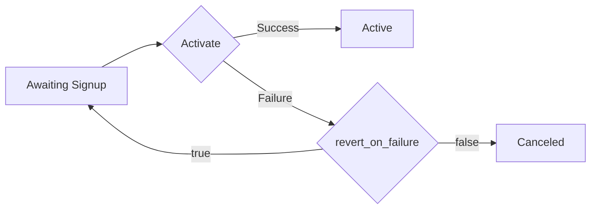

# Reference

Every operation below is shown in its throwing form. On an error status it throws `ApiException<TError>` — the status code, headers, content type and the operation's error type, `RawError` (the raw body) when the spec declares none — and where an operation offers an `…AsResult` sibling, that sibling returns `ApiResult<TResponse, TError>` instead. A request that produces no usable response surfaces as `SdkConnectionException` or `SdkTimeoutException`, a body that does not match the documented response type as `ResponseDeserializationException`, and a credential that cannot be applied as `AuthSchemeException`; all of them derive from `SdkException` and name the failed call. See [README → Error Handling](README.md#error-handling).

> Source: [MaxioClient](MaxioClient.cs)

## ApiExports

> Source: [ApiExports](Api/ApiExports.cs)

<details>
<summary><code>Task&lt;BatchJobResponse&gt; ExportInvoices(RequestOptions? requestOptions = null, CancellationToken cancellationToken = default);</code></summary>

<dl>
<dd>

### Description

<dl>
<dd>

Creates an invoices export and returns a batch job object.

</dd>
</dl>

### Usage

<dl>
<dd>

```csharp
try
{
    var response = await client.ApiExports.ExportInvoices();
    // TODO: Handle 'response' of type BatchJobResponse
}
catch (ApiException<ExportInvoicesError> ex)
{
    if (ex.Error.TryGetNoContent(out var error))
    {
        // TODO: Handle 'error' of type RawError
    }
}
```

</dd>
</dl>

### Response

<dl>
<dd>

**OnSuccess**: <code>[BatchJobResponse](Models/BatchJobResponse.cs)</code>

**OnError**: <code>[ApiException](Core/Exceptions/ApiException.cs)&lt;[ExportInvoicesError](Errors/ExportInvoicesError.cs)&gt;</code>

</dd>
</dl>

</dd>
</dl>

</details>

<details>
<summary><code>Task&lt;BatchJobResponse&gt; ExportProformaInvoices(RequestOptions? requestOptions = null, CancellationToken cancellationToken = default);</code></summary>

<dl>
<dd>

### Description

<dl>
<dd>

Creates a proforma invoices export and returns a batch job object. Proforma invoices are only available on Relationship Invoicing sites.

</dd>
</dl>

### Usage

<dl>
<dd>

```csharp
try
{
    var response = await client.ApiExports.ExportProformaInvoices();
    // TODO: Handle 'response' of type BatchJobResponse
}
catch (ApiException<ExportProformaInvoicesError> ex)
{
    if (ex.Error.TryGetNoContent(out var error))
    {
        // TODO: Handle 'error' of type RawError
    }
}
```

</dd>
</dl>

### Response

<dl>
<dd>

**OnSuccess**: <code>[BatchJobResponse](Models/BatchJobResponse.cs)</code>

**OnError**: <code>[ApiException](Core/Exceptions/ApiException.cs)&lt;[ExportProformaInvoicesError](Errors/ExportProformaInvoicesError.cs)&gt;</code>

</dd>
</dl>

</dd>
</dl>

</details>

<details>
<summary><code>Task&lt;BatchJobResponse&gt; ExportSubscriptions(RequestOptions? requestOptions = null, CancellationToken cancellationToken = default);</code></summary>

<dl>
<dd>

### Description

<dl>
<dd>

Creates a subscriptions export and returns a batch job object.

</dd>
</dl>

### Usage

<dl>
<dd>

```csharp
try
{
    var response = await client.ApiExports.ExportSubscriptions();
    // TODO: Handle 'response' of type BatchJobResponse
}
catch (ApiException<ExportSubscriptionsError> ex)
{
    if (ex.Error.TryGetSingleErrorResponse1(out var error))
    {
        // TODO: Handle 'error' of type SingleErrorResponse1
    }
}
```

</dd>
</dl>

### Response

<dl>
<dd>

**OnSuccess**: <code>[BatchJobResponse](Models/BatchJobResponse.cs)</code>

**OnError**: <code>[ApiException](Core/Exceptions/ApiException.cs)&lt;[ExportSubscriptionsError](Errors/ExportSubscriptionsError.cs)&gt;</code>

</dd>
</dl>

</dd>
</dl>

</details>

<details>
<summary><code>Task&lt;IReadOnlyList&lt;Invoice&gt;&gt; ListExportedInvoices(ListExportedInvoicesRequest request, RequestOptions? requestOptions = null, CancellationToken cancellationToken = default);</code></summary>

<dl>
<dd>

### Description

<dl>
<dd>

Lists exported invoices for a provided `batch_id`. Use pagination to control responses returned from the server.

Example: `GET https://{subdomain}.chargify.com/api_exports/invoices/123/rows?per_page=10000&page=1`.

</dd>
</dl>

### Usage

<dl>
<dd>

```csharp
try
{
    var response = await client.ApiExports.ListExportedInvoices(new ListExportedInvoicesRequest
    {
        BatchId = "some example string",
        Page = 1,
    });
    // TODO: Handle 'response' of type IReadOnlyList<Invoice>
}
catch (ApiException<ListExportedInvoicesError> ex)
{
    if (ex.Error.TryGetNoContent(out var error))
    {
        // TODO: Handle 'error' of type RawError
    }
}
```

</dd>
</dl>

### Request

<dl>
<dd>

<code>[ListExportedInvoicesRequest](Requests/ApiExports/ListExportedInvoicesRequest.cs)</code>

</dd>
</dl>

### Response

<dl>
<dd>

**OnSuccess**: <code>IReadOnlyList&lt;[Invoice](Models/Invoice.cs)&gt;</code>

**OnError**: <code>[ApiException](Core/Exceptions/ApiException.cs)&lt;[ListExportedInvoicesError](Errors/ListExportedInvoicesError.cs)&gt;</code>

</dd>
</dl>

</dd>
</dl>

</details>

<details>
<summary><code>Task&lt;IReadOnlyList&lt;ProformaInvoice&gt;&gt; ListExportedProformaInvoices(ListExportedProformaInvoicesRequest request, RequestOptions? requestOptions = null, CancellationToken cancellationToken = default);</code></summary>

<dl>
<dd>

### Description

<dl>
<dd>

Lists exported proforma invoices for a provided `batch_id`. Use pagination to control responses returned from the server.

Example: `GET https://{subdomain}.chargify.com/api_exports/proforma_invoices/123/rows?per_page=10000&page=1`.

</dd>
</dl>

### Usage

<dl>
<dd>

```csharp
try
{
    var response = await client.ApiExports.ListExportedProformaInvoices(new ListExportedProformaInvoicesRequest
    {
        BatchId = "some example string",
        Page = 1,
    });
    // TODO: Handle 'response' of type IReadOnlyList<ProformaInvoice>
}
catch (ApiException<ListExportedProformaInvoicesError> ex)
{
    if (ex.Error.TryGetNoContent(out var error))
    {
        // TODO: Handle 'error' of type RawError
    }
}
```

</dd>
</dl>

### Request

<dl>
<dd>

<code>[ListExportedProformaInvoicesRequest](Requests/ApiExports/ListExportedProformaInvoicesRequest.cs)</code>

</dd>
</dl>

### Response

<dl>
<dd>

**OnSuccess**: <code>IReadOnlyList&lt;[ProformaInvoice](Models/ProformaInvoice.cs)&gt;</code>

**OnError**: <code>[ApiException](Core/Exceptions/ApiException.cs)&lt;[ListExportedProformaInvoicesError](Errors/ListExportedProformaInvoicesError.cs)&gt;</code>

</dd>
</dl>

</dd>
</dl>

</details>

<details>
<summary><code>Task&lt;IReadOnlyList&lt;Subscription&gt;&gt; ListExportedSubscriptions(ListExportedSubscriptionsRequest request, RequestOptions? requestOptions = null, CancellationToken cancellationToken = default);</code></summary>

<dl>
<dd>

### Description

<dl>
<dd>

Lists exported subscriptions for a provided `batch_id`. Use pagination to control responses returned from the server.

Example: `GET https://{subdomain}.chargify.com/api_exports/subscriptions/123/rows?per_page=200&page=1`.

</dd>
</dl>

### Usage

<dl>
<dd>

```csharp
try
{
    var response = await client.ApiExports.ListExportedSubscriptions(new ListExportedSubscriptionsRequest
    {
        BatchId = "some example string",
        Page = 1,
    });
    // TODO: Handle 'response' of type IReadOnlyList<Subscription>
}
catch (ApiException<ListExportedSubscriptionsError> ex)
{
    if (ex.Error.TryGetNoContent(out var error))
    {
        // TODO: Handle 'error' of type RawError
    }
}
```

</dd>
</dl>

### Request

<dl>
<dd>

<code>[ListExportedSubscriptionsRequest](Requests/ApiExports/ListExportedSubscriptionsRequest.cs)</code>

</dd>
</dl>

### Response

<dl>
<dd>

**OnSuccess**: <code>IReadOnlyList&lt;[Subscription](Models/Subscription.cs)&gt;</code>

**OnError**: <code>[ApiException](Core/Exceptions/ApiException.cs)&lt;[ListExportedSubscriptionsError](Errors/ListExportedSubscriptionsError.cs)&gt;</code>

</dd>
</dl>

</dd>
</dl>

</details>

<details>
<summary><code>Task&lt;BatchJobResponse&gt; ReadInvoicesExport(ReadInvoicesExportRequest request, RequestOptions? requestOptions = null, CancellationToken cancellationToken = default);</code></summary>

<dl>
<dd>

### Description

<dl>
<dd>

Returns a batch job object for an invoices export.

</dd>
</dl>

### Usage

<dl>
<dd>

```csharp
try
{
    var response = await client.ApiExports.ReadInvoicesExport(new ReadInvoicesExportRequest
    {
        BatchId = "some example string",
    });
    // TODO: Handle 'response' of type BatchJobResponse
}
catch (ApiException<ReadInvoicesExportError> ex)
{
    if (ex.Error.TryGetNoContent(out var error))
    {
        // TODO: Handle 'error' of type RawError
    }
}
```

</dd>
</dl>

### Request

<dl>
<dd>

<code>[ReadInvoicesExportRequest](Requests/ApiExports/ReadInvoicesExportRequest.cs)</code>

</dd>
</dl>

### Response

<dl>
<dd>

**OnSuccess**: <code>[BatchJobResponse](Models/BatchJobResponse.cs)</code>

**OnError**: <code>[ApiException](Core/Exceptions/ApiException.cs)&lt;[ReadInvoicesExportError](Errors/ReadInvoicesExportError.cs)&gt;</code>

</dd>
</dl>

</dd>
</dl>

</details>

<details>
<summary><code>Task&lt;BatchJobResponse&gt; ReadProformaInvoicesExport(ReadProformaInvoicesExportRequest request, RequestOptions? requestOptions = null, CancellationToken cancellationToken = default);</code></summary>

<dl>
<dd>

### Description

<dl>
<dd>

Returns a batch job object for a proforma invoices export. Proforma invoices are only available on Relationship Invoicing sites.

</dd>
</dl>

### Usage

<dl>
<dd>

```csharp
try
{
    var response = await client.ApiExports.ReadProformaInvoicesExport(new ReadProformaInvoicesExportRequest
    {
        BatchId = "some example string",
    });
    // TODO: Handle 'response' of type BatchJobResponse
}
catch (ApiException<ReadProformaInvoicesExportError> ex)
{
    if (ex.Error.TryGetNoContent(out var error))
    {
        // TODO: Handle 'error' of type RawError
    }
}
```

</dd>
</dl>

### Request

<dl>
<dd>

<code>[ReadProformaInvoicesExportRequest](Requests/ApiExports/ReadProformaInvoicesExportRequest.cs)</code>

</dd>
</dl>

### Response

<dl>
<dd>

**OnSuccess**: <code>[BatchJobResponse](Models/BatchJobResponse.cs)</code>

**OnError**: <code>[ApiException](Core/Exceptions/ApiException.cs)&lt;[ReadProformaInvoicesExportError](Errors/ReadProformaInvoicesExportError.cs)&gt;</code>

</dd>
</dl>

</dd>
</dl>

</details>

<details>
<summary><code>Task&lt;BatchJobResponse&gt; ReadSubscriptionsExport(ReadSubscriptionsExportRequest request, RequestOptions? requestOptions = null, CancellationToken cancellationToken = default);</code></summary>

<dl>
<dd>

### Description

<dl>
<dd>

Returns a batch job object for a subscriptions export.

</dd>
</dl>

### Usage

<dl>
<dd>

```csharp
try
{
    var response = await client.ApiExports.ReadSubscriptionsExport(new ReadSubscriptionsExportRequest
    {
        BatchId = "some example string",
    });
    // TODO: Handle 'response' of type BatchJobResponse
}
catch (ApiException<ReadSubscriptionsExportError> ex)
{
    if (ex.Error.TryGetNoContent(out var error))
    {
        // TODO: Handle 'error' of type RawError
    }
}
```

</dd>
</dl>

### Request

<dl>
<dd>

<code>[ReadSubscriptionsExportRequest](Requests/ApiExports/ReadSubscriptionsExportRequest.cs)</code>

</dd>
</dl>

### Response

<dl>
<dd>

**OnSuccess**: <code>[BatchJobResponse](Models/BatchJobResponse.cs)</code>

**OnError**: <code>[ApiException](Core/Exceptions/ApiException.cs)&lt;[ReadSubscriptionsExportError](Errors/ReadSubscriptionsExportError.cs)&gt;</code>

</dd>
</dl>

</dd>
</dl>

</details>

## AdvanceInvoice

> Source: [AdvanceInvoice](Api/AdvanceInvoice.cs)

<details>
<summary><code>Task&lt;Invoice&gt; IssueAdvanceInvoice(IssueAdvanceInvoiceOperationRequest request, RequestOptions? requestOptions = null, CancellationToken cancellationToken = default);</code></summary>

<dl>
<dd>

### Description

<dl>
<dd>

Issues an invoice in advance for a subscription's next renewal date. For the most part, advance invoices function like any other invoice, except they are issued early and have special behavior upon being voided. For more information on advance invoices, including eligibility for generating one, see [Issue Invoice In Advance](https://maxio.zendesk.com/hc/en-us/articles/24252026404749-Issue-Invoice-In-Advance).

A subscription can only have one advance invoice per billing period. Attempting to issue an advance invoice when one already exists returns an error.

Regeneration of the invoice can be forced with the params `force: true`, which voids an advance invoice if one exists and generates a new one. If no advance invoice exists, a new one is generated.

Consider using either the create or preview endpoints for proforma invoices to preview this advance invoice before using this endpoint to generate it.

</dd>
</dl>

### Usage

<dl>
<dd>

```csharp
try
{
    var response = await client.AdvanceInvoice.IssueAdvanceInvoice(new IssueAdvanceInvoiceOperationRequest
    {
        SubscriptionId = 1,
        Body = new IssueAdvanceInvoiceRequest { Force = true },
    });
    // TODO: Handle 'response' of type Invoice
}
catch (ApiException<IssueAdvanceInvoiceError> ex)
{
    if (ex.Error.TryGetNoContent(out var error))
    {
        // TODO: Handle 'error' of type RawError
    }
}
```

</dd>
</dl>

### Request

<dl>
<dd>

<code>[IssueAdvanceInvoiceOperationRequest](Requests/AdvanceInvoice/IssueAdvanceInvoiceOperationRequest.cs)</code>

</dd>
</dl>

### Response

<dl>
<dd>

**OnSuccess**: <code>[Invoice](Models/Invoice.cs)</code>

**OnError**: <code>[ApiException](Core/Exceptions/ApiException.cs)&lt;[IssueAdvanceInvoiceError](Errors/IssueAdvanceInvoiceError.cs)&gt;</code>

</dd>
</dl>

</dd>
</dl>

</details>

<details>
<summary><code>Task&lt;Invoice&gt; ReadAdvanceInvoice(ReadAdvanceInvoiceRequest request, RequestOptions? requestOptions = null, CancellationToken cancellationToken = default);</code></summary>

<dl>
<dd>

### Description

<dl>
<dd>

Returns the advance invoice generated for a subscription's upcoming renewal. There can only be one advance invoice per subscription per billing cycle.

</dd>
</dl>

### Usage

<dl>
<dd>

```csharp
try
{
    var response = await client.AdvanceInvoice.ReadAdvanceInvoice(new ReadAdvanceInvoiceRequest { SubscriptionId = 1 });
    // TODO: Handle 'response' of type Invoice
}
catch (ApiException<ReadAdvanceInvoiceError> ex)
{
    if (ex.Error.TryGetNoContent(out var error))
    {
        // TODO: Handle 'error' of type RawError
    }
}
```

</dd>
</dl>

### Request

<dl>
<dd>

<code>[ReadAdvanceInvoiceRequest](Requests/AdvanceInvoice/ReadAdvanceInvoiceRequest.cs)</code>

</dd>
</dl>

### Response

<dl>
<dd>

**OnSuccess**: <code>[Invoice](Models/Invoice.cs)</code>

**OnError**: <code>[ApiException](Core/Exceptions/ApiException.cs)&lt;[ReadAdvanceInvoiceError](Errors/ReadAdvanceInvoiceError.cs)&gt;</code>

</dd>
</dl>

</dd>
</dl>

</details>

<details>
<summary><code>Task&lt;Invoice&gt; VoidAdvanceInvoice(VoidAdvanceInvoiceRequest request, RequestOptions? requestOptions = null, CancellationToken cancellationToken = default);</code></summary>

<dl>
<dd>

### Description

<dl>
<dd>

Voids a subscription's existing advance invoice. Once voided, it can later be regenerated if desired.

A `reason` is required to void, and the invoice must have an open status. Voiding causes any prepayments and credits that were applied to the invoice to be returned to the subscription.

For a full overview of the impact of voiding, see [Invoice]($m/Invoice).

</dd>
</dl>

### Usage

<dl>
<dd>

```csharp
try
{
    var response = await client.AdvanceInvoice.VoidAdvanceInvoice(new VoidAdvanceInvoiceRequest { SubscriptionId = 1 });
    // TODO: Handle 'response' of type Invoice
}
catch (ApiException<VoidAdvanceInvoiceError> ex)
{
    if (ex.Error.TryGetNoContent(out var error))
    {
        // TODO: Handle 'error' of type RawError
    }
}
```

</dd>
</dl>

### Request

<dl>
<dd>

<code>[VoidAdvanceInvoiceRequest](Requests/AdvanceInvoice/VoidAdvanceInvoiceRequest.cs)</code>

</dd>
</dl>

### Response

<dl>
<dd>

**OnSuccess**: <code>[Invoice](Models/Invoice.cs)</code>

**OnError**: <code>[ApiException](Core/Exceptions/ApiException.cs)&lt;[VoidAdvanceInvoiceError](Errors/VoidAdvanceInvoiceError.cs)&gt;</code>

</dd>
</dl>

</dd>
</dl>

</details>

## BillingPortal

> Source: [BillingPortal](Api/BillingPortal.cs)

<details>
<summary><code>Task&lt;CustomerResponse&gt; EnableBillingPortalForCustomer(EnableBillingPortalForCustomerRequest request, RequestOptions? requestOptions = null, CancellationToken cancellationToken = default);</code></summary>

<dl>
<dd>

### Description

<dl>
<dd>

Enables Billing Portal access for a customer, with an option to send an invitation email at the same time.

## Billing Portal Security

If your customer has been invited to the Billing Portal, they receive a link to manage their subscription (the “Management URL”) automatically at the bottom of their statements, invoices, and receipts. **This link changes periodically for security and is only valid for 65 days.**

If you need to provide your customer their Management URL through other means, you can retrieve it [via the API]($e/Billing%20Portal/readBillingPortalLink). Because the URL is cryptographically signed with a timestamp, merchants cannot generate the URL without requesting it through the API.

To prevent abuse and overuse, request a new URL only when absolutely necessary. Management URLs are good for 65 days, so you should re-use a previously generated one as much as possible. If you use the URL frequently (such as to display on your website), **do not** make an API request every time.

For more information configuring the Billing Portal, see [Billing Portal Overview](https://maxio.zendesk.com/hc/en-us/articles/24252412965133-Billing-Portal-Overview).

</dd>
</dl>

### Usage

<dl>
<dd>

```csharp
try
{
    var response = await client.BillingPortal.EnableBillingPortalForCustomer(new EnableBillingPortalForCustomerRequest
    {
        CustomerId = 1,
    });
    // TODO: Handle 'response' of type CustomerResponse
}
catch (ApiException<EnableBillingPortalForCustomerError> ex)
{
    if (ex.Error.TryGetErrorListResponse1(out var error))
    {
        // TODO: Handle 'error' of type ErrorListResponse1
    }
}
```

</dd>
</dl>

### Request

<dl>
<dd>

<code>[EnableBillingPortalForCustomerRequest](Requests/BillingPortal/EnableBillingPortalForCustomerRequest.cs)</code>

</dd>
</dl>

### Response

<dl>
<dd>

**OnSuccess**: <code>[CustomerResponse](Models/CustomerResponse.cs)</code>

**OnError**: <code>[ApiException](Core/Exceptions/ApiException.cs)&lt;[EnableBillingPortalForCustomerError](Errors/EnableBillingPortalForCustomerError.cs)&gt;</code>

</dd>
</dl>

</dd>
</dl>

</details>

<details>
<summary><code>Task&lt;PortalManagementLink&gt; ReadBillingPortalLink(ReadBillingPortalLinkRequest request, RequestOptions? requestOptions = null, CancellationToken cancellationToken = default);</code></summary>

<dl>
<dd>

### Description

<dl>
<dd>

Returns the exact URL required for a subscriber to access the Billing Portal.

## Management Link Request Rules

+ When retrieving a management URL, multiple requests for the same customer in a short period return the **same** URL
+ A new URL is not generated for 15 days
+ You must cache and remember this URL if you are going to need it again within 15 days
+ Only request a new URL after the `new_link_available_at` date
+ You are limited to 15 requests for the same URL. If you make more than 15 requests before `new_link_available_at`, you are blocked from further Management URL requests (with a response code `429`).

</dd>
</dl>

### Usage

<dl>
<dd>

```csharp
try
{
    var response = await client.BillingPortal.ReadBillingPortalLink(new ReadBillingPortalLinkRequest
    {
        CustomerId = 1,
    });
    // TODO: Handle 'response' of type PortalManagementLink
}
catch (ApiException<ReadBillingPortalLinkError> ex)
{
    if (ex.Error.TryGetErrorListResponse1(out var error))
    {
        // TODO: Handle 'error' of type ErrorListResponse1
    }
}
```

</dd>
</dl>

### Request

<dl>
<dd>

<code>[ReadBillingPortalLinkRequest](Requests/BillingPortal/ReadBillingPortalLinkRequest.cs)</code>

</dd>
</dl>

### Response

<dl>
<dd>

**OnSuccess**: <code>[PortalManagementLink](Models/PortalManagementLink.cs)</code>

**OnError**: <code>[ApiException](Core/Exceptions/ApiException.cs)&lt;[ReadBillingPortalLinkError](Errors/ReadBillingPortalLinkError.cs)&gt;</code>

</dd>
</dl>

</dd>
</dl>

</details>

<details>
<summary><code>Task&lt;ResentInvitation&gt; ResendBillingPortalInvitation(ResendBillingPortalInvitationRequest request, RequestOptions? requestOptions = null, CancellationToken cancellationToken = default);</code></summary>

<dl>
<dd>

### Description

<dl>
<dd>

Resends a customer's Billing Portal invitation.

If you attempt to resend an invitation 5 times within 30 minutes, you will receive a `422` response with an `error` message in the body.

If you attempt to resend an invitation when the Billing Portal is already disabled for a Customer, you will receive a `422` error response.

If you attempt to resend an invitation when the Customer does not exist, you will receive a `404` error response.

## Limitations

This endpoint will only return a JSON response.

</dd>
</dl>

### Usage

<dl>
<dd>

```csharp
try
{
    var response = await client.BillingPortal.ResendBillingPortalInvitation(new ResendBillingPortalInvitationRequest
    {
        CustomerId = 1,
    });
    // TODO: Handle 'response' of type ResentInvitation
}
catch (ApiException<ResendBillingPortalInvitationError> ex)
{
    if (ex.Error.TryGetNoContent(out var error))
    {
        // TODO: Handle 'error' of type RawError
    }
}
```

</dd>
</dl>

### Request

<dl>
<dd>

<code>[ResendBillingPortalInvitationRequest](Requests/BillingPortal/ResendBillingPortalInvitationRequest.cs)</code>

</dd>
</dl>

### Response

<dl>
<dd>

**OnSuccess**: <code>[ResentInvitation](Models/ResentInvitation.cs)</code>

**OnError**: <code>[ApiException](Core/Exceptions/ApiException.cs)&lt;[ResendBillingPortalInvitationError](Errors/ResendBillingPortalInvitationError.cs)&gt;</code>

</dd>
</dl>

</dd>
</dl>

</details>

<details>
<summary><code>Task&lt;RevokedInvitation&gt; RevokeBillingPortalAccess(RevokeBillingPortalAccessRequest request, RequestOptions? requestOptions = null, CancellationToken cancellationToken = default);</code></summary>

<dl>
<dd>

### Description

<dl>
<dd>

Revokes a customer's Billing Portal invitation.

If you attempt to revoke an invitation when the Billing Portal is already disabled for a Customer, you will receive a 422 error response.

## Limitations

This endpoint will only return a JSON response.

</dd>
</dl>

### Usage

<dl>
<dd>

```csharp
try
{
    var response = await client.BillingPortal.RevokeBillingPortalAccess(new RevokeBillingPortalAccessRequest
    {
        CustomerId = 1,
    });
    // TODO: Handle 'response' of type RevokedInvitation
}
catch (ApiException<RawError> ex)
{
    // TODO: Handle 'ex.Error' of type RawError
}
```

</dd>
</dl>

### Request

<dl>
<dd>

<code>[RevokeBillingPortalAccessRequest](Requests/BillingPortal/RevokeBillingPortalAccessRequest.cs)</code>

</dd>
</dl>

### Response

<dl>
<dd>

**OnSuccess**: <code>[RevokedInvitation](Models/RevokedInvitation.cs)</code>

**OnError**: <code>[ApiException](Core/Exceptions/ApiException.cs)&lt;[RawError](Core/ErrorResponse/RawError.cs)&gt;</code>

</dd>
</dl>

</dd>
</dl>

</details>

## ComponentFeatures

> Source: [ComponentFeatures](Api/ComponentFeatures.cs)

<details>
<summary><code>Task&lt;FeatureCatalogItemResponse&gt; CreateComponentFeature(CreateComponentFeatureRequest request, RequestOptions? requestOptions = null, CancellationToken cancellationToken = default);</code></summary>

<dl>
<dd>

### Description

<dl>
<dd>

Attaches a feature template to this component with a concrete value. Pass `price_point_type: "PricePoint"` and `price_point_id` to create an override scoped to a single component price point instead of the whole component.

</dd>
</dl>

### Usage

<dl>
<dd>

```csharp
try
{
    var response = await client.ComponentFeatures.CreateComponentFeature(new CreateComponentFeatureRequest
    {
        ComponentId = 1,
    });
    // TODO: Handle 'response' of type FeatureCatalogItemResponse
}
catch (ApiException<CreateComponentFeatureError> ex)
{
    if (ex.Error.TryGetErrorListResponse1(out var error))
    {
        // TODO: Handle 'error' of type ErrorListResponse1
    }
}
```

</dd>
</dl>

### Request

<dl>
<dd>

<code>[CreateComponentFeatureRequest](Requests/ComponentFeatures/CreateComponentFeatureRequest.cs)</code>

</dd>
</dl>

### Response

<dl>
<dd>

**OnSuccess**: <code>[FeatureCatalogItemResponse](Models/FeatureCatalogItemResponse.cs)</code>

**OnError**: <code>[ApiException](Core/Exceptions/ApiException.cs)&lt;[CreateComponentFeatureError](Errors/CreateComponentFeatureError.cs)&gt;</code>

</dd>
</dl>

</dd>
</dl>

</details>

<details>
<summary><code>Task&lt;FeatureCatalogItemsListResponse&gt; ListComponentFeatures(ListComponentFeaturesRequest request, RequestOptions? requestOptions = null, CancellationToken cancellationToken = default);</code></summary>

<dl>
<dd>

### Description

<dl>
<dd>

Lists the feature catalog items attached to this component, including price-point-specific overrides.

</dd>
</dl>

### Usage

<dl>
<dd>

```csharp
try
{
    var response = await client.ComponentFeatures.ListComponentFeatures(new ListComponentFeaturesRequest
    {
        ComponentId = 1,
    });
    // TODO: Handle 'response' of type FeatureCatalogItemsListResponse
}
catch (ApiException<ListComponentFeaturesError> ex)
{
    if (ex.Error.TryGetErrorListResponse1(out var error))
    {
        // TODO: Handle 'error' of type ErrorListResponse1
    }
}
```

</dd>
</dl>

### Request

<dl>
<dd>

<code>[ListComponentFeaturesRequest](Requests/ComponentFeatures/ListComponentFeaturesRequest.cs)</code>

</dd>
</dl>

### Response

<dl>
<dd>

**OnSuccess**: <code>[FeatureCatalogItemsListResponse](Models/FeatureCatalogItemsListResponse.cs)</code>

**OnError**: <code>[ApiException](Core/Exceptions/ApiException.cs)&lt;[ListComponentFeaturesError](Errors/ListComponentFeaturesError.cs)&gt;</code>

</dd>
</dl>

</dd>
</dl>

</details>

<details>
<summary><code>Task&lt;FeatureCatalogItemResponse&gt; ReadComponentFeature(ReadComponentFeatureRequest request, RequestOptions? requestOptions = null, CancellationToken cancellationToken = default);</code></summary>

<dl>
<dd>

### Description

<dl>
<dd>

Returns a single feature catalog item attached to this component.

</dd>
</dl>

### Usage

<dl>
<dd>

```csharp
try
{
    var response = await client.ComponentFeatures.ReadComponentFeature(new ReadComponentFeatureRequest
    {
        ComponentId = 1,
        Id = 1,
    });
    // TODO: Handle 'response' of type FeatureCatalogItemResponse
}
catch (ApiException<ReadComponentFeatureError> ex)
{
    if (ex.Error.TryGetErrorListResponse1(out var error))
    {
        // TODO: Handle 'error' of type ErrorListResponse1
    }
}
```

</dd>
</dl>

### Request

<dl>
<dd>

<code>[ReadComponentFeatureRequest](Requests/ComponentFeatures/ReadComponentFeatureRequest.cs)</code>

</dd>
</dl>

### Response

<dl>
<dd>

**OnSuccess**: <code>[FeatureCatalogItemResponse](Models/FeatureCatalogItemResponse.cs)</code>

**OnError**: <code>[ApiException](Core/Exceptions/ApiException.cs)&lt;[ReadComponentFeatureError](Errors/ReadComponentFeatureError.cs)&gt;</code>

</dd>
</dl>

</dd>
</dl>

</details>

<details>
<summary><code>Task RemoveComponentFeature(RemoveComponentFeatureRequest request, RequestOptions? requestOptions = null, CancellationToken cancellationToken = default);</code></summary>

<dl>
<dd>

### Description

<dl>
<dd>

Removes a feature catalog item from this component.

</dd>
</dl>

### Usage

<dl>
<dd>

```csharp
try
{
    await client.ComponentFeatures.RemoveComponentFeature(new RemoveComponentFeatureRequest
    {
        ComponentId = 1,
        Id = 1,
    });
}
catch (ApiException<RemoveComponentFeatureError> ex)
{
    if (ex.Error.TryGetErrorListResponse1(out var error))
    {
        // TODO: Handle 'error' of type ErrorListResponse1
    }
}
```

</dd>
</dl>

### Request

<dl>
<dd>

<code>[RemoveComponentFeatureRequest](Requests/ComponentFeatures/RemoveComponentFeatureRequest.cs)</code>

</dd>
</dl>

### Response

<dl>
<dd>

**OnSuccess**: No content

**OnError**: <code>[ApiException](Core/Exceptions/ApiException.cs)&lt;[RemoveComponentFeatureError](Errors/RemoveComponentFeatureError.cs)&gt;</code>

</dd>
</dl>

</dd>
</dl>

</details>

<details>
<summary><code>Task&lt;FeatureCatalogItemResponse&gt; RestoreComponentFeature(RestoreComponentFeatureRequest request, RequestOptions? requestOptions = null, CancellationToken cancellationToken = default);</code></summary>

<dl>
<dd>

### Description

<dl>
<dd>

Clears the archived state of a feature catalog item attached to this component. Returns `422` if the parent feature template is still archived. Restore the feature template first.

</dd>
</dl>

### Usage

<dl>
<dd>

```csharp
try
{
    var response = await client.ComponentFeatures.RestoreComponentFeature(new RestoreComponentFeatureRequest
    {
        ComponentId = 1,
        Id = 1,
    });
    // TODO: Handle 'response' of type FeatureCatalogItemResponse
}
catch (ApiException<RestoreComponentFeatureError> ex)
{
    if (ex.Error.TryGetErrorListResponse1(out var error))
    {
        // TODO: Handle 'error' of type ErrorListResponse1
    }
}
```

</dd>
</dl>

### Request

<dl>
<dd>

<code>[RestoreComponentFeatureRequest](Requests/ComponentFeatures/RestoreComponentFeatureRequest.cs)</code>

</dd>
</dl>

### Response

<dl>
<dd>

**OnSuccess**: <code>[FeatureCatalogItemResponse](Models/FeatureCatalogItemResponse.cs)</code>

**OnError**: <code>[ApiException](Core/Exceptions/ApiException.cs)&lt;[RestoreComponentFeatureError](Errors/RestoreComponentFeatureError.cs)&gt;</code>

</dd>
</dl>

</dd>
</dl>

</details>

<details>
<summary><code>Task&lt;FeatureCatalogItemResponse&gt; UpdateComponentFeature(UpdateComponentFeatureRequest request, RequestOptions? requestOptions = null, CancellationToken cancellationToken = default);</code></summary>

<dl>
<dd>

### Description

<dl>
<dd>

Updates the value or periodicity of a feature catalog item attached to this component.

</dd>
</dl>

### Usage

<dl>
<dd>

```csharp
try
{
    var response = await client.ComponentFeatures.UpdateComponentFeature(new UpdateComponentFeatureRequest
    {
        ComponentId = 1,
        Id = 1,
    });
    // TODO: Handle 'response' of type FeatureCatalogItemResponse
}
catch (ApiException<UpdateComponentFeatureError> ex)
{
    if (ex.Error.TryGetErrorListResponse1(out var error))
    {
        // TODO: Handle 'error' of type ErrorListResponse1
    }
}
```

</dd>
</dl>

### Request

<dl>
<dd>

<code>[UpdateComponentFeatureRequest](Requests/ComponentFeatures/UpdateComponentFeatureRequest.cs)</code>

</dd>
</dl>

### Response

<dl>
<dd>

**OnSuccess**: <code>[FeatureCatalogItemResponse](Models/FeatureCatalogItemResponse.cs)</code>

**OnError**: <code>[ApiException](Core/Exceptions/ApiException.cs)&lt;[UpdateComponentFeatureError](Errors/UpdateComponentFeatureError.cs)&gt;</code>

</dd>
</dl>

</dd>
</dl>

</details>

## ComponentPricePoints

> Source: [ComponentPricePoints](Api/ComponentPricePoints.cs)

<details>
<summary><code>Task&lt;ComponentPricePointResponse&gt; ArchiveComponentPricePoint(ArchiveComponentPricePointRequest request, RequestOptions? requestOptions = null, CancellationToken cancellationToken = default);</code></summary>

<dl>
<dd>

### Description

<dl>
<dd>

Archives a component price point. Subscriptions using a price point that has been archived will continue using it until they're moved to another price point.

</dd>
</dl>

### Usage

<dl>
<dd>

```csharp
try
{
    var response = await client.ComponentPricePoints.ArchiveComponentPricePoint(new ArchiveComponentPricePointRequest
    {
        ComponentId = 1,
        PricePointId = 1,
    });
    // TODO: Handle 'response' of type ComponentPricePointResponse
}
catch (ApiException<ArchiveComponentPricePointError> ex)
{
    if (ex.Error.TryGetErrorListResponse1(out var error))
    {
        // TODO: Handle 'error' of type ErrorListResponse1
    }
}
```

</dd>
</dl>

### Request

<dl>
<dd>

<code>[ArchiveComponentPricePointRequest](Requests/ComponentPricePoints/ArchiveComponentPricePointRequest.cs)</code>

</dd>
</dl>

### Response

<dl>
<dd>

**OnSuccess**: <code>[ComponentPricePointResponse](Models/ComponentPricePointResponse.cs)</code>

**OnError**: <code>[ApiException](Core/Exceptions/ApiException.cs)&lt;[ArchiveComponentPricePointError](Errors/ArchiveComponentPricePointError.cs)&gt;</code>

</dd>
</dl>

</dd>
</dl>

</details>

<details>
<summary><code>Task&lt;ComponentPricePointsResponse&gt; BulkCreateComponentPricePoints(BulkCreateComponentPricePointsRequest request, RequestOptions? requestOptions = null, CancellationToken cancellationToken = default);</code></summary>

<dl>
<dd>

### Description

<dl>
<dd>

Creates multiple component price points in one request.

</dd>
</dl>

### Usage

<dl>
<dd>

```csharp
try
{
    var response = await client.ComponentPricePoints.BulkCreateComponentPricePoints(
        new BulkCreateComponentPricePointsRequest
        {
            ComponentId = "some example string",
            Body = new CreateComponentPricePointsRequest
            {
                PricePoints = [
                    new CreateComponentPricePoint
                    {
                        Name = "Wholesale",
                        Handle = "wholesale",
                        PricingScheme = PricingScheme.PerUnit,
                        Prices = [new Price { StartingQuantity = 1, UnitPrice = 5d }],
                    },
                    new CreateComponentPricePoint
                    {
                        Name = "MSRP",
                        Handle = "msrp",
                        PricingScheme = PricingScheme.PerUnit,
                        Prices = [new Price { StartingQuantity = 1, UnitPrice = 4d }],
                    },
                    new CreateComponentPricePoint
                    {
                        Name = "Special Pricing",
                        Handle = "special",
                        PricingScheme = PricingScheme.PerUnit,
                        Prices = [new Price { StartingQuantity = 1, UnitPrice = 5d }],
                    },
                ],
            },
        });
    // TODO: Handle 'response' of type ComponentPricePointsResponse
}
catch (ApiException<BulkCreateComponentPricePointsError> ex)
{
    if (ex.Error.TryGetErrorListResponse1(out var error))
    {
        // TODO: Handle 'error' of type ErrorListResponse1
    }
}
```

</dd>
</dl>

### Request

<dl>
<dd>

<code>[BulkCreateComponentPricePointsRequest](Requests/ComponentPricePoints/BulkCreateComponentPricePointsRequest.cs)</code>

</dd>
</dl>

### Response

<dl>
<dd>

**OnSuccess**: <code>[ComponentPricePointsResponse](Models/ComponentPricePointsResponse.cs)</code>

**OnError**: <code>[ApiException](Core/Exceptions/ApiException.cs)&lt;[BulkCreateComponentPricePointsError](Errors/BulkCreateComponentPricePointsError.cs)&gt;</code>

</dd>
</dl>

</dd>
</dl>

</details>

<details>
<summary><code>Task&lt;ComponentPricePointCurrencyOverageResponse&gt; CloneComponentPricePoint(CloneComponentPricePointOperationRequest request, RequestOptions? requestOptions = null, CancellationToken cancellationToken = default);</code></summary>

<dl>
<dd>

### Description

<dl>
<dd>

Clones a component price point. Custom price points (tied to a specific subscription) cannot be cloned. The following attributes are copied from the source price point:
- Pricing scheme
- All price tiers (with starting/ending quantities and unit prices)
- Tax included setting
- Currency prices (if definitive pricing is set)
- Overage pricing (for prepaid usage components)
- Interval settings (if multi-frequency is enabled)
- Event-based billing segments (if applicable)

</dd>
</dl>

### Usage

<dl>
<dd>

```csharp
try
{
    var response = await client.ComponentPricePoints.CloneComponentPricePoint(
        new CloneComponentPricePointOperationRequest
        {
            ComponentId = 1,
            PricePointId = 1,
            Body = new CloneComponentPricePointRequest
            {
                PricePoint = new CloneComponentPricePoint { Name = "Pro Usage Tiered Clone" },
            },
        });
    // TODO: Handle 'response' of type ComponentPricePointCurrencyOverageResponse
}
catch (ApiException<CloneComponentPricePointError> ex)
{
    if (ex.Error.TryGetNoContent(out var error))
    {
        // TODO: Handle 'error' of type RawError
    }
}
```

</dd>
</dl>

### Request

<dl>
<dd>

<code>[CloneComponentPricePointOperationRequest](Requests/ComponentPricePoints/CloneComponentPricePointOperationRequest.cs)</code>

</dd>
</dl>

### Response

<dl>
<dd>

**OnSuccess**: <code>[ComponentPricePointCurrencyOverageResponse](Models/ComponentPricePointCurrencyOverageResponse.cs)</code>

**OnError**: <code>[ApiException](Core/Exceptions/ApiException.cs)&lt;[CloneComponentPricePointError](Errors/CloneComponentPricePointError.cs)&gt;</code>

</dd>
</dl>

</dd>
</dl>

</details>

<details>
<summary><code>Task&lt;ComponentPricePointResponse&gt; CreateComponentPricePoint(CreateComponentPricePointOperationRequest request, RequestOptions? requestOptions = null, CancellationToken cancellationToken = default);</code></summary>

<dl>
<dd>

### Description

<dl>
<dd>

Creates a price point for an existing component.

</dd>
</dl>

### Usage

<dl>
<dd>

```csharp
try
{
    var response = await client.ComponentPricePoints.CreateComponentPricePoint(
        new CreateComponentPricePointOperationRequest
        {
            ComponentId = 1,
            Body = new CreateComponentPricePointRequest
            {
                PricePoint = new CreateComponentPricePoint
                {
                    Name = "Wholesale",
                    Handle = "wholesale-handle",
                    PricingScheme = PricingScheme.Stairstep,
                    Prices = [
                        new Price { StartingQuantity = "1", EndingQuantity = "100", UnitPrice = "5.00" },
                        new Price { StartingQuantity = "101", EndingQuantity = "200", UnitPrice = "4.00" },
                    ],
                    UseSiteExchangeRate = false,
                },
            },
        });
    // TODO: Handle 'response' of type ComponentPricePointResponse
}
catch (ApiException<CreateComponentPricePointError> ex)
{
    if (ex.Error.TryGetErrorArrayMapResponse1(out var error))
    {
        // TODO: Handle 'error' of type ErrorArrayMapResponse1
    }
}
```

</dd>
</dl>

### Request

<dl>
<dd>

<code>[CreateComponentPricePointOperationRequest](Requests/ComponentPricePoints/CreateComponentPricePointOperationRequest.cs)</code>

</dd>
</dl>

### Response

<dl>
<dd>

**OnSuccess**: <code>[ComponentPricePointResponse](Models/ComponentPricePointResponse.cs)</code>

**OnError**: <code>[ApiException](Core/Exceptions/ApiException.cs)&lt;[CreateComponentPricePointError](Errors/CreateComponentPricePointError.cs)&gt;</code>

</dd>
</dl>

</dd>
</dl>

</details>

<details>
<summary><code>Task&lt;ComponentCurrencyPricesResponse&gt; CreateCurrencyPrices(CreateCurrencyPricesOperationRequest request, RequestOptions? requestOptions = null, CancellationToken cancellationToken = default);</code></summary>

<dl>
<dd>

### Description

<dl>
<dd>

Creates currency prices for a given currency defined at the site level.

When creating currency prices, they need to mirror the structure of your primary pricing. For each price level defined on the component price point, there should be a matching price level created in the given currency.

Note: Currency Prices are not able to be created for custom price points.

</dd>
</dl>

### Usage

<dl>
<dd>

```csharp
try
{
    var response = await client.ComponentPricePoints.CreateCurrencyPrices(new CreateCurrencyPricesOperationRequest
    {
        PricePointId = 1,
        Body = new CreateCurrencyPricesRequest
        {
            CurrencyPrices = [
                new CreateCurrencyPrice { Currency = "EUR", Price = 50d, PriceId = 20 },
                new CreateCurrencyPrice { Currency = "EUR", Price = 40d, PriceId = 21 },
            ],
        },
    });
    // TODO: Handle 'response' of type ComponentCurrencyPricesResponse
}
catch (ApiException<CreateCurrencyPricesError> ex)
{
    if (ex.Error.TryGetErrorArrayMapResponse1(out var error))
    {
        // TODO: Handle 'error' of type ErrorArrayMapResponse1
    }
}
```

</dd>
</dl>

### Request

<dl>
<dd>

<code>[CreateCurrencyPricesOperationRequest](Requests/ComponentPricePoints/CreateCurrencyPricesOperationRequest.cs)</code>

</dd>
</dl>

### Response

<dl>
<dd>

**OnSuccess**: <code>[ComponentCurrencyPricesResponse](Models/ComponentCurrencyPricesResponse.cs)</code>

**OnError**: <code>[ApiException](Core/Exceptions/ApiException.cs)&lt;[CreateCurrencyPricesError](Errors/CreateCurrencyPricesError.cs)&gt;</code>

</dd>
</dl>

</dd>
</dl>

</details>

<details>
<summary><code>Task&lt;ListComponentsPricePointsResponse&gt; ListAllComponentPricePoints(ListAllComponentPricePointsRequest request, RequestOptions? requestOptions = null, CancellationToken cancellationToken = default);</code></summary>

<dl>
<dd>

### Description

<dl>
<dd>

Lists all component price points belonging to a site.

</dd>
</dl>

### Usage

<dl>
<dd>

```csharp
try
{
    var response = await client.ComponentPricePoints.ListAllComponentPricePoints(new ListAllComponentPricePointsRequest
    {
        Include = ListComponentsPricePointsInclude.CurrencyPrices,
        Page = 1,
        PerPage = 50,
    });
    // TODO: Handle 'response' of type ListComponentsPricePointsResponse
}
catch (ApiException<ListAllComponentPricePointsError> ex)
{
    if (ex.Error.TryGetErrorListResponse1(out var error))
    {
        // TODO: Handle 'error' of type ErrorListResponse1
    }
}
```

</dd>
</dl>

### Request

<dl>
<dd>

<code>[ListAllComponentPricePointsRequest](Requests/ComponentPricePoints/ListAllComponentPricePointsRequest.cs)</code>

</dd>
</dl>

### Response

<dl>
<dd>

**OnSuccess**: <code>[ListComponentsPricePointsResponse](Models/ListComponentsPricePointsResponse.cs)</code>

**OnError**: <code>[ApiException](Core/Exceptions/ApiException.cs)&lt;[ListAllComponentPricePointsError](Errors/ListAllComponentPricePointsError.cs)&gt;</code>

</dd>
</dl>

</dd>
</dl>

</details>

<details>
<summary><code>Task&lt;ComponentPricePointsResponse&gt; ListComponentPricePoints(ListComponentPricePointsRequest request, RequestOptions? requestOptions = null, CancellationToken cancellationToken = default);</code></summary>

<dl>
<dd>

### Description

<dl>
<dd>

Lists the price points associated with a component.

You may specify the component by using either the numeric id or the `handle:gold` syntax.

If the price point is set to `use_site_exchange_rate: true`, it will return pricing based on the current exchange rate. If the flag is set to false, it will return all of the defined prices for each currency.

</dd>
</dl>

### Usage

<dl>
<dd>

```csharp
try
{
    var response = await client.ComponentPricePoints.ListComponentPricePoints(new ListComponentPricePointsRequest
    {
        ComponentId = 1,
        Page = 1,
        PerPage = 50,
        FilterType = [PricePointType.Catalog, PricePointType.Default],
    });
    // TODO: Handle 'response' of type ComponentPricePointsResponse
}
catch (ApiException<RawError> ex)
{
    // TODO: Handle 'ex.Error' of type RawError
}
```

</dd>
</dl>

### Request

<dl>
<dd>

<code>[ListComponentPricePointsRequest](Requests/ComponentPricePoints/ListComponentPricePointsRequest.cs)</code>

</dd>
</dl>

### Response

<dl>
<dd>

**OnSuccess**: <code>[ComponentPricePointsResponse](Models/ComponentPricePointsResponse.cs)</code>

**OnError**: <code>[ApiException](Core/Exceptions/ApiException.cs)&lt;[RawError](Core/ErrorResponse/RawError.cs)&gt;</code>

</dd>
</dl>

</dd>
</dl>

</details>

<details>
<summary><code>Task&lt;ComponentResponse&gt; PromoteComponentPricePointToDefault(PromoteComponentPricePointToDefaultRequest request, RequestOptions? requestOptions = null, CancellationToken cancellationToken = default);</code></summary>

<dl>
<dd>

### Description

<dl>
<dd>

Sets a new default price point for the component. This new default will apply to all new subscriptions going forward - existing subscriptions will remain on their current price point.

See [Price Points Documentation](https://maxio.zendesk.com/hc/en-us/articles/24261191737101-Price-Points-Components) for more information on price points and moving subscriptions between price points.

Note: Custom price points are not able to be set as the default for a component.

</dd>
</dl>

### Usage

<dl>
<dd>

```csharp
try
{
    var response = await client.ComponentPricePoints.PromoteComponentPricePointToDefault(
        new PromoteComponentPricePointToDefaultRequest { ComponentId = 1, PricePointId = 1 });
    // TODO: Handle 'response' of type ComponentResponse
}
catch (ApiException<RawError> ex)
{
    // TODO: Handle 'ex.Error' of type RawError
}
```

</dd>
</dl>

### Request

<dl>
<dd>

<code>[PromoteComponentPricePointToDefaultRequest](Requests/ComponentPricePoints/PromoteComponentPricePointToDefaultRequest.cs)</code>

</dd>
</dl>

### Response

<dl>
<dd>

**OnSuccess**: <code>[ComponentResponse](Models/ComponentResponse.cs)</code>

**OnError**: <code>[ApiException](Core/Exceptions/ApiException.cs)&lt;[RawError](Core/ErrorResponse/RawError.cs)&gt;</code>

</dd>
</dl>

</dd>
</dl>

</details>

<details>
<summary><code>Task&lt;ComponentPricePointCurrencyOverageResponse&gt; ReadComponentPricePoint(ReadComponentPricePointRequest request, RequestOptions? requestOptions = null, CancellationToken cancellationToken = default);</code></summary>

<dl>
<dd>

### Description

<dl>
<dd>

Returns details for a specific component price point. You can achieve this by using either the component price point ID or handle.

</dd>
</dl>

### Usage

<dl>
<dd>

```csharp
try
{
    var response = await client.ComponentPricePoints.ReadComponentPricePoint(new ReadComponentPricePointRequest
    {
        ComponentId = 1,
        PricePointId = 1,
    });
    // TODO: Handle 'response' of type ComponentPricePointCurrencyOverageResponse
}
catch (ApiException<RawError> ex)
{
    // TODO: Handle 'ex.Error' of type RawError
}
```

</dd>
</dl>

### Request

<dl>
<dd>

<code>[ReadComponentPricePointRequest](Requests/ComponentPricePoints/ReadComponentPricePointRequest.cs)</code>

</dd>
</dl>

### Response

<dl>
<dd>

**OnSuccess**: <code>[ComponentPricePointCurrencyOverageResponse](Models/ComponentPricePointCurrencyOverageResponse.cs)</code>

**OnError**: <code>[ApiException](Core/Exceptions/ApiException.cs)&lt;[RawError](Core/ErrorResponse/RawError.cs)&gt;</code>

</dd>
</dl>

</dd>
</dl>

</details>

<details>
<summary><code>Task&lt;ComponentPricePointResponse&gt; UnarchiveComponentPricePoint(UnarchiveComponentPricePointRequest request, RequestOptions? requestOptions = null, CancellationToken cancellationToken = default);</code></summary>

<dl>
<dd>

### Description

<dl>
<dd>

Unarchives a component price point.

</dd>
</dl>

### Usage

<dl>
<dd>

```csharp
try
{
    var response = await client.ComponentPricePoints.UnarchiveComponentPricePoint(
        new UnarchiveComponentPricePointRequest { ComponentId = 1, PricePointId = 1 });
    // TODO: Handle 'response' of type ComponentPricePointResponse
}
catch (ApiException<RawError> ex)
{
    // TODO: Handle 'ex.Error' of type RawError
}
```

</dd>
</dl>

### Request

<dl>
<dd>

<code>[UnarchiveComponentPricePointRequest](Requests/ComponentPricePoints/UnarchiveComponentPricePointRequest.cs)</code>

</dd>
</dl>

### Response

<dl>
<dd>

**OnSuccess**: <code>[ComponentPricePointResponse](Models/ComponentPricePointResponse.cs)</code>

**OnError**: <code>[ApiException](Core/Exceptions/ApiException.cs)&lt;[RawError](Core/ErrorResponse/RawError.cs)&gt;</code>

</dd>
</dl>

</dd>
</dl>

</details>

<details>
<summary><code>Task&lt;ComponentPricePointResponse&gt; UpdateComponentPricePoint(UpdateComponentPricePointOperationRequest request, RequestOptions? requestOptions = null, CancellationToken cancellationToken = default);</code></summary>

<dl>
<dd>

### Description

<dl>
<dd>

Updates a component price point and its associated prices.

Passing in a price bracket without an `id` will attempt to create a new price.

Including an `id` will update the corresponding price, and including the `_destroy` flag set to true along with the `id` will remove that price.

Note: Custom price points cannot be updated directly. They must be edited through the Subscription.

</dd>
</dl>

### Usage

<dl>
<dd>

```csharp
try
{
    var response = await client.ComponentPricePoints.UpdateComponentPricePoint(
        new UpdateComponentPricePointOperationRequest
        {
            ComponentId = 1,
            PricePointId = 1,
            Body = new UpdateComponentPricePointRequest
            {
                PricePoint = new UpdateComponentPricePoint
                {
                    Name = "Default",
                    Prices = [
                        new UpdatePrice { Id = 1, EndingQuantity = 100, UnitPrice = 5d },
                        new UpdatePrice { Id = 2, Destroy = true },
                        new UpdatePrice { UnitPrice = 4d, StartingQuantity = 101 },
                    ],
                },
            },
        });
    // TODO: Handle 'response' of type ComponentPricePointResponse
}
catch (ApiException<UpdateComponentPricePointError> ex)
{
    if (ex.Error.TryGetErrorArrayMapResponse1(out var error))
    {
        // TODO: Handle 'error' of type ErrorArrayMapResponse1
    }
}
```

</dd>
</dl>

### Request

<dl>
<dd>

<code>[UpdateComponentPricePointOperationRequest](Requests/ComponentPricePoints/UpdateComponentPricePointOperationRequest.cs)</code>

</dd>
</dl>

### Response

<dl>
<dd>

**OnSuccess**: <code>[ComponentPricePointResponse](Models/ComponentPricePointResponse.cs)</code>

**OnError**: <code>[ApiException](Core/Exceptions/ApiException.cs)&lt;[UpdateComponentPricePointError](Errors/UpdateComponentPricePointError.cs)&gt;</code>

</dd>
</dl>

</dd>
</dl>

</details>

<details>
<summary><code>Task&lt;ComponentCurrencyPricesResponse&gt; UpdateCurrencyPrices(UpdateCurrencyPricesOperationRequest request, RequestOptions? requestOptions = null, CancellationToken cancellationToken = default);</code></summary>

<dl>
<dd>

### Description

<dl>
<dd>

Updates currency prices for a given currency defined at the site level.

Note: Currency Prices are not able to be updated for custom price points.

</dd>
</dl>

### Usage

<dl>
<dd>

```csharp
try
{
    var response = await client.ComponentPricePoints.UpdateCurrencyPrices(new UpdateCurrencyPricesOperationRequest
    {
        PricePointId = 1,
        Body = new UpdateCurrencyPricesRequest
        {
            CurrencyPrices = [
                new UpdateCurrencyPrice { Id = 100, Price = 51d },
                new UpdateCurrencyPrice { Id = 101, Price = 41d },
            ],
        },
    });
    // TODO: Handle 'response' of type ComponentCurrencyPricesResponse
}
catch (ApiException<UpdateCurrencyPricesError> ex)
{
    if (ex.Error.TryGetErrorArrayMapResponse1(out var error))
    {
        // TODO: Handle 'error' of type ErrorArrayMapResponse1
    }
}
```

</dd>
</dl>

### Request

<dl>
<dd>

<code>[UpdateCurrencyPricesOperationRequest](Requests/ComponentPricePoints/UpdateCurrencyPricesOperationRequest.cs)</code>

</dd>
</dl>

### Response

<dl>
<dd>

**OnSuccess**: <code>[ComponentCurrencyPricesResponse](Models/ComponentCurrencyPricesResponse.cs)</code>

**OnError**: <code>[ApiException](Core/Exceptions/ApiException.cs)&lt;[UpdateCurrencyPricesError](Errors/UpdateCurrencyPricesError.cs)&gt;</code>

</dd>
</dl>

</dd>
</dl>

</details>

## Components

> Source: [Components](Api/Components.cs)

<details>
<summary><code>Task&lt;Component&gt; ArchiveComponent(ArchiveComponentRequest request, RequestOptions? requestOptions = null, CancellationToken cancellationToken = default);</code></summary>

<dl>
<dd>

### Description

<dl>
<dd>

Archives the component; all current subscribers will continue to be charged as usual.

</dd>
</dl>

### Usage

<dl>
<dd>

```csharp
try
{
    var response = await client.Components.ArchiveComponent(new ArchiveComponentRequest
    {
        ProductFamilyId = 1,
        ComponentId = "some example string",
    });
    // TODO: Handle 'response' of type Component
}
catch (ApiException<ArchiveComponentError> ex)
{
    if (ex.Error.TryGetErrorListResponse1(out var error))
    {
        // TODO: Handle 'error' of type ErrorListResponse1
    }
}
```

</dd>
</dl>

### Request

<dl>
<dd>

<code>[ArchiveComponentRequest](Requests/Components/ArchiveComponentRequest.cs)</code>

</dd>
</dl>

### Response

<dl>
<dd>

**OnSuccess**: <code>[Component](Models/Component.cs)</code>

**OnError**: <code>[ApiException](Core/Exceptions/ApiException.cs)&lt;[ArchiveComponentError](Errors/ArchiveComponentError.cs)&gt;</code>

</dd>
</dl>

</dd>
</dl>

</details>

<details>
<summary><code>Task&lt;ComponentResponse&gt; CreateEventBasedComponent(CreateEventBasedComponentRequest request, RequestOptions? requestOptions = null, CancellationToken cancellationToken = default);</code></summary>

<dl>
<dd>

### Description

<dl>
<dd>

Creates an event-based component definition under the specified product family. An event-based component can then be added and “allocated” for a subscription.

Event-based components are similar to other component types, in that you define the component parameters (such as name and taxability) and the pricing. A key difference for the event-based component is that it must be attached to a metric. This is because the metric provides the component with the actual quantity used in computing what and how much will be billed each period for each subscription.

So, instead of reporting usage directly for each component (as you would with metered components), the usage is derived from analysis of your events.

For more information, see [Components Overview](https://maxio.zendesk.com/hc/en-us/articles/24261141522189-Components-Overview).

If you have the new [Catalog experience](page:help/announcements/2026-announcements#new-catalog-experience-and-terminology) enabled, taxable components must include a non-blank `tax_code`; sending a blank value results in a validation error.

</dd>
</dl>

### Usage

<dl>
<dd>

```csharp
try
{
    var response = await client.Components.CreateEventBasedComponent(new CreateEventBasedComponentRequest
    {
        ProductFamilyId = "some example string",
        Body = new CreateEbbComponent
        {
            EventBasedComponent = new EbbComponent
            {
                Name = "Component Name",
                UnitName = "string",
                Description = "string",
                Handle = "some_handle",
                Taxable = true,
                PricingScheme = PricingScheme.PerUnit,
                Prices = [new Price { StartingQuantity = 1, UnitPrice = "0.49" }],
                EventBasedBillingMetricId = 123,
            },
        },
    });
    // TODO: Handle 'response' of type ComponentResponse
}
catch (ApiException<CreateEventBasedComponentError> ex)
{
    if (ex.Error.TryGetNoContent(out var error))
    {
        // TODO: Handle 'error' of type RawError
    }
}
```

</dd>
</dl>

### Request

<dl>
<dd>

<code>[CreateEventBasedComponentRequest](Requests/Components/CreateEventBasedComponentRequest.cs)</code>

</dd>
</dl>

### Response

<dl>
<dd>

**OnSuccess**: <code>[ComponentResponse](Models/ComponentResponse.cs)</code>

**OnError**: <code>[ApiException](Core/Exceptions/ApiException.cs)&lt;[CreateEventBasedComponentError](Errors/CreateEventBasedComponentError.cs)&gt;</code>

</dd>
</dl>

</dd>
</dl>

</details>

<details>
<summary><code>Task&lt;ComponentResponse&gt; CreateMeteredComponent(CreateMeteredComponentRequest request, RequestOptions? requestOptions = null, CancellationToken cancellationToken = default);</code></summary>

<dl>
<dd>

### Description

<dl>
<dd>

Creates a metered component definition under the specified product family. A metered component can then be added and “allocated” for a subscription.

Metered components are used to bill for any type of unit that resets to 0 at the end of the billing period (think daily Google Ads clicks or monthly cell phone minutes). This is most commonly associated with usage-based billing and many other pricing schemes.

Note that this is different from recurring quantity-based components, which DO NOT reset to zero at the start of every billing period. If you want to bill for a quantity of something that does not change unless you change it, then you want quantity components, instead.

#### Hybrid Pricing
A `volume`, `tiered`, or `stairstep` metered component can combine its primary pricing with a secondary pricing model (the `overage_pricing` parameter) so both bill as a single invoice line item instead of two. This does not apply to metered components configured for event-based billing (metric, meter, or formula). See [Hybrid Pricing](page:introduction/basic-concepts/hybrid-pricing) for requirements and configuration details.

For more information on components, see our documentation [here](https://maxio.zendesk.com/hc/en-us/articles/24261141522189-Components-Overview).

If you have the new [Catalog experience](page:help/announcements/2026-announcements#new-catalog-experience-and-terminology) enabled, taxable components must include a non-blank `tax_code`. Sending `"tax_code": ""` returns `422`.

</dd>
</dl>

### Usage

<dl>
<dd>

```csharp
try
{
    var response = await client.Components.CreateMeteredComponent(new CreateMeteredComponentRequest
    {
        ProductFamilyId = "some example string",
        Body = new CreateMeteredComponent
        {
            MeteredComponent = new MeteredComponent
            {
                Name = "Text messages",
                UnitName = "text message",
                Taxable = false,
                PricingScheme = PricingScheme.PerUnit,
                Prices = [new Price { StartingQuantity = 1, UnitPrice = 1d }],
            },
        },
    });
    // TODO: Handle 'response' of type ComponentResponse
}
catch (ApiException<CreateMeteredComponentError> ex)
{
    if (ex.Error.TryGetNoContent(out var error))
    {
        // TODO: Handle 'error' of type RawError
    }
}
```

</dd>
</dl>

### Request

<dl>
<dd>

<code>[CreateMeteredComponentRequest](Requests/Components/CreateMeteredComponentRequest.cs)</code>

</dd>
</dl>

### Response

<dl>
<dd>

**OnSuccess**: <code>[ComponentResponse](Models/ComponentResponse.cs)</code>

**OnError**: <code>[ApiException](Core/Exceptions/ApiException.cs)&lt;[CreateMeteredComponentError](Errors/CreateMeteredComponentError.cs)&gt;</code>

</dd>
</dl>

</dd>
</dl>

</details>

<details>
<summary><code>Task&lt;ComponentResponse&gt; CreateOnOffComponent(CreateOnOffComponentRequest request, RequestOptions? requestOptions = null, CancellationToken cancellationToken = default);</code></summary>

<dl>
<dd>

### Description

<dl>
<dd>

Creates an On/Off component definition under the specified product family. An On/Off component can then be added and “allocated” for a subscription.

On/off components are used for any flat fee, recurring add on (think $99/month for tech support or a flat add on shipping fee).

For more information on components, see our documentation [here](https://maxio.zendesk.com/hc/en-us/articles/24261141522189-Components-Overview).

If you have the new [Catalog experience](page:help/announcements/2026-announcements#new-catalog-experience-and-terminology) enabled, taxable components must include a non-blank `tax_code`. Sending `"tax_code": ""` returns `422`.

</dd>
</dl>

### Usage

<dl>
<dd>

```csharp
try
{
    var response = await client.Components.CreateOnOffComponent(new CreateOnOffComponentRequest
    {
        ProductFamilyId = "some example string",
        Body = new CreateOnOffComponent
        {
            OnOffComponent = new OnOffComponent
            {
                Name = "Annual Support Services",
                Description = "Prepay for support services",
                Taxable = true,
                UnitPrice = "100.00",
                DisplayOnHostedPage = true,
                PublicSignupPageIds = [320495],
            },
        },
    });
    // TODO: Handle 'response' of type ComponentResponse
}
catch (ApiException<CreateOnOffComponentError> ex)
{
    if (ex.Error.TryGetNoContent(out var error))
    {
        // TODO: Handle 'error' of type RawError
    }
}
```

</dd>
</dl>

### Request

<dl>
<dd>

<code>[CreateOnOffComponentRequest](Requests/Components/CreateOnOffComponentRequest.cs)</code>

</dd>
</dl>

### Response

<dl>
<dd>

**OnSuccess**: <code>[ComponentResponse](Models/ComponentResponse.cs)</code>

**OnError**: <code>[ApiException](Core/Exceptions/ApiException.cs)&lt;[CreateOnOffComponentError](Errors/CreateOnOffComponentError.cs)&gt;</code>

</dd>
</dl>

</dd>
</dl>

</details>

<details>
<summary><code>Task&lt;ComponentResponse&gt; CreatePrepaidUsageComponent(CreatePrepaidUsageComponentRequest request, RequestOptions? requestOptions = null, CancellationToken cancellationToken = default);</code></summary>

<dl>
<dd>

### Description

<dl>
<dd>

Creates a prepaid usage component definition under the specified product family. A prepaid component can then be added and “allocated” for a subscription.

Prepaid components allow customers to pre-purchase units that can be used up over time on their subscription. In a sense, they are the mirror image of metered components; while metered components charge at the end of the period for the amount of units used, prepaid components are charged for at the time of purchase, and usage is subsequently tracked against the amount purchased.

For more information, see [Components Overview](https://maxio.zendesk.com/hc/en-us/articles/24261141522189-Components-Overview).

If you have the new [Catalog experience](page:help/announcements/2026-announcements#new-catalog-experience-and-terminology) enabled, taxable components must include a non-blank `tax_code`; sending a blank value results in a validation error.

</dd>
</dl>

### Usage

<dl>
<dd>

```csharp
try
{
    var response = await client.Components.CreatePrepaidUsageComponent(new CreatePrepaidUsageComponentRequest
    {
        ProductFamilyId = "some example string",
        Body = new CreatePrepaidComponent
        {
            PrepaidUsageComponent = new PrepaidUsageComponent
            {
                Name = "Minutes",
                UnitName = "minutes",
                PricingScheme = PricingScheme.PerUnit,
                UnitPrice = 2d,
                OveragePricing = new OveragePricing
                {
                    PricingScheme = PricingScheme.Stairstep,
                    Prices = [
                        new Price { StartingQuantity = startingQuantity, UnitPrice = unitPrice },
                        new Price { StartingQuantity = startingQuantity, UnitPrice = unitPrice },
                    ],
                },
                RolloverPrepaidRemainder = true,
                RenewPrepaidAllocation = true,
                ExpirationInterval = 15d,
                ExpirationIntervalUnit = ExpirationIntervalUnit.Day,
            },
        },
    });
    // TODO: Handle 'response' of type ComponentResponse
}
catch (ApiException<CreatePrepaidUsageComponentError> ex)
{
    if (ex.Error.TryGetNoContent(out var error))
    {
        // TODO: Handle 'error' of type RawError
    }
}
```

</dd>
</dl>

### Request

<dl>
<dd>

<code>[CreatePrepaidUsageComponentRequest](Requests/Components/CreatePrepaidUsageComponentRequest.cs)</code>

</dd>
</dl>

### Response

<dl>
<dd>

**OnSuccess**: <code>[ComponentResponse](Models/ComponentResponse.cs)</code>

**OnError**: <code>[ApiException](Core/Exceptions/ApiException.cs)&lt;[CreatePrepaidUsageComponentError](Errors/CreatePrepaidUsageComponentError.cs)&gt;</code>

</dd>
</dl>

</dd>
</dl>

</details>

<details>
<summary><code>Task&lt;ComponentResponse&gt; CreateQuantityBasedComponent(CreateQuantityBasedComponentRequest request, RequestOptions? requestOptions = null, CancellationToken cancellationToken = default);</code></summary>

<dl>
<dd>

### Description

<dl>
<dd>

Creates a Quantity Based component definition under the specified product family. A Quantity Based component can then be added and “allocated” for a subscription.

When defining a Quantity Based component, you can choose one of two types:
#### Recurring
Recurring quantity-based components are used to bill for the number of some unit (think monthly software user licenses or the number of pairs of socks in a box-a-month club). This is most commonly associated with billing for user licenses, number of users, number of employees, etc.

#### One-time
One-time quantity-based components are used to create ad hoc usage charges that do not recur. For example, at the time of signup, you might want to charge your customer a one-time fee for onboarding or other services.

The allocated quantity for one-time quantity-based components immediately gets reset back to zero after the allocation is made.

For more information, see [Components Overview](https://maxio.zendesk.com/hc/en-us/articles/24261141522189-Components-Overview).
#### Hybrid Pricing
A `volume`, `tiered`, or `stairstep` component can combine its primary pricing with a secondary pricing model (the `overage_pricing` parameter) so both bill as a single invoice line item instead of two. See [Hybrid Pricing](page:introduction/basic-concepts/hybrid-pricing) for requirements and configuration details.

For more information on components, see our documentation [here](https://maxio.zendesk.com/hc/en-us/articles/24261141522189-Components-Overview).

If you have the new [Catalog experience](page:help/announcements/2026-announcements#new-catalog-experience-and-terminology) enabled, taxable components must include a non-blank `tax_code`. Sending `"tax_code": ""` returns `422`.

</dd>
</dl>

### Usage

<dl>
<dd>

```csharp
try
{
    var response = await client.Components.CreateQuantityBasedComponent(new CreateQuantityBasedComponentRequest
    {
        ProductFamilyId = "some example string",
        Body = new CreateQuantityBasedComponent
        {
            QuantityBasedComponent = new QuantityBasedComponent
            {
                Name = "Quantity Based Component",
                UnitName = "Component",
                Description = "Example of JSON per-unit component example",
                Taxable = true,
                PricingScheme = PricingScheme.PerUnit,
                UnitPrice = "10",
                DisplayOnHostedPage = true,
                AllowFractionalQuantities = true,
                PublicSignupPageIds = [323397],
            },
        },
    });
    // TODO: Handle 'response' of type ComponentResponse
}
catch (ApiException<CreateQuantityBasedComponentError> ex)
{
    if (ex.Error.TryGetNoContent(out var error))
    {
        // TODO: Handle 'error' of type RawError
    }
}
```

</dd>
</dl>

### Request

<dl>
<dd>

<code>[CreateQuantityBasedComponentRequest](Requests/Components/CreateQuantityBasedComponentRequest.cs)</code>

</dd>
</dl>

### Response

<dl>
<dd>

**OnSuccess**: <code>[ComponentResponse](Models/ComponentResponse.cs)</code>

**OnError**: <code>[ApiException](Core/Exceptions/ApiException.cs)&lt;[CreateQuantityBasedComponentError](Errors/CreateQuantityBasedComponentError.cs)&gt;</code>

</dd>
</dl>

</dd>
</dl>

</details>

<details>
<summary><code>Task&lt;ComponentResponse&gt; FindComponent(FindComponentRequest request, RequestOptions? requestOptions = null, CancellationToken cancellationToken = default);</code></summary>

<dl>
<dd>

### Description

<dl>
<dd>

Returns information for a component matching the provided handle. You can identify your components with a handle so you don't have to save or reference the IDs we generate.

</dd>
</dl>

### Usage

<dl>
<dd>

```csharp
try
{
    var response = await client.Components.FindComponent(new FindComponentRequest { Handle = "some example string" });
    // TODO: Handle 'response' of type ComponentResponse
}
catch (ApiException<RawError> ex)
{
    // TODO: Handle 'ex.Error' of type RawError
}
```

</dd>
</dl>

### Request

<dl>
<dd>

<code>[FindComponentRequest](Requests/Components/FindComponentRequest.cs)</code>

</dd>
</dl>

### Response

<dl>
<dd>

**OnSuccess**: <code>[ComponentResponse](Models/ComponentResponse.cs)</code>

**OnError**: <code>[ApiException](Core/Exceptions/ApiException.cs)&lt;[RawError](Core/ErrorResponse/RawError.cs)&gt;</code>

</dd>
</dl>

</dd>
</dl>

</details>

<details>
<summary><code>Task&lt;IReadOnlyList&lt;ComponentResponse&gt;&gt; ListComponents(ListComponentsRequest request, RequestOptions? requestOptions = null, CancellationToken cancellationToken = default);</code></summary>

<dl>
<dd>

### Description

<dl>
<dd>

Lists components for a site.

</dd>
</dl>

### Usage

<dl>
<dd>

```csharp
try
{
    var response = await client.Components.ListComponents(new ListComponentsRequest
    {
        DateField = BasicDateField.UpdatedAt,
        Page = 1,
        PerPage = 50,
    });
    // TODO: Handle 'response' of type IReadOnlyList<ComponentResponse>
}
catch (ApiException<RawError> ex)
{
    // TODO: Handle 'ex.Error' of type RawError
}
```

</dd>
</dl>

### Request

<dl>
<dd>

<code>[ListComponentsRequest](Requests/Components/ListComponentsRequest.cs)</code>

</dd>
</dl>

### Response

<dl>
<dd>

**OnSuccess**: <code>IReadOnlyList&lt;[ComponentResponse](Models/ComponentResponse.cs)&gt;</code>

**OnError**: <code>[ApiException](Core/Exceptions/ApiException.cs)&lt;[RawError](Core/ErrorResponse/RawError.cs)&gt;</code>

</dd>
</dl>

</dd>
</dl>

</details>

<details>
<summary><code>Task&lt;IReadOnlyList&lt;ComponentResponse&gt;&gt; ListComponentsForProductFamily(ListComponentsForProductFamilyRequest request, RequestOptions? requestOptions = null, CancellationToken cancellationToken = default);</code></summary>

<dl>
<dd>

### Description

<dl>
<dd>

Lists components for a particular product family.

</dd>
</dl>

### Usage

<dl>
<dd>

```csharp
try
{
    var response = await client.Components.ListComponentsForProductFamily(new ListComponentsForProductFamilyRequest
    {
        ProductFamilyId = 1,
        Page = 1,
        PerPage = 50,
        DateField = BasicDateField.UpdatedAt,
    });
    // TODO: Handle 'response' of type IReadOnlyList<ComponentResponse>
}
catch (ApiException<RawError> ex)
{
    // TODO: Handle 'ex.Error' of type RawError
}
```

</dd>
</dl>

### Request

<dl>
<dd>

<code>[ListComponentsForProductFamilyRequest](Requests/Components/ListComponentsForProductFamilyRequest.cs)</code>

</dd>
</dl>

### Response

<dl>
<dd>

**OnSuccess**: <code>IReadOnlyList&lt;[ComponentResponse](Models/ComponentResponse.cs)&gt;</code>

**OnError**: <code>[ApiException](Core/Exceptions/ApiException.cs)&lt;[RawError](Core/ErrorResponse/RawError.cs)&gt;</code>

</dd>
</dl>

</dd>
</dl>

</details>

<details>
<summary><code>Task&lt;ComponentResponse&gt; ReadComponent(ReadComponentRequest request, RequestOptions? requestOptions = null, CancellationToken cancellationToken = default);</code></summary>

<dl>
<dd>

### Description

<dl>
<dd>

Returns information regarding a component from a specific product family.

You can read the component by either the component's id or handle. When using the handle, it must be prefixed with `handle:`.

</dd>
</dl>

### Usage

<dl>
<dd>

```csharp
try
{
    var response = await client.Components.ReadComponent(new ReadComponentRequest
    {
        ProductFamilyId = 1,
        ComponentId = "some example string",
    });
    // TODO: Handle 'response' of type ComponentResponse
}
catch (ApiException<RawError> ex)
{
    // TODO: Handle 'ex.Error' of type RawError
}
```

</dd>
</dl>

### Request

<dl>
<dd>

<code>[ReadComponentRequest](Requests/Components/ReadComponentRequest.cs)</code>

</dd>
</dl>

### Response

<dl>
<dd>

**OnSuccess**: <code>[ComponentResponse](Models/ComponentResponse.cs)</code>

**OnError**: <code>[ApiException](Core/Exceptions/ApiException.cs)&lt;[RawError](Core/ErrorResponse/RawError.cs)&gt;</code>

</dd>
</dl>

</dd>
</dl>

</details>

<details>
<summary><code>Task&lt;ComponentResponse&gt; UpdateComponent(UpdateComponentOperationRequest request, RequestOptions? requestOptions = null, CancellationToken cancellationToken = default);</code></summary>

<dl>
<dd>

### Description

<dl>
<dd>

Updates a component.

You may read the component by either the component's id or handle. When using the handle, it must be prefixed with `handle:`.

If you have the new [Catalog experience](page:help/announcements/2026-announcements#new-catalog-experience-and-terminology) enabled, taxable components must include a non-blank `tax_code`. Sending `"tax_code": ""` returns `422`.

</dd>
</dl>

### Usage

<dl>
<dd>

```csharp
try
{
    var response = await client.Components.UpdateComponent(new UpdateComponentOperationRequest
    {
        ComponentId = "some example string",
    });
    // TODO: Handle 'response' of type ComponentResponse
}
catch (ApiException<UpdateComponentError> ex)
{
    if (ex.Error.TryGetErrorListResponse1(out var error))
    {
        // TODO: Handle 'error' of type ErrorListResponse1
    }
}
```

</dd>
</dl>

### Request

<dl>
<dd>

<code>[UpdateComponentOperationRequest](Requests/Components/UpdateComponentOperationRequest.cs)</code>

</dd>
</dl>

### Response

<dl>
<dd>

**OnSuccess**: <code>[ComponentResponse](Models/ComponentResponse.cs)</code>

**OnError**: <code>[ApiException](Core/Exceptions/ApiException.cs)&lt;[UpdateComponentError](Errors/UpdateComponentError.cs)&gt;</code>

</dd>
</dl>

</dd>
</dl>

</details>

<details>
<summary><code>Task&lt;ComponentResponse&gt; UpdateProductFamilyComponent(UpdateProductFamilyComponentRequest request, RequestOptions? requestOptions = null, CancellationToken cancellationToken = default);</code></summary>

<dl>
<dd>

### Description

<dl>
<dd>

Updates a component from a specific product family.

You may read the component by either the component's id or handle. When using the handle, it must be prefixed with `handle:`.

If you have the new [Catalog experience](page:help/announcements/2026-announcements#new-catalog-experience-and-terminology) enabled, taxable components must include a non-blank `tax_code`. Sending `"tax_code": ""` returns `422`.

</dd>
</dl>

### Usage

<dl>
<dd>

```csharp
try
{
    var response = await client.Components.UpdateProductFamilyComponent(new UpdateProductFamilyComponentRequest
    {
        ProductFamilyId = 1,
        ComponentId = "some example string",
    });
    // TODO: Handle 'response' of type ComponentResponse
}
catch (ApiException<UpdateProductFamilyComponentError> ex)
{
    if (ex.Error.TryGetErrorListResponse1(out var error))
    {
        // TODO: Handle 'error' of type ErrorListResponse1
    }
}
```

</dd>
</dl>

### Request

<dl>
<dd>

<code>[UpdateProductFamilyComponentRequest](Requests/Components/UpdateProductFamilyComponentRequest.cs)</code>

</dd>
</dl>

### Response

<dl>
<dd>

**OnSuccess**: <code>[ComponentResponse](Models/ComponentResponse.cs)</code>

**OnError**: <code>[ApiException](Core/Exceptions/ApiException.cs)&lt;[UpdateProductFamilyComponentError](Errors/UpdateProductFamilyComponentError.cs)&gt;</code>

</dd>
</dl>

</dd>
</dl>

</details>

## Coupons

> Source: [Coupons](Api/Coupons.cs)

<details>
<summary><code>Task&lt;CouponResponse&gt; ArchiveCoupon(ArchiveCouponRequest request, RequestOptions? requestOptions = null, CancellationToken cancellationToken = default);</code></summary>

<dl>
<dd>

### Description

<dl>
<dd>

Archives a coupon, making it unavailable for future use while remaining active on existing subscriptions.
Archiving makes that Coupon unavailable for future use, but allows it to remain attached and functional on existing Subscriptions that are using it.
The `archived_at` date and time will be assigned.

</dd>
</dl>

### Usage

<dl>
<dd>

```csharp
try
{
    var response = await client.Coupons.ArchiveCoupon(new ArchiveCouponRequest { ProductFamilyId = 1, CouponId = 1 });
    // TODO: Handle 'response' of type CouponResponse
}
catch (ApiException<RawError> ex)
{
    // TODO: Handle 'ex.Error' of type RawError
}
```

</dd>
</dl>

### Request

<dl>
<dd>

<code>[ArchiveCouponRequest](Requests/Coupons/ArchiveCouponRequest.cs)</code>

</dd>
</dl>

### Response

<dl>
<dd>

**OnSuccess**: <code>[CouponResponse](Models/CouponResponse.cs)</code>

**OnError**: <code>[ApiException](Core/Exceptions/ApiException.cs)&lt;[RawError](Core/ErrorResponse/RawError.cs)&gt;</code>

</dd>
</dl>

</dd>
</dl>

</details>

<details>
<summary><code>Task&lt;CouponResponse&gt; CreateCoupon(CreateCouponRequest request, RequestOptions? requestOptions = null, CancellationToken cancellationToken = default);</code></summary>

<dl>
<dd>

### Description

<dl>
<dd>

Creates a coupon under the specified product family.

You can create either a flat amount coupon, by specifying `amount_in_cents`, or percentage coupon by specifying `percentage`.

See [Apply Coupons to Subscriptions](https://maxio.zendesk.com/hc/en-us/articles/24261259337101-Coupons-and-Subscriptions) for information on applying a coupon to a subscription in the Advanced Billing UI.

</dd>
</dl>

### Usage

<dl>
<dd>

```csharp
try
{
    var response = await client.Coupons.CreateCoupon(new CreateCouponRequest
    {
        ProductFamilyId = 1,
        Body = new CouponRequest
        {
            Coupon = new CouponPayload
            {
                Name = "15% off",
                Code = "15OFF",
                Description = "15% off for life",
                Percentage = 15d,
                AllowNegativeBalance = false,
                Recurring = false,
                EndDate = DateTimeOffset.Parse("2012-08-29T00:00:00Z"),
                ProductFamilyId = "2",
                Stackable = true,
                CompoundingStrategy = CompoundingStrategy.Compound,
                ExcludeMidPeriodAllocations = true,
                ApplyOnCancelAtEndOfPeriod = true,
            },
            RestrictedProducts = new Dictionary<string, bool> { ["1"] = true },
            RestrictedComponents = new Dictionary<string, bool> { ["1"] = true, ["2"] = false },
        },
    });
    // TODO: Handle 'response' of type CouponResponse
}
catch (ApiException<CreateCouponError> ex)
{
    if (ex.Error.TryGetErrorListResponse1(out var error))
    {
        // TODO: Handle 'error' of type ErrorListResponse1
    }
}
```

</dd>
</dl>

### Request

<dl>
<dd>

<code>[CreateCouponRequest](Requests/Coupons/CreateCouponRequest.cs)</code>

</dd>
</dl>

### Response

<dl>
<dd>

**OnSuccess**: <code>[CouponResponse](Models/CouponResponse.cs)</code>

**OnError**: <code>[ApiException](Core/Exceptions/ApiException.cs)&lt;[CreateCouponError](Errors/CreateCouponError.cs)&gt;</code>

</dd>
</dl>

</dd>
</dl>

</details>

<details>
<summary><code>Task&lt;CouponSubcodesResponse&gt; CreateCouponSubcodes(CreateCouponSubcodesRequest request, RequestOptions? requestOptions = null, CancellationToken cancellationToken = default);</code></summary>

<dl>
<dd>

### Description

<dl>
<dd>

Creates subcodes for an existing coupon.

Coupon Subcodes allow you to create a set of unique codes that allow you to expand the use of one coupon.

For example:

Master Coupon Code:

+ SPRING2020

Coupon Subcodes:

+ SPRING90210
+ DP80302
+ SPRINGBALTIMORE

When creating a coupon subcode, you must specify a coupon to attach it to using the coupon_id. Valid coupon subcodes are all capital letters, contain only letters and numbers, and do not have any spaces. Lowercase letters are capitalized before the subcode is created.

Note: If you are using any of the allowed special characters ("%", "@", "+", "-", "_", and "."), you must encode them for use in the URL.

    % to %25
    @ to %40
    + to %2B
    - to %2D
    _ to %5F
    . to %2E

So, if the coupon subcode is `20%OFF`, the URL to delete this coupon subcode would be: `https://<subdomain>.chargify.com/coupons/567/codes/20%25OFF.<format>`.

For more information on coupon codes and applying coupons to subscriptions, see [Coupon Codes](https://maxio.zendesk.com/hc/en-us/articles/24261208729229-Coupon-Codes) and [Coupons and Subscriptions](https://maxio.zendesk.com/hc/en-us/articles/24261259337101-Coupons-and-Subscriptions).

</dd>
</dl>

### Usage

<dl>
<dd>

```csharp
try
{
    var response = await client.Coupons.CreateCouponSubcodes(new CreateCouponSubcodesRequest
    {
        CouponId = 1,
        Body = new CouponSubcodes { Codes = ["BALTIMOREFALL", "ORLANDOFALL", "DETROITFALL"] },
    });
    // TODO: Handle 'response' of type CouponSubcodesResponse
}
catch (ApiException<RawError> ex)
{
    // TODO: Handle 'ex.Error' of type RawError
}
```

</dd>
</dl>

### Request

<dl>
<dd>

<code>[CreateCouponSubcodesRequest](Requests/Coupons/CreateCouponSubcodesRequest.cs)</code>

</dd>
</dl>

### Response

<dl>
<dd>

**OnSuccess**: <code>[CouponSubcodesResponse](Models/CouponSubcodesResponse.cs)</code>

**OnError**: <code>[ApiException](Core/Exceptions/ApiException.cs)&lt;[RawError](Core/ErrorResponse/RawError.cs)&gt;</code>

</dd>
</dl>

</dd>
</dl>

</details>

<details>
<summary><code>Task&lt;CouponCurrencyResponse&gt; CreateOrUpdateCouponCurrencyPrices(CreateOrUpdateCouponCurrencyPricesRequest request, RequestOptions? requestOptions = null, CancellationToken cancellationToken = default);</code></summary>

<dl>
<dd>

### Description

<dl>
<dd>

Creates and/or updates currency prices for an existing coupon. Multiple prices can be created or updated in a single request but each of the currencies must be defined on the site level already and the coupon must be an amount-based coupon, not percentage.

Currency pricing for coupons must mirror the setup of the primary coupon pricing - if the primary coupon is percentage based, you will not be able to define pricing in non-primary currencies.

</dd>
</dl>

### Usage

<dl>
<dd>

```csharp
try
{
    var response = await client.Coupons.CreateOrUpdateCouponCurrencyPrices(new CreateOrUpdateCouponCurrencyPricesRequest
    {
        CouponId = 1,
        Body = new CouponCurrencyRequest
        {
            CurrencyPrices = [
                new UpdateCouponCurrency { Currency = "EUR", Price = 10 },
                new UpdateCouponCurrency { Currency = "GBP", Price = 9 },
            ],
        },
    });
    // TODO: Handle 'response' of type CouponCurrencyResponse
}
catch (ApiException<CreateOrUpdateCouponCurrencyPricesError> ex)
{
    if (ex.Error.TryGetErrorStringMapResponse1(out var error))
    {
        // TODO: Handle 'error' of type ErrorStringMapResponse1
    }
}
```

</dd>
</dl>

### Request

<dl>
<dd>

<code>[CreateOrUpdateCouponCurrencyPricesRequest](Requests/Coupons/CreateOrUpdateCouponCurrencyPricesRequest.cs)</code>

</dd>
</dl>

### Response

<dl>
<dd>

**OnSuccess**: <code>[CouponCurrencyResponse](Models/CouponCurrencyResponse.cs)</code>

**OnError**: <code>[ApiException](Core/Exceptions/ApiException.cs)&lt;[CreateOrUpdateCouponCurrencyPricesError](Errors/CreateOrUpdateCouponCurrencyPricesError.cs)&gt;</code>

</dd>
</dl>

</dd>
</dl>

</details>

<details>
<summary><code>Task DeleteCouponSubcode(DeleteCouponSubcodeRequest request, RequestOptions? requestOptions = null, CancellationToken cancellationToken = default);</code></summary>

<dl>
<dd>

### Description

<dl>
<dd>

Deletes a specific subcode from a coupon.

## Example

Given a coupon with an ID of 567, and a coupon subcode of 20OFF, the URL to `DELETE` this coupon subcode would be:

```
http://subdomain.chargify.com/coupons/567/codes/20OFF.<format>
```

Note: If you are using any of the allowed special characters (“%”, “@”, “+”, “-”, “_”, and “.”), you must encode them for use in the URL.

| Special character | Encoding |
|-------------------|----------|
| %                 | %25      |
| @                 | %40      |
| +                 | %2B      |
| –                 | %2D      |
| _                 | %5F      |
| .                 | %2E      |

## Percent Encoding Example

Or if the coupon subcode is 20%OFF, the URL to delete this coupon subcode would be: @https://<subdomain>.chargify.com/coupons/567/codes/20%25OFF.<format>.

</dd>
</dl>

### Usage

<dl>
<dd>

```csharp
try
{
    await client.Coupons.DeleteCouponSubcode(new DeleteCouponSubcodeRequest
    {
        CouponId = 1,
        Subcode = "some example string",
    });
}
catch (ApiException<DeleteCouponSubcodeError> ex)
{
    if (ex.Error.TryGetNoContent(out var error))
    {
        // TODO: Handle 'error' of type RawError
    }
}
```

</dd>
</dl>

### Request

<dl>
<dd>

<code>[DeleteCouponSubcodeRequest](Requests/Coupons/DeleteCouponSubcodeRequest.cs)</code>

</dd>
</dl>

### Response

<dl>
<dd>

**OnSuccess**: No content

**OnError**: <code>[ApiException](Core/Exceptions/ApiException.cs)&lt;[DeleteCouponSubcodeError](Errors/DeleteCouponSubcodeError.cs)&gt;</code>

</dd>
</dl>

</dd>
</dl>

</details>

<details>
<summary><code>Task&lt;CouponResponse&gt; FindCoupon(FindCouponRequest request, RequestOptions? requestOptions = null, CancellationToken cancellationToken = default);</code></summary>

<dl>
<dd>

### Description

<dl>
<dd>

Searches for a coupon by code.

If you have more than one product family and if the coupon you are trying to find does not belong to the default product family in your site, you need to specify (either in the URL or as a query string param) the `product_family_id`.

</dd>
</dl>

### Usage

<dl>
<dd>

```csharp
try
{
    var response = await client.Coupons.FindCoupon(new FindCouponRequest { CurrencyPrices = true });
    // TODO: Handle 'response' of type CouponResponse
}
catch (ApiException<RawError> ex)
{
    // TODO: Handle 'ex.Error' of type RawError
}
```

</dd>
</dl>

### Request

<dl>
<dd>

<code>[FindCouponRequest](Requests/Coupons/FindCouponRequest.cs)</code>

</dd>
</dl>

### Response

<dl>
<dd>

**OnSuccess**: <code>[CouponResponse](Models/CouponResponse.cs)</code>

**OnError**: <code>[ApiException](Core/Exceptions/ApiException.cs)&lt;[RawError](Core/ErrorResponse/RawError.cs)&gt;</code>

</dd>
</dl>

</dd>
</dl>

</details>

<details>
<summary><code>Task&lt;CouponSubcodes&gt; ListCouponSubcodes(ListCouponSubcodesRequest request, RequestOptions? requestOptions = null, CancellationToken cancellationToken = default);</code></summary>

<dl>
<dd>

### Description

<dl>
<dd>

Lists the subcodes attached to a coupon.

</dd>
</dl>

### Usage

<dl>
<dd>

```csharp
try
{
    var response = await client.Coupons.ListCouponSubcodes(new ListCouponSubcodesRequest
    {
        CouponId = 1,
        Page = 1,
        PerPage = 50,
    });
    // TODO: Handle 'response' of type CouponSubcodes
}
catch (ApiException<RawError> ex)
{
    // TODO: Handle 'ex.Error' of type RawError
}
```

</dd>
</dl>

### Request

<dl>
<dd>

<code>[ListCouponSubcodesRequest](Requests/Coupons/ListCouponSubcodesRequest.cs)</code>

</dd>
</dl>

### Response

<dl>
<dd>

**OnSuccess**: <code>[CouponSubcodes](Models/CouponSubcodes.cs)</code>

**OnError**: <code>[ApiException](Core/Exceptions/ApiException.cs)&lt;[RawError](Core/ErrorResponse/RawError.cs)&gt;</code>

</dd>
</dl>

</dd>
</dl>

</details>

<details>
<summary><code>Task&lt;IReadOnlyList&lt;CouponResponse&gt;&gt; ListCoupons(ListCouponsRequest request, RequestOptions? requestOptions = null, CancellationToken cancellationToken = default);</code></summary>

<dl>
<dd>

### Description

<dl>
<dd>

Lists coupons for a site.

</dd>
</dl>

### Usage

<dl>
<dd>

```csharp
try
{
    var response = await client.Coupons.ListCoupons(new ListCouponsRequest
    {
        Page = 1,
        PerPage = 50,
        CurrencyPrices = true,
    });
    // TODO: Handle 'response' of type IReadOnlyList<CouponResponse>
}
catch (ApiException<RawError> ex)
{
    // TODO: Handle 'ex.Error' of type RawError
}
```

</dd>
</dl>

### Request

<dl>
<dd>

<code>[ListCouponsRequest](Requests/Coupons/ListCouponsRequest.cs)</code>

</dd>
</dl>

### Response

<dl>
<dd>

**OnSuccess**: <code>IReadOnlyList&lt;[CouponResponse](Models/CouponResponse.cs)&gt;</code>

**OnError**: <code>[ApiException](Core/Exceptions/ApiException.cs)&lt;[RawError](Core/ErrorResponse/RawError.cs)&gt;</code>

</dd>
</dl>

</dd>
</dl>

</details>

<details>
<summary><code>Task&lt;IReadOnlyList&lt;CouponResponse&gt;&gt; ListCouponsForProductFamily(ListCouponsForProductFamilyRequest request, RequestOptions? requestOptions = null, CancellationToken cancellationToken = default);</code></summary>

<dl>
<dd>

### Description

<dl>
<dd>

Lists coupons for a specific product family in a site.

</dd>
</dl>

### Usage

<dl>
<dd>

```csharp
try
{
    var response = await client.Coupons.ListCouponsForProductFamily(new ListCouponsForProductFamilyRequest
    {
        ProductFamilyId = 1,
        Page = 1,
        PerPage = 50,
        CurrencyPrices = true,
    });
    // TODO: Handle 'response' of type IReadOnlyList<CouponResponse>
}
catch (ApiException<RawError> ex)
{
    // TODO: Handle 'ex.Error' of type RawError
}
```

</dd>
</dl>

### Request

<dl>
<dd>

<code>[ListCouponsForProductFamilyRequest](Requests/Coupons/ListCouponsForProductFamilyRequest.cs)</code>

</dd>
</dl>

### Response

<dl>
<dd>

**OnSuccess**: <code>IReadOnlyList&lt;[CouponResponse](Models/CouponResponse.cs)&gt;</code>

**OnError**: <code>[ApiException](Core/Exceptions/ApiException.cs)&lt;[RawError](Core/ErrorResponse/RawError.cs)&gt;</code>

</dd>
</dl>

</dd>
</dl>

</details>

<details>
<summary><code>Task&lt;CouponResponse&gt; ReadCoupon(ReadCouponRequest request, RequestOptions? requestOptions = null, CancellationToken cancellationToken = default);</code></summary>

<dl>
<dd>

### Description

<dl>
<dd>

Returns a coupon by its system-assigned ID. You must identify the Coupon in this call by the ID parameter assigned to it.

If instead you would like to find a Coupon using a Coupon code, use the [Find Coupon]($e/Coupons/findCoupon) endpoint.

If the coupon is set to `use_site_exchange_rate: true`, it returns pricing based on the current exchange rate. If the flag is set to false, it returns all of the defined prices for each currency.

</dd>
</dl>

### Usage

<dl>
<dd>

```csharp
try
{
    var response = await client.Coupons.ReadCoupon(new ReadCouponRequest
    {
        ProductFamilyId = 1,
        CouponId = 1,
        CurrencyPrices = true,
    });
    // TODO: Handle 'response' of type CouponResponse
}
catch (ApiException<RawError> ex)
{
    // TODO: Handle 'ex.Error' of type RawError
}
```

</dd>
</dl>

### Request

<dl>
<dd>

<code>[ReadCouponRequest](Requests/Coupons/ReadCouponRequest.cs)</code>

</dd>
</dl>

### Response

<dl>
<dd>

**OnSuccess**: <code>[CouponResponse](Models/CouponResponse.cs)</code>

**OnError**: <code>[ApiException](Core/Exceptions/ApiException.cs)&lt;[RawError](Core/ErrorResponse/RawError.cs)&gt;</code>

</dd>
</dl>

</dd>
</dl>

</details>

<details>
<summary><code>Task&lt;IReadOnlyList&lt;CouponUsage&gt;&gt; ReadCouponUsage(ReadCouponUsageRequest request, RequestOptions? requestOptions = null, CancellationToken cancellationToken = default);</code></summary>

<dl>
<dd>

### Description

<dl>
<dd>

Lists coupon usage details, one entry per product.

</dd>
</dl>

### Usage

<dl>
<dd>

```csharp
try
{
    var response = await client.Coupons.ReadCouponUsage(new ReadCouponUsageRequest
    {
        ProductFamilyId = 1,
        CouponId = 1,
    });
    // TODO: Handle 'response' of type IReadOnlyList<CouponUsage>
}
catch (ApiException<RawError> ex)
{
    // TODO: Handle 'ex.Error' of type RawError
}
```

</dd>
</dl>

### Request

<dl>
<dd>

<code>[ReadCouponUsageRequest](Requests/Coupons/ReadCouponUsageRequest.cs)</code>

</dd>
</dl>

### Response

<dl>
<dd>

**OnSuccess**: <code>IReadOnlyList&lt;[CouponUsage](Models/CouponUsage.cs)&gt;</code>

**OnError**: <code>[ApiException](Core/Exceptions/ApiException.cs)&lt;[RawError](Core/ErrorResponse/RawError.cs)&gt;</code>

</dd>
</dl>

</dd>
</dl>

</details>

<details>
<summary><code>Task&lt;CouponResponse&gt; UpdateCoupon(UpdateCouponRequest request, RequestOptions? requestOptions = null, CancellationToken cancellationToken = default);</code></summary>

<dl>
<dd>

### Description

<dl>
<dd>

Updates a coupon. 

You can restrict a coupon to only apply to specific products / components by optionally passing in hashes of `restricted_products` and/or `restricted_components` in the format:
`{ "<product/component_id>": boolean_value }`

</dd>
</dl>

### Usage

<dl>
<dd>

```csharp
try
{
    var response = await client.Coupons.UpdateCoupon(new UpdateCouponRequest
    {
        ProductFamilyId = 1,
        CouponId = 1,
        Body = new CouponRequest
        {
            Coupon = new CouponPayload
            {
                Name = "15% off",
                Code = "15OFF",
                Description = "15% off for life",
                Percentage = 15d,
                AllowNegativeBalance = false,
                Recurring = false,
                EndDate = DateTimeOffset.Parse("2012-08-29T00:00:00Z"),
                ProductFamilyId = "2",
                Stackable = true,
                CompoundingStrategy = CompoundingStrategy.Compound,
            },
            RestrictedProducts = new Dictionary<string, bool> { ["1"] = true },
            RestrictedComponents = new Dictionary<string, bool> { ["1"] = true, ["2"] = false },
        },
    });
    // TODO: Handle 'response' of type CouponResponse
}
catch (ApiException<UpdateCouponError> ex)
{
    if (ex.Error.TryGetErrorListResponse1(out var error))
    {
        // TODO: Handle 'error' of type ErrorListResponse1
    }
}
```

</dd>
</dl>

### Request

<dl>
<dd>

<code>[UpdateCouponRequest](Requests/Coupons/UpdateCouponRequest.cs)</code>

</dd>
</dl>

### Response

<dl>
<dd>

**OnSuccess**: <code>[CouponResponse](Models/CouponResponse.cs)</code>

**OnError**: <code>[ApiException](Core/Exceptions/ApiException.cs)&lt;[UpdateCouponError](Errors/UpdateCouponError.cs)&gt;</code>

</dd>
</dl>

</dd>
</dl>

</details>

<details>
<summary><code>Task&lt;CouponSubcodesResponse&gt; UpdateCouponSubcodes(UpdateCouponSubcodesRequest request, RequestOptions? requestOptions = null, CancellationToken cancellationToken = default);</code></summary>

<dl>
<dd>

### Description

<dl>
<dd>

Updates the subcodes for a coupon, replacing all existing subcodes with the new list.
Send an array of new coupon subcodes.

**Note**: All current subcodes for that Coupon will be deleted first, and replaced with the list of subcodes sent to this endpoint.
The response will contain:

+ The created subcodes,

+ Subcodes that were not created because they already exist,

+ Any subcodes not created because they are invalid.

</dd>
</dl>

### Usage

<dl>
<dd>

```csharp
try
{
    var response = await client.Coupons.UpdateCouponSubcodes(new UpdateCouponSubcodesRequest
    {
        CouponId = 1,
        Body = new CouponSubcodes { Codes = ["AAAA", "BBBB", "CCCC"] },
    });
    // TODO: Handle 'response' of type CouponSubcodesResponse
}
catch (ApiException<RawError> ex)
{
    // TODO: Handle 'ex.Error' of type RawError
}
```

</dd>
</dl>

### Request

<dl>
<dd>

<code>[UpdateCouponSubcodesRequest](Requests/Coupons/UpdateCouponSubcodesRequest.cs)</code>

</dd>
</dl>

### Response

<dl>
<dd>

**OnSuccess**: <code>[CouponSubcodesResponse](Models/CouponSubcodesResponse.cs)</code>

**OnError**: <code>[ApiException](Core/Exceptions/ApiException.cs)&lt;[RawError](Core/ErrorResponse/RawError.cs)&gt;</code>

</dd>
</dl>

</dd>
</dl>

</details>

<details>
<summary><code>Task&lt;CouponResponse&gt; ValidateCoupon(ValidateCouponRequest request, RequestOptions? requestOptions = null, CancellationToken cancellationToken = default);</code></summary>

<dl>
<dd>

### Description

<dl>
<dd>

Verifies whether a specific coupon code is valid. This method is useful for validating coupon codes that are entered by a customer.

If you have more than one product family and if the coupon you are validating does not belong to the first product family in your site, you need to specify the product family, either in the URL or as a query string param. This can be done by supplying the id or the handle in the `handle:my-family` format.

Supplying the `product_family_handle` in the URL:

```
https://<subdomain>.chargify.com/product_families/handle:<product_family_handle>/coupons/validate.<format>?code=<coupon_code>
```

Supplying the `product_family_id` as a query parameter:

```
https://<subdomain>.chargify.com/coupons/validate.<format>?code=<coupon_code>&product_family_id=<id>
```

</dd>
</dl>

### Usage

<dl>
<dd>

```csharp
try
{
    var response = await client.Coupons.ValidateCoupon(new ValidateCouponRequest { Code = "some example string" });
    // TODO: Handle 'response' of type CouponResponse
}
catch (ApiException<ValidateCouponError> ex)
{
    if (ex.Error.TryGetSingleStringErrorResponse1(out var error))
    {
        // TODO: Handle 'error' of type SingleStringErrorResponse1
    }
}
```

</dd>
</dl>

### Request

<dl>
<dd>

<code>[ValidateCouponRequest](Requests/Coupons/ValidateCouponRequest.cs)</code>

</dd>
</dl>

### Response

<dl>
<dd>

**OnSuccess**: <code>[CouponResponse](Models/CouponResponse.cs)</code>

**OnError**: <code>[ApiException](Core/Exceptions/ApiException.cs)&lt;[ValidateCouponError](Errors/ValidateCouponError.cs)&gt;</code>

</dd>
</dl>

</dd>
</dl>

</details>

## CustomFields

> Source: [CustomFields](Api/CustomFields.cs)

<details>
<summary><code>Task&lt;IReadOnlyList&lt;Metadata&gt;&gt; CreateMetadata(CreateMetadataOperationRequest request, RequestOptions? requestOptions = null, CancellationToken cancellationToken = default);</code></summary>

<dl>
<dd>

### Description

<dl>
<dd>

Creates metadata and metafields for a specific subscription or customer, or updates metadata values of existing metafields for a subscription or customer. Metadata values are limited to 2 KB in size.

If you create metadata on a subscription or customer with a metafield that does not already exist, the metafield is created with the metadata you specify and it is always added as a text field. You can update the input_type for the metafield with the [Update Metafield]($e/Custom%20Fields/updateMetafield) endpoint. 

>Note: Each site is limited to 100 unique metafields per resource. This means you can have 100 metafields for Subscriptions and another 100 for Customers.

</dd>
</dl>

### Usage

<dl>
<dd>

```csharp
try
{
    var response = await client.CustomFields.CreateMetadata(new CreateMetadataOperationRequest
    {
        ResourceType = ResourceType.Subscriptions,
        ResourceId = 1,
        Body = new CreateMetadataRequest
        {
            Metadata = [
                new CreateMetadata { Name = "Color", Value = "Blue" },
                new CreateMetadata { Name = "Something", Value = "Useful" },
            ],
        },
    });
    // TODO: Handle 'response' of type IReadOnlyList<Metadata>
}
catch (ApiException<CreateMetadataError> ex)
{
    if (ex.Error.TryGetSingleErrorResponse1(out var error))
    {
        // TODO: Handle 'error' of type SingleErrorResponse1
    }
}
```

</dd>
</dl>

### Request

<dl>
<dd>

<code>[CreateMetadataOperationRequest](Requests/CustomFields/CreateMetadataOperationRequest.cs)</code>

</dd>
</dl>

### Response

<dl>
<dd>

**OnSuccess**: <code>IReadOnlyList&lt;[Metadata](Models/Metadata.cs)&gt;</code>

**OnError**: <code>[ApiException](Core/Exceptions/ApiException.cs)&lt;[CreateMetadataError](Errors/CreateMetadataError.cs)&gt;</code>

</dd>
</dl>

</dd>
</dl>

</details>

<details>
<summary><code>Task&lt;IReadOnlyList&lt;Metafield&gt;&gt; CreateMetafields(CreateMetafieldsOperationRequest request, RequestOptions? requestOptions = null, CancellationToken cancellationToken = default);</code></summary>

<dl>
<dd>

### Description

<dl>
<dd>

Creates metafields on a Site for either the Subscriptions or Customers resource. 

Metafields and their metadata are created in the Custom Fields configuration page on your Site. Metafields can be populated with metadata when you create them or later with the [Update Metafield]($e/Custom%20Fields/updateMetafield), [Create Metadata]($e/Custom%20Fields/createMetadata), or [Update Metadata]($e/Custom%20Fields/updateMetadata) endpoints. The Create Metadata and Update Metadata endpoints allow you to add metafields and metadata values to a specific subscription or customer.

Each site is limited to 100 unique metafields per resource. This means you can have 100 metafields for Subscriptions and another 100 for Customers.

> Note: After creating a metafield, the resource type cannot be modified.

In the UI and product documentation, metafields and metadata are called Custom Fields. 

- Metafield is the custom field
- Metadata is the data populating the custom field.

See [Custom Fields Reference](https://docs.maxio.com/hc/en-us/articles/24266140850573-Custom-Fields-Reference) and [Custom Fields Tab](https://maxio.zendesk.com/hc/en-us/articles/24251701302925-Subscription-Summary-Custom-Fields-Tab) for information on using Custom Fields in the Advanced Billing UI.

</dd>
</dl>

### Usage

<dl>
<dd>

```csharp
try
{
    var response = await client.CustomFields.CreateMetafields(new CreateMetafieldsOperationRequest
    {
        ResourceType = ResourceType.Subscriptions,
        Body = new CreateMetafieldsRequest
        {
            Metafields = new CreateMetafield
            {
                Name = "Dropdown field",
                Scope = new MetafieldScope
                {
                    Csv = IncludeOption._0,
                    Invoices = IncludeOption._0,
                    Statements = IncludeOption._0,
                    Portal = IncludeOption._1,
                },
                InputType = MetafieldInput.Dropdown,
                Enum = ["option 1", "option 2"],
            },
        },
    });
    // TODO: Handle 'response' of type IReadOnlyList<Metafield>
}
catch (ApiException<CreateMetafieldsError> ex)
{
    if (ex.Error.TryGetSingleErrorResponse1(out var error))
    {
        // TODO: Handle 'error' of type SingleErrorResponse1
    }
}
```

</dd>
</dl>

### Request

<dl>
<dd>

<code>[CreateMetafieldsOperationRequest](Requests/CustomFields/CreateMetafieldsOperationRequest.cs)</code>

</dd>
</dl>

### Response

<dl>
<dd>

**OnSuccess**: <code>IReadOnlyList&lt;[Metafield](Models/Metafield.cs)&gt;</code>

**OnError**: <code>[ApiException](Core/Exceptions/ApiException.cs)&lt;[CreateMetafieldsError](Errors/CreateMetafieldsError.cs)&gt;</code>

</dd>
</dl>

</dd>
</dl>

</details>

<details>
<summary><code>Task DeleteMetadata(DeleteMetadataRequest request, RequestOptions? requestOptions = null, CancellationToken cancellationToken = default);</code></summary>

<dl>
<dd>

### Description

<dl>
<dd>

Deletes one or more metafields (and associated metadata) from the specified subscription or customer.

</dd>
</dl>

### Usage

<dl>
<dd>

```csharp
try
{
    await client.CustomFields.DeleteMetadata(new DeleteMetadataRequest
    {
        ResourceType = ResourceType.Subscriptions,
        ResourceId = 1,
    });
}
catch (ApiException<DeleteMetadataError> ex)
{
    if (ex.Error.TryGetNoContent(out var error))
    {
        // TODO: Handle 'error' of type RawError
    }
}
```

</dd>
</dl>

### Request

<dl>
<dd>

<code>[DeleteMetadataRequest](Requests/CustomFields/DeleteMetadataRequest.cs)</code>

</dd>
</dl>

### Response

<dl>
<dd>

**OnSuccess**: No content

**OnError**: <code>[ApiException](Core/Exceptions/ApiException.cs)&lt;[DeleteMetadataError](Errors/DeleteMetadataError.cs)&gt;</code>

</dd>
</dl>

</dd>
</dl>

</details>

<details>
<summary><code>Task DeleteMetafield(DeleteMetafieldRequest request, RequestOptions? requestOptions = null, CancellationToken cancellationToken = default);</code></summary>

<dl>
<dd>

### Description

<dl>
<dd>

Deletes a metafield from your Site. Removes the metafield and associated metadata from all Subscriptions or Customers resources on the Site.

</dd>
</dl>

### Usage

<dl>
<dd>

```csharp
try
{
    await client.CustomFields.DeleteMetafield(new DeleteMetafieldRequest { ResourceType = ResourceType.Subscriptions });
}
catch (ApiException<DeleteMetafieldError> ex)
{
    if (ex.Error.TryGetNoContent(out var error))
    {
        // TODO: Handle 'error' of type RawError
    }
}
```

</dd>
</dl>

### Request

<dl>
<dd>

<code>[DeleteMetafieldRequest](Requests/CustomFields/DeleteMetafieldRequest.cs)</code>

</dd>
</dl>

### Response

<dl>
<dd>

**OnSuccess**: No content

**OnError**: <code>[ApiException](Core/Exceptions/ApiException.cs)&lt;[DeleteMetafieldError](Errors/DeleteMetafieldError.cs)&gt;</code>

</dd>
</dl>

</dd>
</dl>

</details>

<details>
<summary><code>Task&lt;PaginatedMetadata&gt; ListMetadata(ListMetadataRequest request, RequestOptions? requestOptions = null, CancellationToken cancellationToken = default);</code></summary>

<dl>
<dd>

### Description

<dl>
<dd>

Lists metadata and metafields for a specific customer or subscription.

</dd>
</dl>

### Usage

<dl>
<dd>

```csharp
try
{
    var response = await client.CustomFields.ListMetadata(new ListMetadataRequest
    {
        ResourceType = ResourceType.Subscriptions,
        ResourceId = 1,
        Page = 1,
        PerPage = 50,
    });
    // TODO: Handle 'response' of type PaginatedMetadata
}
catch (ApiException<RawError> ex)
{
    // TODO: Handle 'ex.Error' of type RawError
}
```

</dd>
</dl>

### Request

<dl>
<dd>

<code>[ListMetadataRequest](Requests/CustomFields/ListMetadataRequest.cs)</code>

</dd>
</dl>

### Response

<dl>
<dd>

**OnSuccess**: <code>[PaginatedMetadata](Models/PaginatedMetadata.cs)</code>

**OnError**: <code>[ApiException](Core/Exceptions/ApiException.cs)&lt;[RawError](Core/ErrorResponse/RawError.cs)&gt;</code>

</dd>
</dl>

</dd>
</dl>

</details>

<details>
<summary><code>Task&lt;PaginatedMetadata&gt; ListMetadataForResourceType(ListMetadataForResourceTypeRequest request, RequestOptions? requestOptions = null, CancellationToken cancellationToken = default);</code></summary>

<dl>
<dd>

### Description

<dl>
<dd>

Lists metadata for a specified array of subscriptions or customers.

</dd>
</dl>

### Usage

<dl>
<dd>

```csharp
try
{
    var response = await client.CustomFields.ListMetadataForResourceType(new ListMetadataForResourceTypeRequest
    {
        ResourceType = ResourceType.Subscriptions,
        Page = 1,
        PerPage = 50,
        DateField = BasicDateField.UpdatedAt,
    });
    // TODO: Handle 'response' of type PaginatedMetadata
}
catch (ApiException<RawError> ex)
{
    // TODO: Handle 'ex.Error' of type RawError
}
```

</dd>
</dl>

### Request

<dl>
<dd>

<code>[ListMetadataForResourceTypeRequest](Requests/CustomFields/ListMetadataForResourceTypeRequest.cs)</code>

</dd>
</dl>

### Response

<dl>
<dd>

**OnSuccess**: <code>[PaginatedMetadata](Models/PaginatedMetadata.cs)</code>

**OnError**: <code>[ApiException](Core/Exceptions/ApiException.cs)&lt;[RawError](Core/ErrorResponse/RawError.cs)&gt;</code>

</dd>
</dl>

</dd>
</dl>

</details>

<details>
<summary><code>Task&lt;ListMetafieldsResponse&gt; ListMetafields(ListMetafieldsRequest request, RequestOptions? requestOptions = null, CancellationToken cancellationToken = default);</code></summary>

<dl>
<dd>

### Description

<dl>
<dd>

Lists the metafields and their associated details for a Site and resource type. You can filter the request to a specific metafield.

</dd>
</dl>

### Usage

<dl>
<dd>

```csharp
try
{
    var response = await client.CustomFields.ListMetafields(new ListMetafieldsRequest
    {
        ResourceType = ResourceType.Subscriptions,
        Page = 1,
        PerPage = 50,
    });
    // TODO: Handle 'response' of type ListMetafieldsResponse
}
catch (ApiException<RawError> ex)
{
    // TODO: Handle 'ex.Error' of type RawError
}
```

</dd>
</dl>

### Request

<dl>
<dd>

<code>[ListMetafieldsRequest](Requests/CustomFields/ListMetafieldsRequest.cs)</code>

</dd>
</dl>

### Response

<dl>
<dd>

**OnSuccess**: <code>[ListMetafieldsResponse](Models/ListMetafieldsResponse.cs)</code>

**OnError**: <code>[ApiException](Core/Exceptions/ApiException.cs)&lt;[RawError](Core/ErrorResponse/RawError.cs)&gt;</code>

</dd>
</dl>

</dd>
</dl>

</details>

<details>
<summary><code>Task&lt;IReadOnlyList&lt;Metadata&gt;&gt; UpdateMetadata(UpdateMetadataOperationRequest request, RequestOptions? requestOptions = null, CancellationToken cancellationToken = default);</code></summary>

<dl>
<dd>

### Description

<dl>
<dd>

Updates metadata and metafields on the Site and the customer or subscription specified, and updates the metadata value on a subscription or customer.

If you update metadata on a subscription or customer with a metafield that does not already exist, the metafield is created with the metadata you specify and it is always added as a text field to the Site and to the subscription or customer you specify. You can update the input_type for the metafield with the Update Metafield endpoint. 

Each site is limited to 100 unique metafields per resource. This means you can have 100 metafields for the Subscription resource and another 100 for the Customer resource.

</dd>
</dl>

### Usage

<dl>
<dd>

```csharp
try
{
    var response = await client.CustomFields.UpdateMetadata(new UpdateMetadataOperationRequest
    {
        ResourceType = ResourceType.Subscriptions,
        ResourceId = 1,
    });
    // TODO: Handle 'response' of type IReadOnlyList<Metadata>
}
catch (ApiException<UpdateMetadataError> ex)
{
    if (ex.Error.TryGetSingleErrorResponse1(out var error))
    {
        // TODO: Handle 'error' of type SingleErrorResponse1
    }
}
```

</dd>
</dl>

### Request

<dl>
<dd>

<code>[UpdateMetadataOperationRequest](Requests/CustomFields/UpdateMetadataOperationRequest.cs)</code>

</dd>
</dl>

### Response

<dl>
<dd>

**OnSuccess**: <code>IReadOnlyList&lt;[Metadata](Models/Metadata.cs)&gt;</code>

**OnError**: <code>[ApiException](Core/Exceptions/ApiException.cs)&lt;[UpdateMetadataError](Errors/UpdateMetadataError.cs)&gt;</code>

</dd>
</dl>

</dd>
</dl>

</details>

<details>
<summary><code>Task&lt;IReadOnlyList&lt;Metafield&gt;&gt; UpdateMetafield(UpdateMetafieldRequest request, RequestOptions? requestOptions = null, CancellationToken cancellationToken = default);</code></summary>

<dl>
<dd>

### Description

<dl>
<dd>

Updates metafields on your Site for a resource type.  Depending on the request structure, you can update or add metafields and metadata to the Subscriptions or Customers resource.

With this endpoint, you can: 

- Add metafields. If the metafield specified in current_name does not exist, a new metafield is added. 
  >Note: Each site is limited to 100 unique metafields per resource. This means you can have 100 metafields for Subscriptions and another 100 for Customers.

- Change the name of a metafield. 
  >Note: To keep the metafield name the same and only update the metadata for the metafield, you must use the current metafield name in both the `current_name` and `name` parameters.

- Change the input type for the metafield. For example, you can change a metafield input type from text to a dropdown. If you change the input type from text to a dropdown or radio, you must update the specific subscriptions or customers where the metafield was used to reflect the updated metafield and metadata. 

- Add metadata values to the existing metadata for a dropdown or radio metafield. 
  >Note: Updates to metadata overwrite. To add one or more values, you must specify all metadata values including the new value you want to add.

- Add new metadata to a dropdown or radio for a metafield that was created without metadata.

- Remove metadata for a dropdown or radio for a metafield.
  >Note: Updates to metadata overwrite existing values. To remove one or more values, specify all metadata values except those you want to remove.

- Add or update scope settings for a metafield.
  >Note: Scope changes overwrite existing settings. You must specify the complete scope, including the changes you want to make.

</dd>
</dl>

### Usage

<dl>
<dd>

```csharp
try
{
    var response = await client.CustomFields.UpdateMetafield(new UpdateMetafieldRequest
    {
        ResourceType = ResourceType.Subscriptions,
    });
    // TODO: Handle 'response' of type IReadOnlyList<Metafield>
}
catch (ApiException<UpdateMetafieldError> ex)
{
    if (ex.Error.TryGetSingleErrorResponse1(out var error))
    {
        // TODO: Handle 'error' of type SingleErrorResponse1
    }
}
```

</dd>
</dl>

### Request

<dl>
<dd>

<code>[UpdateMetafieldRequest](Requests/CustomFields/UpdateMetafieldRequest.cs)</code>

</dd>
</dl>

### Response

<dl>
<dd>

**OnSuccess**: <code>IReadOnlyList&lt;[Metafield](Models/Metafield.cs)&gt;</code>

**OnError**: <code>[ApiException](Core/Exceptions/ApiException.cs)&lt;[UpdateMetafieldError](Errors/UpdateMetafieldError.cs)&gt;</code>

</dd>
</dl>

</dd>
</dl>

</details>

## Customers

> Source: [Customers](Api/Customers.cs)

<details>
<summary><code>Task&lt;CustomerResponse&gt; CreateCustomer(CreateCustomerOperationRequest request, RequestOptions? requestOptions = null, CancellationToken cancellationToken = default);</code></summary>

<dl>
<dd>

### Description

<dl>
<dd>

Creates a new customer; can also be created alongside a new subscription. The only validation restriction is that you can only create one customer for a given reference value.

If provided, the `reference` value must be unique. It represents a unique identifier for the customer from your own app, i.e. the customer’s ID. This allows you to retrieve a given customer via a piece of shared information. Alternatively, you can choose to leave `reference` blank, and store the system-assigned unique ID for the customer, which is in the `id` attribute.

For more information, see [Customer Details](https://maxio.zendesk.com/hc/en-us/articles/24252190590093-Customer-Details).

## Required Country Format

Format the country attribute of the customer using the ISO Standard Country codes.

Countries should be formatted as two characters. For more information, see [ISO 3166-1](http://en.wikipedia.org/wiki/ISO_3166-1#Current_codes).

## Required State Format

Format the state attribute of the customer using the ISO Standard State codes.

+ US States (two characters): see [ISO 3166-2](https://en.wikipedia.org/wiki/ISO_3166-2:US).

+ States Outside the US (two to three characters): To find the correct state codes outside the US, go to [ISO 3166-1](http://en.wikipedia.org/wiki/ISO_3166-1#Current_codes) and click on the link in the “ISO 3166-2 codes” column next to the country you wish to populate.

## Locale

You can attribute a language/region to the customer to deliver invoices in any required language. For more information, see [Customer Locale](https://maxio.zendesk.com/hc/en-us/articles/24286672013709-Customer-Locale).

## Tax and Business Identifiers

Send `entity_identifier_kind` and `entity_identifier_value` together to store the customer's tax or business identifier, such as an EU VAT number, a French SIREN, or a LEI. A customer holds one identifier at a time.

The `vat_eu` and `national_tax` kinds also require `vat_country`. An unsupported kind, a missing or mismatched `vat_country`, or a `gln`, `duns`, or `lei` value in the wrong format returns `422`.

Always send the kind. `entity_identifier_value` on its own is stored as a `company_reg` when no `vat_country` is present, and returns `422` naming `entity_identifier_kind` when one is.

A blank pair is ignored rather than rejected, so a `vat_number` sent alongside it still takes effect.

The legacy `vat_number` and `vat_country` pair still works on its own. When neither entity identifier field is sent, Advanced Billing derives the kind from `vat_country`: an EU member state code or `GB` gives `vat_eu`, one of the national tax country codes gives `national_tax`, and a blank or unrecognized country gives `company_reg`.

The response reports the stored identifier in `entity_identifier_kind` and `entity_identifier_value`, and repeats its value in `vat_number`.

</dd>
</dl>

### Usage

<dl>
<dd>

```csharp
try
{
    var response = await client.Customers.CreateCustomer(new CreateCustomerOperationRequest
    {
        Body = new CreateCustomerRequest
        {
            Customer = new CreateCustomer
            {
                FirstName = "Martha",
                LastName = "Washington",
                Email = "martha@example.com",
                CcEmails = "george@example.com",
                Organization = "ABC, Inc.",
                Reference = "1234567890",
                Address = "123 Main Street",
                Address2 = "Unit 10",
                City = "Anytown",
                State = "MA",
                Zip = "02120",
                Country = "US",
                Phone = "555-555-1212",
                Locale = "es-MX",
            },
        },
    });
    // TODO: Handle 'response' of type CustomerResponse
}
catch (ApiException<CreateCustomerError> ex)
{
    if (ex.Error.TryGetCustomerErrorResponse1(out var error))
    {
        // TODO: Handle 'error' of type CustomerErrorResponse1
    }
}
```

</dd>
</dl>

### Request

<dl>
<dd>

<code>[CreateCustomerOperationRequest](Requests/Customers/CreateCustomerOperationRequest.cs)</code>

</dd>
</dl>

### Response

<dl>
<dd>

**OnSuccess**: <code>[CustomerResponse](Models/CustomerResponse.cs)</code>

**OnError**: <code>[ApiException](Core/Exceptions/ApiException.cs)&lt;[CreateCustomerError](Errors/CreateCustomerError.cs)&gt;</code>

</dd>
</dl>

</dd>
</dl>

</details>

<details>
<summary><code>Task DeleteCustomer(DeleteCustomerRequest request, RequestOptions? requestOptions = null, CancellationToken cancellationToken = default);</code></summary>

<dl>
<dd>

### Description

<dl>
<dd>

Deletes the customer.

</dd>
</dl>

### Usage

<dl>
<dd>

```csharp
try
{
    await client.Customers.DeleteCustomer(new DeleteCustomerRequest { Id = 1 });
}
catch (ApiException<RawError> ex)
{
    // TODO: Handle 'ex.Error' of type RawError
}
```

</dd>
</dl>

### Request

<dl>
<dd>

<code>[DeleteCustomerRequest](Requests/Customers/DeleteCustomerRequest.cs)</code>

</dd>
</dl>

### Response

<dl>
<dd>

**OnSuccess**: No content

**OnError**: <code>[ApiException](Core/Exceptions/ApiException.cs)&lt;[RawError](Core/ErrorResponse/RawError.cs)&gt;</code>

</dd>
</dl>

</dd>
</dl>

</details>

<details>
<summary><code>Task&lt;IReadOnlyList&lt;SubscriptionResponse&gt;&gt; ListCustomerSubscriptions(ListCustomerSubscriptionsRequest request, RequestOptions? requestOptions = null, CancellationToken cancellationToken = default);</code></summary>

<dl>
<dd>

### Description

<dl>
<dd>

Lists all subscriptions that belong to a customer.

 If you have the new [Catalog experience](page:help/announcements/2026-announcements#new-catalog-experience-and-terminology) enabled, subscriptions no longer require an associated product. For subscriptions without an associated product, 'product', 'product_price_point_id', and 'product_price_point_type' are returned as 'null'.

</dd>
</dl>

### Usage

<dl>
<dd>

```csharp
try
{
    var response = await client.Customers.ListCustomerSubscriptions(new ListCustomerSubscriptionsRequest
    {
        CustomerId = 1,
    });
    // TODO: Handle 'response' of type IReadOnlyList<SubscriptionResponse>
}
catch (ApiException<RawError> ex)
{
    // TODO: Handle 'ex.Error' of type RawError
}
```

</dd>
</dl>

### Request

<dl>
<dd>

<code>[ListCustomerSubscriptionsRequest](Requests/Customers/ListCustomerSubscriptionsRequest.cs)</code>

</dd>
</dl>

### Response

<dl>
<dd>

**OnSuccess**: <code>IReadOnlyList&lt;[SubscriptionResponse](Models/SubscriptionResponse.cs)&gt;</code>

**OnError**: <code>[ApiException](Core/Exceptions/ApiException.cs)&lt;[RawError](Core/ErrorResponse/RawError.cs)&gt;</code>

</dd>
</dl>

</dd>
</dl>

</details>

<details>
<summary><code>Task&lt;IReadOnlyList&lt;CustomerResponse&gt;&gt; ListCustomers(ListCustomersRequest request, RequestOptions? requestOptions = null, CancellationToken cancellationToken = default);</code></summary>

<dl>
<dd>

### Description

<dl>
<dd>

Lists all customers associated with your site, or filters results using the search parameter.

## Find Customer

Use the search feature with the `q` query parameter to retrieve an array of customers that matches the search query.

Common use cases are:

+ Search by an email
+ Search by an Advanced Billing ID
+ Search by an organization
+ Search by a reference value from your application
+ Search by a first or last name

To retrieve a single, exact match by reference, use the [lookup endpoint](https://developers.chargify.com/docs/api-docs/b710d8fbef104-read-customer-by-reference).

</dd>
</dl>

### Usage

<dl>
<dd>

```csharp
try
{
    var response = await client.Customers.ListCustomers(new ListCustomersRequest
    {
        Page = 1,
        PerPage = 30,
        DateField = BasicDateField.UpdatedAt,
    });
    // TODO: Handle 'response' of type IReadOnlyList<CustomerResponse>
}
catch (ApiException<RawError> ex)
{
    // TODO: Handle 'ex.Error' of type RawError
}
```

</dd>
</dl>

### Request

<dl>
<dd>

<code>[ListCustomersRequest](Requests/Customers/ListCustomersRequest.cs)</code>

</dd>
</dl>

### Response

<dl>
<dd>

**OnSuccess**: <code>IReadOnlyList&lt;[CustomerResponse](Models/CustomerResponse.cs)&gt;</code>

**OnError**: <code>[ApiException](Core/Exceptions/ApiException.cs)&lt;[RawError](Core/ErrorResponse/RawError.cs)&gt;</code>

</dd>
</dl>

</dd>
</dl>

</details>

<details>
<summary><code>Task&lt;CustomerResponse&gt; ReadCustomer(ReadCustomerRequest request, RequestOptions? requestOptions = null, CancellationToken cancellationToken = default);</code></summary>

<dl>
<dd>

### Description

<dl>
<dd>

Retrieves the Customer properties by Advanced Billing-generated Customer ID.

</dd>
</dl>

### Usage

<dl>
<dd>

```csharp
try
{
    var response = await client.Customers.ReadCustomer(new ReadCustomerRequest { Id = 1 });
    // TODO: Handle 'response' of type CustomerResponse
}
catch (ApiException<RawError> ex)
{
    // TODO: Handle 'ex.Error' of type RawError
}
```

</dd>
</dl>

### Request

<dl>
<dd>

<code>[ReadCustomerRequest](Requests/Customers/ReadCustomerRequest.cs)</code>

</dd>
</dl>

### Response

<dl>
<dd>

**OnSuccess**: <code>[CustomerResponse](Models/CustomerResponse.cs)</code>

**OnError**: <code>[ApiException](Core/Exceptions/ApiException.cs)&lt;[RawError](Core/ErrorResponse/RawError.cs)&gt;</code>

</dd>
</dl>

</dd>
</dl>

</details>

<details>
<summary><code>Task&lt;CustomerResponse&gt; ReadCustomerByReference(ReadCustomerByReferenceRequest request, RequestOptions? requestOptions = null, CancellationToken cancellationToken = default);</code></summary>

<dl>
<dd>

### Description

<dl>
<dd>

Returns a customer by their unique reference ID. It will return a single match.

</dd>
</dl>

### Usage

<dl>
<dd>

```csharp
try
{
    var response = await client.Customers.ReadCustomerByReference(new ReadCustomerByReferenceRequest
    {
        Reference = "some example string",
    });
    // TODO: Handle 'response' of type CustomerResponse
}
catch (ApiException<RawError> ex)
{
    // TODO: Handle 'ex.Error' of type RawError
}
```

</dd>
</dl>

### Request

<dl>
<dd>

<code>[ReadCustomerByReferenceRequest](Requests/Customers/ReadCustomerByReferenceRequest.cs)</code>

</dd>
</dl>

### Response

<dl>
<dd>

**OnSuccess**: <code>[CustomerResponse](Models/CustomerResponse.cs)</code>

**OnError**: <code>[ApiException](Core/Exceptions/ApiException.cs)&lt;[RawError](Core/ErrorResponse/RawError.cs)&gt;</code>

</dd>
</dl>

</dd>
</dl>

</details>

<details>
<summary><code>Task&lt;CustomerResponse&gt; UpdateCustomer(UpdateCustomerOperationRequest request, RequestOptions? requestOptions = null, CancellationToken cancellationToken = default);</code></summary>

<dl>
<dd>

### Description

<dl>
<dd>

Updates the customer.

## Tax and Business Identifiers

Send `entity_identifier_kind` and `entity_identifier_value` together to store the customer's tax or business identifier, such as an EU VAT number, a French SIREN, or a LEI. A customer holds one identifier at a time, so saving an identifier of a different kind replaces the existing one.

The `vat_eu` and `national_tax` kinds also require `vat_country`. An unsupported kind, a missing or mismatched `vat_country`, or a `gln`, `duns`, or `lei` value in the wrong format returns `422`.

Always send the kind. `entity_identifier_value` on its own is stored as a `company_reg` when no `vat_country` is present, and returns `422` naming `entity_identifier_kind` when one is.

To clear an identifier, send a supported `entity_identifier_kind` with a blank `entity_identifier_value`, or send a blank `vat_number` on its own. The first form also clears `vat_number` and `vat_country`, and it removes whichever identifier the customer holds, whatever kind you send with it.

The legacy `vat_number` and `vat_country` pair still works on its own. When neither entity identifier field is sent, Advanced Billing derives the kind from `vat_country`: an EU member state code or `GB` gives `vat_eu`, one of the national tax country codes gives `national_tax`, and a blank or unrecognized country gives `company_reg`.

Sending a customer response straight back leaves the tax ID alone. A blank pair, and a pair that still matches the stored identifier with `vat_country` unchanged, are read as nothing to change rather than as a request to clear. For `gln`, `duns`, and `lei` that also covers the `vat_number` the response mirrors back, so the kind survives the round trip.

What you do change is applied, and the entity identifier fields take precedence over `vat_number`. A different kind or value writes that identifier, and `vat_number` and `vat_country` follow from it. A different `vat_country` next to an unchanged pair is a real edit, so it is validated and can return `422`. Changing only `vat_number` leaves the pair unchanged, so the derivation above decides the kind, which turns a `gln`, `duns`, or `lei` customer into a `company_reg`. Setting `vat_number` to `null` or a blank string still clears the identifier.

The response reports the stored identifier in `entity_identifier_kind` and `entity_identifier_value`, and repeats its value in `vat_number`.

</dd>
</dl>

### Usage

<dl>
<dd>

```csharp
try
{
    var response = await client.Customers.UpdateCustomer(new UpdateCustomerOperationRequest
    {
        Id = 1,
        Body = new UpdateCustomerRequest
        {
            Customer = new UpdateCustomer
            {
                FirstName = "Martha",
                LastName = "Washington",
                Email = "martha.washington@example.com",
            },
        },
    });
    // TODO: Handle 'response' of type CustomerResponse
}
catch (ApiException<UpdateCustomerError> ex)
{
    if (ex.Error.TryGetNoContent(out var error))
    {
        // TODO: Handle 'error' of type RawError
    }
}
```

</dd>
</dl>

### Request

<dl>
<dd>

<code>[UpdateCustomerOperationRequest](Requests/Customers/UpdateCustomerOperationRequest.cs)</code>

</dd>
</dl>

### Response

<dl>
<dd>

**OnSuccess**: <code>[CustomerResponse](Models/CustomerResponse.cs)</code>

**OnError**: <code>[ApiException](Core/Exceptions/ApiException.cs)&lt;[UpdateCustomerError](Errors/UpdateCustomerError.cs)&gt;</code>

</dd>
</dl>

</dd>
</dl>

</details>

## Entitlements

> Source: [Entitlements](Api/Entitlements.cs)

<details>
<summary><code>Task&lt;AggregatedEntitlementsResponse&gt; ReadSubscriptionEntitlements(ReadSubscriptionEntitlementsRequest request, RequestOptions? requestOptions = null, CancellationToken cancellationToken = default);</code></summary>

<dl>
<dd>

### Description

<dl>
<dd>

Returns every feature a subscription is entitled to, collapsed into one entry per feature key and periodicity window across all products and components on the subscription. A `usage_limit` feature granted with two different periodicities comes back as two entries sharing one `feature_key`, each identified by its own `periodicity_key`.

When more than one product or component grants the same feature key and periodicity, the values are combined:
- **`access_right`** features are combined with a boolean OR. If any contributor grants access, the aggregate is `true`. `source_products` only lists the contributors that granted `true`.
- **`usage_limit`** features are summed across every contributor sharing the same periodicity window. `source_products` lists every contributor. Grants with different periodicities are not summed together. Each periodicity is returned as a separate entry.
- **`service_right`** features are not combined: one contributor's value wins. Do not rely on which one when several grant the same feature key.

`enabled` reflects both the aggregated value and the subscription's state. The field is `false` whenever the subscription is not in a live state (`active`, `trialing`, `assessing`, `past_due`, `soft_failure`), regardless of the aggregated value. Entitlements deliberately stay enabled through dunning.

</dd>
</dl>

### Usage

<dl>
<dd>

```csharp
try
{
    var response = await client.Entitlements.ReadSubscriptionEntitlements(new ReadSubscriptionEntitlementsRequest
    {
        SubscriptionId = 1,
    });
    // TODO: Handle 'response' of type AggregatedEntitlementsResponse
}
catch (ApiException<ReadSubscriptionEntitlementsError> ex)
{
    if (ex.Error.TryGetErrorListResponse1(out var error))
    {
        // TODO: Handle 'error' of type ErrorListResponse1
    }
}
```

</dd>
</dl>

### Request

<dl>
<dd>

<code>[ReadSubscriptionEntitlementsRequest](Requests/Entitlements/ReadSubscriptionEntitlementsRequest.cs)</code>

</dd>
</dl>

### Response

<dl>
<dd>

**OnSuccess**: <code>[AggregatedEntitlementsResponse](Models/AggregatedEntitlementsResponse.cs)</code>

**OnError**: <code>[ApiException](Core/Exceptions/ApiException.cs)&lt;[ReadSubscriptionEntitlementsError](Errors/ReadSubscriptionEntitlementsError.cs)&gt;</code>

</dd>
</dl>

</dd>
</dl>

</details>

## Events

> Source: [Events](Api/Events.cs)

<details>
<summary><code>Task&lt;IReadOnlyList&lt;EventResponse&gt;&gt; ListEvents(ListEventsRequest request, RequestOptions? requestOptions = null, CancellationToken cancellationToken = default);</code></summary>

<dl>
<dd>

### Description

<dl>
<dd>

Lists events for a site.

Events include various activity that happens around a Site. This information is **especially** useful to track down issues that arise when subscriptions are not created due to errors.

Within the UI, Events are referred to as Site Activity. For more information, see [Site Activity](https://maxio.zendesk.com/hc/en-us/articles/24250671733517-Site-Activity).

Use query string filters to narrow down results. You can use the `filter` parameter to filter by event key.

### Legacy Filters

The following keys are no longer supported.

+ `payment_failure_recreated`
+ `payment_success_recreated`
+ `renewal_failure_recreated`
+ `renewal_success_recreated`
+ `zferral_revenue_post_failure` - (Specific to the deprecated Zferral integration)
+ `zferral_revenue_post_success` - (Specific to the deprecated Zferral integration)

## Event Key
The event type is identified by the key property. See [Event Key]($m/Event%20Key) for a complete list of supported keys.

## Event Specific Data

Different event types may include additional data in `event_specific_data` property.
While some events share the same schema for `event_specific_data`, others may not include it at all.
For precise mappings from key to event_specific_data, refer to [Event]($m/Event).

### Example
Here’s an example event for the `subscription_product_change` event:

```
{
    "event": {
        "id": 351,
        "key": "subscription_product_change",
        "message": "Product changed on Mark Alan's subscription from 'Basic' to 'Pro'",
        "subscription_id": 205,
        "event_specific_data": {
            "new_product_id": 3,
            "previous_product_id": 2
        },
        "created_at": "2012-01-30T10:43:31-05:00"
    }
}
```

Here’s an example event for the `subscription_state_change` event:

```
 {
     "event": {
         "id": 353,
         "key": "subscription_state_change",
         "message": "State changed on Mark Alan's subscription to Pro from trialing to active",
         "subscription_id": 205,
         "event_specific_data": {
             "new_subscription_state": "active",
             "previous_subscription_state": "trialing"
         },
         "created_at": "2012-01-30T10:43:33-05:00"
     }
 }
```

## Enhanced Catalog Experience

If you’re using the [enhanced Catalog experience](page:help/announcements/2026-announcements#new-catalog-experience-and-terminology), you’ll see updated naming in webhook events and messages.

Event name changes:

- subscription_product_change → subscription_plan_change
- component_allocation_change → allocation_change
- component_billing_date_change → product_billing_date_change

Message updates:

- “Plan changed on Subscription from previous plan to new plan”
- “Successful payment for allocation changes to Product on Subscription”
- “Failed payment for allocation changes to Product on Subscription”

</dd>
</dl>

### Usage

<dl>
<dd>

```csharp
try
{
    var response = await client.Events.ListEvents(new ListEventsRequest
    {
        Page = 1,
        PerPage = 50,
        Filter = [EventKey.CustomFieldValueChange, EventKey.PaymentSuccess],
        DateField = ListEventsDateField.CreatedAt,
    });
    // TODO: Handle 'response' of type IReadOnlyList<EventResponse>
}
catch (ApiException<RawError> ex)
{
    // TODO: Handle 'ex.Error' of type RawError
}
```

</dd>
</dl>

### Request

<dl>
<dd>

<code>[ListEventsRequest](Requests/Events/ListEventsRequest.cs)</code>

</dd>
</dl>

### Response

<dl>
<dd>

**OnSuccess**: <code>IReadOnlyList&lt;[EventResponse](Models/EventResponse.cs)&gt;</code>

**OnError**: <code>[ApiException](Core/Exceptions/ApiException.cs)&lt;[RawError](Core/ErrorResponse/RawError.cs)&gt;</code>

</dd>
</dl>

</dd>
</dl>

</details>

<details>
<summary><code>Task&lt;IReadOnlyList&lt;EventResponse&gt;&gt; ListSubscriptionEvents(ListSubscriptionEventsRequest request, RequestOptions? requestOptions = null, CancellationToken cancellationToken = default);</code></summary>

<dl>
<dd>

### Description

<dl>
<dd>

Lists events for a subscription.

## Event Key
The event type is identified by the key property. See [Event Key]($m/Event%20Key) for a complete list of supported keys.

## Event Specific Data

Different event types may include additional data in `event_specific_data` property.
While some events share the same schema for `event_specific_data`, others may not include it at all.
For precise mappings from key to event_specific_data, refer to [Event]($m/Event).

## Enhanced Catalog Experience

If you’re using the [enhanced Catalog experience](page:help/announcements/2026-announcements#new-catalog-experience-and-terminology), you’ll see updated naming in webhook events and messages.

Event name changes:

- subscription_product_change → subscription_plan_change
- component_allocation_change → allocation_change
- component_billing_date_change → product_billing_date_change

Message updates:

- “Successful payment for allocation changes to Product on Subscription”
- “Failed payment for allocation changes to Product on Subscription”
- “Plan changed on Subscription from previous plan to new plan”

</dd>
</dl>

### Usage

<dl>
<dd>

```csharp
try
{
    var response = await client.Events.ListSubscriptionEvents(new ListSubscriptionEventsRequest
    {
        SubscriptionId = 1,
        Page = 1,
        PerPage = 50,
        Filter = [EventKey.CustomFieldValueChange, EventKey.PaymentSuccess],
    });
    // TODO: Handle 'response' of type IReadOnlyList<EventResponse>
}
catch (ApiException<RawError> ex)
{
    // TODO: Handle 'ex.Error' of type RawError
}
```

</dd>
</dl>

### Request

<dl>
<dd>

<code>[ListSubscriptionEventsRequest](Requests/Events/ListSubscriptionEventsRequest.cs)</code>

</dd>
</dl>

### Response

<dl>
<dd>

**OnSuccess**: <code>IReadOnlyList&lt;[EventResponse](Models/EventResponse.cs)&gt;</code>

**OnError**: <code>[ApiException](Core/Exceptions/ApiException.cs)&lt;[RawError](Core/ErrorResponse/RawError.cs)&gt;</code>

</dd>
</dl>

</dd>
</dl>

</details>

<details>
<summary><code>Task&lt;CountResponse&gt; ReadEventsCount(ReadEventsCountRequest request, RequestOptions? requestOptions = null, CancellationToken cancellationToken = default);</code></summary>

<dl>
<dd>

### Description

<dl>
<dd>

Returns the total count of events for a given site.

If you’re using the [enhanced Catalog experience](page:help/announcements/2026-announcements#new-catalog-experience-and-terminology), you’ll see updated naming in webhook events and messages.

Event name changes:

- subscription_product_change → subscription_plan_change
- component_allocation_change → allocation_change
- component_billing_date_change → product_billing_date_change

Message updates:

- “Successful payment for allocation changes to Product on Subscription”
- “Failed payment for allocation changes to Product on Subscription”
- “Plan changed on Subscription from previous plan to new plan”

</dd>
</dl>

### Usage

<dl>
<dd>

```csharp
try
{
    var response = await client.Events.ReadEventsCount(new ReadEventsCountRequest
    {
        Page = 1,
        PerPage = 50,
        Filter = [EventKey.CustomFieldValueChange, EventKey.PaymentSuccess],
    });
    // TODO: Handle 'response' of type CountResponse
}
catch (ApiException<RawError> ex)
{
    // TODO: Handle 'ex.Error' of type RawError
}
```

</dd>
</dl>

### Request

<dl>
<dd>

<code>[ReadEventsCountRequest](Requests/Events/ReadEventsCountRequest.cs)</code>

</dd>
</dl>

### Response

<dl>
<dd>

**OnSuccess**: <code>[CountResponse](Models/CountResponse.cs)</code>

**OnError**: <code>[ApiException](Core/Exceptions/ApiException.cs)&lt;[RawError](Core/ErrorResponse/RawError.cs)&gt;</code>

</dd>
</dl>

</dd>
</dl>

</details>

## EventsBasedBillingSegments

> Source: [EventsBasedBillingSegments](Api/EventsBasedBillingSegments.cs)

<details>
<summary><code>Task&lt;ListSegmentsResponse&gt; BulkCreateSegments(BulkCreateSegmentsRequest request, RequestOptions? requestOptions = null, CancellationToken cancellationToken = default);</code></summary>

<dl>
<dd>

### Description

<dl>
<dd>

Creates multiple segments in one request. The array of segments can contain up to `2000` records.

If any of the records contain an error the whole request would fail and none of the requested segments get created. The error response contains a message for only the one segment that failed validation, with the corresponding index in the array.

You may specify component and/or price point by using either the numeric ID or the `handle:gold` syntax.

</dd>
</dl>

### Usage

<dl>
<dd>

```csharp
try
{
    var response = await client.EventsBasedBillingSegments.BulkCreateSegments(new BulkCreateSegmentsRequest
    {
        ComponentId = "some example string",
        PricePointId = "some example string",
    });
    // TODO: Handle 'response' of type ListSegmentsResponse
}
catch (ApiException<BulkCreateSegmentsError> ex)
{
    if (ex.Error.TryGetNoContent(out var error))
    {
        // TODO: Handle 'error' of type RawError
    }
}
```

</dd>
</dl>

### Request

<dl>
<dd>

<code>[BulkCreateSegmentsRequest](Requests/EventsBasedBillingSegments/BulkCreateSegmentsRequest.cs)</code>

</dd>
</dl>

### Response

<dl>
<dd>

**OnSuccess**: <code>[ListSegmentsResponse](Models/ListSegmentsResponse.cs)</code>

**OnError**: <code>[ApiException](Core/Exceptions/ApiException.cs)&lt;[BulkCreateSegmentsError](Errors/BulkCreateSegmentsError.cs)&gt;</code>

</dd>
</dl>

</dd>
</dl>

</details>

<details>
<summary><code>Task&lt;ListSegmentsResponse&gt; BulkUpdateSegments(BulkUpdateSegmentsRequest request, RequestOptions? requestOptions = null, CancellationToken cancellationToken = default);</code></summary>

<dl>
<dd>

### Description

<dl>
<dd>

Updates multiple segments in one request. The array of segments can contain up to `1000` records.

If any of the records contain an error the whole request would fail and none of the requested segments get updated. The error response contains a message for only the one segment that failed validation, with the corresponding index in the array.

You may specify component and/or price point by using either the numeric ID or the `handle:gold` syntax.

</dd>
</dl>

### Usage

<dl>
<dd>

```csharp
try
{
    var response = await client.EventsBasedBillingSegments.BulkUpdateSegments(new BulkUpdateSegmentsRequest
    {
        ComponentId = "some example string",
        PricePointId = "some example string",
    });
    // TODO: Handle 'response' of type ListSegmentsResponse
}
catch (ApiException<BulkUpdateSegmentsError> ex)
{
    if (ex.Error.TryGetNoContent(out var error))
    {
        // TODO: Handle 'error' of type RawError
    }
}
```

</dd>
</dl>

### Request

<dl>
<dd>

<code>[BulkUpdateSegmentsRequest](Requests/EventsBasedBillingSegments/BulkUpdateSegmentsRequest.cs)</code>

</dd>
</dl>

### Response

<dl>
<dd>

**OnSuccess**: <code>[ListSegmentsResponse](Models/ListSegmentsResponse.cs)</code>

**OnError**: <code>[ApiException](Core/Exceptions/ApiException.cs)&lt;[BulkUpdateSegmentsError](Errors/BulkUpdateSegmentsError.cs)&gt;</code>

</dd>
</dl>

</dd>
</dl>

</details>

<details>
<summary><code>Task&lt;SegmentResponse&gt; CreateSegment(CreateSegmentOperationRequest request, RequestOptions? requestOptions = null, CancellationToken cancellationToken = default);</code></summary>

<dl>
<dd>

### Description

<dl>
<dd>

Creates a new segment for a component with a segmented metric. It allows you to specify properties to bill upon and prices for each Segment. You can only pass as many "property_values" as the related Metric has segmenting properties defined.

You may specify component and/or price point by using either the numeric ID or the `handle:gold` syntax.

</dd>
</dl>

### Usage

<dl>
<dd>

```csharp
try
{
    var response = await client.EventsBasedBillingSegments.CreateSegment(new CreateSegmentOperationRequest
    {
        ComponentId = "some example string",
        PricePointId = "some example string",
        Body = new CreateSegmentRequest
        {
            Segment = new CreateSegment
            {
                SegmentProperty1Value = "France",
                SegmentProperty2Value = "Spain",
                PricingScheme = PricingScheme.Volume,
                Prices = [
                    new CreateOrUpdateSegmentPrice { StartingQuantity = 1, EndingQuantity = 10000, UnitPrice = 0.19d },
                    new CreateOrUpdateSegmentPrice { StartingQuantity = 10001, UnitPrice = 0.09d },
                ],
            },
        },
    });
    // TODO: Handle 'response' of type SegmentResponse
}
catch (ApiException<CreateSegmentError> ex)
{
    if (ex.Error.TryGetNoContent(out var error))
    {
        // TODO: Handle 'error' of type RawError
    }
}
```

</dd>
</dl>

### Request

<dl>
<dd>

<code>[CreateSegmentOperationRequest](Requests/EventsBasedBillingSegments/CreateSegmentOperationRequest.cs)</code>

</dd>
</dl>

### Response

<dl>
<dd>

**OnSuccess**: <code>[SegmentResponse](Models/SegmentResponse.cs)</code>

**OnError**: <code>[ApiException](Core/Exceptions/ApiException.cs)&lt;[CreateSegmentError](Errors/CreateSegmentError.cs)&gt;</code>

</dd>
</dl>

</dd>
</dl>

</details>

<details>
<summary><code>Task DeleteSegment(DeleteSegmentRequest request, RequestOptions? requestOptions = null, CancellationToken cancellationToken = default);</code></summary>

<dl>
<dd>

### Description

<dl>
<dd>

Deletes a segment with the specified ID.

You may specify component and/or price point by using either the numeric ID or the `handle:gold` syntax.

</dd>
</dl>

### Usage

<dl>
<dd>

```csharp
try
{
    await client.EventsBasedBillingSegments.DeleteSegment(new DeleteSegmentRequest
    {
        ComponentId = "some example string",
        PricePointId = "some example string",
        Id = 1.5d,
    });
}
catch (ApiException<DeleteSegmentError> ex)
{
    if (ex.Error.TryGetNoContent(out var error))
    {
        // TODO: Handle 'error' of type RawError
    }
}
```

</dd>
</dl>

### Request

<dl>
<dd>

<code>[DeleteSegmentRequest](Requests/EventsBasedBillingSegments/DeleteSegmentRequest.cs)</code>

</dd>
</dl>

### Response

<dl>
<dd>

**OnSuccess**: No content

**OnError**: <code>[ApiException](Core/Exceptions/ApiException.cs)&lt;[DeleteSegmentError](Errors/DeleteSegmentError.cs)&gt;</code>

</dd>
</dl>

</dd>
</dl>

</details>

<details>
<summary><code>Task&lt;ListSegmentsResponse&gt; ListSegmentsForPricePoint(ListSegmentsForPricePointRequest request, RequestOptions? requestOptions = null, CancellationToken cancellationToken = default);</code></summary>

<dl>
<dd>

### Description

<dl>
<dd>

Lists segments created for a given price point, in order of creation.

You can pass `page` and `per_page` parameters in order to access all of the segments. By default it will return `30` records. You can set `per_page` to `200` at most.

You may specify component and/or price point by using either the numeric ID or the `handle:gold` syntax.

</dd>
</dl>

### Usage

<dl>
<dd>

```csharp
try
{
    var response = await client.EventsBasedBillingSegments.ListSegmentsForPricePoint(
        new ListSegmentsForPricePointRequest
        {
            ComponentId = "some example string",
            PricePointId = "some example string",
            Page = 1,
            PerPage = 50,
        });
    // TODO: Handle 'response' of type ListSegmentsResponse
}
catch (ApiException<ListSegmentsForPricePointError> ex)
{
    if (ex.Error.TryGetNoContent(out var error))
    {
        // TODO: Handle 'error' of type RawError
    }
}
```

</dd>
</dl>

### Request

<dl>
<dd>

<code>[ListSegmentsForPricePointRequest](Requests/EventsBasedBillingSegments/ListSegmentsForPricePointRequest.cs)</code>

</dd>
</dl>

### Response

<dl>
<dd>

**OnSuccess**: <code>[ListSegmentsResponse](Models/ListSegmentsResponse.cs)</code>

**OnError**: <code>[ApiException](Core/Exceptions/ApiException.cs)&lt;[ListSegmentsForPricePointError](Errors/ListSegmentsForPricePointError.cs)&gt;</code>

</dd>
</dl>

</dd>
</dl>

</details>

<details>
<summary><code>Task&lt;SegmentResponse&gt; UpdateSegment(UpdateSegmentOperationRequest request, RequestOptions? requestOptions = null, CancellationToken cancellationToken = default);</code></summary>

<dl>
<dd>

### Description

<dl>
<dd>

Updates a single segment for a component with a segmented metric. You can also update the pricing for the segment.

You can specify component and/or price point by using either the numeric ID or the `handle:gold` syntax.

</dd>
</dl>

### Usage

<dl>
<dd>

```csharp
try
{
    var response = await client.EventsBasedBillingSegments.UpdateSegment(new UpdateSegmentOperationRequest
    {
        ComponentId = "some example string",
        PricePointId = "some example string",
        Id = 1.5d,
    });
    // TODO: Handle 'response' of type SegmentResponse
}
catch (ApiException<UpdateSegmentError> ex)
{
    if (ex.Error.TryGetNoContent(out var error))
    {
        // TODO: Handle 'error' of type RawError
    }
}
```

</dd>
</dl>

### Request

<dl>
<dd>

<code>[UpdateSegmentOperationRequest](Requests/EventsBasedBillingSegments/UpdateSegmentOperationRequest.cs)</code>

</dd>
</dl>

### Response

<dl>
<dd>

**OnSuccess**: <code>[SegmentResponse](Models/SegmentResponse.cs)</code>

**OnError**: <code>[ApiException](Core/Exceptions/ApiException.cs)&lt;[UpdateSegmentError](Errors/UpdateSegmentError.cs)&gt;</code>

</dd>
</dl>

</dd>
</dl>

</details>

## FeatureTemplates

> Source: [FeatureTemplates](Api/FeatureTemplates.cs)

<details>
<summary><code>Task ArchiveFeatureTemplate(ArchiveFeatureTemplateRequest request, RequestOptions? requestOptions = null, CancellationToken cancellationToken = default);</code></summary>

<dl>
<dd>

### Description

<dl>
<dd>

Archives a feature template. Archived feature templates are not addressable via [Read Feature Template]($e/Feature%20Templates/readFeatureTemplate) or [Update Feature Template]($e/Feature%20Templates/updateFeatureTemplate). Both endpoints return `404` until the template is restored.

The feature template record itself is never hard-deleted, and can always be restored with [Restore Feature Template]($e/Feature%20Templates/restoreFeatureTemplate). Reversibility does not extend to `remove_from_catalog=true`: the feature catalog items and entitlements that parameter destroys are gone permanently, and restoring the template will not bring subscriber access back.

</dd>
</dl>

### Usage

<dl>
<dd>

```csharp
try
{
    await client.FeatureTemplates.ArchiveFeatureTemplate(new ArchiveFeatureTemplateRequest { Id = 1 });
}
catch (ApiException<ArchiveFeatureTemplateError> ex)
{
    if (ex.Error.TryGetErrorListResponse1(out var error))
    {
        // TODO: Handle 'error' of type ErrorListResponse1
    }
}
```

</dd>
</dl>

### Request

<dl>
<dd>

<code>[ArchiveFeatureTemplateRequest](Requests/FeatureTemplates/ArchiveFeatureTemplateRequest.cs)</code>

</dd>
</dl>

### Response

<dl>
<dd>

**OnSuccess**: No content

**OnError**: <code>[ApiException](Core/Exceptions/ApiException.cs)&lt;[ArchiveFeatureTemplateError](Errors/ArchiveFeatureTemplateError.cs)&gt;</code>

</dd>
</dl>

</dd>
</dl>

</details>

<details>
<summary><code>Task&lt;FeatureTemplateResponse&gt; CreateFeatureTemplate(CreateFeatureTemplateOperationRequest request, RequestOptions? requestOptions = null, CancellationToken cancellationToken = default);</code></summary>

<dl>
<dd>

### Description

<dl>
<dd>

Defines a new feature at the site level. Feature templates aren't billable on their own. Attach a template to products or components to grant the feature to subscribers.

</dd>
</dl>

### Usage

<dl>
<dd>

```csharp
try
{
    var response = await client.FeatureTemplates.CreateFeatureTemplate(new CreateFeatureTemplateOperationRequest
    {
        Body = new CreateFeatureTemplateRequest
        {
            Feature = new Feature { Key = "sso", Name = "Single Sign-On", Kind = FeatureKind.AccessRight },
        },
    });
    // TODO: Handle 'response' of type FeatureTemplateResponse
}
catch (ApiException<CreateFeatureTemplateError> ex)
{
    if (ex.Error.TryGetErrorListResponse1(out var error))
    {
        // TODO: Handle 'error' of type ErrorListResponse1
    }
}
```

</dd>
</dl>

### Request

<dl>
<dd>

<code>[CreateFeatureTemplateOperationRequest](Requests/FeatureTemplates/CreateFeatureTemplateOperationRequest.cs)</code>

</dd>
</dl>

### Response

<dl>
<dd>

**OnSuccess**: <code>[FeatureTemplateResponse](Models/FeatureTemplateResponse.cs)</code>

**OnError**: <code>[ApiException](Core/Exceptions/ApiException.cs)&lt;[CreateFeatureTemplateError](Errors/CreateFeatureTemplateError.cs)&gt;</code>

</dd>
</dl>

</dd>
</dl>

</details>

<details>
<summary><code>Task&lt;FeatureTemplatesListResponse&gt; ListFeatureTemplates(ListFeatureTemplatesRequest request, RequestOptions? requestOptions = null, CancellationToken cancellationToken = default);</code></summary>

<dl>
<dd>

### Description

<dl>
<dd>

Lists the feature templates defined for your site, active (non-archived) ones by default. Pass `status=archived` or `status=all` to widen the result set.

Supply `page` or `per_page` to paginate. Without either parameter, the response includes the full result set.

</dd>
</dl>

### Usage

<dl>
<dd>

```csharp
try
{
    var response = await client.FeatureTemplates.ListFeatureTemplates(new ListFeatureTemplatesRequest
    {
        Page = 1,
        PerPage = 50,
    });
    // TODO: Handle 'response' of type FeatureTemplatesListResponse
}
catch (ApiException<ListFeatureTemplatesError> ex)
{
    if (ex.Error.TryGetErrorListResponse1(out var error))
    {
        // TODO: Handle 'error' of type ErrorListResponse1
    }
}
```

</dd>
</dl>

### Request

<dl>
<dd>

<code>[ListFeatureTemplatesRequest](Requests/FeatureTemplates/ListFeatureTemplatesRequest.cs)</code>

</dd>
</dl>

### Response

<dl>
<dd>

**OnSuccess**: <code>[FeatureTemplatesListResponse](Models/FeatureTemplatesListResponse.cs)</code>

**OnError**: <code>[ApiException](Core/Exceptions/ApiException.cs)&lt;[ListFeatureTemplatesError](Errors/ListFeatureTemplatesError.cs)&gt;</code>

</dd>
</dl>

</dd>
</dl>

</details>

<details>
<summary><code>Task&lt;FeatureTemplateResponse&gt; ReadFeatureTemplate(ReadFeatureTemplateRequest request, RequestOptions? requestOptions = null, CancellationToken cancellationToken = default);</code></summary>

<dl>
<dd>

### Description

<dl>
<dd>

Returns a single feature template. Archived feature templates are not addressable here and return `404`. Restore a template first to read or update it.

</dd>
</dl>

### Usage

<dl>
<dd>

```csharp
try
{
    var response = await client.FeatureTemplates.ReadFeatureTemplate(new ReadFeatureTemplateRequest { Id = 1 });
    // TODO: Handle 'response' of type FeatureTemplateResponse
}
catch (ApiException<ReadFeatureTemplateError> ex)
{
    if (ex.Error.TryGetErrorListResponse1(out var error))
    {
        // TODO: Handle 'error' of type ErrorListResponse1
    }
}
```

</dd>
</dl>

### Request

<dl>
<dd>

<code>[ReadFeatureTemplateRequest](Requests/FeatureTemplates/ReadFeatureTemplateRequest.cs)</code>

</dd>
</dl>

### Response

<dl>
<dd>

**OnSuccess**: <code>[FeatureTemplateResponse](Models/FeatureTemplateResponse.cs)</code>

**OnError**: <code>[ApiException](Core/Exceptions/ApiException.cs)&lt;[ReadFeatureTemplateError](Errors/ReadFeatureTemplateError.cs)&gt;</code>

</dd>
</dl>

</dd>
</dl>

</details>

<details>
<summary><code>Task&lt;FeatureTemplateResponse&gt; RestoreFeatureTemplate(RestoreFeatureTemplateRequest request, RequestOptions? requestOptions = null, CancellationToken cancellationToken = default);</code></summary>

<dl>
<dd>

### Description

<dl>
<dd>

Clears the feature template's archived state. Feature catalog items created from this template are not automatically restored. Restore each one individually.

</dd>
</dl>

### Usage

<dl>
<dd>

```csharp
try
{
    var response = await client.FeatureTemplates.RestoreFeatureTemplate(new RestoreFeatureTemplateRequest { Id = 1 });
    // TODO: Handle 'response' of type FeatureTemplateResponse
}
catch (ApiException<RestoreFeatureTemplateError> ex)
{
    if (ex.Error.TryGetErrorListResponse1(out var error))
    {
        // TODO: Handle 'error' of type ErrorListResponse1
    }
}
```

</dd>
</dl>

### Request

<dl>
<dd>

<code>[RestoreFeatureTemplateRequest](Requests/FeatureTemplates/RestoreFeatureTemplateRequest.cs)</code>

</dd>
</dl>

### Response

<dl>
<dd>

**OnSuccess**: <code>[FeatureTemplateResponse](Models/FeatureTemplateResponse.cs)</code>

**OnError**: <code>[ApiException](Core/Exceptions/ApiException.cs)&lt;[RestoreFeatureTemplateError](Errors/RestoreFeatureTemplateError.cs)&gt;</code>

</dd>
</dl>

</dd>
</dl>

</details>

<details>
<summary><code>Task&lt;FeatureTemplateResponse&gt; UpdateFeatureTemplate(UpdateFeatureTemplateOperationRequest request, RequestOptions? requestOptions = null, CancellationToken cancellationToken = default);</code></summary>

<dl>
<dd>

### Description

<dl>
<dd>

Updates the name, description, unit, value type, default value, or default periodicity of a feature template. `key` is rejected on every update. `kind` is rejected once any feature catalog item has been created from this template.

Archived feature templates are not addressable here and return `404`. Restore a template first to update it.

</dd>
</dl>

### Usage

<dl>
<dd>

```csharp
try
{
    var response = await client.FeatureTemplates.UpdateFeatureTemplate(new UpdateFeatureTemplateOperationRequest
    {
        Id = 1,
    });
    // TODO: Handle 'response' of type FeatureTemplateResponse
}
catch (ApiException<UpdateFeatureTemplateError> ex)
{
    if (ex.Error.TryGetErrorListResponse1(out var error))
    {
        // TODO: Handle 'error' of type ErrorListResponse1
    }
}
```

</dd>
</dl>

### Request

<dl>
<dd>

<code>[UpdateFeatureTemplateOperationRequest](Requests/FeatureTemplates/UpdateFeatureTemplateOperationRequest.cs)</code>

</dd>
</dl>

### Response

<dl>
<dd>

**OnSuccess**: <code>[FeatureTemplateResponse](Models/FeatureTemplateResponse.cs)</code>

**OnError**: <code>[ApiException](Core/Exceptions/ApiException.cs)&lt;[UpdateFeatureTemplateError](Errors/UpdateFeatureTemplateError.cs)&gt;</code>

</dd>
</dl>

</dd>
</dl>

</details>

## Insights

> Source: [Insights](Api/Insights.cs)

<details>
<summary><code>Task&lt;ListMrrResponse&gt; ListMrrMovements(ListMrrMovementsRequest request, RequestOptions? requestOptions = null, CancellationToken cancellationToken = default);</code></summary>

<dl>
<dd>

### Description

<dl>
<dd>

Lists your site's MRR movements.

## Understanding MRR movements

This endpoint will aid in accessing your site's [MRR Report](https://maxio.zendesk.com/hc/en-us/articles/24285894587021-MRR-Analytics) data.

Whenever a subscription event occurs that causes your site's MRR to change (such as a signup or upgrade), we record an MRR movement. These records are accessible via the MRR Movements endpoint.

Each MRR Movement belongs to a subscription and contains a timestamp, category, and an amount. `line_items` represent the subscription's product configuration at the time of the movement.

### Plan & Usage Breakouts

In the MRR Report UI, we support a setting to [include or exclude](https://maxio.zendesk.com/hc/en-us/articles/24285894587021-MRR-Analytics#displaying-component-based-metered-usage-in-mrr) usage revenue. In the MRR APIs, responses include `plan` and `usage` breakouts.

Plan includes revenue from:
* Products
* Quantity-Based Components
* On/Off Components

Usage includes revenue from:
* Metered Components
* Prepaid Usage Components

</dd>
</dl>

### Usage

<dl>
<dd>

```csharp
try
{
    var response = await client.Insights.ListMrrMovements(new ListMrrMovementsRequest { Page = 1, PerPage = 20 });
    // TODO: Handle 'response' of type ListMrrResponse
}
catch (ApiException<RawError> ex)
{
    // TODO: Handle 'ex.Error' of type RawError
}
```

</dd>
</dl>

### Request

<dl>
<dd>

<code>[ListMrrMovementsRequest](Requests/Insights/ListMrrMovementsRequest.cs)</code>

</dd>
</dl>

### Response

<dl>
<dd>

**OnSuccess**: <code>[ListMrrResponse](Models/ListMrrResponse.cs)</code>

**OnError**: <code>[ApiException](Core/Exceptions/ApiException.cs)&lt;[RawError](Core/ErrorResponse/RawError.cs)&gt;</code>

</dd>
</dl>

</dd>
</dl>

</details>

<details>
<summary><code>Task&lt;SubscriptionMrrResponse&gt; ListMrrPerSubscription(ListMrrPerSubscriptionRequest request, RequestOptions? requestOptions = null, CancellationToken cancellationToken = default);</code></summary>

<dl>
<dd>

### Description

<dl>
<dd>

Lists your site's current MRR, including plan and usage breakouts split per subscription.

</dd>
</dl>

### Usage

<dl>
<dd>

```csharp
try
{
    var response = await client.Insights.ListMrrPerSubscription(new ListMrrPerSubscriptionRequest
    {
        AtTime = "at_time=2022-01-10T10:00:00-05:00",
        Page = 1,
        PerPage = 50,
        Direction = Direction.Desc,
    });
    // TODO: Handle 'response' of type SubscriptionMrrResponse
}
catch (ApiException<ListMrrPerSubscriptionError> ex)
{
    if (ex.Error.TryGetSubscriptionsMrrErrorResponse1(out var error))
    {
        // TODO: Handle 'error' of type SubscriptionsMrrErrorResponse1
    }
}
```

</dd>
</dl>

### Request

<dl>
<dd>

<code>[ListMrrPerSubscriptionRequest](Requests/Insights/ListMrrPerSubscriptionRequest.cs)</code>

</dd>
</dl>

### Response

<dl>
<dd>

**OnSuccess**: <code>[SubscriptionMrrResponse](Models/SubscriptionMrrResponse.cs)</code>

**OnError**: <code>[ApiException](Core/Exceptions/ApiException.cs)&lt;[ListMrrPerSubscriptionError](Errors/ListMrrPerSubscriptionError.cs)&gt;</code>

</dd>
</dl>

</dd>
</dl>

</details>

<details>
<summary><code>Task&lt;MrrResponse&gt; ReadMrr(ReadMrrRequest request, RequestOptions? requestOptions = null, CancellationToken cancellationToken = default);</code></summary>

<dl>
<dd>

### Description

<dl>
<dd>

Returns your site's current MRR, including plan and usage breakouts.

</dd>
</dl>

### Usage

<dl>
<dd>

```csharp
try
{
    var response = await client.Insights.ReadMrr(new ReadMrrRequest());
    // TODO: Handle 'response' of type MrrResponse
}
catch (ApiException<RawError> ex)
{
    // TODO: Handle 'ex.Error' of type RawError
}
```

</dd>
</dl>

### Request

<dl>
<dd>

<code>[ReadMrrRequest](Requests/Insights/ReadMrrRequest.cs)</code>

</dd>
</dl>

### Response

<dl>
<dd>

**OnSuccess**: <code>[MrrResponse](Models/MrrResponse.cs)</code>

**OnError**: <code>[ApiException](Core/Exceptions/ApiException.cs)&lt;[RawError](Core/ErrorResponse/RawError.cs)&gt;</code>

</dd>
</dl>

</dd>
</dl>

</details>

<details>
<summary><code>Task&lt;SiteSummary&gt; ReadSiteStats(RequestOptions? requestOptions = null, CancellationToken cancellationToken = default);</code></summary>

<dl>
<dd>

### Description

<dl>
<dd>

Returns basic site-level stats. This API call only answers with JSON responses. An XML version is not provided.

## Stats Documentation

There currently is not a complimentary matching set of documentation that compliments this endpoint. However, each Site's dashboard will reflect the summary of information provided in the Stats response.

```
https://subdomain.chargify.com/dashboard
```

</dd>
</dl>

### Usage

<dl>
<dd>

```csharp
try
{
    var response = await client.Insights.ReadSiteStats();
    // TODO: Handle 'response' of type SiteSummary
}
catch (ApiException<RawError> ex)
{
    // TODO: Handle 'ex.Error' of type RawError
}
```

</dd>
</dl>

### Response

<dl>
<dd>

**OnSuccess**: <code>[SiteSummary](Models/SiteSummary.cs)</code>

**OnError**: <code>[ApiException](Core/Exceptions/ApiException.cs)&lt;[RawError](Core/ErrorResponse/RawError.cs)&gt;</code>

</dd>
</dl>

</dd>
</dl>

</details>

## Invoices

> Source: [Invoices](Api/Invoices.cs)

<details>
<summary><code>Task&lt;InvoiceResponse&gt; CreateInvoice(CreateInvoiceOperationRequest request, RequestOptions? requestOptions = null, CancellationToken cancellationToken = default);</code></summary>

<dl>
<dd>

### Description

<dl>
<dd>

Creates an ad hoc invoice.

### Basic Behavior

You can create a basic invoice by sending an array of line items to this endpoint. Each line item, at a minimum, must include a title, a quantity and a unit price. Example:

```json
{
  "invoice": {
    "line_items": [
      {
        "title": "A Product",
        "quantity": 12,
        "unit_price": "150.00"
      }
    ]
  }
}
```

### Catalog items
Instead of creating custom products like in above example, You can pass existing items like products, components.

```json
{
  "invoice": {
    "line_items": [
      {
        "product_id": "handle:gold-product",
        "quantity": 2,
      }
    ]
  }
}
```


The price for each line item will be calculated as well as a total due amount for the invoice. Multiple line items can be sent.

### Line item types
When defining a line item, You can choose one of 3 types for a line item:
#### Custom item
As shown in the basic behavior example, You can pass `title` and `unit_price` for custom item.
#### Product id
Product handle (with handle: prefix) or id from the scope of current subscription's site can be provided with `product_id`. By default `unit_price` is taken from product's default price point, but can be overwritten by passing `unit_price` or `product_price_point_id`. If `product_id` is used, following fields cannot be used: `title`, `component_id`.
#### Component id
Component handle (with handle: prefix) or id from the scope of current subscription's site can be provided with `component_id`. If `component_id` is used, following fields cannot be used: `title`, `product_id`. By default `unit_price` is taken from product's default price point, but can be overwritten by passing `unit_price` or `price_point_id`. At this moment price points are supported only for quantity based, on/off and metered components. For prepaid and event based billing components `unit_price` is required.

### Coupons
When creating ad hoc invoice, new discounts can be applied in following way:

```json
{
  "invoice": {
    "line_items": [
      {
        "product_id": "handle:gold-product",
        "quantity": 1
      }
    ],
    "coupons": [
      {
        "code": "COUPONCODE",
        "percentage": 50.0
      }
    ]
  }
}
```
If You want to use existing coupon for discount creation, only `code` and optional `product_family_id` is needed

```json
...
 "coupons": [
      {
        "code": "FREESETUP",
        "product_family_id": 1
      }
  ]
...
```

#### Using Coupon Subcodes
You can also use coupon subcodes to apply existing coupons with specific subcodes:

```json
...
 "coupons": [
      {
        "subcode": "SUB1",
        "product_family_id": 1
      }
  ]
...
```
**Important:** You cannot specify both `code` and `subcode` for the same coupon. Use either:
- `code` to apply a main coupon
- `subcode` to apply a specific coupon subcode

The API response will include both the main coupon code and the subcode used:

```json
...
 "coupons": [
      {
        "code": "MAIN123",
        "subcode": "SUB1",
        "product_family_id": 1,
        "percentage": 10,
        "description": "Special discount"
      }
  ]
...
```

### Coupon options
#### Code
Coupon `code` will be displayed on invoice discount section.
Coupon code can only contain uppercase letters, numbers, and allowed special characters.
Lowercase letters will be converted to uppercase. It can be used to select an existing coupon from the catalog, or as an ad hoc coupon when passed with `percentage` or `amount`.
#### Subcode
Coupon `subcode` allows you to apply existing coupons using their subcodes. When a subcode is used, the API response will include both the main coupon code and the specific subcode that was applied. Subcodes are case-insensitive and will be converted to uppercase automatically.
#### Percentage
Coupon `percentage` can take values from 0 to 100 and up to 4 decimal places. It cannot be used with `amount`. Only for ad hoc coupons, will be ignored if `code` is used to select an existing coupon from the catalog.
#### Amount
Coupon `amount` takes number value. It cannot be used with `percentage`. Used only when not matching existing coupon by `code`.
#### Description
Optional `description` will be displayed with coupon `code`. Used only when not matching existing coupon by `code`.
#### Product Family id
Optional `product_family_id` handle (with handle: prefix) or id is used to match existing coupon within site, when codes are not unique.
#### Compounding Strategy
Optional `compounding_strategy` for percentage coupons, can take values `compound` or `full-price`.

For amount coupons, discounts will be always calculated against the original item price, before other discounts are applied.

`compound` strategy:
Percentage-based discounts will be calculated against the remaining price, after prior discounts have been calculated. It is set by default.

`full-price` strategy:
Percentage-based discounts will always be calculated against the original item price, before other discounts are applied.

### Line Item Options

#### Period Date Range

A custom period date range can be defined for each line item with the `period_range_start` and `period_range_end` parameters. Dates must be sent in the `YYYY-MM-DD` format.
`period_range_end` must be greater or equal `period_range_start`.

#### Taxes

The `taxable` parameter can be sent as `true` if taxes should be calculated for a specific line item. For this to work, the site should be configured to use and calculate taxes. Further, if the site uses Avalara for tax calculations, a `tax_code` parameter should also be sent. For existing catalog items: products/components taxes cannot be overwritten.

#### Price Point
Price point handle (with handle: prefix) or id from the scope of current subscription's site can be provided with `price_point_id` for components with `component_id` or `product_price_point_id` for products with `product_id` parameter. If price point is passed `unit_price` cannot be used. It can be used only with catalog items products and components.

#### Description
Optional `description` parameter, it will overwrite default generated description for line item.

### Invoice Options

#### Issue Date

By default, invoices will be created with a issue date set to today in your site's time zone. The `issue_date` parameter can be sent to alter the default. Only today or dates in the past are accepted. This date is interpreted and validated in your site's time zone. The format for `issue_date` is `YYYY-MM-DD`.

#### Net Terms

By default, invoices will be created with a due date matching the date of invoice creation. If a different due date is desired, the `net_terms` parameter can be sent indicating the number of days in advance the due date should be.

#### Addresses

The seller, shipping and billing addresses can be sent to override the site's defaults. Each address requires to send a `first_name` at a minimum in order to work. See below for the details on which parameters can be sent for each address object.

#### Memo and Payment Instructions

A custom memo can be sent with the `memo` parameter to override the site's default. Likewise, custom payment instructions can be sent with the `payment_instructions` parameter.

#### Status

By default, invoices will be created with open status. Possible alternative is `draft`.

</dd>
</dl>

### Usage

<dl>
<dd>

```csharp
try
{
    var response = await client.Invoices.CreateInvoice(new CreateInvoiceOperationRequest
    {
        SubscriptionId = 1,
        Body = new CreateInvoiceRequest
        {
            Invoice = new CreateInvoice
            {
                LineItems = [new CreateInvoiceItem { Title = "A Product", Quantity = 12d, UnitPrice = "150.00" }],
            },
        },
    });
    // TODO: Handle 'response' of type InvoiceResponse
}
catch (ApiException<CreateInvoiceError> ex)
{
    if (ex.Error.TryGetErrorArrayMapResponse1(out var error))
    {
        // TODO: Handle 'error' of type ErrorArrayMapResponse1
    }
}
```

</dd>
</dl>

### Request

<dl>
<dd>

<code>[CreateInvoiceOperationRequest](Requests/Invoices/CreateInvoiceOperationRequest.cs)</code>

</dd>
</dl>

### Response

<dl>
<dd>

**OnSuccess**: <code>[InvoiceResponse](Models/InvoiceResponse.cs)</code>

**OnError**: <code>[ApiException](Core/Exceptions/ApiException.cs)&lt;[CreateInvoiceError](Errors/CreateInvoiceError.cs)&gt;</code>

</dd>
</dl>

</dd>
</dl>

</details>

<details>
<summary><code>Task DeleteInvoice(DeleteInvoiceRequest request, RequestOptions? requestOptions = null, CancellationToken cancellationToken = default);</code></summary>

<dl>
<dd>

### Description

<dl>
<dd>

Deletes an ad hoc invoice while it is in the `draft` state.

**Important: only invoices with the `adhoc` role and `draft` status can be deleted.** Any other invoice — issued, or with a different role (e.g. `renewal`, `signup`) — cannot be deleted through this endpoint and the request returns a `422` error. Issued invoices should be voided instead. If the invoice does not belong to the provided subscription, a `404` error is returned.

A successful deletion returns a `204 No Content` response and the invoice is permanently removed.

</dd>
</dl>

### Usage

<dl>
<dd>

```csharp
try
{
    await client.Invoices.DeleteInvoice(new DeleteInvoiceRequest { SubscriptionId = 1, Uid = "some example string" });
}
catch (ApiException<DeleteInvoiceError> ex)
{
    if (ex.Error.TryGetErrorListResponse1(out var error))
    {
        // TODO: Handle 'error' of type ErrorListResponse1
    }
}
```

</dd>
</dl>

### Request

<dl>
<dd>

<code>[DeleteInvoiceRequest](Requests/Invoices/DeleteInvoiceRequest.cs)</code>

</dd>
</dl>

### Response

<dl>
<dd>

**OnSuccess**: No content

**OnError**: <code>[ApiException](Core/Exceptions/ApiException.cs)&lt;[DeleteInvoiceError](Errors/DeleteInvoiceError.cs)&gt;</code>

</dd>
</dl>

</dd>
</dl>

</details>

<details>
<summary><code>Task&lt;Invoice&gt; IssueInvoice(IssueInvoiceOperationRequest request, RequestOptions? requestOptions = null, CancellationToken cancellationToken = default);</code></summary>

<dl>
<dd>

### Description

<dl>
<dd>

Issues an invoice that is in "pending" or "draft" status. For example, you can issue an invoice that was created when allocating new quantity on a component and using "accrue charges" option.

You cannot issue a pending child invoice that was created for a member subscription in a group.

For Remittance subscriptions, the invoice will go into "open" status and payment won't be attempted. The value for `on_failed_payment` would be rejected if sent. Any prepayments or service credits that exist on the subscription will be automatically applied. Additionally, if the setting is enabled, an email will be sent for the issued invoice.

For Automatic subscriptions, prepayments and service credits will apply to the invoice before payment is attempted. On successful payment, the invoice will go into "paid" status and email will be sent to the customer (if setting applies). When payment fails, the next event depends on the `on_failed_payment` value:
- `leave_open_invoice` - prepayments and credits applied to invoice; invoice status set to "open"; email sent to the customer for the issued invoice (if setting applies); payment failure recorded in the invoice history. This is the default option.
- `rollback_to_pending` - prepayments and credits not applied; invoice remains in "pending" status; no email sent to the customer; payment failure recorded in the invoice history.
- `initiate_dunning` - prepayments and credits applied to the invoice; invoice status set to "open"; email sent to the customer for the issued invoice (if setting applies); payment failure recorded in the invoice history; subscription will  most likely go into "past_due" or "canceled" state (depending upon net terms and dunning settings).

</dd>
</dl>

### Usage

<dl>
<dd>

```csharp
try
{
    var response = await client.Invoices.IssueInvoice(new IssueInvoiceOperationRequest { Uid = "some example string" });
    // TODO: Handle 'response' of type Invoice
}
catch (ApiException<IssueInvoiceError> ex)
{
    if (ex.Error.TryGetNoContent(out var error))
    {
        // TODO: Handle 'error' of type RawError
    }
}
```

</dd>
</dl>

### Request

<dl>
<dd>

<code>[IssueInvoiceOperationRequest](Requests/Invoices/IssueInvoiceOperationRequest.cs)</code>

</dd>
</dl>

### Response

<dl>
<dd>

**OnSuccess**: <code>[Invoice](Models/Invoice.cs)</code>

**OnError**: <code>[ApiException](Core/Exceptions/ApiException.cs)&lt;[IssueInvoiceError](Errors/IssueInvoiceError.cs)&gt;</code>

</dd>
</dl>

</dd>
</dl>

</details>

<details>
<summary><code>Task&lt;ConsolidatedInvoice&gt; ListConsolidatedInvoiceSegments(ListConsolidatedInvoiceSegmentsRequest request, RequestOptions? requestOptions = null, CancellationToken cancellationToken = default);</code></summary>

<dl>
<dd>

### Description

<dl>
<dd>

Lists segments for a consolidated invoice. Invoice segments returned on the index will only include totals, not detailed breakdowns for `line_items`, `discounts`, `taxes`, `credits`, `payments`, or `custom_fields`.

</dd>
</dl>

### Usage

<dl>
<dd>

```csharp
try
{
    var response = await client.Invoices.ListConsolidatedInvoiceSegments(new ListConsolidatedInvoiceSegmentsRequest
    {
        InvoiceUid = "some example string",
        Page = 1,
        PerPage = 50,
    });
    // TODO: Handle 'response' of type ConsolidatedInvoice
}
catch (ApiException<RawError> ex)
{
    // TODO: Handle 'ex.Error' of type RawError
}
```

</dd>
</dl>

### Request

<dl>
<dd>

<code>[ListConsolidatedInvoiceSegmentsRequest](Requests/Invoices/ListConsolidatedInvoiceSegmentsRequest.cs)</code>

</dd>
</dl>

### Response

<dl>
<dd>

**OnSuccess**: <code>[ConsolidatedInvoice](Models/ConsolidatedInvoice.cs)</code>

**OnError**: <code>[ApiException](Core/Exceptions/ApiException.cs)&lt;[RawError](Core/ErrorResponse/RawError.cs)&gt;</code>

</dd>
</dl>

</dd>
</dl>

</details>

<details>
<summary><code>Task&lt;ListCreditNotesResponse&gt; ListCreditNotes(ListCreditNotesRequest request, RequestOptions? requestOptions = null, CancellationToken cancellationToken = default);</code></summary>

<dl>
<dd>

### Description

<dl>
<dd>

Lists credit notes for a site. Credit Notes are like inverse invoices. They reduce the amount a customer owes.

By default, the credit notes returned by this endpoint will exclude the arrays of `line_items`, `discounts`, `taxes`, `applications`, or `refunds`. To include these arrays, pass the specific field as a key in the query with a value set to `true`.

</dd>
</dl>

### Usage

<dl>
<dd>

```csharp
try
{
    var response = await client.Invoices.ListCreditNotes(new ListCreditNotesRequest
    {
        DateField = CreditNoteDateField.IssueDate,
        Page = 1,
        PerPage = 50,
    });
    // TODO: Handle 'response' of type ListCreditNotesResponse
}
catch (ApiException<RawError> ex)
{
    // TODO: Handle 'ex.Error' of type RawError
}
```

</dd>
</dl>

### Request

<dl>
<dd>

<code>[ListCreditNotesRequest](Requests/Invoices/ListCreditNotesRequest.cs)</code>

</dd>
</dl>

### Response

<dl>
<dd>

**OnSuccess**: <code>[ListCreditNotesResponse](Models/ListCreditNotesResponse.cs)</code>

**OnError**: <code>[ApiException](Core/Exceptions/ApiException.cs)&lt;[RawError](Core/ErrorResponse/RawError.cs)&gt;</code>

</dd>
</dl>

</dd>
</dl>

</details>

<details>
<summary><code>Task&lt;ListInvoiceEventsResponse&gt; ListInvoiceEvents(ListInvoiceEventsRequest request, RequestOptions? requestOptions = null, CancellationToken cancellationToken = default);</code></summary>

<dl>
<dd>

### Description

<dl>
<dd>

Lists invoice events for a site. Each event contains event "data" (such as an applied payment) as well as a snapshot of the `invoice` at the time of event completion.

Exposed event types are:

+ issue_invoice
+ apply_credit_note
+ apply_payment
+ refund_invoice
+ void_invoice
+ void_remainder
+ backport_invoice
+ change_invoice_status
+ change_invoice_collection_method
+ remove_payment
+ failed_payment
+ apply_debit_note
+ create_debit_note
+ change_chargeback_status

Invoice events are returned in ascending order.

If both a `since_date` and `since_id` are provided in request parameters, the `since_date` will be used.

Note - invoice events that occurred prior to 09/05/2018 __will not__ contain an `invoice` snapshot.

</dd>
</dl>

### Usage

<dl>
<dd>

```csharp
try
{
    var response = await client.Invoices.ListInvoiceEvents(new ListInvoiceEventsRequest { Page = 1 });
    // TODO: Handle 'response' of type ListInvoiceEventsResponse
}
catch (ApiException<RawError> ex)
{
    // TODO: Handle 'ex.Error' of type RawError
}
```

</dd>
</dl>

### Request

<dl>
<dd>

<code>[ListInvoiceEventsRequest](Requests/Invoices/ListInvoiceEventsRequest.cs)</code>

</dd>
</dl>

### Response

<dl>
<dd>

**OnSuccess**: <code>[ListInvoiceEventsResponse](Models/ListInvoiceEventsResponse.cs)</code>

**OnError**: <code>[ApiException](Core/Exceptions/ApiException.cs)&lt;[RawError](Core/ErrorResponse/RawError.cs)&gt;</code>

</dd>
</dl>

</dd>
</dl>

</details>

<details>
<summary><code>Task&lt;ListInvoicesResponse&gt; ListInvoices(ListInvoicesRequest request, RequestOptions? requestOptions = null, CancellationToken cancellationToken = default);</code></summary>

<dl>
<dd>

### Description

<dl>
<dd>

Lists invoices for a site. By default, invoices returned on the index will only include totals, not detailed breakdowns for `line_items`, `discounts`, `taxes`, `credits`, `payments`, `custom_fields`, or `refunds`. To include breakdowns, pass the specific field as a key in the query with a value set to `true`.

</dd>
</dl>

### Usage

<dl>
<dd>

```csharp
try
{
    var response = await client.Invoices.ListInvoices(new ListInvoicesRequest
    {
        Page = 1,
        PerPage = 50,
        DateField = InvoiceDateField.IssueDate,
        CustomerIds = [1, 2, 3],
        Number = ["1234", "1235"],
        ProductIds = [23, 34],
        Sort = InvoiceSortField.TotalAmount,
    });
    // TODO: Handle 'response' of type ListInvoicesResponse
}
catch (ApiException<RawError> ex)
{
    // TODO: Handle 'ex.Error' of type RawError
}
```

</dd>
</dl>

### Request

<dl>
<dd>

<code>[ListInvoicesRequest](Requests/Invoices/ListInvoicesRequest.cs)</code>

</dd>
</dl>

### Response

<dl>
<dd>

**OnSuccess**: <code>[ListInvoicesResponse](Models/ListInvoicesResponse.cs)</code>

**OnError**: <code>[ApiException](Core/Exceptions/ApiException.cs)&lt;[RawError](Core/ErrorResponse/RawError.cs)&gt;</code>

</dd>
</dl>

</dd>
</dl>

</details>

<details>
<summary><code>Task&lt;CustomerChangesPreviewResponse&gt; PreviewCustomerInformationChanges(PreviewCustomerInformationChangesRequest request, RequestOptions? requestOptions = null, CancellationToken cancellationToken = default);</code></summary>

<dl>
<dd>

### Description

<dl>
<dd>

Previews the effect of customer information changes on an open invoice. Customer information may change after an invoice is issued, which may lead to a mismatch between customer information that is present on an open invoice and actual customer information. This endpoint allows you to preview these differences, if any.

The endpoint doesn't accept a request body. Customer information differences are calculated on the application side.

</dd>
</dl>

### Usage

<dl>
<dd>

```csharp
try
{
    var response = await client.Invoices.PreviewCustomerInformationChanges(new PreviewCustomerInformationChangesRequest
    {
        Uid = "some example string",
    });
    // TODO: Handle 'response' of type CustomerChangesPreviewResponse
}
catch (ApiException<PreviewCustomerInformationChangesError> ex)
{
    if (ex.Error.TryGetErrorListResponse1(out var error))
    {
        // TODO: Handle 'error' of type ErrorListResponse1
    }
}
```

</dd>
</dl>

### Request

<dl>
<dd>

<code>[PreviewCustomerInformationChangesRequest](Requests/Invoices/PreviewCustomerInformationChangesRequest.cs)</code>

</dd>
</dl>

### Response

<dl>
<dd>

**OnSuccess**: <code>[CustomerChangesPreviewResponse](Models/CustomerChangesPreviewResponse.cs)</code>

**OnError**: <code>[ApiException](Core/Exceptions/ApiException.cs)&lt;[PreviewCustomerInformationChangesError](Errors/PreviewCustomerInformationChangesError.cs)&gt;</code>

</dd>
</dl>

</dd>
</dl>

</details>

<details>
<summary><code>Task&lt;CreditNote&gt; ReadCreditNote(ReadCreditNoteRequest request, RequestOptions? requestOptions = null, CancellationToken cancellationToken = default);</code></summary>

<dl>
<dd>

### Description

<dl>
<dd>

Returns the details for a credit note.

</dd>
</dl>

### Usage

<dl>
<dd>

```csharp
try
{
    var response = await client.Invoices.ReadCreditNote(new ReadCreditNoteRequest { Uid = "some example string" });
    // TODO: Handle 'response' of type CreditNote
}
catch (ApiException<RawError> ex)
{
    // TODO: Handle 'ex.Error' of type RawError
}
```

</dd>
</dl>

### Request

<dl>
<dd>

<code>[ReadCreditNoteRequest](Requests/Invoices/ReadCreditNoteRequest.cs)</code>

</dd>
</dl>

### Response

<dl>
<dd>

**OnSuccess**: <code>[CreditNote](Models/CreditNote.cs)</code>

**OnError**: <code>[ApiException](Core/Exceptions/ApiException.cs)&lt;[RawError](Core/ErrorResponse/RawError.cs)&gt;</code>

</dd>
</dl>

</dd>
</dl>

</details>

<details>
<summary><code>Task&lt;Invoice&gt; ReadInvoice(ReadInvoiceRequest request, RequestOptions? requestOptions = null, CancellationToken cancellationToken = default);</code></summary>

<dl>
<dd>

### Description

<dl>
<dd>

Returns the details for an invoice.

## PDF Invoice retrieval

Individual PDF Invoices can be retrieved by using the "Accept" header application/pdf or appending .pdf as the format portion of the URL:
```curl -u <api_key>:x -H
Accept:application/pdf -H
https://acme.chargify.com/invoices/inv_8gd8tdhtd3hgr.pdf > output_file.pdf
URL: `https://<subdomain>.chargify.com/invoices/<uid>.<format>`
Method: GET
Required parameters: `uid`
Response: A single Invoice.
```

</dd>
</dl>

### Usage

<dl>
<dd>

```csharp
try
{
    var response = await client.Invoices.ReadInvoice(new ReadInvoiceRequest { Uid = "some example string" });
    // TODO: Handle 'response' of type Invoice
}
catch (ApiException<RawError> ex)
{
    // TODO: Handle 'ex.Error' of type RawError
}
```

</dd>
</dl>

### Request

<dl>
<dd>

<code>[ReadInvoiceRequest](Requests/Invoices/ReadInvoiceRequest.cs)</code>

</dd>
</dl>

### Response

<dl>
<dd>

**OnSuccess**: <code>[Invoice](Models/Invoice.cs)</code>

**OnError**: <code>[ApiException](Core/Exceptions/ApiException.cs)&lt;[RawError](Core/ErrorResponse/RawError.cs)&gt;</code>

</dd>
</dl>

</dd>
</dl>

</details>

<details>
<summary><code>Task&lt;Invoice&gt; RecordPaymentForInvoice(RecordPaymentForInvoiceRequest request, RequestOptions? requestOptions = null, CancellationToken cancellationToken = default);</code></summary>

<dl>
<dd>

### Description

<dl>
<dd>

Applies a payment of a given type against a specific invoice. If you would like to apply a payment across multiple invoices, you can use the [Record Payment for Multiple Invoices]($e/Invoices/recordPaymentForMultipleInvoices) endpoint.

</dd>
</dl>

### Usage

<dl>
<dd>

```csharp
try
{
    var response = await client.Invoices.RecordPaymentForInvoice(new RecordPaymentForInvoiceRequest
    {
        Uid = "some example string",
        Body = new CreateInvoicePaymentRequest
        {
            Payment = new CreateInvoicePayment
            {
                Amount = 124.33d,
                Memo = "for John Smith",
                Method = InvoicePaymentMethodType.Check,
                Details = "#0102",
            },
        },
    });
    // TODO: Handle 'response' of type Invoice
}
catch (ApiException<RecordPaymentForInvoiceError> ex)
{
    if (ex.Error.TryGetErrorListResponse1(out var error))
    {
        // TODO: Handle 'error' of type ErrorListResponse1
    }
}
```

</dd>
</dl>

### Request

<dl>
<dd>

<code>[RecordPaymentForInvoiceRequest](Requests/Invoices/RecordPaymentForInvoiceRequest.cs)</code>

</dd>
</dl>

### Response

<dl>
<dd>

**OnSuccess**: <code>[Invoice](Models/Invoice.cs)</code>

**OnError**: <code>[ApiException](Core/Exceptions/ApiException.cs)&lt;[RecordPaymentForInvoiceError](Errors/RecordPaymentForInvoiceError.cs)&gt;</code>

</dd>
</dl>

</dd>
</dl>

</details>

<details>
<summary><code>Task&lt;MultiInvoicePaymentResponse&gt; RecordPaymentForMultipleInvoices(RecordPaymentForMultipleInvoicesRequest request, RequestOptions? requestOptions = null, CancellationToken cancellationToken = default);</code></summary>

<dl>
<dd>

### Description

<dl>
<dd>

Records an external payment against multiple invoices.

To apply a payment to multiple invoices, at minimum, specify the `amount` and `applications` (i.e., `invoice_uid` and `amount`) details.

Note that the invoice payment amounts must be greater than 0. Total amount must be greater or equal to invoices payment amount sum.

</dd>
</dl>

### Usage

<dl>
<dd>

```csharp
try
{
    var response = await client.Invoices.RecordPaymentForMultipleInvoices(new RecordPaymentForMultipleInvoicesRequest
    {
        Body = new CreateMultiInvoicePaymentRequest
        {
            Payment = new CreateMultiInvoicePayment
            {
                Memo = "to pay the bills",
                Details = "check number 8675309",
                Method = InvoicePaymentMethodType.Check,
                Amount = "100.00",
                Applications = [
                    new CreateInvoicePaymentApplication { InvoiceUid = "inv_8gk5bwkct3gqt", Amount = "50.00" },
                    new CreateInvoicePaymentApplication { InvoiceUid = "inv_7bc6bwkct3lyt", Amount = "50.00" },
                ],
            },
        },
    });
    // TODO: Handle 'response' of type MultiInvoicePaymentResponse
}
catch (ApiException<RecordPaymentForMultipleInvoicesError> ex)
{
    if (ex.Error.TryGetErrorListResponse1(out var error))
    {
        // TODO: Handle 'error' of type ErrorListResponse1
    }
}
```

</dd>
</dl>

### Request

<dl>
<dd>

<code>[RecordPaymentForMultipleInvoicesRequest](Requests/Invoices/RecordPaymentForMultipleInvoicesRequest.cs)</code>

</dd>
</dl>

### Response

<dl>
<dd>

**OnSuccess**: <code>[MultiInvoicePaymentResponse](Models/MultiInvoicePaymentResponse.cs)</code>

**OnError**: <code>[ApiException](Core/Exceptions/ApiException.cs)&lt;[RecordPaymentForMultipleInvoicesError](Errors/RecordPaymentForMultipleInvoicesError.cs)&gt;</code>

</dd>
</dl>

</dd>
</dl>

</details>

<details>
<summary><code>Task&lt;RecordPaymentResponse&gt; RecordPaymentForSubscription(RecordPaymentForSubscriptionRequest request, RequestOptions? requestOptions = null, CancellationToken cancellationToken = default);</code></summary>

<dl>
<dd>

### Description

<dl>
<dd>

Records an external payment made against a subscription that will pay partially or in full one or more invoices.

Payment will be applied starting with the oldest open invoice and then next oldest, and so on until the amount of the payment is fully consumed.

Excess payment will result in the creation of a prepayment on the Invoice Account.

Only ungrouped or primary subscriptions may be paid using the "bulk" payment request.

</dd>
</dl>

### Usage

<dl>
<dd>

```csharp
try
{
    var response = await client.Invoices.RecordPaymentForSubscription(new RecordPaymentForSubscriptionRequest
    {
        SubscriptionId = 1,
        Body = new RecordPaymentRequest
        {
            Payment = new CreatePayment
            {
                Amount = "10.0",
                Memo = "to pay the bills",
                PaymentDetails = "check number 8675309",
                PaymentMethod = InvoicePaymentMethodType.Check,
            },
        },
    });
    // TODO: Handle 'response' of type RecordPaymentResponse
}
catch (ApiException<RecordPaymentForSubscriptionError> ex)
{
    if (ex.Error.TryGetErrorListResponse1(out var error))
    {
        // TODO: Handle 'error' of type ErrorListResponse1
    }
}
```

</dd>
</dl>

### Request

<dl>
<dd>

<code>[RecordPaymentForSubscriptionRequest](Requests/Invoices/RecordPaymentForSubscriptionRequest.cs)</code>

</dd>
</dl>

### Response

<dl>
<dd>

**OnSuccess**: <code>[RecordPaymentResponse](Models/RecordPaymentResponse.cs)</code>

**OnError**: <code>[ApiException](Core/Exceptions/ApiException.cs)&lt;[RecordPaymentForSubscriptionError](Errors/RecordPaymentForSubscriptionError.cs)&gt;</code>

</dd>
</dl>

</dd>
</dl>

</details>

<details>
<summary><code>Task&lt;Invoice&gt; RefundInvoice(RefundInvoiceOperationRequest request, RequestOptions? requestOptions = null, CancellationToken cancellationToken = default);</code></summary>

<dl>
<dd>

### Description

<dl>
<dd>

Refunds an invoice, segment, or consolidated invoice.

## Partial Refund for Consolidated Invoice

A refund less than the total of a consolidated invoice will be split across its segments.

For a $50.00 refund on a $100.00 consolidated invoice with one $60.00 segment and one $40.00 segment, the refunded amount will be applied as 50% of each ($30.00 and $20.00, respectively).

</dd>
</dl>

### Usage

<dl>
<dd>

```csharp
try
{
    var response = await client.Invoices.RefundInvoice(new RefundInvoiceOperationRequest
    {
        Uid = "some example string",
        Body = new RefundInvoiceRequest
        {
            Refund = new RefundInvoice
            {
                Amount = "100.00",
                Memo = "Refund for Basic Plan renewal",
                PaymentId = 12345,
                External = false,
                ApplyCredit = false,
                VoidInvoice = true,
            },
        },
    });
    // TODO: Handle 'response' of type Invoice
}
catch (ApiException<RefundInvoiceError> ex)
{
    if (ex.Error.TryGetErrorListResponse1(out var error))
    {
        // TODO: Handle 'error' of type ErrorListResponse1
    }
}
```

</dd>
</dl>

### Request

<dl>
<dd>

<code>[RefundInvoiceOperationRequest](Requests/Invoices/RefundInvoiceOperationRequest.cs)</code>

</dd>
</dl>

### Response

<dl>
<dd>

**OnSuccess**: <code>[Invoice](Models/Invoice.cs)</code>

**OnError**: <code>[ApiException](Core/Exceptions/ApiException.cs)&lt;[RefundInvoiceError](Errors/RefundInvoiceError.cs)&gt;</code>

</dd>
</dl>

</dd>
</dl>

</details>

<details>
<summary><code>Task&lt;Invoice&gt; ReopenInvoice(ReopenInvoiceRequest request, RequestOptions? requestOptions = null, CancellationToken cancellationToken = default);</code></summary>

<dl>
<dd>

### Description

<dl>
<dd>

Reopens any invoice with the "canceled" status. Invoices enter "canceled" status if they were open at the time the subscription was canceled (whether through dunning or an intentional cancellation).

Invoices with "canceled" status are no longer considered to be due. Once reopened, they are considered due for payment. Payment may then be captured in one of the following ways:

- Reactivating the subscription, which will capture all open invoices (See note below about automatic reopening of invoices.)
- Recording a payment directly against the invoice

A note about reactivations: any canceled invoices from the most recent active period are automatically opened as a part of the reactivation process. Reactivating via this endpoint prior to reactivation is only necessary when you wish to capture older invoices from previous periods during the reactivation.

### Reopening Consolidated Invoices

When reopening a consolidated invoice, all of its canceled segments will also be reopened.

</dd>
</dl>

### Usage

<dl>
<dd>

```csharp
try
{
    var response = await client.Invoices.ReopenInvoice(new ReopenInvoiceRequest { Uid = "some example string" });
    // TODO: Handle 'response' of type Invoice
}
catch (ApiException<ReopenInvoiceError> ex)
{
    if (ex.Error.TryGetObject(out var error))
    {
        // TODO: Handle 'error' of type object?
    }
}
```

</dd>
</dl>

### Request

<dl>
<dd>

<code>[ReopenInvoiceRequest](Requests/Invoices/ReopenInvoiceRequest.cs)</code>

</dd>
</dl>

### Response

<dl>
<dd>

**OnSuccess**: <code>[Invoice](Models/Invoice.cs)</code>

**OnError**: <code>[ApiException](Core/Exceptions/ApiException.cs)&lt;[ReopenInvoiceError](Errors/ReopenInvoiceError.cs)&gt;</code>

</dd>
</dl>

</dd>
</dl>

</details>

<details>
<summary><code>Task SendInvoice(SendInvoiceOperationRequest request, RequestOptions? requestOptions = null, CancellationToken cancellationToken = default);</code></summary>

<dl>
<dd>

### Description

<dl>
<dd>

Sends an invoice to the customer via email. This endpoint supports the delivery of both ad-hoc and automatically generated invoices. Additionally, this endpoint supports email delivery to direct recipients, carbon-copy (cc) recipients, and blind carbon-copy (bcc) recipients.

**File Attachments**: You can attach files to invoice emails using `attachment_urls[]` parameter by providing URLs to the files you want to attach. When using attachments, the request must use `multipart/form-data` content type. Max 10 files, 10MB per file.

If no recipient email addresses are specified in the request, then the subscription's default email configuration will be used. For example, if `recipient_emails` is left blank, then the invoice will be delivered to the subscription's customer email address.

On success, a 204 no-content response will be returned. The response does not indicate that email(s) have been delivered, but instead indicates that emails have been successfully queued for delivery. If _any_ invalid or malformed email address is found in the request body, the entire request will be rejected and a 422 response will be returned.

</dd>
</dl>

### Usage

<dl>
<dd>

```csharp
try
{
    await client.Invoices.SendInvoice(new SendInvoiceOperationRequest
    {
        Uid = "some example string",
        Body = new SendInvoiceRequest
        {
            RecipientEmails = ["user0@example.com"],
            CcRecipientEmails = ["user1@example.com"],
            BccRecipientEmails = ["user2@example.com"],
        },
    });
}
catch (ApiException<SendInvoiceError> ex)
{
    if (ex.Error.TryGetErrorListResponse1(out var error))
    {
        // TODO: Handle 'error' of type ErrorListResponse1
    }
}
```

</dd>
</dl>

### Request

<dl>
<dd>

<code>[SendInvoiceOperationRequest](Requests/Invoices/SendInvoiceOperationRequest.cs)</code>

</dd>
</dl>

### Response

<dl>
<dd>

**OnSuccess**: No content

**OnError**: <code>[ApiException](Core/Exceptions/ApiException.cs)&lt;[SendInvoiceError](Errors/SendInvoiceError.cs)&gt;</code>

</dd>
</dl>

</dd>
</dl>

</details>

<details>
<summary><code>Task&lt;Invoice&gt; UpdateCustomerInformation(UpdateCustomerInformationRequest request, RequestOptions? requestOptions = null, CancellationToken cancellationToken = default);</code></summary>

<dl>
<dd>

### Description

<dl>
<dd>

Updates customer information on an open invoice and returns the updated invoice. If you would like to preview changes that will be applied, use the `/invoices/{uid}/customer_information/preview.json` endpoint first.

The endpoint doesn't accept a request body. Customer information differences are calculated on the application side.

</dd>
</dl>

### Usage

<dl>
<dd>

```csharp
try
{
    var response = await client.Invoices.UpdateCustomerInformation(new UpdateCustomerInformationRequest
    {
        Uid = "some example string",
    });
    // TODO: Handle 'response' of type Invoice
}
catch (ApiException<UpdateCustomerInformationError> ex)
{
    if (ex.Error.TryGetErrorListResponse1(out var error))
    {
        // TODO: Handle 'error' of type ErrorListResponse1
    }
}
```

</dd>
</dl>

### Request

<dl>
<dd>

<code>[UpdateCustomerInformationRequest](Requests/Invoices/UpdateCustomerInformationRequest.cs)</code>

</dd>
</dl>

### Response

<dl>
<dd>

**OnSuccess**: <code>[Invoice](Models/Invoice.cs)</code>

**OnError**: <code>[ApiException](Core/Exceptions/ApiException.cs)&lt;[UpdateCustomerInformationError](Errors/UpdateCustomerInformationError.cs)&gt;</code>

</dd>
</dl>

</dd>
</dl>

</details>

<details>
<summary><code>Task&lt;InvoiceResponse&gt; UpdateInvoice(UpdateInvoiceOperationRequest request, RequestOptions? requestOptions = null, CancellationToken cancellationToken = default);</code></summary>

<dl>
<dd>

### Description

<dl>
<dd>

Updates an ad hoc invoice while it is in the `draft` state.

**Important: only invoices with the `adhoc` role and `draft` status can be updated.** Any other invoice — issued, or with a different role (e.g. `renewal`, `signup`) — cannot be updated through this endpoint and the request returns a `422` error. If the invoice does not belong to the provided subscription, a `404` error is returned.

Only the attributes submitted in the request are changed — omitted attributes keep their current values.

### Line Items

The `line_items` array describes changes to the invoice's line items. Line items not referenced in the array remain unchanged.

#### Adding a line item

A line item without a `uid` is added to the invoice. The same line item types and options as on invoice creation are supported (custom items, `product_id`, `component_id`, price points, period date ranges, taxes).

#### Updating a line item

A line item with the `uid` of an existing line item updates that line item with the submitted attributes. Amounts and taxes are recalculated.

#### Removing a line item

A line item with a `uid` and `"_destroy": true` is removed from the invoice. Other line items remain unchanged.

Referencing a `uid` which does not exist on the invoice returns a `422` error.

### Coupons

When the `coupons` key is present, the submitted coupons replace all discounts currently applied to the invoice. Send an empty array to remove all discounts. Coupon options are the same as on invoice creation.

### Invoice Options

#### Issue Date and Net Terms

The `issue_date` parameter can be sent to change the invoice's issue date. Only today or dates in the past are accepted. The date is interpreted and validated in your site's time zone, using the `YYYY-MM-DD` format. The `net_terms` parameter indicates the number of days after the issue date on which the invoice is due. The due date is recalculated whenever the issue date or net terms change.

#### Addresses

The seller, shipping and billing addresses can be sent to replace the addresses on the invoice. Each address requires to send a `first_name` at a minimum in order to work. Taxes are recalculated after an address change.

#### Memo and Payment Instructions

A custom memo can be sent with the `memo` parameter. Likewise, custom payment instructions can be sent with the `payment_instructions` parameter.

</dd>
</dl>

### Usage

<dl>
<dd>

```csharp
try
{
    var response = await client.Invoices.UpdateInvoice(new UpdateInvoiceOperationRequest
    {
        SubscriptionId = 1,
        Uid = "some example string",
        Body = new UpdateInvoiceRequest { Invoice = new UpdateInvoice { NetTerms = 30, Memo = "Updated memo" } },
    });
    // TODO: Handle 'response' of type InvoiceResponse
}
catch (ApiException<UpdateInvoiceError> ex)
{
    if (ex.Error.TryGetErrorListResponse1(out var error))
    {
        // TODO: Handle 'error' of type ErrorListResponse1
    }
}
```

</dd>
</dl>

### Request

<dl>
<dd>

<code>[UpdateInvoiceOperationRequest](Requests/Invoices/UpdateInvoiceOperationRequest.cs)</code>

</dd>
</dl>

### Response

<dl>
<dd>

**OnSuccess**: <code>[InvoiceResponse](Models/InvoiceResponse.cs)</code>

**OnError**: <code>[ApiException](Core/Exceptions/ApiException.cs)&lt;[UpdateInvoiceError](Errors/UpdateInvoiceError.cs)&gt;</code>

</dd>
</dl>

</dd>
</dl>

</details>

<details>
<summary><code>Task&lt;Invoice&gt; VoidInvoice(VoidInvoiceOperationRequest request, RequestOptions? requestOptions = null, CancellationToken cancellationToken = default);</code></summary>

<dl>
<dd>

### Description

<dl>
<dd>

Voids any invoice with the "open" or "canceled" status.  It will also allow voiding of an invoice with the "pending" status if it is not a consolidated invoice.

</dd>
</dl>

### Usage

<dl>
<dd>

```csharp
try
{
    var response = await client.Invoices.VoidInvoice(new VoidInvoiceOperationRequest
    {
        Uid = "some example string",
        Body = new VoidInvoiceRequest { Void = new VoidInvoice { Reason = "Duplicate invoice" } },
    });
    // TODO: Handle 'response' of type Invoice
}
catch (ApiException<VoidInvoiceError> ex)
{
    if (ex.Error.TryGetObject(out var error))
    {
        // TODO: Handle 'error' of type object?
    }
}
```

</dd>
</dl>

### Request

<dl>
<dd>

<code>[VoidInvoiceOperationRequest](Requests/Invoices/VoidInvoiceOperationRequest.cs)</code>

</dd>
</dl>

### Response

<dl>
<dd>

**OnSuccess**: <code>[Invoice](Models/Invoice.cs)</code>

**OnError**: <code>[ApiException](Core/Exceptions/ApiException.cs)&lt;[VoidInvoiceError](Errors/VoidInvoiceError.cs)&gt;</code>

</dd>
</dl>

</dd>
</dl>

</details>

## Offers

> Source: [Offers](Api/Offers.cs)

<details>
<summary><code>Task ArchiveOffer(ArchiveOfferRequest request, RequestOptions? requestOptions = null, CancellationToken cancellationToken = default);</code></summary>

<dl>
<dd>

### Description

<dl>
<dd>

Archives an existing offer. Please provide an `offer_id` in order to archive the correct item.

</dd>
</dl>

### Usage

<dl>
<dd>

```csharp
try
{
    await client.Offers.ArchiveOffer(new ArchiveOfferRequest { OfferId = 1 });
}
catch (ApiException<RawError> ex)
{
    // TODO: Handle 'ex.Error' of type RawError
}
```

</dd>
</dl>

### Request

<dl>
<dd>

<code>[ArchiveOfferRequest](Requests/Offers/ArchiveOfferRequest.cs)</code>

</dd>
</dl>

### Response

<dl>
<dd>

**OnSuccess**: No content

**OnError**: <code>[ApiException](Core/Exceptions/ApiException.cs)&lt;[RawError](Core/ErrorResponse/RawError.cs)&gt;</code>

</dd>
</dl>

</dd>
</dl>

</details>

<details>
<summary><code>Task&lt;OfferResponse&gt; CreateOffer(CreateOfferOperationRequest request, RequestOptions? requestOptions = null, CancellationToken cancellationToken = default);</code></summary>

<dl>
<dd>

### Description

<dl>
<dd>

Creates an offer within your site.

Offers allow you to package complicated combinations of products, components and coupons into a convenient package which can then be subscribed to just like products.

Once an offer is defined it can be used as an alternative to the product when creating subscriptions.

For more information, see [Offers](https://maxio.zendesk.com/hc/en-us/articles/24261295098637-Offers-Overview) in the product documentation.

## Using a Product Price Point

You can optionally pass in a `product_price_point_id` that corresponds with the `product_id` and the offer will use that price point. If a `product_price_point_id` is not passed in, the product's default price point will be used.

</dd>
</dl>

### Usage

<dl>
<dd>

```csharp
try
{
    var response = await client.Offers.CreateOffer(new CreateOfferOperationRequest
    {
        Body = new CreateOfferRequest
        {
            Offer = new CreateOffer
            {
                Name = "Solo",
                Handle = "han_shot_first",
                Description = "A Star Wars Story",
                ProductId = 31,
                ProductPricePointId = 102,
                Components = [new CreateOfferComponent { ComponentId = 24, StartingQuantity = 1 }],
                Coupons = ["DEF456"],
            },
        },
    });
    // TODO: Handle 'response' of type OfferResponse
}
catch (ApiException<CreateOfferError> ex)
{
    if (ex.Error.TryGetErrorArrayMapResponse1(out var error))
    {
        // TODO: Handle 'error' of type ErrorArrayMapResponse1
    }
}
```

</dd>
</dl>

### Request

<dl>
<dd>

<code>[CreateOfferOperationRequest](Requests/Offers/CreateOfferOperationRequest.cs)</code>

</dd>
</dl>

### Response

<dl>
<dd>

**OnSuccess**: <code>[OfferResponse](Models/OfferResponse.cs)</code>

**OnError**: <code>[ApiException](Core/Exceptions/ApiException.cs)&lt;[CreateOfferError](Errors/CreateOfferError.cs)&gt;</code>

</dd>
</dl>

</dd>
</dl>

</details>

<details>
<summary><code>Task&lt;ListOffersResponse&gt; ListOffers(ListOffersRequest request, RequestOptions? requestOptions = null, CancellationToken cancellationToken = default);</code></summary>

<dl>
<dd>

### Description

<dl>
<dd>

Lists offers for a site.

</dd>
</dl>

### Usage

<dl>
<dd>

```csharp
try
{
    var response = await client.Offers.ListOffers(new ListOffersRequest
    {
        Page = 1,
        PerPage = 50,
        IncludeArchived = true,
    });
    // TODO: Handle 'response' of type ListOffersResponse
}
catch (ApiException<ListOffersError> ex)
{
    if (ex.Error.TryGetErrorListResponse1(out var error))
    {
        // TODO: Handle 'error' of type ErrorListResponse1
    }
}
```

</dd>
</dl>

### Request

<dl>
<dd>

<code>[ListOffersRequest](Requests/Offers/ListOffersRequest.cs)</code>

</dd>
</dl>

### Response

<dl>
<dd>

**OnSuccess**: <code>[ListOffersResponse](Models/ListOffersResponse.cs)</code>

**OnError**: <code>[ApiException](Core/Exceptions/ApiException.cs)&lt;[ListOffersError](Errors/ListOffersError.cs)&gt;</code>

</dd>
</dl>

</dd>
</dl>

</details>

<details>
<summary><code>Task&lt;OfferResponse&gt; ReadOffer(ReadOfferRequest request, RequestOptions? requestOptions = null, CancellationToken cancellationToken = default);</code></summary>

<dl>
<dd>

### Description

<dl>
<dd>

Returns a specific offer's attributes. This is different from listing all offers for a site, as it requires an `offer_id`.

</dd>
</dl>

### Usage

<dl>
<dd>

```csharp
try
{
    var response = await client.Offers.ReadOffer(new ReadOfferRequest { OfferId = 1 });
    // TODO: Handle 'response' of type OfferResponse
}
catch (ApiException<RawError> ex)
{
    // TODO: Handle 'ex.Error' of type RawError
}
```

</dd>
</dl>

### Request

<dl>
<dd>

<code>[ReadOfferRequest](Requests/Offers/ReadOfferRequest.cs)</code>

</dd>
</dl>

### Response

<dl>
<dd>

**OnSuccess**: <code>[OfferResponse](Models/OfferResponse.cs)</code>

**OnError**: <code>[ApiException](Core/Exceptions/ApiException.cs)&lt;[RawError](Core/ErrorResponse/RawError.cs)&gt;</code>

</dd>
</dl>

</dd>
</dl>

</details>

<details>
<summary><code>Task UnarchiveOffer(UnarchiveOfferRequest request, RequestOptions? requestOptions = null, CancellationToken cancellationToken = default);</code></summary>

<dl>
<dd>

### Description

<dl>
<dd>

Unarchives a previously archived offer. Please provide an `offer_id` in order to unarchive the correct item.

</dd>
</dl>

### Usage

<dl>
<dd>

```csharp
try
{
    await client.Offers.UnarchiveOffer(new UnarchiveOfferRequest { OfferId = 1 });
}
catch (ApiException<RawError> ex)
{
    // TODO: Handle 'ex.Error' of type RawError
}
```

</dd>
</dl>

### Request

<dl>
<dd>

<code>[UnarchiveOfferRequest](Requests/Offers/UnarchiveOfferRequest.cs)</code>

</dd>
</dl>

### Response

<dl>
<dd>

**OnSuccess**: No content

**OnError**: <code>[ApiException](Core/Exceptions/ApiException.cs)&lt;[RawError](Core/ErrorResponse/RawError.cs)&gt;</code>

</dd>
</dl>

</dd>
</dl>

</details>

## PaymentProfiles

> Source: [PaymentProfiles](Api/PaymentProfiles.cs)

<details>
<summary><code>Task&lt;PaymentProfileResponse&gt; ChangeSubscriptionDefaultPaymentProfile(ChangeSubscriptionDefaultPaymentProfileRequest request, RequestOptions? requestOptions = null, CancellationToken cancellationToken = default);</code></summary>

<dl>
<dd>

### Description

<dl>
<dd>

Changes the default payment profile on the subscription to the existing payment profile with the specified ID.

You must elect to change the existing payment profile to a new payment profile ID in order to receive a satisfactory response from this endpoint.

</dd>
</dl>

### Usage

<dl>
<dd>

```csharp
try
{
    var response = await client.PaymentProfiles.ChangeSubscriptionDefaultPaymentProfile(
        new ChangeSubscriptionDefaultPaymentProfileRequest { SubscriptionId = 1, PaymentProfileId = 1 });
    // TODO: Handle 'response' of type PaymentProfileResponse
}
catch (ApiException<ChangeSubscriptionDefaultPaymentProfileError> ex)
{
    if (ex.Error.TryGetNoContent(out var error))
    {
        // TODO: Handle 'error' of type RawError
    }
}
```

</dd>
</dl>

### Request

<dl>
<dd>

<code>[ChangeSubscriptionDefaultPaymentProfileRequest](Requests/PaymentProfiles/ChangeSubscriptionDefaultPaymentProfileRequest.cs)</code>

</dd>
</dl>

### Response

<dl>
<dd>

**OnSuccess**: <code>[PaymentProfileResponse](Models/PaymentProfileResponse.cs)</code>

**OnError**: <code>[ApiException](Core/Exceptions/ApiException.cs)&lt;[ChangeSubscriptionDefaultPaymentProfileError](Errors/ChangeSubscriptionDefaultPaymentProfileError.cs)&gt;</code>

</dd>
</dl>

</dd>
</dl>

</details>

<details>
<summary><code>Task&lt;PaymentProfileResponse&gt; ChangeSubscriptionGroupDefaultPaymentProfile(ChangeSubscriptionGroupDefaultPaymentProfileRequest request, RequestOptions? requestOptions = null, CancellationToken cancellationToken = default);</code></summary>

<dl>
<dd>

### Description

<dl>
<dd>

Changes the default payment profile on the subscription group to the existing payment profile with the specified ID.

You must elect to change the existing payment profile to a new payment profile ID in order to receive a satisfactory response from this endpoint.

The new payment profile must belong to the subscription group's customer, otherwise you will receive an error.

</dd>
</dl>

### Usage

<dl>
<dd>

```csharp
try
{
    var response = await client.PaymentProfiles.ChangeSubscriptionGroupDefaultPaymentProfile(
        new ChangeSubscriptionGroupDefaultPaymentProfileRequest { Uid = "some example string", PaymentProfileId = 1 });
    // TODO: Handle 'response' of type PaymentProfileResponse
}
catch (ApiException<ChangeSubscriptionGroupDefaultPaymentProfileError> ex)
{
    if (ex.Error.TryGetErrorListResponse1(out var error))
    {
        // TODO: Handle 'error' of type ErrorListResponse1
    }
}
```

</dd>
</dl>

### Request

<dl>
<dd>

<code>[ChangeSubscriptionGroupDefaultPaymentProfileRequest](Requests/PaymentProfiles/ChangeSubscriptionGroupDefaultPaymentProfileRequest.cs)</code>

</dd>
</dl>

### Response

<dl>
<dd>

**OnSuccess**: <code>[PaymentProfileResponse](Models/PaymentProfileResponse.cs)</code>

**OnError**: <code>[ApiException](Core/Exceptions/ApiException.cs)&lt;[ChangeSubscriptionGroupDefaultPaymentProfileError](Errors/ChangeSubscriptionGroupDefaultPaymentProfileError.cs)&gt;</code>

</dd>
</dl>

</dd>
</dl>

</details>

<details>
<summary><code>Task&lt;PaymentProfileResponse&gt; CreatePaymentProfile(CreatePaymentProfileOperationRequest request, RequestOptions? requestOptions = null, CancellationToken cancellationToken = default);</code></summary>

<dl>
<dd>

### Description

<dl>
<dd>

Creates a payment profile for a customer.

When you create a new payment profile for a customer via the API, it does not automatically make the profile current for any of the customer’s subscriptions. To use the payment profile as the default, you must set it explicitly for the subscription or subscription group.

Select an option from the **Request Examples** drop-down on the right side of the portal to see examples of common scenarios for creating payment profiles. 

Do not use real card information for testing. See the Sites articles that cover [testing your site setup](https://docs.maxio.com/hc/en-us/articles/24250712113165-Testing-Overview#testing-overview-0-0) for more details on testing in your sandbox.

Note that collecting and sending raw card details in production requires [PCI compliance](https://docs.maxio.com/hc/en-us/articles/24183956938381-PCI-Compliance#pci-compliance-0-0) on your end. If your business is not PCI compliant, use [Maxio.js (formerly Chargify.js)](https://docs.maxio.com/hc/en-us/articles/38163190843789-Chargify-js-Overview#chargify-js-overview-0-0) to collect credit card or bank account information.

See the following articles to learn more about subscriptions and payments:

+ [Subscriber Payment Details](https://maxio.zendesk.com/hc/en-us/articles/24251599929613-Subscription-Summary-Payment-Details-Tab)
+ [Self Service Pages](https://maxio.zendesk.com/hc/en-us/articles/24261425318541-Self-Service-Pages) (Allows credit card updates by Subscriber)
+ [Public Signup Pages payment settings](https://maxio.zendesk.com/hc/en-us/articles/24261368332557-Individual-Page-Settings)
+ [Taxes](https://developers.chargify.com/docs/developer-docs/d2e9e34db740e-signups#taxes)
+ [Maxio.js (formerly Chargify.js)](https://docs.maxio.com/hc/en-us/articles/38163190843789-Chargify-js-Overview)
    + [Maxio.js with GoCardless - minimal example](https://docs.maxio.com/hc/en-us/articles/38206331271693-Examples#h_01K0PJ15QQZKCER8CFK40MR6XJ)
    + [Maxio.js with GoCardless - full example](https://docs.maxio.com/hc/en-us/articles/38206331271693-Examples#h_01K0PJ15QR09JVHWW0MCA7HVJV)
    + [Maxio.js with Stripe Direct Debit - minimal example](https://docs.maxio.com/hc/en-us/articles/38206331271693-Examples#h_01K0PJ15QQFKKN8Z7B7DZ9AJS5)
    + [Maxio.js with Stripe Direct Debit - full example](https://docs.maxio.com/hc/en-us/articles/38206331271693-Examples#h_01K0PJ15QRECQQ4ECS3ZA55GY7)
    + [Maxio.js with Stripe BECS Direct Debit - minimal example](https://developers.chargify.com/docs/developer-docs/ZG9jOjE0NjAzNDIy-examples#minimal-example-with-sepa-or-becs-direct-debit-stripe-gateway)
    + [Maxio.js with Stripe BECS Direct Debit - full example](https://developers.chargify.com/docs/developer-docs/ZG9jOjE0NjAzNDIy-examples#full-example-with-sepa-direct-debit-stripe-gateway)
+ [Full documentation on GoCardless](https://maxio.zendesk.com/hc/en-us/articles/24176159136909-GoCardless)
+ [Full documentation on Stripe SEPA Direct Debit](https://maxio.zendesk.com/hc/en-us/articles/24176170430093-Stripe-SEPA-and-BECS-Direct-Debit)
+ [Full documentation on Stripe BECS Direct Debit](https://maxio.zendesk.com/hc/en-us/articles/24176170430093-Stripe-SEPA-and-BECS-Direct-Debit)
+ [Full documentation on Stripe BACS Direct Debit](https://maxio.zendesk.com/hc/en-us/articles/24176170430093-Stripe-SEPA-and-BECS-Direct-Debit)

## 3D Secure (3DS) Authentication post-authentication flow

When a payment requires 3DS Authentication to adhere to Strong Customer Authentication (SCA), the request enters a post-authentication flow where a 422 Unprocessable Entity status is returned with an action_link that will direct the customer through 3DS Authentication. 

See the [3D Secure Post-Authentication Flow](https://docs.maxio.com/hc/en-us/articles/44277749524365-3D-Secure-Post-Authentication-Flow) article in the product documentation to learn how to manage the redirect flow.

</dd>
</dl>

### Usage

<dl>
<dd>

```csharp
try
{
    var response = await client.PaymentProfiles.CreatePaymentProfile(new CreatePaymentProfileOperationRequest
    {
        Body = new CreatePaymentProfileRequest
        {
            PaymentProfile = new CreatePaymentProfile
            {
                ChargifyToken = "tok_w68qcpnftyv53jk33jv6wk3w",
                CustomerId = 1036,
            },
        },
    });
    // TODO: Handle 'response' of type PaymentProfileResponse
}
catch (ApiException<CreatePaymentProfileError> ex)
{
    if (ex.Error.TryGetNoContent(out var error))
    {
        // TODO: Handle 'error' of type RawError
    }
}
```

</dd>
</dl>

### Request

<dl>
<dd>

<code>[CreatePaymentProfileOperationRequest](Requests/PaymentProfiles/CreatePaymentProfileOperationRequest.cs)</code>

</dd>
</dl>

### Response

<dl>
<dd>

**OnSuccess**: <code>[PaymentProfileResponse](Models/PaymentProfileResponse.cs)</code>

**OnError**: <code>[ApiException](Core/Exceptions/ApiException.cs)&lt;[CreatePaymentProfileError](Errors/CreatePaymentProfileError.cs)&gt;</code>

</dd>
</dl>

</dd>
</dl>

</details>

<details>
<summary><code>Task DeleteSubscriptionGroupPaymentProfile(DeleteSubscriptionGroupPaymentProfileRequest request, RequestOptions? requestOptions = null, CancellationToken cancellationToken = default);</code></summary>

<dl>
<dd>

### Description

<dl>
<dd>

Deletes a Payment Profile belonging to a Subscription Group.

**Note**: If the Payment Profile belongs to multiple Subscription Groups and/or Subscriptions, it will be removed from all of them.

</dd>
</dl>

### Usage

<dl>
<dd>

```csharp
try
{
    await client.PaymentProfiles.DeleteSubscriptionGroupPaymentProfile(new DeleteSubscriptionGroupPaymentProfileRequest
    {
        Uid = "some example string",
        PaymentProfileId = 1,
    });
}
catch (ApiException<RawError> ex)
{
    // TODO: Handle 'ex.Error' of type RawError
}
```

</dd>
</dl>

### Request

<dl>
<dd>

<code>[DeleteSubscriptionGroupPaymentProfileRequest](Requests/PaymentProfiles/DeleteSubscriptionGroupPaymentProfileRequest.cs)</code>

</dd>
</dl>

### Response

<dl>
<dd>

**OnSuccess**: No content

**OnError**: <code>[ApiException](Core/Exceptions/ApiException.cs)&lt;[RawError](Core/ErrorResponse/RawError.cs)&gt;</code>

</dd>
</dl>

</dd>
</dl>

</details>

<details>
<summary><code>Task DeleteSubscriptionsPaymentProfile(DeleteSubscriptionsPaymentProfileRequest request, RequestOptions? requestOptions = null, CancellationToken cancellationToken = default);</code></summary>

<dl>
<dd>

### Description

<dl>
<dd>

Deletes a payment profile belonging to the customer on the subscription.

If the customer has multiple subscriptions, the payment profile is removed from all of them.

If you delete the default payment profile for a subscription, you need to specify another payment profile to be the default through the API, or either prompt the user to enter a card in the billing portal or on the self-service page, or visit the Payment Details tab on the subscription in the Admin UI and use the “Add New Credit Card” or “Make Active Payment Method” link, (depending on whether there are other cards present).

</dd>
</dl>

### Usage

<dl>
<dd>

```csharp
try
{
    await client.PaymentProfiles.DeleteSubscriptionsPaymentProfile(new DeleteSubscriptionsPaymentProfileRequest
    {
        SubscriptionId = 1,
        PaymentProfileId = 1,
    });
}
catch (ApiException<RawError> ex)
{
    // TODO: Handle 'ex.Error' of type RawError
}
```

</dd>
</dl>

### Request

<dl>
<dd>

<code>[DeleteSubscriptionsPaymentProfileRequest](Requests/PaymentProfiles/DeleteSubscriptionsPaymentProfileRequest.cs)</code>

</dd>
</dl>

### Response

<dl>
<dd>

**OnSuccess**: No content

**OnError**: <code>[ApiException](Core/Exceptions/ApiException.cs)&lt;[RawError](Core/ErrorResponse/RawError.cs)&gt;</code>

</dd>
</dl>

</dd>
</dl>

</details>

<details>
<summary><code>Task DeleteUnusedPaymentProfile(DeleteUnusedPaymentProfileRequest request, RequestOptions? requestOptions = null, CancellationToken cancellationToken = default);</code></summary>

<dl>
<dd>

### Description

<dl>
<dd>

Deletes an unused payment profile.

If the payment profile is in use by one or more subscriptions or groups, an error message is returned.

</dd>
</dl>

### Usage

<dl>
<dd>

```csharp
try
{
    await client.PaymentProfiles.DeleteUnusedPaymentProfile(new DeleteUnusedPaymentProfileRequest
    {
        PaymentProfileId = 1,
    });
}
catch (ApiException<DeleteUnusedPaymentProfileError> ex)
{
    if (ex.Error.TryGetNoContent(out var error))
    {
        // TODO: Handle 'error' of type RawError
    }
}
```

</dd>
</dl>

### Request

<dl>
<dd>

<code>[DeleteUnusedPaymentProfileRequest](Requests/PaymentProfiles/DeleteUnusedPaymentProfileRequest.cs)</code>

</dd>
</dl>

### Response

<dl>
<dd>

**OnSuccess**: No content

**OnError**: <code>[ApiException](Core/Exceptions/ApiException.cs)&lt;[DeleteUnusedPaymentProfileError](Errors/DeleteUnusedPaymentProfileError.cs)&gt;</code>

</dd>
</dl>

</dd>
</dl>

</details>

<details>
<summary><code>Task&lt;IReadOnlyList&lt;PaymentProfileResponse&gt;&gt; ListPaymentProfiles(ListPaymentProfilesRequest request, RequestOptions? requestOptions = null, CancellationToken cancellationToken = default);</code></summary>

<dl>
<dd>

### Description

<dl>
<dd>

Lists all active payment profiles for a site, or for one customer within a site. If no payment profiles are found, this endpoint returns an empty array.

</dd>
</dl>

### Usage

<dl>
<dd>

```csharp
try
{
    var response = await client.PaymentProfiles.ListPaymentProfiles(new ListPaymentProfilesRequest
    {
        Page = 1,
        PerPage = 50,
    });
    // TODO: Handle 'response' of type IReadOnlyList<PaymentProfileResponse>
}
catch (ApiException<RawError> ex)
{
    // TODO: Handle 'ex.Error' of type RawError
}
```

</dd>
</dl>

### Request

<dl>
<dd>

<code>[ListPaymentProfilesRequest](Requests/PaymentProfiles/ListPaymentProfilesRequest.cs)</code>

</dd>
</dl>

### Response

<dl>
<dd>

**OnSuccess**: <code>IReadOnlyList&lt;[PaymentProfileResponse](Models/PaymentProfileResponse.cs)&gt;</code>

**OnError**: <code>[ApiException](Core/Exceptions/ApiException.cs)&lt;[RawError](Core/ErrorResponse/RawError.cs)&gt;</code>

</dd>
</dl>

</dd>
</dl>

</details>

<details>
<summary><code>Task&lt;GetOneTimeTokenRequest&gt; ReadOneTimeToken(ReadOneTimeTokenRequest request, RequestOptions? requestOptions = null, CancellationToken cancellationToken = default);</code></summary>

<dl>
<dd>

### Description

<dl>
<dd>

Returns the one-time token data, including credit card or ACH details, associated with the provided token ID. One Time Tokens aka Advanced Billing Tokens house the credit card or ACH (Authorize.Net or Stripe only) data for a customer.

You can use One Time Tokens while creating a subscription or payment profile instead of passing all bank account or credit card data directly to a given API endpoint.

To obtain a One Time Token you have to use [Chargify.js](https://docs.maxio.com/hc/en-us/articles/38163190843789-Chargify-js-Overview#chargify-js-overview-0-0).

</dd>
</dl>

### Usage

<dl>
<dd>

```csharp
try
{
    var response = await client.PaymentProfiles.ReadOneTimeToken(new ReadOneTimeTokenRequest
    {
        ChargifyToken = "some example string",
    });
    // TODO: Handle 'response' of type GetOneTimeTokenRequest
}
catch (ApiException<ReadOneTimeTokenError> ex)
{
    if (ex.Error.TryGetErrorListResponse1(out var error))
    {
        // TODO: Handle 'error' of type ErrorListResponse1
    }
}
```

</dd>
</dl>

### Request

<dl>
<dd>

<code>[ReadOneTimeTokenRequest](Requests/PaymentProfiles/ReadOneTimeTokenRequest.cs)</code>

</dd>
</dl>

### Response

<dl>
<dd>

**OnSuccess**: <code>[GetOneTimeTokenRequest](Models/GetOneTimeTokenRequest.cs)</code>

**OnError**: <code>[ApiException](Core/Exceptions/ApiException.cs)&lt;[ReadOneTimeTokenError](Errors/ReadOneTimeTokenError.cs)&gt;</code>

</dd>
</dl>

</dd>
</dl>

</details>

<details>
<summary><code>Task&lt;PaymentProfileResponse&gt; ReadPaymentProfile(ReadPaymentProfileRequest request, RequestOptions? requestOptions = null, CancellationToken cancellationToken = default);</code></summary>

<dl>
<dd>

### Description

<dl>
<dd>

Returns a payment profile identified by its unique ID.

Note that a different JSON object will be returned if the card method on file is a bank account.

### Response for Bank Account

Example response for Bank Account:

```
{
  "payment_profile": {
    "id": 10089892,
    "first_name": "Chester",
    "last_name": "Tester",
    "created_at": "2025-01-01T00:00:00-05:00",
    "updated_at": "2025-01-01T00:00:00-05:00",
    "customer_id": 14543792,
    "current_vault": "bogus",
    "vault_token": "0011223344",
    "billing_address": "456 Juniper Court",
    "billing_city": "Boulder",
    "billing_state": "CO",
    "billing_zip": "80302",
    "billing_country": "US",
    "customer_vault_token": null,
    "billing_address_2": "",
    "bank_name": "Bank of Kansas City",
    "masked_bank_routing_number": "XXXX6789",
    "masked_bank_account_number": "XXXX3344",
    "bank_account_type": "checking",
    "bank_account_holder_type": "personal",
    "payment_type": "bank_account",
    "site_gateway_setting_id": 1,
    "gateway_handle": null
  }
}
```

</dd>
</dl>

### Usage

<dl>
<dd>

```csharp
try
{
    var response = await client.PaymentProfiles.ReadPaymentProfile(new ReadPaymentProfileRequest
    {
        PaymentProfileId = 1,
    });
    // TODO: Handle 'response' of type PaymentProfileResponse
}
catch (ApiException<ReadPaymentProfileError> ex)
{
    if (ex.Error.TryGetNoContent(out var error))
    {
        // TODO: Handle 'error' of type RawError
    }
}
```

</dd>
</dl>

### Request

<dl>
<dd>

<code>[ReadPaymentProfileRequest](Requests/PaymentProfiles/ReadPaymentProfileRequest.cs)</code>

</dd>
</dl>

### Response

<dl>
<dd>

**OnSuccess**: <code>[PaymentProfileResponse](Models/PaymentProfileResponse.cs)</code>

**OnError**: <code>[ApiException](Core/Exceptions/ApiException.cs)&lt;[ReadPaymentProfileError](Errors/ReadPaymentProfileError.cs)&gt;</code>

</dd>
</dl>

</dd>
</dl>

</details>

<details>
<summary><code>Task SendRequestUpdatePaymentEmail(SendRequestUpdatePaymentEmailRequest request, RequestOptions? requestOptions = null, CancellationToken cancellationToken = default);</code></summary>

<dl>
<dd>

### Description

<dl>
<dd>

Sends a "request payment update" email to the customer associated with the subscription.

If you attempt to send a "request payment update" email more than five times within a 30-minute period, you will receive a `422` response with an error message in the body. This error message will indicate that the request has been rejected due to excessive attempts, and will provide instructions on how to resubmit the request.

Additionally, if you attempt to send a "request payment update" email for a subscription that does not exist, you will receive a `404` error response. This error message will indicate that the subscription could not be found, and will provide instructions on how to correct the error and resubmit the request.

These error responses are designed to prevent excessive or invalid requests, and to provide clear and helpful information to users who encounter errors during the request process.

</dd>
</dl>

### Usage

<dl>
<dd>

```csharp
try
{
    await client.PaymentProfiles.SendRequestUpdatePaymentEmail(new SendRequestUpdatePaymentEmailRequest
    {
        SubscriptionId = 1,
    });
}
catch (ApiException<SendRequestUpdatePaymentEmailError> ex)
{
    if (ex.Error.TryGetNoContent(out var error))
    {
        // TODO: Handle 'error' of type RawError
    }
}
```

</dd>
</dl>

### Request

<dl>
<dd>

<code>[SendRequestUpdatePaymentEmailRequest](Requests/PaymentProfiles/SendRequestUpdatePaymentEmailRequest.cs)</code>

</dd>
</dl>

### Response

<dl>
<dd>

**OnSuccess**: No content

**OnError**: <code>[ApiException](Core/Exceptions/ApiException.cs)&lt;[SendRequestUpdatePaymentEmailError](Errors/SendRequestUpdatePaymentEmailError.cs)&gt;</code>

</dd>
</dl>

</dd>
</dl>

</details>

<details>
<summary><code>Task&lt;PaymentProfileResponse&gt; UpdatePaymentProfile(UpdatePaymentProfileOperationRequest request, RequestOptions? requestOptions = null, CancellationToken cancellationToken = default);</code></summary>

<dl>
<dd>

### Description

<dl>
<dd>

Updates a payment profile.

## Partial Card Updates

In the event that you are using the Authorize.net, Stripe, Cybersource, Forte or Braintree Blue payment gateways, you can update just the billing and contact information for a payment method. Note the lack of credit-card related data contained in the JSON payload.

In this case, the following JSON is acceptable:

```
{
  "payment_profile": {
    "first_name": "Kelly",
    "last_name": "Test",
    "billing_address": "789 Juniper Court",
    "billing_city": "Boulder",
    "billing_state": "CO",
    "billing_zip": "80302",
    "billing_country": "US",
    "billing_address_2": null
  }
}
```

The result will be that you have updated the billing information for the card, yet retained the original card number data.

## Specific notes on updating payment profiles

- Merchants with **Authorize.net**, **Cybersource**, **Forte**, **Braintree Blue** or **Stripe** as their payment gateway can update their Customer’s credit cards without passing in the full credit card number and CVV.

- If you are using **Authorize.net**, **Cybersource**, **Forte**, **Braintree Blue** or **Stripe**, Advanced Billing will ignore the credit card number and CVV when processing an update via the API, and attempt a partial update instead. If you wish to change the card number on a payment profile, you will need to create a new payment profile for the given customer.

- A Payment Profile cannot be updated with the attributes of another type of Payment Profile. For example, if the payment profile you are attempting to update is a credit card, you cannot pass in bank account attributes (like `bank_account_number`), and vice versa.

- Updating a payment profile directly will not trigger an attempt to capture a past-due balance. If this is the intent, update the card details via the Subscription instead.

- If you are using Authorize.net or Stripe, you may elect to manually trigger a retry for a past due subscription after a partial update.

</dd>
</dl>

### Usage

<dl>
<dd>

```csharp
try
{
    var response = await client.PaymentProfiles.UpdatePaymentProfile(new UpdatePaymentProfileOperationRequest
    {
        PaymentProfileId = 1,
        Body = new UpdatePaymentProfileRequest
        {
            PaymentProfile = new UpdatePaymentProfile
            {
                FirstName = "Graham",
                LastName = "Test",
                BillingAddress = "456 Juniper Court",
                BillingCity = "Boulder",
                BillingState = "CO",
                BillingZip = "80302",
                BillingCountry = "US",
                BillingAddress2 = "some example string",
            },
        },
    });
    // TODO: Handle 'response' of type PaymentProfileResponse
}
catch (ApiException<UpdatePaymentProfileError> ex)
{
    if (ex.Error.TryGetNoContent(out var error))
    {
        // TODO: Handle 'error' of type RawError
    }
}
```

</dd>
</dl>

### Request

<dl>
<dd>

<code>[UpdatePaymentProfileOperationRequest](Requests/PaymentProfiles/UpdatePaymentProfileOperationRequest.cs)</code>

</dd>
</dl>

### Response

<dl>
<dd>

**OnSuccess**: <code>[PaymentProfileResponse](Models/PaymentProfileResponse.cs)</code>

**OnError**: <code>[ApiException](Core/Exceptions/ApiException.cs)&lt;[UpdatePaymentProfileError](Errors/UpdatePaymentProfileError.cs)&gt;</code>

</dd>
</dl>

</dd>
</dl>

</details>

<details>
<summary><code>Task&lt;BankAccountResponse&gt; VerifyBankAccount(VerifyBankAccountRequest request, RequestOptions? requestOptions = null, CancellationToken cancellationToken = default);</code></summary>

<dl>
<dd>

### Description

<dl>
<dd>

Verifies a bank account. Submit the two small deposit amounts the customer received in their bank account to verify the bank account. (Stripe only)

</dd>
</dl>

### Usage

<dl>
<dd>

```csharp
try
{
    var response = await client.PaymentProfiles.VerifyBankAccount(new VerifyBankAccountRequest
    {
        BankAccountId = 1,
        Body = new BankAccountVerificationRequest
        {
            BankAccountVerification = new BankAccountVerification { Deposit1InCents = 32L, Deposit2InCents = 45L },
        },
    });
    // TODO: Handle 'response' of type BankAccountResponse
}
catch (ApiException<VerifyBankAccountError> ex)
{
    if (ex.Error.TryGetNoContent(out var error))
    {
        // TODO: Handle 'error' of type RawError
    }
}
```

</dd>
</dl>

### Request

<dl>
<dd>

<code>[VerifyBankAccountRequest](Requests/PaymentProfiles/VerifyBankAccountRequest.cs)</code>

</dd>
</dl>

### Response

<dl>
<dd>

**OnSuccess**: <code>[BankAccountResponse](Models/BankAccountResponse.cs)</code>

**OnError**: <code>[ApiException](Core/Exceptions/ApiException.cs)&lt;[VerifyBankAccountError](Errors/VerifyBankAccountError.cs)&gt;</code>

</dd>
</dl>

</dd>
</dl>

</details>

## ProductFamilies

> Source: [ProductFamilies](Api/ProductFamilies.cs)

<details>
<summary><code>Task&lt;ProductFamilyResponse&gt; CreateProductFamily(CreateProductFamilyOperationRequest request, RequestOptions? requestOptions = null, CancellationToken cancellationToken = default);</code></summary>

<dl>
<dd>

### Description

<dl>
<dd>

Creates a Product Family within your site. Create a Product Family to act as a container for your products, components, and coupons.

Full documentation on how Product Families operate within the Advanced Billing UI can be located [here](https://maxio.zendesk.com/hc/en-us/articles/24261098936205-Product-Families).

</dd>
</dl>

### Usage

<dl>
<dd>

```csharp
try
{
    var response = await client.ProductFamilies.CreateProductFamily(new CreateProductFamilyOperationRequest
    {
        Body = new CreateProductFamilyRequest
        {
            ProductFamily = new CreateProductFamily
            {
                Name = "Acme Projects",
                Description = "Amazing project management tool",
                Surcharging = false,
            },
        },
    });
    // TODO: Handle 'response' of type ProductFamilyResponse
}
catch (ApiException<CreateProductFamilyError> ex)
{
    if (ex.Error.TryGetErrorListResponse1(out var error))
    {
        // TODO: Handle 'error' of type ErrorListResponse1
    }
}
```

</dd>
</dl>

### Request

<dl>
<dd>

<code>[CreateProductFamilyOperationRequest](Requests/ProductFamilies/CreateProductFamilyOperationRequest.cs)</code>

</dd>
</dl>

### Response

<dl>
<dd>

**OnSuccess**: <code>[ProductFamilyResponse](Models/ProductFamilyResponse.cs)</code>

**OnError**: <code>[ApiException](Core/Exceptions/ApiException.cs)&lt;[CreateProductFamilyError](Errors/CreateProductFamilyError.cs)&gt;</code>

</dd>
</dl>

</dd>
</dl>

</details>

<details>
<summary><code>Task&lt;IReadOnlyList&lt;ProductFamilyResponse&gt;&gt; ListProductFamilies(ListProductFamiliesRequest request, RequestOptions? requestOptions = null, CancellationToken cancellationToken = default);</code></summary>

<dl>
<dd>

### Description

<dl>
<dd>

Lists Product Families for a site.

</dd>
</dl>

### Usage

<dl>
<dd>

```csharp
try
{
    var response = await client.ProductFamilies.ListProductFamilies(new ListProductFamiliesRequest
    {
        DateField = BasicDateField.UpdatedAt,
    });
    // TODO: Handle 'response' of type IReadOnlyList<ProductFamilyResponse>
}
catch (ApiException<RawError> ex)
{
    // TODO: Handle 'ex.Error' of type RawError
}
```

</dd>
</dl>

### Request

<dl>
<dd>

<code>[ListProductFamiliesRequest](Requests/ProductFamilies/ListProductFamiliesRequest.cs)</code>

</dd>
</dl>

### Response

<dl>
<dd>

**OnSuccess**: <code>IReadOnlyList&lt;[ProductFamilyResponse](Models/ProductFamilyResponse.cs)&gt;</code>

**OnError**: <code>[ApiException](Core/Exceptions/ApiException.cs)&lt;[RawError](Core/ErrorResponse/RawError.cs)&gt;</code>

</dd>
</dl>

</dd>
</dl>

</details>

<details>
<summary><code>Task&lt;IReadOnlyList&lt;ProductResponse&gt;&gt; ListProductsForProductFamily(ListProductsForProductFamilyRequest request, RequestOptions? requestOptions = null, CancellationToken cancellationToken = default);</code></summary>

<dl>
<dd>

### Description

<dl>
<dd>

Retrieves a list of Products belonging to a Product Family.

</dd>
</dl>

### Usage

<dl>
<dd>

```csharp
try
{
    var response = await client.ProductFamilies.ListProductsForProductFamily(new ListProductsForProductFamilyRequest
    {
        ProductFamilyId = "some example string",
        Page = 1,
        PerPage = 50,
        DateField = BasicDateField.UpdatedAt,
        Include = ListProductsInclude.PrepaidProductPricePoint,
    });
    // TODO: Handle 'response' of type IReadOnlyList<ProductResponse>
}
catch (ApiException<ListProductsForProductFamilyError> ex)
{
    if (ex.Error.TryGetString(out var error))
    {
        // TODO: Handle 'error' of type string
    }
}
```

</dd>
</dl>

### Request

<dl>
<dd>

<code>[ListProductsForProductFamilyRequest](Requests/ProductFamilies/ListProductsForProductFamilyRequest.cs)</code>

</dd>
</dl>

### Response

<dl>
<dd>

**OnSuccess**: <code>IReadOnlyList&lt;[ProductResponse](Models/ProductResponse.cs)&gt;</code>

**OnError**: <code>[ApiException](Core/Exceptions/ApiException.cs)&lt;[ListProductsForProductFamilyError](Errors/ListProductsForProductFamilyError.cs)&gt;</code>

</dd>
</dl>

</dd>
</dl>

</details>

<details>
<summary><code>Task&lt;ProductFamilyResponse&gt; ReadProductFamily(ReadProductFamilyRequest request, RequestOptions? requestOptions = null, CancellationToken cancellationToken = default);</code></summary>

<dl>
<dd>

### Description

<dl>
<dd>

Retrieves a Product Family via the `product_family_id`. The response will contain a Product Family object.

The product family can be specified either with the id number, or with the `handle:my-family` format.

</dd>
</dl>

### Usage

<dl>
<dd>

```csharp
try
{
    var response = await client.ProductFamilies.ReadProductFamily(new ReadProductFamilyRequest { Id = 1 });
    // TODO: Handle 'response' of type ProductFamilyResponse
}
catch (ApiException<RawError> ex)
{
    // TODO: Handle 'ex.Error' of type RawError
}
```

</dd>
</dl>

### Request

<dl>
<dd>

<code>[ReadProductFamilyRequest](Requests/ProductFamilies/ReadProductFamilyRequest.cs)</code>

</dd>
</dl>

### Response

<dl>
<dd>

**OnSuccess**: <code>[ProductFamilyResponse](Models/ProductFamilyResponse.cs)</code>

**OnError**: <code>[ApiException](Core/Exceptions/ApiException.cs)&lt;[RawError](Core/ErrorResponse/RawError.cs)&gt;</code>

</dd>
</dl>

</dd>
</dl>

</details>

## ProductFeatures

> Source: [ProductFeatures](Api/ProductFeatures.cs)

<details>
<summary><code>Task&lt;FeatureCatalogItemResponse&gt; CreateProductFeature(CreateProductFeatureRequest request, RequestOptions? requestOptions = null, CancellationToken cancellationToken = default);</code></summary>

<dl>
<dd>

### Description

<dl>
<dd>

Attaches a feature template to this product with a concrete value. Pass `price_point_type: "ProductPricePoint"` and `price_point_id` to create an override scoped to a single product price point instead of the whole product.

</dd>
</dl>

### Usage

<dl>
<dd>

```csharp
try
{
    var response = await client.ProductFeatures.CreateProductFeature(new CreateProductFeatureRequest { ProductId = 1 });
    // TODO: Handle 'response' of type FeatureCatalogItemResponse
}
catch (ApiException<CreateProductFeatureError> ex)
{
    if (ex.Error.TryGetErrorListResponse1(out var error))
    {
        // TODO: Handle 'error' of type ErrorListResponse1
    }
}
```

</dd>
</dl>

### Request

<dl>
<dd>

<code>[CreateProductFeatureRequest](Requests/ProductFeatures/CreateProductFeatureRequest.cs)</code>

</dd>
</dl>

### Response

<dl>
<dd>

**OnSuccess**: <code>[FeatureCatalogItemResponse](Models/FeatureCatalogItemResponse.cs)</code>

**OnError**: <code>[ApiException](Core/Exceptions/ApiException.cs)&lt;[CreateProductFeatureError](Errors/CreateProductFeatureError.cs)&gt;</code>

</dd>
</dl>

</dd>
</dl>

</details>

<details>
<summary><code>Task&lt;FeatureCatalogItemsListResponse&gt; ListProductFeatures(ListProductFeaturesRequest request, RequestOptions? requestOptions = null, CancellationToken cancellationToken = default);</code></summary>

<dl>
<dd>

### Description

<dl>
<dd>

Lists the feature catalog items attached to this product, including price-point-specific overrides.

</dd>
</dl>

### Usage

<dl>
<dd>

```csharp
try
{
    var response = await client.ProductFeatures.ListProductFeatures(new ListProductFeaturesRequest { ProductId = 1 });
    // TODO: Handle 'response' of type FeatureCatalogItemsListResponse
}
catch (ApiException<ListProductFeaturesError> ex)
{
    if (ex.Error.TryGetErrorListResponse1(out var error))
    {
        // TODO: Handle 'error' of type ErrorListResponse1
    }
}
```

</dd>
</dl>

### Request

<dl>
<dd>

<code>[ListProductFeaturesRequest](Requests/ProductFeatures/ListProductFeaturesRequest.cs)</code>

</dd>
</dl>

### Response

<dl>
<dd>

**OnSuccess**: <code>[FeatureCatalogItemsListResponse](Models/FeatureCatalogItemsListResponse.cs)</code>

**OnError**: <code>[ApiException](Core/Exceptions/ApiException.cs)&lt;[ListProductFeaturesError](Errors/ListProductFeaturesError.cs)&gt;</code>

</dd>
</dl>

</dd>
</dl>

</details>

<details>
<summary><code>Task&lt;FeatureCatalogItemResponse&gt; ReadProductFeature(ReadProductFeatureRequest request, RequestOptions? requestOptions = null, CancellationToken cancellationToken = default);</code></summary>

<dl>
<dd>

### Description

<dl>
<dd>

Returns a single feature catalog item attached to this product.

</dd>
</dl>

### Usage

<dl>
<dd>

```csharp
try
{
    var response = await client.ProductFeatures.ReadProductFeature(new ReadProductFeatureRequest
    {
        ProductId = 1,
        Id = 1,
    });
    // TODO: Handle 'response' of type FeatureCatalogItemResponse
}
catch (ApiException<ReadProductFeatureError> ex)
{
    if (ex.Error.TryGetErrorListResponse1(out var error))
    {
        // TODO: Handle 'error' of type ErrorListResponse1
    }
}
```

</dd>
</dl>

### Request

<dl>
<dd>

<code>[ReadProductFeatureRequest](Requests/ProductFeatures/ReadProductFeatureRequest.cs)</code>

</dd>
</dl>

### Response

<dl>
<dd>

**OnSuccess**: <code>[FeatureCatalogItemResponse](Models/FeatureCatalogItemResponse.cs)</code>

**OnError**: <code>[ApiException](Core/Exceptions/ApiException.cs)&lt;[ReadProductFeatureError](Errors/ReadProductFeatureError.cs)&gt;</code>

</dd>
</dl>

</dd>
</dl>

</details>

<details>
<summary><code>Task RemoveProductFeature(RemoveProductFeatureRequest request, RequestOptions? requestOptions = null, CancellationToken cancellationToken = default);</code></summary>

<dl>
<dd>

### Description

<dl>
<dd>

Removes a feature catalog item from this product.

</dd>
</dl>

### Usage

<dl>
<dd>

```csharp
try
{
    await client.ProductFeatures.RemoveProductFeature(new RemoveProductFeatureRequest { ProductId = 1, Id = 1 });
}
catch (ApiException<RemoveProductFeatureError> ex)
{
    if (ex.Error.TryGetErrorListResponse1(out var error))
    {
        // TODO: Handle 'error' of type ErrorListResponse1
    }
}
```

</dd>
</dl>

### Request

<dl>
<dd>

<code>[RemoveProductFeatureRequest](Requests/ProductFeatures/RemoveProductFeatureRequest.cs)</code>

</dd>
</dl>

### Response

<dl>
<dd>

**OnSuccess**: No content

**OnError**: <code>[ApiException](Core/Exceptions/ApiException.cs)&lt;[RemoveProductFeatureError](Errors/RemoveProductFeatureError.cs)&gt;</code>

</dd>
</dl>

</dd>
</dl>

</details>

<details>
<summary><code>Task&lt;FeatureCatalogItemResponse&gt; RestoreProductFeature(RestoreProductFeatureRequest request, RequestOptions? requestOptions = null, CancellationToken cancellationToken = default);</code></summary>

<dl>
<dd>

### Description

<dl>
<dd>

Clears the archived state of a feature catalog item attached to this product. Returns `422` if the parent feature template is still archived. Restore the feature template first.

</dd>
</dl>

### Usage

<dl>
<dd>

```csharp
try
{
    var response = await client.ProductFeatures.RestoreProductFeature(new RestoreProductFeatureRequest
    {
        ProductId = 1,
        Id = 1,
    });
    // TODO: Handle 'response' of type FeatureCatalogItemResponse
}
catch (ApiException<RestoreProductFeatureError> ex)
{
    if (ex.Error.TryGetErrorListResponse1(out var error))
    {
        // TODO: Handle 'error' of type ErrorListResponse1
    }
}
```

</dd>
</dl>

### Request

<dl>
<dd>

<code>[RestoreProductFeatureRequest](Requests/ProductFeatures/RestoreProductFeatureRequest.cs)</code>

</dd>
</dl>

### Response

<dl>
<dd>

**OnSuccess**: <code>[FeatureCatalogItemResponse](Models/FeatureCatalogItemResponse.cs)</code>

**OnError**: <code>[ApiException](Core/Exceptions/ApiException.cs)&lt;[RestoreProductFeatureError](Errors/RestoreProductFeatureError.cs)&gt;</code>

</dd>
</dl>

</dd>
</dl>

</details>

<details>
<summary><code>Task&lt;FeatureCatalogItemResponse&gt; UpdateProductFeature(UpdateProductFeatureRequest request, RequestOptions? requestOptions = null, CancellationToken cancellationToken = default);</code></summary>

<dl>
<dd>

### Description

<dl>
<dd>

Updates the value or periodicity of a feature catalog item attached to this product.

</dd>
</dl>

### Usage

<dl>
<dd>

```csharp
try
{
    var response = await client.ProductFeatures.UpdateProductFeature(new UpdateProductFeatureRequest
    {
        ProductId = 1,
        Id = 1,
    });
    // TODO: Handle 'response' of type FeatureCatalogItemResponse
}
catch (ApiException<UpdateProductFeatureError> ex)
{
    if (ex.Error.TryGetErrorListResponse1(out var error))
    {
        // TODO: Handle 'error' of type ErrorListResponse1
    }
}
```

</dd>
</dl>

### Request

<dl>
<dd>

<code>[UpdateProductFeatureRequest](Requests/ProductFeatures/UpdateProductFeatureRequest.cs)</code>

</dd>
</dl>

### Response

<dl>
<dd>

**OnSuccess**: <code>[FeatureCatalogItemResponse](Models/FeatureCatalogItemResponse.cs)</code>

**OnError**: <code>[ApiException](Core/Exceptions/ApiException.cs)&lt;[UpdateProductFeatureError](Errors/UpdateProductFeatureError.cs)&gt;</code>

</dd>
</dl>

</dd>
</dl>

</details>

## ProductPricePoints

> Source: [ProductPricePoints](Api/ProductPricePoints.cs)

<details>
<summary><code>Task&lt;ProductPricePointResponse&gt; ArchiveProductPricePoint(ArchiveProductPricePointRequest request, RequestOptions? requestOptions = null, CancellationToken cancellationToken = default);</code></summary>

<dl>
<dd>

### Description

<dl>
<dd>

Archives a product price point.

</dd>
</dl>

### Usage

<dl>
<dd>

```csharp
try
{
    var response = await client.ProductPricePoints.ArchiveProductPricePoint(new ArchiveProductPricePointRequest
    {
        ProductId = 1,
        PricePointId = 1,
    });
    // TODO: Handle 'response' of type ProductPricePointResponse
}
catch (ApiException<ArchiveProductPricePointError> ex)
{
    if (ex.Error.TryGetErrorListResponse1(out var error))
    {
        // TODO: Handle 'error' of type ErrorListResponse1
    }
}
```

</dd>
</dl>

### Request

<dl>
<dd>

<code>[ArchiveProductPricePointRequest](Requests/ProductPricePoints/ArchiveProductPricePointRequest.cs)</code>

</dd>
</dl>

### Response

<dl>
<dd>

**OnSuccess**: <code>[ProductPricePointResponse](Models/ProductPricePointResponse.cs)</code>

**OnError**: <code>[ApiException](Core/Exceptions/ApiException.cs)&lt;[ArchiveProductPricePointError](Errors/ArchiveProductPricePointError.cs)&gt;</code>

</dd>
</dl>

</dd>
</dl>

</details>

<details>
<summary><code>Task&lt;BulkCreateProductPricePointsResponse&gt; BulkCreateProductPricePoints(BulkCreateProductPricePointsOperationRequest request, RequestOptions? requestOptions = null, CancellationToken cancellationToken = default);</code></summary>

<dl>
<dd>

### Description

<dl>
<dd>

Creates multiple product price points in one request.

</dd>
</dl>

### Usage

<dl>
<dd>

```csharp
try
{
    var response = await client.ProductPricePoints.BulkCreateProductPricePoints(
        new BulkCreateProductPricePointsOperationRequest
        {
            ProductId = 1,
            Body = new BulkCreateProductPricePointsRequest
            {
                PricePoints = [
                    new CreateProductPricePoint
                    {
                        Name = "Educational",
                        Handle = "educational",
                        PriceInCents = 1000L,
                        Interval = 1,
                        IntervalUnit = IntervalUnit.Month,
                        TrialPriceInCents = 4900L,
                        TrialInterval = 1,
                        TrialIntervalUnit = IntervalUnit.Month,
                        TrialType = TrialType.PaymentExpected,
                        InitialChargeInCents = 120000L,
                        InitialChargeAfterTrial = false,
                        ExpirationInterval = 12,
                        ExpirationIntervalUnit = ExpirationIntervalUnit.Month,
                    },
                    new CreateProductPricePoint
                    {
                        Name = "More Educational",
                        Handle = "more-educational",
                        PriceInCents = 2000L,
                        Interval = 1,
                        IntervalUnit = IntervalUnit.Month,
                        TrialPriceInCents = 4900L,
                        TrialInterval = 1,
                        TrialIntervalUnit = IntervalUnit.Month,
                        TrialType = TrialType.PaymentExpected,
                        InitialChargeInCents = 120000L,
                        InitialChargeAfterTrial = false,
                        ExpirationInterval = 12,
                        ExpirationIntervalUnit = ExpirationIntervalUnit.Month,
                    },
                ],
            },
        });
    // TODO: Handle 'response' of type BulkCreateProductPricePointsResponse
}
catch (ApiException<BulkCreateProductPricePointsError> ex)
{
    if (ex.Error.TryGetMapOfJsonElement(out var error))
    {
        // TODO: Handle 'error' of type IReadOnlyDictionary<string, JsonElement>
    }
}
```

</dd>
</dl>

### Request

<dl>
<dd>

<code>[BulkCreateProductPricePointsOperationRequest](Requests/ProductPricePoints/BulkCreateProductPricePointsOperationRequest.cs)</code>

</dd>
</dl>

### Response

<dl>
<dd>

**OnSuccess**: <code>[BulkCreateProductPricePointsResponse](Models/BulkCreateProductPricePointsResponse.cs)</code>

**OnError**: <code>[ApiException](Core/Exceptions/ApiException.cs)&lt;[BulkCreateProductPricePointsError](Errors/BulkCreateProductPricePointsError.cs)&gt;</code>

</dd>
</dl>

</dd>
</dl>

</details>

<details>
<summary><code>Task&lt;CurrencyPricesResponse&gt; CreateProductCurrencyPrices(CreateProductCurrencyPricesOperationRequest request, RequestOptions? requestOptions = null, CancellationToken cancellationToken = default);</code></summary>

<dl>
<dd>

### Description

<dl>
<dd>

Creates currency prices for a given currency that has been defined on the site level in your settings.

When creating currency prices, they need to mirror the structure of your primary pricing. If the product price point defines a trial and/or setup fee, each currency must also define a trial and/or setup fee.

Note: Currency Prices are not able to be created for custom product price points.

</dd>
</dl>

### Usage

<dl>
<dd>

```csharp
try
{
    var response = await client.ProductPricePoints.CreateProductCurrencyPrices(
        new CreateProductCurrencyPricesOperationRequest
        {
            ProductPricePointId = 1,
            Body = new CreateProductCurrencyPricesRequest
            {
                CurrencyPrices = [
                    new CreateProductCurrencyPrice { Currency = "EUR", Price = 60, Role = CurrencyPriceRole.Baseline },
                    new CreateProductCurrencyPrice { Currency = "EUR", Price = 30, Role = CurrencyPriceRole.Trial },
                    new CreateProductCurrencyPrice { Currency = "EUR", Price = 100, Role = CurrencyPriceRole.Initial },
                ],
            },
        });
    // TODO: Handle 'response' of type CurrencyPricesResponse
}
catch (ApiException<CreateProductCurrencyPricesError> ex)
{
    if (ex.Error.TryGetErrorArrayMapResponse1(out var error))
    {
        // TODO: Handle 'error' of type ErrorArrayMapResponse1
    }
}
```

</dd>
</dl>

### Request

<dl>
<dd>

<code>[CreateProductCurrencyPricesOperationRequest](Requests/ProductPricePoints/CreateProductCurrencyPricesOperationRequest.cs)</code>

</dd>
</dl>

### Response

<dl>
<dd>

**OnSuccess**: <code>[CurrencyPricesResponse](Models/CurrencyPricesResponse.cs)</code>

**OnError**: <code>[ApiException](Core/Exceptions/ApiException.cs)&lt;[CreateProductCurrencyPricesError](Errors/CreateProductCurrencyPricesError.cs)&gt;</code>

</dd>
</dl>

</dd>
</dl>

</details>

<details>
<summary><code>Task&lt;ProductPricePointResponse&gt; CreateProductPricePoint(CreateProductPricePointOperationRequest request, RequestOptions? requestOptions = null, CancellationToken cancellationToken = default);</code></summary>

<dl>
<dd>

### Description

<dl>
<dd>

Creates a Product Price Point. See the [Product Price Point](https://maxio.zendesk.com/hc/en-us/articles/24261111947789-Product-Price-Points) documentation for details.

</dd>
</dl>

### Usage

<dl>
<dd>

```csharp
try
{
    var response = await client.ProductPricePoints.CreateProductPricePoint(new CreateProductPricePointOperationRequest
    {
        ProductId = 1,
        Body = new CreateProductPricePointRequest
        {
            PricePoint = new CreateProductPricePoint
            {
                Name = "Educational",
                Handle = "educational",
                PriceInCents = 1000L,
                Interval = 1,
                IntervalUnit = IntervalUnit.Month,
                TrialPriceInCents = 4900L,
                TrialInterval = 1,
                TrialIntervalUnit = IntervalUnit.Month,
                TrialType = TrialType.PaymentExpected,
                InitialChargeInCents = 120000L,
                InitialChargeAfterTrial = false,
                ExpirationInterval = 12,
                ExpirationIntervalUnit = ExpirationIntervalUnit.Month,
            },
        },
    });
    // TODO: Handle 'response' of type ProductPricePointResponse
}
catch (ApiException<CreateProductPricePointError> ex)
{
    if (ex.Error.TryGetProductPricePointErrorResponse1(out var error))
    {
        // TODO: Handle 'error' of type ProductPricePointErrorResponse1
    }
}
```

</dd>
</dl>

### Request

<dl>
<dd>

<code>[CreateProductPricePointOperationRequest](Requests/ProductPricePoints/CreateProductPricePointOperationRequest.cs)</code>

</dd>
</dl>

### Response

<dl>
<dd>

**OnSuccess**: <code>[ProductPricePointResponse](Models/ProductPricePointResponse.cs)</code>

**OnError**: <code>[ApiException](Core/Exceptions/ApiException.cs)&lt;[CreateProductPricePointError](Errors/CreateProductPricePointError.cs)&gt;</code>

</dd>
</dl>

</dd>
</dl>

</details>

<details>
<summary><code>Task&lt;ListProductPricePointsResponse&gt; ListAllProductPricePoints(ListAllProductPricePointsRequest request, RequestOptions? requestOptions = null, CancellationToken cancellationToken = default);</code></summary>

<dl>
<dd>

### Description

<dl>
<dd>

Lists Product Price Points belonging to a site.

</dd>
</dl>

### Usage

<dl>
<dd>

```csharp
try
{
    var response = await client.ProductPricePoints.ListAllProductPricePoints(new ListAllProductPricePointsRequest
    {
        Include = ListProductsPricePointsInclude.CurrencyPrices,
        Page = 1,
        PerPage = 50,
    });
    // TODO: Handle 'response' of type ListProductPricePointsResponse
}
catch (ApiException<ListAllProductPricePointsError> ex)
{
    if (ex.Error.TryGetErrorListResponse1(out var error))
    {
        // TODO: Handle 'error' of type ErrorListResponse1
    }
}
```

</dd>
</dl>

### Request

<dl>
<dd>

<code>[ListAllProductPricePointsRequest](Requests/ProductPricePoints/ListAllProductPricePointsRequest.cs)</code>

</dd>
</dl>

### Response

<dl>
<dd>

**OnSuccess**: <code>[ListProductPricePointsResponse](Models/ListProductPricePointsResponse.cs)</code>

**OnError**: <code>[ApiException](Core/Exceptions/ApiException.cs)&lt;[ListAllProductPricePointsError](Errors/ListAllProductPricePointsError.cs)&gt;</code>

</dd>
</dl>

</dd>
</dl>

</details>

<details>
<summary><code>Task&lt;ListProductPricePointsResponse&gt; ListProductPricePoints(ListProductPricePointsRequest request, RequestOptions? requestOptions = null, CancellationToken cancellationToken = default);</code></summary>

<dl>
<dd>

### Description

<dl>
<dd>

Retrieves a list of product price points.

</dd>
</dl>

### Usage

<dl>
<dd>

```csharp
try
{
    var response = await client.ProductPricePoints.ListProductPricePoints(new ListProductPricePointsRequest
    {
        ProductId = 1,
        Page = 1,
        FilterType = [PricePointType.Catalog, PricePointType.Default],
    });
    // TODO: Handle 'response' of type ListProductPricePointsResponse
}
catch (ApiException<RawError> ex)
{
    // TODO: Handle 'ex.Error' of type RawError
}
```

</dd>
</dl>

### Request

<dl>
<dd>

<code>[ListProductPricePointsRequest](Requests/ProductPricePoints/ListProductPricePointsRequest.cs)</code>

</dd>
</dl>

### Response

<dl>
<dd>

**OnSuccess**: <code>[ListProductPricePointsResponse](Models/ListProductPricePointsResponse.cs)</code>

**OnError**: <code>[ApiException](Core/Exceptions/ApiException.cs)&lt;[RawError](Core/ErrorResponse/RawError.cs)&gt;</code>

</dd>
</dl>

</dd>
</dl>

</details>

<details>
<summary><code>Task&lt;ProductResponse&gt; PromoteProductPricePointToDefault(PromoteProductPricePointToDefaultRequest request, RequestOptions? requestOptions = null, CancellationToken cancellationToken = default);</code></summary>

<dl>
<dd>

### Description

<dl>
<dd>

Sets a product price point as the default for the product.

Note: Custom product price points cannot be set as the default for a product.

</dd>
</dl>

### Usage

<dl>
<dd>

```csharp
try
{
    var response = await client.ProductPricePoints.PromoteProductPricePointToDefault(
        new PromoteProductPricePointToDefaultRequest { ProductId = 1, PricePointId = 1 });
    // TODO: Handle 'response' of type ProductResponse
}
catch (ApiException<RawError> ex)
{
    // TODO: Handle 'ex.Error' of type RawError
}
```

</dd>
</dl>

### Request

<dl>
<dd>

<code>[PromoteProductPricePointToDefaultRequest](Requests/ProductPricePoints/PromoteProductPricePointToDefaultRequest.cs)</code>

</dd>
</dl>

### Response

<dl>
<dd>

**OnSuccess**: <code>[ProductResponse](Models/ProductResponse.cs)</code>

**OnError**: <code>[ApiException](Core/Exceptions/ApiException.cs)&lt;[RawError](Core/ErrorResponse/RawError.cs)&gt;</code>

</dd>
</dl>

</dd>
</dl>

</details>

<details>
<summary><code>Task&lt;ProductPricePointResponse&gt; ReadProductPricePoint(ReadProductPricePointRequest request, RequestOptions? requestOptions = null, CancellationToken cancellationToken = default);</code></summary>

<dl>
<dd>

### Description

<dl>
<dd>

Returns details for a specific product price point. You can achieve this by using either the product price point ID or handle.

</dd>
</dl>

### Usage

<dl>
<dd>

```csharp
try
{
    var response = await client.ProductPricePoints.ReadProductPricePoint(new ReadProductPricePointRequest
    {
        ProductId = 1,
        PricePointId = 1,
    });
    // TODO: Handle 'response' of type ProductPricePointResponse
}
catch (ApiException<RawError> ex)
{
    // TODO: Handle 'ex.Error' of type RawError
}
```

</dd>
</dl>

### Request

<dl>
<dd>

<code>[ReadProductPricePointRequest](Requests/ProductPricePoints/ReadProductPricePointRequest.cs)</code>

</dd>
</dl>

### Response

<dl>
<dd>

**OnSuccess**: <code>[ProductPricePointResponse](Models/ProductPricePointResponse.cs)</code>

**OnError**: <code>[ApiException](Core/Exceptions/ApiException.cs)&lt;[RawError](Core/ErrorResponse/RawError.cs)&gt;</code>

</dd>
</dl>

</dd>
</dl>

</details>

<details>
<summary><code>Task&lt;ProductPricePointResponse&gt; UnarchiveProductPricePoint(UnarchiveProductPricePointRequest request, RequestOptions? requestOptions = null, CancellationToken cancellationToken = default);</code></summary>

<dl>
<dd>

### Description

<dl>
<dd>

Unarchives an archived product price point.

</dd>
</dl>

### Usage

<dl>
<dd>

```csharp
try
{
    var response = await client.ProductPricePoints.UnarchiveProductPricePoint(new UnarchiveProductPricePointRequest
    {
        ProductId = 1,
        PricePointId = 1,
    });
    // TODO: Handle 'response' of type ProductPricePointResponse
}
catch (ApiException<RawError> ex)
{
    // TODO: Handle 'ex.Error' of type RawError
}
```

</dd>
</dl>

### Request

<dl>
<dd>

<code>[UnarchiveProductPricePointRequest](Requests/ProductPricePoints/UnarchiveProductPricePointRequest.cs)</code>

</dd>
</dl>

### Response

<dl>
<dd>

**OnSuccess**: <code>[ProductPricePointResponse](Models/ProductPricePointResponse.cs)</code>

**OnError**: <code>[ApiException](Core/Exceptions/ApiException.cs)&lt;[RawError](Core/ErrorResponse/RawError.cs)&gt;</code>

</dd>
</dl>

</dd>
</dl>

</details>

<details>
<summary><code>Task&lt;CurrencyPricesResponse&gt; UpdateProductCurrencyPrices(UpdateProductCurrencyPricesRequest request, RequestOptions? requestOptions = null, CancellationToken cancellationToken = default);</code></summary>

<dl>
<dd>

### Description

<dl>
<dd>

Updates the `price`s of currency prices for a given currency that exists on the product price point.

When updating the pricing, it needs to mirror the structure of your primary pricing. If the product price point defines a trial and/or setup fee, each currency must also define a trial and/or setup fee.

Note: Currency Prices cannot be updated for custom product price points.

</dd>
</dl>

### Usage

<dl>
<dd>

```csharp
try
{
    var response = await client.ProductPricePoints.UpdateProductCurrencyPrices(new UpdateProductCurrencyPricesRequest
    {
        ProductPricePointId = 1,
        Body = new UpdateCurrencyPricesRequest
        {
            CurrencyPrices = [
                new UpdateCurrencyPrice { Id = 200, Price = 15d },
                new UpdateCurrencyPrice { Id = 201, Price = 5d },
            ],
        },
    });
    // TODO: Handle 'response' of type CurrencyPricesResponse
}
catch (ApiException<UpdateProductCurrencyPricesError> ex)
{
    if (ex.Error.TryGetErrorArrayMapResponse1(out var error))
    {
        // TODO: Handle 'error' of type ErrorArrayMapResponse1
    }
}
```

</dd>
</dl>

### Request

<dl>
<dd>

<code>[UpdateProductCurrencyPricesRequest](Requests/ProductPricePoints/UpdateProductCurrencyPricesRequest.cs)</code>

</dd>
</dl>

### Response

<dl>
<dd>

**OnSuccess**: <code>[CurrencyPricesResponse](Models/CurrencyPricesResponse.cs)</code>

**OnError**: <code>[ApiException](Core/Exceptions/ApiException.cs)&lt;[UpdateProductCurrencyPricesError](Errors/UpdateProductCurrencyPricesError.cs)&gt;</code>

</dd>
</dl>

</dd>
</dl>

</details>

<details>
<summary><code>Task&lt;ProductPricePointResponse&gt; UpdateProductPricePoint(UpdateProductPricePointOperationRequest request, RequestOptions? requestOptions = null, CancellationToken cancellationToken = default);</code></summary>

<dl>
<dd>

### Description

<dl>
<dd>

Updates a product price point.

Note: Custom product price points cannot be updated.

</dd>
</dl>

### Usage

<dl>
<dd>

```csharp
try
{
    var response = await client.ProductPricePoints.UpdateProductPricePoint(new UpdateProductPricePointOperationRequest
    {
        ProductId = 1,
        PricePointId = 1,
        Body = new UpdateProductPricePointRequest
        {
            PricePoint = new UpdateProductPricePoint { Handle = "educational", PriceInCents = 1250L },
        },
    });
    // TODO: Handle 'response' of type ProductPricePointResponse
}
catch (ApiException<RawError> ex)
{
    // TODO: Handle 'ex.Error' of type RawError
}
```

</dd>
</dl>

### Request

<dl>
<dd>

<code>[UpdateProductPricePointOperationRequest](Requests/ProductPricePoints/UpdateProductPricePointOperationRequest.cs)</code>

</dd>
</dl>

### Response

<dl>
<dd>

**OnSuccess**: <code>[ProductPricePointResponse](Models/ProductPricePointResponse.cs)</code>

**OnError**: <code>[ApiException](Core/Exceptions/ApiException.cs)&lt;[RawError](Core/ErrorResponse/RawError.cs)&gt;</code>

</dd>
</dl>

</dd>
</dl>

</details>

## Products

> Source: [Products](Api/Products.cs)

<details>
<summary><code>Task&lt;ProductResponse&gt; ArchiveProduct(ArchiveProductRequest request, RequestOptions? requestOptions = null, CancellationToken cancellationToken = default);</code></summary>

<dl>
<dd>

### Description

<dl>
<dd>

Archives the product. All current subscribers will be unaffected; their subscription/purchase will continue to be charged monthly.

This will restrict the option to chose the product for purchase via the Billing Portal, as well as disable Public Signup Pages for the product.

</dd>
</dl>

### Usage

<dl>
<dd>

```csharp
try
{
    var response = await client.Products.ArchiveProduct(new ArchiveProductRequest { ProductId = 1 });
    // TODO: Handle 'response' of type ProductResponse
}
catch (ApiException<ArchiveProductError> ex)
{
    if (ex.Error.TryGetErrorListResponse1(out var error))
    {
        // TODO: Handle 'error' of type ErrorListResponse1
    }
}
```

</dd>
</dl>

### Request

<dl>
<dd>

<code>[ArchiveProductRequest](Requests/Products/ArchiveProductRequest.cs)</code>

</dd>
</dl>

### Response

<dl>
<dd>

**OnSuccess**: <code>[ProductResponse](Models/ProductResponse.cs)</code>

**OnError**: <code>[ApiException](Core/Exceptions/ApiException.cs)&lt;[ArchiveProductError](Errors/ArchiveProductError.cs)&gt;</code>

</dd>
</dl>

</dd>
</dl>

</details>

<details>
<summary><code>Task&lt;ProductResponse&gt; CreateProduct(CreateProductRequest request, RequestOptions? requestOptions = null, CancellationToken cancellationToken = default);</code></summary>

<dl>
<dd>

### Description

<dl>
<dd>

Creates a product in your site.

If you have the new [Catalog experience](page:help/announcements/2026-announcements#new-catalog-experience-and-terminology) enabled, the `auto_create_signup_page` parameter is not supported. If `auto_create_signup_page` is included (with any value) an error is returned.

For more information, see:

+ [Products Overview](https://maxio.zendesk.com/hc/en-us/articles/24261090117645-Products-Overview)
+ [Changing a Subscription's Product](https://maxio.zendesk.com/hc/en-us/articles/24252069837581-Product-Changes-and-Migrations)

</dd>
</dl>

### Usage

<dl>
<dd>

```csharp
try
{
    var response = await client.Products.CreateProduct(new CreateProductRequest
    {
        ProductFamilyId = "some example string",
        Body = new CreateOrUpdateProductRequest
        {
            Product = new CreateOrUpdateProduct
            {
                Name = "Gold Plan",
                Handle = "gold",
                Description = "This is our gold plan.",
                AccountingCode = "123",
                RequireCreditCard = true,
                PriceInCents = 1000L,
                Interval = 1,
                IntervalUnit = IntervalUnit.Month,
                AutoCreateSignupPage = true,
                TaxCode = "D0000000",
            },
        },
    });
    // TODO: Handle 'response' of type ProductResponse
}
catch (ApiException<CreateProductError> ex)
{
    if (ex.Error.TryGetErrorListResponse1(out var error))
    {
        // TODO: Handle 'error' of type ErrorListResponse1
    }
}
```

</dd>
</dl>

### Request

<dl>
<dd>

<code>[CreateProductRequest](Requests/Products/CreateProductRequest.cs)</code>

</dd>
</dl>

### Response

<dl>
<dd>

**OnSuccess**: <code>[ProductResponse](Models/ProductResponse.cs)</code>

**OnError**: <code>[ApiException](Core/Exceptions/ApiException.cs)&lt;[CreateProductError](Errors/CreateProductError.cs)&gt;</code>

</dd>
</dl>

</dd>
</dl>

</details>

<details>
<summary><code>Task&lt;IReadOnlyList&lt;ProductResponse&gt;&gt; ListProducts(ListProductsRequest request, RequestOptions? requestOptions = null, CancellationToken cancellationToken = default);</code></summary>

<dl>
<dd>

### Description

<dl>
<dd>

Lists products belonging to a site.

</dd>
</dl>

### Usage

<dl>
<dd>

```csharp
try
{
    var response = await client.Products.ListProducts(new ListProductsRequest
    {
        DateField = BasicDateField.UpdatedAt,
        Page = 1,
        PerPage = 50,
        IncludeArchived = true,
        Include = ListProductsInclude.PrepaidProductPricePoint,
    });
    // TODO: Handle 'response' of type IReadOnlyList<ProductResponse>
}
catch (ApiException<RawError> ex)
{
    // TODO: Handle 'ex.Error' of type RawError
}
```

</dd>
</dl>

### Request

<dl>
<dd>

<code>[ListProductsRequest](Requests/Products/ListProductsRequest.cs)</code>

</dd>
</dl>

### Response

<dl>
<dd>

**OnSuccess**: <code>IReadOnlyList&lt;[ProductResponse](Models/ProductResponse.cs)&gt;</code>

**OnError**: <code>[ApiException](Core/Exceptions/ApiException.cs)&lt;[RawError](Core/ErrorResponse/RawError.cs)&gt;</code>

</dd>
</dl>

</dd>
</dl>

</details>

<details>
<summary><code>Task&lt;ProductResponse&gt; ReadProduct(ReadProductRequest request, RequestOptions? requestOptions = null, CancellationToken cancellationToken = default);</code></summary>

<dl>
<dd>

### Description

<dl>
<dd>

Reads the current details of a product.

</dd>
</dl>

### Usage

<dl>
<dd>

```csharp
try
{
    var response = await client.Products.ReadProduct(new ReadProductRequest { ProductId = 1 });
    // TODO: Handle 'response' of type ProductResponse
}
catch (ApiException<RawError> ex)
{
    // TODO: Handle 'ex.Error' of type RawError
}
```

</dd>
</dl>

### Request

<dl>
<dd>

<code>[ReadProductRequest](Requests/Products/ReadProductRequest.cs)</code>

</dd>
</dl>

### Response

<dl>
<dd>

**OnSuccess**: <code>[ProductResponse](Models/ProductResponse.cs)</code>

**OnError**: <code>[ApiException](Core/Exceptions/ApiException.cs)&lt;[RawError](Core/ErrorResponse/RawError.cs)&gt;</code>

</dd>
</dl>

</dd>
</dl>

</details>

<details>
<summary><code>Task&lt;ProductResponse&gt; ReadProductByHandle(ReadProductByHandleRequest request, RequestOptions? requestOptions = null, CancellationToken cancellationToken = default);</code></summary>

<dl>
<dd>

### Description

<dl>
<dd>

Retrieves a Product object by its `api_handle`.

</dd>
</dl>

### Usage

<dl>
<dd>

```csharp
try
{
    var response = await client.Products.ReadProductByHandle(new ReadProductByHandleRequest
    {
        ApiHandle = "some example string",
    });
    // TODO: Handle 'response' of type ProductResponse
}
catch (ApiException<RawError> ex)
{
    // TODO: Handle 'ex.Error' of type RawError
}
```

</dd>
</dl>

### Request

<dl>
<dd>

<code>[ReadProductByHandleRequest](Requests/Products/ReadProductByHandleRequest.cs)</code>

</dd>
</dl>

### Response

<dl>
<dd>

**OnSuccess**: <code>[ProductResponse](Models/ProductResponse.cs)</code>

**OnError**: <code>[ApiException](Core/Exceptions/ApiException.cs)&lt;[RawError](Core/ErrorResponse/RawError.cs)&gt;</code>

</dd>
</dl>

</dd>
</dl>

</details>

<details>
<summary><code>Task&lt;ProductResponse&gt; UpdateProduct(UpdateProductRequest request, RequestOptions? requestOptions = null, CancellationToken cancellationToken = default);</code></summary>

<dl>
<dd>

### Description

<dl>
<dd>

Updates aspects of an existing product.

### Input Attributes Update Notes

+ `update_return_params` The parameters we will append to your `update_return_url`. See Return URLs and Parameters

### Product Price Point

Updating a product using this endpoint will create a new price point and set it as the default price point for this product. If you should like to update an existing product price point, that must be done separately.

</dd>
</dl>

### Usage

<dl>
<dd>

```csharp
try
{
    var response = await client.Products.UpdateProduct(new UpdateProductRequest { ProductId = 1 });
    // TODO: Handle 'response' of type ProductResponse
}
catch (ApiException<UpdateProductError> ex)
{
    if (ex.Error.TryGetErrorListResponse1(out var error))
    {
        // TODO: Handle 'error' of type ErrorListResponse1
    }
}
```

</dd>
</dl>

### Request

<dl>
<dd>

<code>[UpdateProductRequest](Requests/Products/UpdateProductRequest.cs)</code>

</dd>
</dl>

### Response

<dl>
<dd>

**OnSuccess**: <code>[ProductResponse](Models/ProductResponse.cs)</code>

**OnError**: <code>[ApiException](Core/Exceptions/ApiException.cs)&lt;[UpdateProductError](Errors/UpdateProductError.cs)&gt;</code>

</dd>
</dl>

</dd>
</dl>

</details>

## ProformaInvoices

> Source: [ProformaInvoices](Api/ProformaInvoices.cs)

<details>
<summary><code>Task CreateConsolidatedProformaInvoice(CreateConsolidatedProformaInvoiceRequest request, RequestOptions? requestOptions = null, CancellationToken cancellationToken = default);</code></summary>

<dl>
<dd>

### Description

<dl>
<dd>

Creates a consolidated proforma invoice asynchronously. To find and view the new consolidated proforma invoice, you can poll the subscription group listing for proforma invoices; only one consolidated proforma invoice can be created per group at a time.

If the information becomes outdated, simply void the old consolidated proforma invoice and generate a new one.

## Restrictions

Proforma invoices are only available on Relationship Invoicing sites. To create a proforma invoice, the subscription must not be prepaid, and must be in a live state.

</dd>
</dl>

### Usage

<dl>
<dd>

```csharp
try
{
    await client.ProformaInvoices.CreateConsolidatedProformaInvoice(new CreateConsolidatedProformaInvoiceRequest
    {
        Uid = "some example string",
    });
}
catch (ApiException<CreateConsolidatedProformaInvoiceError> ex)
{
    if (ex.Error.TryGetErrorListResponse1(out var error))
    {
        // TODO: Handle 'error' of type ErrorListResponse1
    }
}
```

</dd>
</dl>

### Request

<dl>
<dd>

<code>[CreateConsolidatedProformaInvoiceRequest](Requests/ProformaInvoices/CreateConsolidatedProformaInvoiceRequest.cs)</code>

</dd>
</dl>

### Response

<dl>
<dd>

**OnSuccess**: No content

**OnError**: <code>[ApiException](Core/Exceptions/ApiException.cs)&lt;[CreateConsolidatedProformaInvoiceError](Errors/CreateConsolidatedProformaInvoiceError.cs)&gt;</code>

</dd>
</dl>

</dd>
</dl>

</details>

<details>
<summary><code>Task&lt;ProformaInvoice&gt; CreateProformaInvoice(CreateProformaInvoiceRequest request, RequestOptions? requestOptions = null, CancellationToken cancellationToken = default);</code></summary>

<dl>
<dd>

### Description

<dl>
<dd>

Creates a proforma invoice and returns it as a response. If the information becomes outdated, simply void the old proforma invoice and generate a new one.

If you would like to preview the next billing amounts without generating a full proforma invoice, use the renewal preview endpoint.

## Restrictions

Proforma invoices are only available on Relationship Invoicing sites. To create a proforma invoice, the subscription must not be in a group, must not be prepaid, and must be in a live state.

</dd>
</dl>

### Usage

<dl>
<dd>

```csharp
try
{
    var response = await client.ProformaInvoices.CreateProformaInvoice(new CreateProformaInvoiceRequest
    {
        SubscriptionId = 1,
    });
    // TODO: Handle 'response' of type ProformaInvoice
}
catch (ApiException<CreateProformaInvoiceError> ex)
{
    if (ex.Error.TryGetErrorListResponse1(out var error))
    {
        // TODO: Handle 'error' of type ErrorListResponse1
    }
}
```

</dd>
</dl>

### Request

<dl>
<dd>

<code>[CreateProformaInvoiceRequest](Requests/ProformaInvoices/CreateProformaInvoiceRequest.cs)</code>

</dd>
</dl>

### Response

<dl>
<dd>

**OnSuccess**: <code>[ProformaInvoice](Models/ProformaInvoice.cs)</code>

**OnError**: <code>[ApiException](Core/Exceptions/ApiException.cs)&lt;[CreateProformaInvoiceError](Errors/CreateProformaInvoiceError.cs)&gt;</code>

</dd>
</dl>

</dd>
</dl>

</details>

<details>
<summary><code>Task&lt;ProformaInvoice&gt; CreateSignupProformaInvoice(CreateSignupProformaInvoiceRequest request, RequestOptions? requestOptions = null, CancellationToken cancellationToken = default);</code></summary>

<dl>
<dd>

### Description

<dl>
<dd>

Creates a proforma invoice to preview costs before a subscription's signup. This endpoint is only available for Relationship Invoicing sites and cannot be used to create consolidated proforma invoices or preview prepaid subscriptions. Like other proforma invoices, it can be emailed to the customer, voided, and publicly viewed on the chargifypay domain.

Pass a payload that resembles a subscription create or signup preview request. For example, you can specify components, coupons/a referral, offers, custom pricing, and an existing customer or payment profile to populate a shipping or billing address.

A product and customer first name, last name, and email are the minimum requirements. We recommend associating the proforma invoice with a customer_id to easily find their proforma invoices, since the subscription_id will always be blank.

</dd>
</dl>

### Usage

<dl>
<dd>

```csharp
try
{
    var response = await client.ProformaInvoices.CreateSignupProformaInvoice(new CreateSignupProformaInvoiceRequest
    {
        Body = new CreateSubscriptionRequest
        {
            Subscription = new CreateSubscription
            {
                ProductHandle = "gold-product",
                CustomerAttributes = new CustomerAttributes
                {
                    FirstName = "Myra",
                    LastName = "Maisel",
                    Email = "mmaisel@example.com",
                },
            },
        },
    });
    // TODO: Handle 'response' of type ProformaInvoice
}
catch (ApiException<CreateSignupProformaInvoiceError> ex)
{
    if (ex.Error.TryGetProformaBadRequestErrorResponse1(out var error))
    {
        // TODO: Handle 'error' of type ProformaBadRequestErrorResponse1
    }
}
```

</dd>
</dl>

### Request

<dl>
<dd>

<code>[CreateSignupProformaInvoiceRequest](Requests/ProformaInvoices/CreateSignupProformaInvoiceRequest.cs)</code>

</dd>
</dl>

### Response

<dl>
<dd>

**OnSuccess**: <code>[ProformaInvoice](Models/ProformaInvoice.cs)</code>

**OnError**: <code>[ApiException](Core/Exceptions/ApiException.cs)&lt;[CreateSignupProformaInvoiceError](Errors/CreateSignupProformaInvoiceError.cs)&gt;</code>

</dd>
</dl>

</dd>
</dl>

</details>

<details>
<summary><code>Task&lt;ProformaInvoice&gt; DeliverProformaInvoice(DeliverProformaInvoiceOperationRequest request, RequestOptions? requestOptions = null, CancellationToken cancellationToken = default);</code></summary>

<dl>
<dd>

### Description

<dl>
<dd>

Delivers a proforma invoice programmatically via email. Supports email
delivery to direct recipients, carbon-copy (cc) recipients, and blind carbon-copy (bcc) recipients.

If `recipient_emails` is omitted, the system will fall back to the primary recipient derived from the invoice or
subscription. At least one recipient must be present, either via the request body or via this default behavior, so an
empty body may still succeed when defaults are available.

</dd>
</dl>

### Usage

<dl>
<dd>

```csharp
try
{
    var response = await client.ProformaInvoices.DeliverProformaInvoice(new DeliverProformaInvoiceOperationRequest
    {
        ProformaInvoiceUid = "some example string",
        Body = new DeliverProformaInvoiceRequest
        {
            RecipientEmails = ["user0@example.com"],
            CcRecipientEmails = ["user1@example.com"],
            BccRecipientEmails = ["user2@example.com"],
        },
    });
    // TODO: Handle 'response' of type ProformaInvoice
}
catch (ApiException<DeliverProformaInvoiceError> ex)
{
    if (ex.Error.TryGetNoContent(out var error))
    {
        // TODO: Handle 'error' of type RawError
    }
}
```

</dd>
</dl>

### Request

<dl>
<dd>

<code>[DeliverProformaInvoiceOperationRequest](Requests/ProformaInvoices/DeliverProformaInvoiceOperationRequest.cs)</code>

</dd>
</dl>

### Response

<dl>
<dd>

**OnSuccess**: <code>[ProformaInvoice](Models/ProformaInvoice.cs)</code>

**OnError**: <code>[ApiException](Core/Exceptions/ApiException.cs)&lt;[DeliverProformaInvoiceError](Errors/DeliverProformaInvoiceError.cs)&gt;</code>

</dd>
</dl>

</dd>
</dl>

</details>

<details>
<summary><code>Task&lt;ListProformaInvoicesResponse&gt; ListProformaInvoices(ListProformaInvoicesRequest request, RequestOptions? requestOptions = null, CancellationToken cancellationToken = default);</code></summary>

<dl>
<dd>

### Description

<dl>
<dd>

Lists proforma invoices for a subscription. By default, results only include totals, not detailed breakdowns for `line_items`, `discounts`, `taxes`, `credits`, `payments`, or `custom_fields`. To include breakdowns, pass the specific field as a key in the query with a value set to `true`.

</dd>
</dl>

### Usage

<dl>
<dd>

```csharp
try
{
    var response = await client.ProformaInvoices.ListProformaInvoices(new ListProformaInvoicesRequest
    {
        SubscriptionId = 1,
        Page = 1,
        PerPage = 50,
    });
    // TODO: Handle 'response' of type ListProformaInvoicesResponse
}
catch (ApiException<RawError> ex)
{
    // TODO: Handle 'ex.Error' of type RawError
}
```

</dd>
</dl>

### Request

<dl>
<dd>

<code>[ListProformaInvoicesRequest](Requests/ProformaInvoices/ListProformaInvoicesRequest.cs)</code>

</dd>
</dl>

### Response

<dl>
<dd>

**OnSuccess**: <code>[ListProformaInvoicesResponse](Models/ListProformaInvoicesResponse.cs)</code>

**OnError**: <code>[ApiException](Core/Exceptions/ApiException.cs)&lt;[RawError](Core/ErrorResponse/RawError.cs)&gt;</code>

</dd>
</dl>

</dd>
</dl>

</details>

<details>
<summary><code>Task&lt;ListProformaInvoicesResponse&gt; ListSubscriptionGroupProformaInvoices(ListSubscriptionGroupProformaInvoicesRequest request, RequestOptions? requestOptions = null, CancellationToken cancellationToken = default);</code></summary>

<dl>
<dd>

### Description

<dl>
<dd>

Lists proforma invoices with a `consolidation_level` of parent for the subscription group.

By default, proforma invoices returned on the index will only include totals, not detailed breakdowns for `line_items`, `discounts`, `taxes`, `credits`, `payments`, `custom_fields`. To include breakdowns, pass the specific field as a key in the query with a value set to true.

</dd>
</dl>

### Usage

<dl>
<dd>

```csharp
try
{
    var response = await client.ProformaInvoices.ListSubscriptionGroupProformaInvoices(
        new ListSubscriptionGroupProformaInvoicesRequest { Uid = "some example string" });
    // TODO: Handle 'response' of type ListProformaInvoicesResponse
}
catch (ApiException<ListSubscriptionGroupProformaInvoicesError> ex)
{
    if (ex.Error.TryGetNoContent(out var error))
    {
        // TODO: Handle 'error' of type RawError
    }
}
```

</dd>
</dl>

### Request

<dl>
<dd>

<code>[ListSubscriptionGroupProformaInvoicesRequest](Requests/ProformaInvoices/ListSubscriptionGroupProformaInvoicesRequest.cs)</code>

</dd>
</dl>

### Response

<dl>
<dd>

**OnSuccess**: <code>[ListProformaInvoicesResponse](Models/ListProformaInvoicesResponse.cs)</code>

**OnError**: <code>[ApiException](Core/Exceptions/ApiException.cs)&lt;[ListSubscriptionGroupProformaInvoicesError](Errors/ListSubscriptionGroupProformaInvoicesError.cs)&gt;</code>

</dd>
</dl>

</dd>
</dl>

</details>

<details>
<summary><code>Task&lt;ProformaInvoice&gt; PreviewProformaInvoice(PreviewProformaInvoiceRequest request, RequestOptions? requestOptions = null, CancellationToken cancellationToken = default);</code></summary>

<dl>
<dd>

### Description

<dl>
<dd>

Previews the data that will be included on a given subscription's proforma invoice if one were to be generated. It will have similar line items and totals as a renewal preview, but the response will be presented in the format of a proforma invoice. Consequently it will include additional information such as the name and addresses that will appear on the proforma invoice.

The preview endpoint is subject to all the same conditions as the proforma invoice endpoint. For example, previews are only available on the Relationship Invoicing architecture, and previews cannot be made for end-of-life subscriptions.

If all the data returned in the preview is as expected, you may then create a static proforma invoice and send it to your customer. The data within a preview will not be saved and will not be accessible after the call is made.

Alternatively, if you have some proforma invoices already, you may make a preview call to determine whether any billing information for the subscription's upcoming renewal has changed.

</dd>
</dl>

### Usage

<dl>
<dd>

```csharp
try
{
    var response = await client.ProformaInvoices.PreviewProformaInvoice(new PreviewProformaInvoiceRequest
    {
        SubscriptionId = 1,
    });
    // TODO: Handle 'response' of type ProformaInvoice
}
catch (ApiException<PreviewProformaInvoiceError> ex)
{
    if (ex.Error.TryGetNoContent(out var error))
    {
        // TODO: Handle 'error' of type RawError
    }
}
```

</dd>
</dl>

### Request

<dl>
<dd>

<code>[PreviewProformaInvoiceRequest](Requests/ProformaInvoices/PreviewProformaInvoiceRequest.cs)</code>

</dd>
</dl>

### Response

<dl>
<dd>

**OnSuccess**: <code>[ProformaInvoice](Models/ProformaInvoice.cs)</code>

**OnError**: <code>[ApiException](Core/Exceptions/ApiException.cs)&lt;[PreviewProformaInvoiceError](Errors/PreviewProformaInvoiceError.cs)&gt;</code>

</dd>
</dl>

</dd>
</dl>

</details>

<details>
<summary><code>Task&lt;SignupProformaPreviewResponse&gt; PreviewSignupProformaInvoice(PreviewSignupProformaInvoiceRequest request, RequestOptions? requestOptions = null, CancellationToken cancellationToken = default);</code></summary>

<dl>
<dd>

### Description

<dl>
<dd>

Creates a signup preview in the format of a proforma invoice to preview costs before a subscription's signup. This endpoint is only available for Relationship Invoicing sites and cannot be used to create consolidated proforma invoice previews or preview prepaid subscriptions. You have the option of previewing the first renewal's costs as well. The proforma invoice preview will not be persisted.

Pass a payload that resembles a subscription create or signup preview request. For example, you can specify components, coupons/a referral, offers, custom pricing, and an existing customer or payment profile to populate a shipping or billing address.

A product and customer first name, last name, and email are the minimum requirements.

</dd>
</dl>

### Usage

<dl>
<dd>

```csharp
try
{
    var response = await client.ProformaInvoices.PreviewSignupProformaInvoice(new PreviewSignupProformaInvoiceRequest
    {
        Include = CreateSignupProformaPreviewInclude.NextProformaInvoice,
        Body = new CreateSubscriptionRequest
        {
            Subscription = new CreateSubscription
            {
                ProductHandle = "gold-plan",
                CustomerAttributes = new CustomerAttributes
                {
                    FirstName = "first",
                    LastName = "last",
                    Email = "flast@example.com",
                },
            },
        },
    });
    // TODO: Handle 'response' of type SignupProformaPreviewResponse
}
catch (ApiException<PreviewSignupProformaInvoiceError> ex)
{
    if (ex.Error.TryGetProformaBadRequestErrorResponse1(out var error))
    {
        // TODO: Handle 'error' of type ProformaBadRequestErrorResponse1
    }
}
```

</dd>
</dl>

### Request

<dl>
<dd>

<code>[PreviewSignupProformaInvoiceRequest](Requests/ProformaInvoices/PreviewSignupProformaInvoiceRequest.cs)</code>

</dd>
</dl>

### Response

<dl>
<dd>

**OnSuccess**: <code>[SignupProformaPreviewResponse](Models/SignupProformaPreviewResponse.cs)</code>

**OnError**: <code>[ApiException](Core/Exceptions/ApiException.cs)&lt;[PreviewSignupProformaInvoiceError](Errors/PreviewSignupProformaInvoiceError.cs)&gt;</code>

</dd>
</dl>

</dd>
</dl>

</details>

<details>
<summary><code>Task&lt;ProformaInvoice&gt; ReadProformaInvoice(ReadProformaInvoiceRequest request, RequestOptions? requestOptions = null, CancellationToken cancellationToken = default);</code></summary>

<dl>
<dd>

### Description

<dl>
<dd>

Returns the details of an existing proforma invoice.

## Restrictions

Proforma invoices are only available on Relationship Invoicing sites.

</dd>
</dl>

### Usage

<dl>
<dd>

```csharp
try
{
    var response = await client.ProformaInvoices.ReadProformaInvoice(new ReadProformaInvoiceRequest
    {
        ProformaInvoiceUid = "some example string",
    });
    // TODO: Handle 'response' of type ProformaInvoice
}
catch (ApiException<ReadProformaInvoiceError> ex)
{
    if (ex.Error.TryGetNoContent(out var error))
    {
        // TODO: Handle 'error' of type RawError
    }
}
```

</dd>
</dl>

### Request

<dl>
<dd>

<code>[ReadProformaInvoiceRequest](Requests/ProformaInvoices/ReadProformaInvoiceRequest.cs)</code>

</dd>
</dl>

### Response

<dl>
<dd>

**OnSuccess**: <code>[ProformaInvoice](Models/ProformaInvoice.cs)</code>

**OnError**: <code>[ApiException](Core/Exceptions/ApiException.cs)&lt;[ReadProformaInvoiceError](Errors/ReadProformaInvoiceError.cs)&gt;</code>

</dd>
</dl>

</dd>
</dl>

</details>

<details>
<summary><code>Task&lt;ProformaInvoice&gt; VoidProformaInvoice(VoidProformaInvoiceRequest request, RequestOptions? requestOptions = null, CancellationToken cancellationToken = default);</code></summary>

<dl>
<dd>

### Description

<dl>
<dd>

Voids a proforma invoice that has the status "draft".

## Restrictions

Proforma invoices are only available on Relationship Invoicing sites.

Only proforma invoices that have the appropriate status may be reopened. If the invoice identified by {uid} does not have the appropriate status, the response will have HTTP status code 422 and an error message.

A reason for the void operation is required to be included in the request body. If one is not provided, the response will have HTTP status code 422 and an error message.

</dd>
</dl>

### Usage

<dl>
<dd>

```csharp
try
{
    var response = await client.ProformaInvoices.VoidProformaInvoice(new VoidProformaInvoiceRequest
    {
        ProformaInvoiceUid = "some example string",
    });
    // TODO: Handle 'response' of type ProformaInvoice
}
catch (ApiException<VoidProformaInvoiceError> ex)
{
    if (ex.Error.TryGetNoContent(out var error))
    {
        // TODO: Handle 'error' of type RawError
    }
}
```

</dd>
</dl>

### Request

<dl>
<dd>

<code>[VoidProformaInvoiceRequest](Requests/ProformaInvoices/VoidProformaInvoiceRequest.cs)</code>

</dd>
</dl>

### Response

<dl>
<dd>

**OnSuccess**: <code>[ProformaInvoice](Models/ProformaInvoice.cs)</code>

**OnError**: <code>[ApiException](Core/Exceptions/ApiException.cs)&lt;[VoidProformaInvoiceError](Errors/VoidProformaInvoiceError.cs)&gt;</code>

</dd>
</dl>

</dd>
</dl>

</details>

## ReasonCodes

> Source: [ReasonCodes](Api/ReasonCodes.cs)

<details>
<summary><code>Task&lt;ReasonCodeResponse&gt; CreateReasonCode(CreateReasonCodeOperationRequest request, RequestOptions? requestOptions = null, CancellationToken cancellationToken = default);</code></summary>

<dl>
<dd>

### Description

<dl>
<dd>

Creates a reason code for a given site.

Reason Codes are a way to gain a high-level view of why your customers are cancelling the subscription to your product or service.

Add a set of churn reason codes to be displayed in-app and/or the Maxio Billing Portal. As your subscribers decide to cancel their subscription, learn why they decided to cancel.

For more information, see [Churn Reason Codes](https://maxio.zendesk.com/hc/en-us/articles/24286647554701-Churn-Reason-Codes).

</dd>
</dl>

### Usage

<dl>
<dd>

```csharp
try
{
    var response = await client.ReasonCodes.CreateReasonCode(new CreateReasonCodeOperationRequest
    {
        Body = new CreateReasonCodeRequest
        {
            ReasonCode = new CreateReasonCode { Code = "NOTHANKYOU", Description = "No thank you!", Position = 5 },
        },
    });
    // TODO: Handle 'response' of type ReasonCodeResponse
}
catch (ApiException<CreateReasonCodeError> ex)
{
    if (ex.Error.TryGetErrorListResponse1(out var error))
    {
        // TODO: Handle 'error' of type ErrorListResponse1
    }
}
```

</dd>
</dl>

### Request

<dl>
<dd>

<code>[CreateReasonCodeOperationRequest](Requests/ReasonCodes/CreateReasonCodeOperationRequest.cs)</code>

</dd>
</dl>

### Response

<dl>
<dd>

**OnSuccess**: <code>[ReasonCodeResponse](Models/ReasonCodeResponse.cs)</code>

**OnError**: <code>[ApiException](Core/Exceptions/ApiException.cs)&lt;[CreateReasonCodeError](Errors/CreateReasonCodeError.cs)&gt;</code>

</dd>
</dl>

</dd>
</dl>

</details>

<details>
<summary><code>Task&lt;OkResponse&gt; DeleteReasonCode(DeleteReasonCodeRequest request, RequestOptions? requestOptions = null, CancellationToken cancellationToken = default);</code></summary>

<dl>
<dd>

### Description

<dl>
<dd>

Deletes a reason code from the Churn Reason Codes. This code will be immediately removed. This action is not reversible.

</dd>
</dl>

### Usage

<dl>
<dd>

```csharp
try
{
    var response = await client.ReasonCodes.DeleteReasonCode(new DeleteReasonCodeRequest { ReasonCodeId = 1 });
    // TODO: Handle 'response' of type OkResponse
}
catch (ApiException<DeleteReasonCodeError> ex)
{
    if (ex.Error.TryGetNoContent(out var error))
    {
        // TODO: Handle 'error' of type RawError
    }
}
```

</dd>
</dl>

### Request

<dl>
<dd>

<code>[DeleteReasonCodeRequest](Requests/ReasonCodes/DeleteReasonCodeRequest.cs)</code>

</dd>
</dl>

### Response

<dl>
<dd>

**OnSuccess**: <code>[OkResponse](Models/OkResponse.cs)</code>

**OnError**: <code>[ApiException](Core/Exceptions/ApiException.cs)&lt;[DeleteReasonCodeError](Errors/DeleteReasonCodeError.cs)&gt;</code>

</dd>
</dl>

</dd>
</dl>

</details>

<details>
<summary><code>Task&lt;IReadOnlyList&lt;ReasonCodeResponse&gt;&gt; ListReasonCodes(ListReasonCodesRequest request, RequestOptions? requestOptions = null, CancellationToken cancellationToken = default);</code></summary>

<dl>
<dd>

### Description

<dl>
<dd>

Lists all current churn codes for a given site.

</dd>
</dl>

### Usage

<dl>
<dd>

```csharp
try
{
    var response = await client.ReasonCodes.ListReasonCodes(new ListReasonCodesRequest { Page = 1, PerPage = 50 });
    // TODO: Handle 'response' of type IReadOnlyList<ReasonCodeResponse>
}
catch (ApiException<ListReasonCodesError> ex)
{
    if (ex.Error.TryGetErrorListResponse1(out var error))
    {
        // TODO: Handle 'error' of type ErrorListResponse1
    }
}
```

</dd>
</dl>

### Request

<dl>
<dd>

<code>[ListReasonCodesRequest](Requests/ReasonCodes/ListReasonCodesRequest.cs)</code>

</dd>
</dl>

### Response

<dl>
<dd>

**OnSuccess**: <code>IReadOnlyList&lt;[ReasonCodeResponse](Models/ReasonCodeResponse.cs)&gt;</code>

**OnError**: <code>[ApiException](Core/Exceptions/ApiException.cs)&lt;[ListReasonCodesError](Errors/ListReasonCodesError.cs)&gt;</code>

</dd>
</dl>

</dd>
</dl>

</details>

<details>
<summary><code>Task&lt;ReasonCodeResponse&gt; ReadReasonCode(ReadReasonCodeRequest request, RequestOptions? requestOptions = null, CancellationToken cancellationToken = default);</code></summary>

<dl>
<dd>

### Description

<dl>
<dd>

Returns a particular churn reason code for a given site by its unique ID.

</dd>
</dl>

### Usage

<dl>
<dd>

```csharp
try
{
    var response = await client.ReasonCodes.ReadReasonCode(new ReadReasonCodeRequest { ReasonCodeId = 1 });
    // TODO: Handle 'response' of type ReasonCodeResponse
}
catch (ApiException<ReadReasonCodeError> ex)
{
    if (ex.Error.TryGetNoContent(out var error))
    {
        // TODO: Handle 'error' of type RawError
    }
}
```

</dd>
</dl>

### Request

<dl>
<dd>

<code>[ReadReasonCodeRequest](Requests/ReasonCodes/ReadReasonCodeRequest.cs)</code>

</dd>
</dl>

### Response

<dl>
<dd>

**OnSuccess**: <code>[ReasonCodeResponse](Models/ReasonCodeResponse.cs)</code>

**OnError**: <code>[ApiException](Core/Exceptions/ApiException.cs)&lt;[ReadReasonCodeError](Errors/ReadReasonCodeError.cs)&gt;</code>

</dd>
</dl>

</dd>
</dl>

</details>

<details>
<summary><code>Task&lt;ReasonCodeResponse&gt; UpdateReasonCode(UpdateReasonCodeOperationRequest request, RequestOptions? requestOptions = null, CancellationToken cancellationToken = default);</code></summary>

<dl>
<dd>

### Description

<dl>
<dd>

Updates an existing reason code for a given site.

</dd>
</dl>

### Usage

<dl>
<dd>

```csharp
try
{
    var response = await client.ReasonCodes.UpdateReasonCode(new UpdateReasonCodeOperationRequest { ReasonCodeId = 1 });
    // TODO: Handle 'response' of type ReasonCodeResponse
}
catch (ApiException<UpdateReasonCodeError> ex)
{
    if (ex.Error.TryGetNoContent(out var error))
    {
        // TODO: Handle 'error' of type RawError
    }
}
```

</dd>
</dl>

### Request

<dl>
<dd>

<code>[UpdateReasonCodeOperationRequest](Requests/ReasonCodes/UpdateReasonCodeOperationRequest.cs)</code>

</dd>
</dl>

### Response

<dl>
<dd>

**OnSuccess**: <code>[ReasonCodeResponse](Models/ReasonCodeResponse.cs)</code>

**OnError**: <code>[ApiException](Core/Exceptions/ApiException.cs)&lt;[UpdateReasonCodeError](Errors/UpdateReasonCodeError.cs)&gt;</code>

</dd>
</dl>

</dd>
</dl>

</details>

## ReferralCodes

> Source: [ReferralCodes](Api/ReferralCodes.cs)

<details>
<summary><code>Task&lt;ReferralValidationResponse&gt; ValidateReferralCode(ValidateReferralCodeRequest request, RequestOptions? requestOptions = null, CancellationToken cancellationToken = default);</code></summary>

<dl>
<dd>

### Description

<dl>
<dd>

Validates whether a referral code is valid and applicable within your site. This method is useful for validating referral codes that are entered by a customer.

For more information, see [Understanding Referrals](https://docs.maxio.com/hc/en-us/articles/24286981223693-Understanding-Referrals) in the product documentation.

</dd>
</dl>

### Usage

<dl>
<dd>

```csharp
try
{
    var response = await client.ReferralCodes.ValidateReferralCode(new ValidateReferralCodeRequest
    {
        Code = "some example string",
    });
    // TODO: Handle 'response' of type ReferralValidationResponse
}
catch (ApiException<ValidateReferralCodeError> ex)
{
    if (ex.Error.TryGetSingleStringErrorResponse1(out var error))
    {
        // TODO: Handle 'error' of type SingleStringErrorResponse1
    }
}
```

</dd>
</dl>

### Request

<dl>
<dd>

<code>[ValidateReferralCodeRequest](Requests/ReferralCodes/ValidateReferralCodeRequest.cs)</code>

</dd>
</dl>

### Response

<dl>
<dd>

**OnSuccess**: <code>[ReferralValidationResponse](Models/ReferralValidationResponse.cs)</code>

**OnError**: <code>[ApiException](Core/Exceptions/ApiException.cs)&lt;[ValidateReferralCodeError](Errors/ValidateReferralCodeError.cs)&gt;</code>

</dd>
</dl>

</dd>
</dl>

</details>

## SalesCommissions

> Source: [SalesCommissions](Api/SalesCommissions.cs)

<details>
<summary><code>Task&lt;IReadOnlyList&lt;SaleRepSettings&gt;&gt; ListSalesCommissionSettings(ListSalesCommissionSettingsRequest request, RequestOptions? requestOptions = null, CancellationToken cancellationToken = default);</code></summary>

<dl>
<dd>

### Description

<dl>
<dd>

Lists subscriptions with associated sales reps.

## Modified Authentication Process

The Sales Commission API differs from other Chargify API endpoints. This resource is associated with the seller itself. Up to now all available resources were at the level of the site, therefore creating the API Key per site was a sufficient solution. To share resources at the seller level, a new authentication method was introduced, which is user authentication. Creating an API Key for a user is a required step to correctly use the Sales Commission API, more details [here](https://developers.chargify.com/docs/developer-docs/ZG9jOjMyNzk5NTg0-2020-04-20-new-api-authentication).

Access to the Sales Commission API endpoints is available to users with financial access, where the seller has the Advanced Analytics component enabled. For further information on getting access to Advanced Analytics contact Maxio support.

> Note: The request is at seller level, it means `<<subdomain>>` variable will be replaced by `app`.

</dd>
</dl>

### Usage

<dl>
<dd>

```csharp
try
{
    var response = await client.SalesCommissions.ListSalesCommissionSettings(new ListSalesCommissionSettingsRequest
    {
        SellerId = "some example string",
        Page = 1,
    });
    // TODO: Handle 'response' of type IReadOnlyList<SaleRepSettings>
}
catch (ApiException<RawError> ex)
{
    // TODO: Handle 'ex.Error' of type RawError
}
```

</dd>
</dl>

### Request

<dl>
<dd>

<code>[ListSalesCommissionSettingsRequest](Requests/SalesCommissions/ListSalesCommissionSettingsRequest.cs)</code>

</dd>
</dl>

### Response

<dl>
<dd>

**OnSuccess**: <code>IReadOnlyList&lt;[SaleRepSettings](Models/SaleRepSettings.cs)&gt;</code>

**OnError**: <code>[ApiException](Core/Exceptions/ApiException.cs)&lt;[RawError](Core/ErrorResponse/RawError.cs)&gt;</code>

</dd>
</dl>

</dd>
</dl>

</details>

<details>
<summary><code>Task&lt;IReadOnlyList&lt;ListSaleRepItem&gt;&gt; ListSalesReps(ListSalesRepsRequest request, RequestOptions? requestOptions = null, CancellationToken cancellationToken = default);</code></summary>

<dl>
<dd>

### Description

<dl>
<dd>

Lists sales reps with details.

## Modified Authentication Process

The Sales Commission API differs from other Chargify API endpoints. This resource is associated with the seller itself. Up to now all available resources were at the level of the site, therefore creating the API Key per site was a sufficient solution. To share resources at the seller level, a new authentication method was introduced, which is user authentication. Creating an API Key for a user is a required step to correctly use the Sales Commission API, more details [here](https://developers.chargify.com/docs/developer-docs/ZG9jOjMyNzk5NTg0-2020-04-20-new-api-authentication).

Access to the Sales Commission API endpoints is available to users with financial access, where the seller has the Advanced Analytics component enabled. For further information on getting access to Advanced Analytics contact Maxio support.

> Note: The request is at seller level, it means `<<subdomain>>` variable will be replaced by `app`.

</dd>
</dl>

### Usage

<dl>
<dd>

```csharp
try
{
    var response = await client.SalesCommissions.ListSalesReps(new ListSalesRepsRequest
    {
        SellerId = "some example string",
        Page = 1,
    });
    // TODO: Handle 'response' of type IReadOnlyList<ListSaleRepItem>
}
catch (ApiException<RawError> ex)
{
    // TODO: Handle 'ex.Error' of type RawError
}
```

</dd>
</dl>

### Request

<dl>
<dd>

<code>[ListSalesRepsRequest](Requests/SalesCommissions/ListSalesRepsRequest.cs)</code>

</dd>
</dl>

### Response

<dl>
<dd>

**OnSuccess**: <code>IReadOnlyList&lt;[ListSaleRepItem](Models/ListSaleRepItem.cs)&gt;</code>

**OnError**: <code>[ApiException](Core/Exceptions/ApiException.cs)&lt;[RawError](Core/ErrorResponse/RawError.cs)&gt;</code>

</dd>
</dl>

</dd>
</dl>

</details>

<details>
<summary><code>Task&lt;SaleRep&gt; ReadSalesRep(ReadSalesRepRequest request, RequestOptions? requestOptions = null, CancellationToken cancellationToken = default);</code></summary>

<dl>
<dd>

### Description

<dl>
<dd>

Returns a sales rep and attached subscription details.

## Modified Authentication Process

The Sales Commission API differs from other Chargify API endpoints. This resource is associated with the seller itself. Up to now all available resources were at the level of the site, therefore creating the API Key per site was a sufficient solution. To share resources at the seller level, a new authentication method was introduced, which is user authentication. Creating an API Key for a user is a required step to correctly use the Sales Commission API, more details [here](https://developers.chargify.com/docs/developer-docs/ZG9jOjMyNzk5NTg0-2020-04-20-new-api-authentication).

Access to the Sales Commission API endpoints is available to users with financial access, where the seller has the Advanced Analytics component enabled. For further information on getting access to Advanced Analytics contact Maxio support.

> Note: The request is at seller level, it means `<<subdomain>>` variable will be replaced by `app`.

</dd>
</dl>

### Usage

<dl>
<dd>

```csharp
try
{
    var response = await client.SalesCommissions.ReadSalesRep(new ReadSalesRepRequest
    {
        SellerId = "some example string",
        SalesRepId = "some example string",
        Page = 1,
    });
    // TODO: Handle 'response' of type SaleRep
}
catch (ApiException<RawError> ex)
{
    // TODO: Handle 'ex.Error' of type RawError
}
```

</dd>
</dl>

### Request

<dl>
<dd>

<code>[ReadSalesRepRequest](Requests/SalesCommissions/ReadSalesRepRequest.cs)</code>

</dd>
</dl>

### Response

<dl>
<dd>

**OnSuccess**: <code>[SaleRep](Models/SaleRep.cs)</code>

**OnError**: <code>[ApiException](Core/Exceptions/ApiException.cs)&lt;[RawError](Core/ErrorResponse/RawError.cs)&gt;</code>

</dd>
</dl>

</dd>
</dl>

</details>

## Sites

> Source: [Sites](Api/Sites.cs)

<details>
<summary><code>Task ClearSite(ClearSiteRequest request, RequestOptions? requestOptions = null, CancellationToken cancellationToken = default);</code></summary>

<dl>
<dd>

### Description

<dl>
<dd>

Clears all data from a test site asynchronously. This call is asynchronous and there may be a delay before the site data is fully deleted. If you are clearing site data for an automated test, you will need to build in a delay and/or check that there are no products, etc., in the site before proceeding.

**This functionality will only work on sites in TEST mode. Attempts to perform this on sites in “live” mode will result in a response of 403 FORBIDDEN.**

</dd>
</dl>

### Usage

<dl>
<dd>

```csharp
try
{
    await client.Sites.ClearSite(new ClearSiteRequest());
}
catch (ApiException<RawError> ex)
{
    // TODO: Handle 'ex.Error' of type RawError
}
```

</dd>
</dl>

### Request

<dl>
<dd>

<code>[ClearSiteRequest](Requests/Sites/ClearSiteRequest.cs)</code>

</dd>
</dl>

### Response

<dl>
<dd>

**OnSuccess**: No content

**OnError**: <code>[ApiException](Core/Exceptions/ApiException.cs)&lt;[RawError](Core/ErrorResponse/RawError.cs)&gt;</code>

</dd>
</dl>

</dd>
</dl>

</details>

<details>
<summary><code>Task&lt;ListPublicKeysResponse&gt; ListChargifyJsPublicKeys(ListChargifyJsPublicKeysRequest request, RequestOptions? requestOptions = null, CancellationToken cancellationToken = default);</code></summary>

<dl>
<dd>

### Description

<dl>
<dd>

Lists public keys used for Maxio.js (formerly Chargify.js).

</dd>
</dl>

### Usage

<dl>
<dd>

```csharp
try
{
    var response = await client.Sites.ListChargifyJsPublicKeys(new ListChargifyJsPublicKeysRequest
    {
        Page = 1,
        PerPage = 50,
    });
    // TODO: Handle 'response' of type ListPublicKeysResponse
}
catch (ApiException<RawError> ex)
{
    // TODO: Handle 'ex.Error' of type RawError
}
```

</dd>
</dl>

### Request

<dl>
<dd>

<code>[ListChargifyJsPublicKeysRequest](Requests/Sites/ListChargifyJsPublicKeysRequest.cs)</code>

</dd>
</dl>

### Response

<dl>
<dd>

**OnSuccess**: <code>[ListPublicKeysResponse](Models/ListPublicKeysResponse.cs)</code>

**OnError**: <code>[ApiException](Core/Exceptions/ApiException.cs)&lt;[RawError](Core/ErrorResponse/RawError.cs)&gt;</code>

</dd>
</dl>

</dd>
</dl>

</details>

<details>
<summary><code>Task&lt;SiteResponse&gt; ReadSite(RequestOptions? requestOptions = null, CancellationToken cancellationToken = default);</code></summary>

<dl>
<dd>

### Description

<dl>
<dd>

Retrieves site data.

For more information, see [Sites](https://maxio.zendesk.com/hc/en-us/sections/24250550707085-Sites) in the product documentation. Specifically, the [Clearing Site Data](https://maxio.zendesk.com/hc/en-us/articles/24250617028365-Clearing-Site-Data) section is relevant to this endpoint.

#### Relationship invoicing enabled
If the site has Relationship invoicing enabled, additional properties are returned in the response:

```
"customer_hierarchy_enabled": true,
"whopays_enabled": true,
"whopays_default_payer": "self"
```

For more information, see [Who Pays & Customer Hierarchy](https://maxio.zendesk.com/hc/en-us/articles/24252185211533-Customer-Hierarchies-WhoPays).

</dd>
</dl>

### Usage

<dl>
<dd>

```csharp
try
{
    var response = await client.Sites.ReadSite();
    // TODO: Handle 'response' of type SiteResponse
}
catch (ApiException<RawError> ex)
{
    // TODO: Handle 'ex.Error' of type RawError
}
```

</dd>
</dl>

### Response

<dl>
<dd>

**OnSuccess**: <code>[SiteResponse](Models/SiteResponse.cs)</code>

**OnError**: <code>[ApiException](Core/Exceptions/ApiException.cs)&lt;[RawError](Core/ErrorResponse/RawError.cs)&gt;</code>

</dd>
</dl>

</dd>
</dl>

</details>

## SubscriptionComponents

> Source: [SubscriptionComponents](Api/SubscriptionComponents.cs)

<details>
<summary><code>Task ActivateEventBasedComponent(ActivateEventBasedComponentRequest request, RequestOptions? requestOptions = null, CancellationToken cancellationToken = default);</code></summary>

<dl>
<dd>

### Description

<dl>
<dd>

Activates an event-based component for a single subscription.

To bill your subscribers on your Events data under the Events-Based Billing feature, the components must be activated for the subscriber.

For more information, see [Design Your Catalog](https://docs.maxio.com/hc/en-us/articles/24181036583053-Design-Your-Catalog?method=componenttypes).

Use this endpoint to activate an event-based component for a single subscription. Activating an event-based component causes billing for events when the subscription is renewed.

Note: it is possible to stream events for a subscription at any time, regardless of component activation status. The activation status only determines if the subscription should be billed for event-based component usage at renewal.

</dd>
</dl>

### Usage

<dl>
<dd>

```csharp
try
{
    await client.SubscriptionComponents.ActivateEventBasedComponent(new ActivateEventBasedComponentRequest
    {
        SubscriptionId = 1,
        ComponentId = 1,
        Body = new ActivateEventBasedComponent
        {
            PricePointId = 1,
            BillingSchedule = new BillingSchedule { InitialBillingAt = DateTimeOffset.Parse("2022-01-01T00:00:00Z") },
            CustomPrice = new ComponentCustomPrice
            {
                TaxIncluded = false,
                PricingScheme = PricingScheme.PerUnit,
                Interval = 30,
                IntervalUnit = IntervalUnit.Day,
                Prices = [new Price { StartingQuantity = 1, EndingQuantity = 1, UnitPrice = "5.0" }],
            },
        },
    });
}
catch (ApiException<RawError> ex)
{
    // TODO: Handle 'ex.Error' of type RawError
}
```

</dd>
</dl>

### Request

<dl>
<dd>

<code>[ActivateEventBasedComponentRequest](Requests/SubscriptionComponents/ActivateEventBasedComponentRequest.cs)</code>

</dd>
</dl>

### Response

<dl>
<dd>

**OnSuccess**: No content

**OnError**: <code>[ApiException](Core/Exceptions/ApiException.cs)&lt;[RawError](Core/ErrorResponse/RawError.cs)&gt;</code>

</dd>
</dl>

</dd>
</dl>

</details>

<details>
<summary><code>Task&lt;AllocationResponse&gt; AllocateComponent(AllocateComponentRequest request, RequestOptions? requestOptions = null, CancellationToken cancellationToken = default);</code></summary>

<dl>
<dd>

### Description

<dl>
<dd>

Creates an allocation, sets the current allocated quantity for the component, and records a memo. Allocations can only be updated for Quantity, On/Off, and Prepaid Components.

When creating an allocation via the API, you can pass the `upgrade_charge`, `downgrade_credit`, and `accrue_charge` to be applied.

> **Note:** These proration and accrual fields are ignored for Prepaid Components since this component type always generates charges immediately without proration.

For information on prorated components and upgrade/downgrade schemes, see [Setting Component Allocations.](https://maxio.zendesk.com/hc/en-us/articles/24251906165133-Component-Allocations-Proration)

### Order of Resolution for upgrade_charge and downgrade_credit

1. Per allocation in API call (within a single allocation of the `allocations` array)
2. [Component-level default value](https://maxio.zendesk.com/hc/en-us/articles/24251883961485-Component-Allocations-Overview)
3. Allocation API call top level (outside of the `allocations` array)
4. [Site-level default value](https://maxio.zendesk.com/hc/en-us/articles/24251906165133-Component-Allocations-Proration#proration-schemes)

### Order of Resolution for accrue charge

1. Allocation API call top level (outside of the `allocations` array)
2. [Site-level default value](https://maxio.zendesk.com/hc/en-us/articles/24251906165133-Component-Allocations-Proration#proration-schemes)

> **Note:** Proration uses the current price of the component as well as the current tax rates. Changes to either may cause the prorated charge/credit to be wrong.

For more information, see the [Component Allocations](https://maxio.zendesk.com/hc/en-us/articles/24251883961485-Component-Allocations-Overview) product Documentation.

</dd>
</dl>

### Usage

<dl>
<dd>

```csharp
try
{
    var response = await client.SubscriptionComponents.AllocateComponent(new AllocateComponentRequest
    {
        SubscriptionId = 1,
        ComponentId = 1,
        Body = new CreateAllocationRequest
        {
            Allocation = new CreateAllocation
            {
                Quantity = 10d,
                DecimalQuantity = "10.0",
                PreviousQuantity = 5d,
                DecimalPreviousQuantity = "5.0",
                Memo = "Increase seats to 10",
                ProrationDowngradeScheme = "prorate",
                ProrationUpgradeScheme = "full-price-attempt-capture",
                DowngradeCredit = DowngradeCreditCreditType.Prorated,
                UpgradeCharge = UpgradeChargeCreditType.Full,
                AccrueCharge = false,
                PricePointId = 789,
                BillingSchedule = new BillingSchedule
                {
                    InitialBillingAt = DateTimeOffset.Parse("2025-02-28T00:00:00Z"),
                },
                CustomPrice = new ComponentCustomPrice
                {
                    TaxIncluded = false,
                    PricingScheme = PricingScheme.PerUnit,
                    Interval = 1,
                    IntervalUnit = IntervalUnit.Month,
                    ListPricePointId = 4321,
                    UseDefaultListPrice = false,
                    Prices = [
                        new Price { StartingQuantity = startingQuantity, UnitPrice = unitPrice },
                        new Price { StartingQuantity = startingQuantity, UnitPrice = unitPrice },
                    ],
                    RenewPrepaidAllocation = false,
                    RolloverPrepaidRemainder = false,
                    ExpirationInterval = 1,
                    ExpirationIntervalUnit = ExpirationIntervalUnit.Never,
                },
            },
        },
    });
    // TODO: Handle 'response' of type AllocationResponse
}
catch (ApiException<AllocateComponentError> ex)
{
    if (ex.Error.TryGetErrorListResponse1(out var error))
    {
        // TODO: Handle 'error' of type ErrorListResponse1
    }
}
```

</dd>
</dl>

### Request

<dl>
<dd>

<code>[AllocateComponentRequest](Requests/SubscriptionComponents/AllocateComponentRequest.cs)</code>

</dd>
</dl>

### Response

<dl>
<dd>

**OnSuccess**: <code>[AllocationResponse](Models/AllocationResponse.cs)</code>

**OnError**: <code>[ApiException](Core/Exceptions/ApiException.cs)&lt;[AllocateComponentError](Errors/AllocateComponentError.cs)&gt;</code>

</dd>
</dl>

</dd>
</dl>

</details>

<details>
<summary><code>Task&lt;IReadOnlyList&lt;AllocationResponse&gt;&gt; AllocateComponents(AllocateComponentsRequest request, RequestOptions? requestOptions = null, CancellationToken cancellationToken = default);</code></summary>

<dl>
<dd>

### Description

<dl>
<dd>

Creates multiple allocations, sets the current allocated quantity for each of the components, and records a memo.   A `component_id` is required for each allocation.

The charges and/or credits that are created will be rolled up into a single total which is used to determine whether this is an upgrade or a downgrade.

### Order of Resolution for upgrade_charge and downgrade_credit

1. Per allocation in API call (within a single allocation of the `allocations` array)
2. [Component-level default value](https://maxio.zendesk.com/hc/en-us/articles/24251883961485-Component-Allocations-Overview)
3. Allocation API call top level (outside of the `allocations` array)
4. [Site-level default value](https://maxio.zendesk.com/hc/en-us/articles/24251906165133-Component-Allocations-Proration#proration-schemes)

### Order of Resolution for accrue charge

1. Allocation API call top level (outside of the `allocations` array)
2. [Site-level default value](https://maxio.zendesk.com/hc/en-us/articles/24251906165133-Component-Allocations-Proration#proration-schemes)

> **Note:** Proration uses the current price of the component as well as the current tax rates. Changes to either may cause the prorated charge/credit to be wrong.

For more information, see the [Component Allocations](https://maxio.zendesk.com/hc/en-us/articles/24251883961485-Component-Allocations-Overview) product documentation.

</dd>
</dl>

### Usage

<dl>
<dd>

```csharp
try
{
    var response = await client.SubscriptionComponents.AllocateComponents(new AllocateComponentsRequest
    {
        SubscriptionId = 1,
        Body = new AllocateComponents
        {
            ProrationUpgradeScheme = "prorate-attempt-capture",
            ProrationDowngradeScheme = "no-prorate",
            Allocations = [
                new CreateAllocation { Quantity = 10d, ComponentId = 123, Memo = "foo" },
                new CreateAllocation { Quantity = 5d, ComponentId = 456, Memo = "bar" },
            ],
        },
    });
    // TODO: Handle 'response' of type IReadOnlyList<AllocationResponse>
}
catch (ApiException<AllocateComponentsError> ex)
{
    if (ex.Error.TryGetNoContent(out var error))
    {
        // TODO: Handle 'error' of type RawError
    }
}
```

</dd>
</dl>

### Request

<dl>
<dd>

<code>[AllocateComponentsRequest](Requests/SubscriptionComponents/AllocateComponentsRequest.cs)</code>

</dd>
</dl>

### Response

<dl>
<dd>

**OnSuccess**: <code>IReadOnlyList&lt;[AllocationResponse](Models/AllocationResponse.cs)&gt;</code>

**OnError**: <code>[ApiException](Core/Exceptions/ApiException.cs)&lt;[AllocateComponentsError](Errors/AllocateComponentsError.cs)&gt;</code>

</dd>
</dl>

</dd>
</dl>

</details>

<details>
<summary><code>Task BulkRecordEvents(BulkRecordEventsRequest request, RequestOptions? requestOptions = null, CancellationToken cancellationToken = default);</code></summary>

<dl>
<dd>

### Description

<dl>
<dd>

Records a collection of events.

Note: this endpoint differs from the standard URL for this API in that `events` and your site subdomain are included in the path.

A maximum of 1000 events can be published in a single request. A 422 will be returned if this limit is exceeded.

</dd>
</dl>

### Usage

<dl>
<dd>

```csharp
try
{
    await client.SubscriptionComponents.BulkRecordEvents(new BulkRecordEventsRequest
    {
        ApiHandle = "some example string",
    });
}
catch (ApiException<RawError> ex)
{
    // TODO: Handle 'ex.Error' of type RawError
}
```

</dd>
</dl>

### Request

<dl>
<dd>

<code>[BulkRecordEventsRequest](Requests/SubscriptionComponents/BulkRecordEventsRequest.cs)</code>

</dd>
</dl>

### Response

<dl>
<dd>

**OnSuccess**: No content

**OnError**: <code>[ApiException](Core/Exceptions/ApiException.cs)&lt;[RawError](Core/ErrorResponse/RawError.cs)&gt;</code>

</dd>
</dl>

</dd>
</dl>

</details>

<details>
<summary><code>Task&lt;SubscriptionResponse&gt; BulkResetSubscriptionComponentsPricePoints(BulkResetSubscriptionComponentsPricePointsRequest request, RequestOptions? requestOptions = null, CancellationToken cancellationToken = default);</code></summary>

<dl>
<dd>

### Description

<dl>
<dd>

Resets all of a subscription's components to use the current default.

**Note**: this will update the price point for all of the subscription's components, even ones that have not been allocated yet.

</dd>
</dl>

### Usage

<dl>
<dd>

```csharp
try
{
    var response = await client.SubscriptionComponents.BulkResetSubscriptionComponentsPricePoints(
        new BulkResetSubscriptionComponentsPricePointsRequest { SubscriptionId = 1 });
    // TODO: Handle 'response' of type SubscriptionResponse
}
catch (ApiException<RawError> ex)
{
    // TODO: Handle 'ex.Error' of type RawError
}
```

</dd>
</dl>

### Request

<dl>
<dd>

<code>[BulkResetSubscriptionComponentsPricePointsRequest](Requests/SubscriptionComponents/BulkResetSubscriptionComponentsPricePointsRequest.cs)</code>

</dd>
</dl>

### Response

<dl>
<dd>

**OnSuccess**: <code>[SubscriptionResponse](Models/SubscriptionResponse.cs)</code>

**OnError**: <code>[ApiException](Core/Exceptions/ApiException.cs)&lt;[RawError](Core/ErrorResponse/RawError.cs)&gt;</code>

</dd>
</dl>

</dd>
</dl>

</details>

<details>
<summary><code>Task&lt;BulkComponentsPricePointAssignment&gt; BulkUpdateSubscriptionComponentsPricePoints(BulkUpdateSubscriptionComponentsPricePointsRequest request, RequestOptions? requestOptions = null, CancellationToken cancellationToken = default);</code></summary>

<dl>
<dd>

### Description

<dl>
<dd>

Updates the price points on one or more of a subscription's components.

The `price_point` key can take either a:
1. Price point id (integer)
2. Price point handle (string)
3. `"_default"` string, which will reset the price point to the component's current default price point.

</dd>
</dl>

### Usage

<dl>
<dd>

```csharp
try
{
    var response = await client.SubscriptionComponents.BulkUpdateSubscriptionComponentsPricePoints(
        new BulkUpdateSubscriptionComponentsPricePointsRequest
        {
            SubscriptionId = 1,
            Body = new BulkComponentsPricePointAssignment
            {
                Components = [
                    new ComponentPricePointAssignment { ComponentId = 997, PricePoint = 1022 },
                    new ComponentPricePointAssignment { ComponentId = 998, PricePoint = "wholesale-handle" },
                    new ComponentPricePointAssignment { ComponentId = 999, PricePoint = "_default" },
                ],
            },
        });
    // TODO: Handle 'response' of type BulkComponentsPricePointAssignment
}
catch (ApiException<BulkUpdateSubscriptionComponentsPricePointsError> ex)
{
    if (ex.Error.TryGetComponentPricePointError1(out var error))
    {
        // TODO: Handle 'error' of type ComponentPricePointError1
    }
}
```

</dd>
</dl>

### Request

<dl>
<dd>

<code>[BulkUpdateSubscriptionComponentsPricePointsRequest](Requests/SubscriptionComponents/BulkUpdateSubscriptionComponentsPricePointsRequest.cs)</code>

</dd>
</dl>

### Response

<dl>
<dd>

**OnSuccess**: <code>[BulkComponentsPricePointAssignment](Models/BulkComponentsPricePointAssignment.cs)</code>

**OnError**: <code>[ApiException](Core/Exceptions/ApiException.cs)&lt;[BulkUpdateSubscriptionComponentsPricePointsError](Errors/BulkUpdateSubscriptionComponentsPricePointsError.cs)&gt;</code>

</dd>
</dl>

</dd>
</dl>

</details>

<details>
<summary><code>Task&lt;UsageResponse&gt; CreateUsage(CreateUsageOperationRequest request, RequestOptions? requestOptions = null, CancellationToken cancellationToken = default);</code></summary>

<dl>
<dd>

### Description

<dl>
<dd>

Records an instance of metered or prepaid usage for a subscription.

You can report metered or prepaid usage to Advanced Billing as often as you wish. You can report usage as it happens or periodically, such as each night or once per billing period. 

Full documentation on how to create Components in the Advanced Billing UI can be located [here](https://maxio.zendesk.com/hc/en-us/articles/24261149711501-Create-Edit-and-Archive-Components). Additionally, for information on how to record component usage against a subscription, see the following resources:

It is not possible to record metered usage for more than one component at a time. Usage should be reported as one API call per component on a single subscription. For example, to record that a subscriber has sent both an SMS Message and an Email, send an API call for each.        

See the following product documentation articles for more information:

- [Create and Manage Components](https://maxio.zendesk.com/hc/en-us/articles/24261149711501-Create-Edit-and-Archive-Components)
- [Recording Metered Component Usage](https://maxio.zendesk.com/hc/en-us/articles/24251890500109-Reporting-Component-Allocations#reporting-metered-component-usage)
- [Reporting Prepaid Component Status](https://maxio.zendesk.com/hc/en-us/articles/24251890500109-Reporting-Component-Allocations#reporting-prepaid-component-status)

The `quantity` from usage for each component is accumulated to the `unit_balance` on the [Component Line Item]($e/Subscription%20Components/readSubscriptionComponent) for the subscription.

## Price Point ID usage

If you are using price points, for metered and prepaid usage components Advanced Billing gives you the option to specify a price point in your request.

You do not need to specify a price point ID. If a price point is not included, the default price point for the component will be used when the usage is recorded.

## Deducting Usage

If you need to reverse a previous usage report or otherwise deduct from the current usage balance, you can provide a negative quantity.

Example:

Previously recorded quantity was 5000:

```json
{
  "usage": {
    "quantity": 5000,
    "memo": "Recording 5000 units"
  }
}
```

To reduce the quantity to `0`, POST the following payload:

```json
{
  "usage": {
    "quantity": -5000,
    "memo": "Deducting 5000 units"
  }
}
```
The `unit_balance` has a floor of `0`; negative unit balances are never allowed. For example, if the usage balance is 100 and you deduct 200 units, the unit balance would then be `0`, not `-100`.

</dd>
</dl>

### Usage

<dl>
<dd>

```csharp
try
{
    var response = await client.SubscriptionComponents.CreateUsage(new CreateUsageOperationRequest
    {
        SubscriptionIdOrReference = 1,
        ComponentId = 1,
        Body = new CreateUsageRequest
        {
            Usage = new CreateUsage { Quantity = 1000d, PricePointId = "149416", Memo = "My memo" },
        },
    });
    // TODO: Handle 'response' of type UsageResponse
}
catch (ApiException<CreateUsageError> ex)
{
    if (ex.Error.TryGetErrorListResponse1(out var error))
    {
        // TODO: Handle 'error' of type ErrorListResponse1
    }
}
```

</dd>
</dl>

### Request

<dl>
<dd>

<code>[CreateUsageOperationRequest](Requests/SubscriptionComponents/CreateUsageOperationRequest.cs)</code>

</dd>
</dl>

### Response

<dl>
<dd>

**OnSuccess**: <code>[UsageResponse](Models/UsageResponse.cs)</code>

**OnError**: <code>[ApiException](Core/Exceptions/ApiException.cs)&lt;[CreateUsageError](Errors/CreateUsageError.cs)&gt;</code>

</dd>
</dl>

</dd>
</dl>

</details>

<details>
<summary><code>Task DeactivateEventBasedComponent(DeactivateEventBasedComponentRequest request, RequestOptions? requestOptions = null, CancellationToken cancellationToken = default);</code></summary>

<dl>
<dd>

### Description

<dl>
<dd>

Deactivates an event-based component for a single subscription. Deactivating the event-based component causes Advanced Billing to ignore related events at subscription renewal.

</dd>
</dl>

### Usage

<dl>
<dd>

```csharp
try
{
    await client.SubscriptionComponents.DeactivateEventBasedComponent(new DeactivateEventBasedComponentRequest
    {
        SubscriptionId = 1,
        ComponentId = 1,
    });
}
catch (ApiException<RawError> ex)
{
    // TODO: Handle 'ex.Error' of type RawError
}
```

</dd>
</dl>

### Request

<dl>
<dd>

<code>[DeactivateEventBasedComponentRequest](Requests/SubscriptionComponents/DeactivateEventBasedComponentRequest.cs)</code>

</dd>
</dl>

### Response

<dl>
<dd>

**OnSuccess**: No content

**OnError**: <code>[ApiException](Core/Exceptions/ApiException.cs)&lt;[RawError](Core/ErrorResponse/RawError.cs)&gt;</code>

</dd>
</dl>

</dd>
</dl>

</details>

<details>
<summary><code>Task DeletePrepaidUsageAllocation(DeletePrepaidUsageAllocationRequest request, RequestOptions? requestOptions = null, CancellationToken cancellationToken = default);</code></summary>

<dl>
<dd>

### Description

<dl>
<dd>

Deletes a prepaid usage allocation.

Prepaid Usage components are unique in that their allocations are always additive. In order to reduce a subscription's allocated quantity for a prepaid usage component, each allocation must be destroyed individually via this endpoint.

## Credit Scheme

By default, destroying an allocation will generate a service credit on the subscription. This behavior can be modified with the optional `credit_scheme` parameter on this endpoint. The accepted values are:

1. `none`: The allocation will be destroyed and the balances will be updated but no service credit or refund will be created.
2. `credit`: The allocation will be destroyed and the balances will be updated and a service credit will be generated. This is also the default behavior if the `credit_scheme` param is not passed.
3. `refund`: The allocation will be destroyed and the balances will be updated and a refund will be issued along with a Credit Note.

</dd>
</dl>

### Usage

<dl>
<dd>

```csharp
try
{
    await client.SubscriptionComponents.DeletePrepaidUsageAllocation(new DeletePrepaidUsageAllocationRequest
    {
        SubscriptionId = 1,
        ComponentId = 1,
        AllocationId = 1,
        Body = new CreditSchemeRequest { CreditScheme = CreditScheme.None },
    });
}
catch (ApiException<DeletePrepaidUsageAllocationError> ex)
{
    if (ex.Error.TryGetNoContent(out var error))
    {
        // TODO: Handle 'error' of type RawError
    }
}
```

</dd>
</dl>

### Request

<dl>
<dd>

<code>[DeletePrepaidUsageAllocationRequest](Requests/SubscriptionComponents/DeletePrepaidUsageAllocationRequest.cs)</code>

</dd>
</dl>

### Response

<dl>
<dd>

**OnSuccess**: No content

**OnError**: <code>[ApiException](Core/Exceptions/ApiException.cs)&lt;[DeletePrepaidUsageAllocationError](Errors/DeletePrepaidUsageAllocationError.cs)&gt;</code>

</dd>
</dl>

</dd>
</dl>

</details>

<details>
<summary><code>Task&lt;IReadOnlyList&lt;AllocationResponse&gt;&gt; ListAllocations(ListAllocationsRequest request, RequestOptions? requestOptions = null, CancellationToken cancellationToken = default);</code></summary>

<dl>
<dd>

### Description

<dl>
<dd>

Lists the 50 most recent Allocations, ordered by most recent first.

## On/Off Components

When a subscription's on/off component has been toggled to on (`1`) or off (`0`), usage will be logged in this response.

</dd>
</dl>

### Usage

<dl>
<dd>

```csharp
try
{
    var response = await client.SubscriptionComponents.ListAllocations(new ListAllocationsRequest
    {
        SubscriptionId = 1,
        ComponentId = 1,
        Page = 1,
    });
    // TODO: Handle 'response' of type IReadOnlyList<AllocationResponse>
}
catch (ApiException<ListAllocationsError> ex)
{
    if (ex.Error.TryGetNoContent(out var error))
    {
        // TODO: Handle 'error' of type RawError
    }
}
```

</dd>
</dl>

### Request

<dl>
<dd>

<code>[ListAllocationsRequest](Requests/SubscriptionComponents/ListAllocationsRequest.cs)</code>

</dd>
</dl>

### Response

<dl>
<dd>

**OnSuccess**: <code>IReadOnlyList&lt;[AllocationResponse](Models/AllocationResponse.cs)&gt;</code>

**OnError**: <code>[ApiException](Core/Exceptions/ApiException.cs)&lt;[ListAllocationsError](Errors/ListAllocationsError.cs)&gt;</code>

</dd>
</dl>

</dd>
</dl>

</details>

<details>
<summary><code>Task&lt;IReadOnlyList&lt;SubscriptionComponentResponse&gt;&gt; ListSubscriptionComponents(ListSubscriptionComponentsRequest request, RequestOptions? requestOptions = null, CancellationToken cancellationToken = default);</code></summary>

<dl>
<dd>

### Description

<dl>
<dd>

Lists a subscription's applied components.

## Archived Components

When requesting to list components for a given subscription, if the subscription contains **archived** components they will be listed in the server response.

</dd>
</dl>

### Usage

<dl>
<dd>

```csharp
try
{
    var response = await client.SubscriptionComponents.ListSubscriptionComponents(new ListSubscriptionComponentsRequest
    {
        SubscriptionId = 1,
        DateField = SubscriptionListDateField.UpdatedAt,
        PricePointIds = IncludeNotNull.NotNull,
        ProductFamilyIds = [1, 2, 3],
        Sort = ListSubscriptionComponentsSort.UpdatedAt,
        Include = [ListSubscriptionComponentsInclude.Subscription, ListSubscriptionComponentsInclude.HistoricUsages],
        InUse = true,
    });
    // TODO: Handle 'response' of type IReadOnlyList<SubscriptionComponentResponse>
}
catch (ApiException<RawError> ex)
{
    // TODO: Handle 'ex.Error' of type RawError
}
```

</dd>
</dl>

### Request

<dl>
<dd>

<code>[ListSubscriptionComponentsRequest](Requests/SubscriptionComponents/ListSubscriptionComponentsRequest.cs)</code>

</dd>
</dl>

### Response

<dl>
<dd>

**OnSuccess**: <code>IReadOnlyList&lt;[SubscriptionComponentResponse](Models/SubscriptionComponentResponse.cs)&gt;</code>

**OnError**: <code>[ApiException](Core/Exceptions/ApiException.cs)&lt;[RawError](Core/ErrorResponse/RawError.cs)&gt;</code>

</dd>
</dl>

</dd>
</dl>

</details>

<details>
<summary><code>Task&lt;ListSubscriptionComponentsResponse&gt; ListSubscriptionComponentsForSite(ListSubscriptionComponentsForSiteRequest request, RequestOptions? requestOptions = null, CancellationToken cancellationToken = default);</code></summary>

<dl>
<dd>

### Description

<dl>
<dd>

Lists components applied to each subscription.

</dd>
</dl>

### Usage

<dl>
<dd>

```csharp
try
{
    var response = await client.SubscriptionComponents.ListSubscriptionComponentsForSite(
        new ListSubscriptionComponentsForSiteRequest
        {
            Page = 1,
            PerPage = 50,
            Sort = ListSubscriptionComponentsSort.UpdatedAt,
            DateField = SubscriptionListDateField.UpdatedAt,
            SubscriptionIds = [1, 2, 3],
            PricePointIds = IncludeNotNull.NotNull,
            ProductFamilyIds = [1, 2, 3],
            Include = ListSubscriptionComponentsInclude.Subscription,
        });
    // TODO: Handle 'response' of type ListSubscriptionComponentsResponse
}
catch (ApiException<RawError> ex)
{
    // TODO: Handle 'ex.Error' of type RawError
}
```

</dd>
</dl>

### Request

<dl>
<dd>

<code>[ListSubscriptionComponentsForSiteRequest](Requests/SubscriptionComponents/ListSubscriptionComponentsForSiteRequest.cs)</code>

</dd>
</dl>

### Response

<dl>
<dd>

**OnSuccess**: <code>[ListSubscriptionComponentsResponse](Models/ListSubscriptionComponentsResponse.cs)</code>

**OnError**: <code>[ApiException](Core/Exceptions/ApiException.cs)&lt;[RawError](Core/ErrorResponse/RawError.cs)&gt;</code>

</dd>
</dl>

</dd>
</dl>

</details>

<details>
<summary><code>Task&lt;IReadOnlyList&lt;UsageResponse&gt;&gt; ListUsages(ListUsagesRequest request, RequestOptions? requestOptions = null, CancellationToken cancellationToken = default);</code></summary>

<dl>
<dd>

### Description

<dl>
<dd>

Lists usages associated with a subscription for a particular metered component. This will display the previously recorded components for a subscription.

This endpoint is not compatible with quantity-based components.

## Since Date and Until Date Usage

Note: The `since_date` and `until_date` attributes each default to midnight on the date specified. For example, in order to list usages for January 20th, you would need to append the following to the URL.

```
?since_date=2016-01-20&until_date=2016-01-21
```

## Read Usage by Handle

Use this endpoint to read the previously recorded components for a subscription.  You can now specify either the component id (integer) or the component handle prefixed by "handle:" to specify the unique identifier for the component you are working with.

</dd>
</dl>

### Usage

<dl>
<dd>

```csharp
try
{
    var response = await client.SubscriptionComponents.ListUsages(new ListUsagesRequest
    {
        SubscriptionIdOrReference = 1,
        ComponentId = 1,
        Page = 1,
        PerPage = 50,
    });
    // TODO: Handle 'response' of type IReadOnlyList<UsageResponse>
}
catch (ApiException<RawError> ex)
{
    // TODO: Handle 'ex.Error' of type RawError
}
```

</dd>
</dl>

### Request

<dl>
<dd>

<code>[ListUsagesRequest](Requests/SubscriptionComponents/ListUsagesRequest.cs)</code>

</dd>
</dl>

### Response

<dl>
<dd>

**OnSuccess**: <code>IReadOnlyList&lt;[UsageResponse](Models/UsageResponse.cs)&gt;</code>

**OnError**: <code>[ApiException](Core/Exceptions/ApiException.cs)&lt;[RawError](Core/ErrorResponse/RawError.cs)&gt;</code>

</dd>
</dl>

</dd>
</dl>

</details>

<details>
<summary><code>Task&lt;AllocationPreviewResponse&gt; PreviewAllocations(PreviewAllocationsOperationRequest request, RequestOptions? requestOptions = null, CancellationToken cancellationToken = default);</code></summary>

<dl>
<dd>

### Description

<dl>
<dd>

Previews a potential subscription's **quantity-based** or **on/off** component allocation in the middle of the current billing period.  This is useful if you want users to be able to see the effect of a component operation before actually doing it.

## Fine-grained Component Control: Use with multiple `upgrade_charge`s or `downgrade_credits`

When the allocation uses multiple different types of `upgrade_charge`s or `downgrade_credit`s, the Allocation is viewed as an Allocation which uses "Fine-Grained Component Control". As a result, the response will not include `direction` and `proration` within the `allocation_preview`, but at the `line_items` and `allocations` level respectfully.

See example below for Fine-Grained Component Control response.

</dd>
</dl>

### Usage

<dl>
<dd>

```csharp
try
{
    var response = await client.SubscriptionComponents.PreviewAllocations(new PreviewAllocationsOperationRequest
    {
        SubscriptionId = 1,
        Body = new PreviewAllocationsRequest
        {
            Allocations = [
                new CreateAllocation
                {
                    Quantity = 10d,
                    ComponentId = 554108,
                    Memo = "NOW",
                    ProrationDowngradeScheme = "prorate",
                    ProrationUpgradeScheme = "prorate-attempt-capture",
                    PricePointId = 325826,
                },
            ],
            EffectiveProrationDate = DateTimeOffset.Parse("2023-11-01T00:00:00Z"),
        },
    });
    // TODO: Handle 'response' of type AllocationPreviewResponse
}
catch (ApiException<PreviewAllocationsError> ex)
{
    if (ex.Error.TryGetComponentAllocationError1(out var error))
    {
        // TODO: Handle 'error' of type ComponentAllocationError1
    }
}
```

</dd>
</dl>

### Request

<dl>
<dd>

<code>[PreviewAllocationsOperationRequest](Requests/SubscriptionComponents/PreviewAllocationsOperationRequest.cs)</code>

</dd>
</dl>

### Response

<dl>
<dd>

**OnSuccess**: <code>[AllocationPreviewResponse](Models/AllocationPreviewResponse.cs)</code>

**OnError**: <code>[ApiException](Core/Exceptions/ApiException.cs)&lt;[PreviewAllocationsError](Errors/PreviewAllocationsError.cs)&gt;</code>

</dd>
</dl>

</dd>
</dl>

</details>

<details>
<summary><code>Task&lt;SubscriptionComponentResponse&gt; ReadSubscriptionComponent(ReadSubscriptionComponentRequest request, RequestOptions? requestOptions = null, CancellationToken cancellationToken = default);</code></summary>

<dl>
<dd>

### Description

<dl>
<dd>

Returns information for a specific component on a subscription.

</dd>
</dl>

### Usage

<dl>
<dd>

```csharp
try
{
    var response = await client.SubscriptionComponents.ReadSubscriptionComponent(new ReadSubscriptionComponentRequest
    {
        SubscriptionId = 1,
        ComponentId = 1,
    });
    // TODO: Handle 'response' of type SubscriptionComponentResponse
}
catch (ApiException<ReadSubscriptionComponentError> ex)
{
    if (ex.Error.TryGetNoContent(out var error))
    {
        // TODO: Handle 'error' of type RawError
    }
}
```

</dd>
</dl>

### Request

<dl>
<dd>

<code>[ReadSubscriptionComponentRequest](Requests/SubscriptionComponents/ReadSubscriptionComponentRequest.cs)</code>

</dd>
</dl>

### Response

<dl>
<dd>

**OnSuccess**: <code>[SubscriptionComponentResponse](Models/SubscriptionComponentResponse.cs)</code>

**OnError**: <code>[ApiException](Core/Exceptions/ApiException.cs)&lt;[ReadSubscriptionComponentError](Errors/ReadSubscriptionComponentError.cs)&gt;</code>

</dd>
</dl>

</dd>
</dl>

</details>

<details>
<summary><code>Task RecordEvent(RecordEventRequest request, RequestOptions? requestOptions = null, CancellationToken cancellationToken = default);</code></summary>

<dl>
<dd>

### Description

<dl>
<dd>

Records a single event for Events-Based Billing.

Events-Based Billing is an evolved form of metered billing that is based on data-rich events streamed in real-time from your system to Advanced Billing.

These events can then be transformed, enriched, or analyzed to form the computed totals of usage charges billed to your customers.

This API allows you to stream events into the Advanced Billing data ingestion engine.

For more information, see [Design Your Catalog](https://docs.maxio.com/hc/en-us/articles/24181036583053-Design-Your-Catalog?method=componenttypes).

Note: this endpoint differs from the standard URL for this API in that `events` and your site subdomain are included in the path. For example:

```
https://events.chargify.com/my-site-subdomain/events/my-stream-api-handle
```

</dd>
</dl>

### Usage

<dl>
<dd>

```csharp
try
{
    await client.SubscriptionComponents.RecordEvent(new RecordEventRequest
    {
        ApiHandle = "some example string",
        Body = new EbbEvent
        {
            Chargify = new ChargifyEbb { Timestamp = DateTimeOffset.Parse("2020-02-27T22:45:50Z"), SubscriptionId = 1 },
        },
    });
}
catch (ApiException<RawError> ex)
{
    // TODO: Handle 'ex.Error' of type RawError
}
```

</dd>
</dl>

### Request

<dl>
<dd>

<code>[RecordEventRequest](Requests/SubscriptionComponents/RecordEventRequest.cs)</code>

</dd>
</dl>

### Response

<dl>
<dd>

**OnSuccess**: No content

**OnError**: <code>[ApiException](Core/Exceptions/ApiException.cs)&lt;[RawError](Core/ErrorResponse/RawError.cs)&gt;</code>

</dd>
</dl>

</dd>
</dl>

</details>

<details>
<summary><code>Task UpdatePrepaidUsageAllocationExpirationDate(UpdatePrepaidUsageAllocationExpirationDateRequest request, RequestOptions? requestOptions = null, CancellationToken cancellationToken = default);</code></summary>

<dl>
<dd>

### Description

<dl>
<dd>

Updates the expiration date for a prepaid usage allocation. This expiration date can be changed after the fact to allow for extending or shortening the allocation's active window.

In order to change a prepaid usage allocation's expiration date, a PUT call must be made to the allocation's endpoint with a new expiration date.

## Limitations

A few limitations exist when changing an allocation's expiration date:

- An expiration date can only be changed for an allocation that belongs to a price point with expiration interval options explicitly set.
- An expiration date can be changed towards the future with no limitations.
- An expiration date can be changed towards the past (essentially expiring it) up to the subscription's current period beginning date.

</dd>
</dl>

### Usage

<dl>
<dd>

```csharp
try
{
    await client.SubscriptionComponents.UpdatePrepaidUsageAllocationExpirationDate(
        new UpdatePrepaidUsageAllocationExpirationDateRequest
        {
            SubscriptionId = 1,
            ComponentId = 1,
            AllocationId = 1,
            Body = new UpdateAllocationExpirationDate
            {
                Allocation = new AllocationExpirationDate { ExpiresAt = DateTimeOffset.Parse("2021-05-05T16:00:00Z") },
            },
        });
}
catch (ApiException<UpdatePrepaidUsageAllocationExpirationDateError> ex)
{
    if (ex.Error.TryGetNoContent(out var error))
    {
        // TODO: Handle 'error' of type RawError
    }
}
```

</dd>
</dl>

### Request

<dl>
<dd>

<code>[UpdatePrepaidUsageAllocationExpirationDateRequest](Requests/SubscriptionComponents/UpdatePrepaidUsageAllocationExpirationDateRequest.cs)</code>

</dd>
</dl>

### Response

<dl>
<dd>

**OnSuccess**: No content

**OnError**: <code>[ApiException](Core/Exceptions/ApiException.cs)&lt;[UpdatePrepaidUsageAllocationExpirationDateError](Errors/UpdatePrepaidUsageAllocationExpirationDateError.cs)&gt;</code>

</dd>
</dl>

</dd>
</dl>

</details>

## SubscriptionGroupInvoiceAccount

> Source: [SubscriptionGroupInvoiceAccount](Api/SubscriptionGroupInvoiceAccount.cs)

<details>
<summary><code>Task&lt;SubscriptionGroupPrepaymentResponse&gt; CreateSubscriptionGroupPrepayment(CreateSubscriptionGroupPrepaymentRequest request, RequestOptions? requestOptions = null, CancellationToken cancellationToken = default);</code></summary>

<dl>
<dd>

### Description

<dl>
<dd>

Adds a prepayment for a subscription group. This endpoint requires an `amount`, `details`, `method`, and `memo`. On success, the prepayment will be added to the group's prepayment balance.

</dd>
</dl>

### Usage

<dl>
<dd>

```csharp
try
{
    var response = await client.SubscriptionGroupInvoiceAccount.CreateSubscriptionGroupPrepayment(
        new CreateSubscriptionGroupPrepaymentRequest { Uid = "some example string" });
    // TODO: Handle 'response' of type SubscriptionGroupPrepaymentResponse
}
catch (ApiException<CreateSubscriptionGroupPrepaymentError> ex)
{
    if (ex.Error.TryGetErrorListResponse1(out var error))
    {
        // TODO: Handle 'error' of type ErrorListResponse1
    }
}
```

</dd>
</dl>

### Request

<dl>
<dd>

<code>[CreateSubscriptionGroupPrepaymentRequest](Requests/SubscriptionGroupInvoiceAccount/CreateSubscriptionGroupPrepaymentRequest.cs)</code>

</dd>
</dl>

### Response

<dl>
<dd>

**OnSuccess**: <code>[SubscriptionGroupPrepaymentResponse](Models/SubscriptionGroupPrepaymentResponse.cs)</code>

**OnError**: <code>[ApiException](Core/Exceptions/ApiException.cs)&lt;[CreateSubscriptionGroupPrepaymentError](Errors/CreateSubscriptionGroupPrepaymentError.cs)&gt;</code>

</dd>
</dl>

</dd>
</dl>

</details>

<details>
<summary><code>Task&lt;ServiceCredit&gt; DeductSubscriptionGroupServiceCredit(DeductSubscriptionGroupServiceCreditRequest request, RequestOptions? requestOptions = null, CancellationToken cancellationToken = default);</code></summary>

<dl>
<dd>

### Description

<dl>
<dd>

Deducts service credit for a subscription group. Credit will be deducted from the group in the amount specified in the request body.

</dd>
</dl>

### Usage

<dl>
<dd>

```csharp
try
{
    var response = await client.SubscriptionGroupInvoiceAccount.DeductSubscriptionGroupServiceCredit(
        new DeductSubscriptionGroupServiceCreditRequest
        {
            Uid = "some example string",
            Body = new DeductServiceCreditRequest
            {
                Deduction = new DeductServiceCredit { Amount = 10d, Memo = "Deduct from group account" },
            },
        });
    // TODO: Handle 'response' of type ServiceCredit
}
catch (ApiException<DeductSubscriptionGroupServiceCreditError> ex)
{
    if (ex.Error.TryGetErrorListResponse1(out var error))
    {
        // TODO: Handle 'error' of type ErrorListResponse1
    }
}
```

</dd>
</dl>

### Request

<dl>
<dd>

<code>[DeductSubscriptionGroupServiceCreditRequest](Requests/SubscriptionGroupInvoiceAccount/DeductSubscriptionGroupServiceCreditRequest.cs)</code>

</dd>
</dl>

### Response

<dl>
<dd>

**OnSuccess**: <code>[ServiceCredit](Models/ServiceCredit.cs)</code>

**OnError**: <code>[ApiException](Core/Exceptions/ApiException.cs)&lt;[DeductSubscriptionGroupServiceCreditError](Errors/DeductSubscriptionGroupServiceCreditError.cs)&gt;</code>

</dd>
</dl>

</dd>
</dl>

</details>

<details>
<summary><code>Task&lt;ServiceCreditResponse&gt; IssueSubscriptionGroupServiceCredit(IssueSubscriptionGroupServiceCreditRequest request, RequestOptions? requestOptions = null, CancellationToken cancellationToken = default);</code></summary>

<dl>
<dd>

### Description

<dl>
<dd>

Issues service credit for a subscription group. Credit will be added to the group in the amount specified in the request body. The credit will be applied to group member invoices as they are generated.

</dd>
</dl>

### Usage

<dl>
<dd>

```csharp
try
{
    var response = await client.SubscriptionGroupInvoiceAccount.IssueSubscriptionGroupServiceCredit(
        new IssueSubscriptionGroupServiceCreditRequest
        {
            Uid = "some example string",
            Body = new IssueServiceCreditRequest
            {
                ServiceCredit = new IssueServiceCredit { Amount = 10d, Memo = "Credit the group account" },
            },
        });
    // TODO: Handle 'response' of type ServiceCreditResponse
}
catch (ApiException<IssueSubscriptionGroupServiceCreditError> ex)
{
    if (ex.Error.TryGetErrorListResponse1(out var error))
    {
        // TODO: Handle 'error' of type ErrorListResponse1
    }
}
```

</dd>
</dl>

### Request

<dl>
<dd>

<code>[IssueSubscriptionGroupServiceCreditRequest](Requests/SubscriptionGroupInvoiceAccount/IssueSubscriptionGroupServiceCreditRequest.cs)</code>

</dd>
</dl>

### Response

<dl>
<dd>

**OnSuccess**: <code>[ServiceCreditResponse](Models/ServiceCreditResponse.cs)</code>

**OnError**: <code>[ApiException](Core/Exceptions/ApiException.cs)&lt;[IssueSubscriptionGroupServiceCreditError](Errors/IssueSubscriptionGroupServiceCreditError.cs)&gt;</code>

</dd>
</dl>

</dd>
</dl>

</details>

<details>
<summary><code>Task&lt;ListSubscriptionGroupPrepaymentResponse&gt; ListPrepaymentsForSubscriptionGroup(ListPrepaymentsForSubscriptionGroupRequest request, RequestOptions? requestOptions = null, CancellationToken cancellationToken = default);</code></summary>

<dl>
<dd>

### Description

<dl>
<dd>

Lists a subscription group's prepayments.

</dd>
</dl>

### Usage

<dl>
<dd>

```csharp
try
{
    var response = await client.SubscriptionGroupInvoiceAccount.ListPrepaymentsForSubscriptionGroup(
        new ListPrepaymentsForSubscriptionGroupRequest { Uid = "some example string", Page = 1, PerPage = 50 });
    // TODO: Handle 'response' of type ListSubscriptionGroupPrepaymentResponse
}
catch (ApiException<ListPrepaymentsForSubscriptionGroupError> ex)
{
    if (ex.Error.TryGetNoContent(out var error))
    {
        // TODO: Handle 'error' of type RawError
    }
}
```

</dd>
</dl>

### Request

<dl>
<dd>

<code>[ListPrepaymentsForSubscriptionGroupRequest](Requests/SubscriptionGroupInvoiceAccount/ListPrepaymentsForSubscriptionGroupRequest.cs)</code>

</dd>
</dl>

### Response

<dl>
<dd>

**OnSuccess**: <code>[ListSubscriptionGroupPrepaymentResponse](Models/ListSubscriptionGroupPrepaymentResponse.cs)</code>

**OnError**: <code>[ApiException](Core/Exceptions/ApiException.cs)&lt;[ListPrepaymentsForSubscriptionGroupError](Errors/ListPrepaymentsForSubscriptionGroupError.cs)&gt;</code>

</dd>
</dl>

</dd>
</dl>

</details>

## SubscriptionGroupStatus

> Source: [SubscriptionGroupStatus](Api/SubscriptionGroupStatus.cs)

<details>
<summary><code>Task CancelDelayedCancellationForGroup(CancelDelayedCancellationForGroupRequest request, RequestOptions? requestOptions = null, CancellationToken cancellationToken = default);</code></summary>

<dl>
<dd>

### Description

<dl>
<dd>

Removes the delayed cancellation on a subscription group.

Removing the delayed cancellation on a subscription group will ensure that the subscriptions do not get canceled at the end of the period. The request will reset the `cancel_at_end_of_period` flag to false on each member in the group.

</dd>
</dl>

### Usage

<dl>
<dd>

```csharp
try
{
    await client.SubscriptionGroupStatus.CancelDelayedCancellationForGroup(new CancelDelayedCancellationForGroupRequest
    {
        Uid = "some example string",
    });
}
catch (ApiException<CancelDelayedCancellationForGroupError> ex)
{
    if (ex.Error.TryGetErrorListResponse1(out var error))
    {
        // TODO: Handle 'error' of type ErrorListResponse1
    }
}
```

</dd>
</dl>

### Request

<dl>
<dd>

<code>[CancelDelayedCancellationForGroupRequest](Requests/SubscriptionGroupStatus/CancelDelayedCancellationForGroupRequest.cs)</code>

</dd>
</dl>

### Response

<dl>
<dd>

**OnSuccess**: No content

**OnError**: <code>[ApiException](Core/Exceptions/ApiException.cs)&lt;[CancelDelayedCancellationForGroupError](Errors/CancelDelayedCancellationForGroupError.cs)&gt;</code>

</dd>
</dl>

</dd>
</dl>

</details>

<details>
<summary><code>Task CancelSubscriptionsInGroup(CancelSubscriptionsInGroupRequest request, RequestOptions? requestOptions = null, CancellationToken cancellationToken = default);</code></summary>

<dl>
<dd>

### Description

<dl>
<dd>

Cancels all subscriptions within the specified group immediately. The group is identified by the `uid` that is passed in the URL. To successfully cancel the group, the primary subscription must be on automatic billing. The group members must be on automatic billing or prepaid.

To cancel a subscription group while also charging for any unbilled usage on metered or prepaid components, the `charge_unbilled_usage=true` parameter must be included in the request.

</dd>
</dl>

### Usage

<dl>
<dd>

```csharp
try
{
    await client.SubscriptionGroupStatus.CancelSubscriptionsInGroup(new CancelSubscriptionsInGroupRequest
    {
        Uid = "some example string",
        Body = new CancelGroupedSubscriptionsRequest { ChargeUnbilledUsage = true },
    });
}
catch (ApiException<CancelSubscriptionsInGroupError> ex)
{
    if (ex.Error.TryGetErrorListResponse1(out var error))
    {
        // TODO: Handle 'error' of type ErrorListResponse1
    }
}
```

</dd>
</dl>

### Request

<dl>
<dd>

<code>[CancelSubscriptionsInGroupRequest](Requests/SubscriptionGroupStatus/CancelSubscriptionsInGroupRequest.cs)</code>

</dd>
</dl>

### Response

<dl>
<dd>

**OnSuccess**: No content

**OnError**: <code>[ApiException](Core/Exceptions/ApiException.cs)&lt;[CancelSubscriptionsInGroupError](Errors/CancelSubscriptionsInGroupError.cs)&gt;</code>

</dd>
</dl>

</dd>
</dl>

</details>

<details>
<summary><code>Task InitiateDelayedCancellationForGroup(InitiateDelayedCancellationForGroupRequest request, RequestOptions? requestOptions = null, CancellationToken cancellationToken = default);</code></summary>

<dl>
<dd>

### Description

<dl>
<dd>

Schedules all subscriptions within the specified group to be canceled at the end of their billing period. The group is identified by its uid passed in the URL.

All subscriptions in the group must be on automatic billing in order to successfully cancel them, and the group must not be in a "past_due" state.

</dd>
</dl>

### Usage

<dl>
<dd>

```csharp
try
{
    await client.SubscriptionGroupStatus.InitiateDelayedCancellationForGroup(
        new InitiateDelayedCancellationForGroupRequest { Uid = "some example string" });
}
catch (ApiException<InitiateDelayedCancellationForGroupError> ex)
{
    if (ex.Error.TryGetErrorListResponse1(out var error))
    {
        // TODO: Handle 'error' of type ErrorListResponse1
    }
}
```

</dd>
</dl>

### Request

<dl>
<dd>

<code>[InitiateDelayedCancellationForGroupRequest](Requests/SubscriptionGroupStatus/InitiateDelayedCancellationForGroupRequest.cs)</code>

</dd>
</dl>

### Response

<dl>
<dd>

**OnSuccess**: No content

**OnError**: <code>[ApiException](Core/Exceptions/ApiException.cs)&lt;[InitiateDelayedCancellationForGroupError](Errors/InitiateDelayedCancellationForGroupError.cs)&gt;</code>

</dd>
</dl>

</dd>
</dl>

</details>

<details>
<summary><code>Task&lt;ReactivateSubscriptionGroupResponse&gt; ReactivateSubscriptionGroup(ReactivateSubscriptionGroupOperationRequest request, RequestOptions? requestOptions = null, CancellationToken cancellationToken = default);</code></summary>

<dl>
<dd>

### Description

<dl>
<dd>

Reactivates or resumes a cancelled subscription group. Upon reactivation, any canceled invoices created after the beginning of the primary subscription's billing period will be reopened and payment will be attempted on them. If the subscription group is being reactivated (as opposed to resumed), new charges will also be assessed for the new billing period.

Whether a subscription group is reactivated (a new billing period is created) or resumed (the current billing period is respected) will depend on the parameters that are sent with the request as well as the date of the request relative to the primary subscription's period.

## Reactivating within the current period

If a subscription group is cancelled and reactivated within the primary subscription's current period, we can choose to either start a new billing period or maintain the existing one. If we want to maintain the existing billing period, the `resume=true` option must be passed in request parameters.

An exception to the above are subscriptions that are on calendar billing. These subscriptions cannot be reactivated within the current period. If the `resume=true` option is not passed, the request will return an error.

The `resume_members` option is ignored in this case. All eligible group members will be automatically resumed.


## Reactivating beyond the current period

In this case, a subscription group can only be reactivated with a new billing period. If the `resume=true` option is passed it will be ignored.

Member subscriptions can have billing periods that are longer than the primary (e.g. a monthly primary with annual group members). If the primary subscription in a group cannot be reactivated within the current period, but other group members can be, passing `resume_members=true` will resume the existing billing period for eligible group members. The primary subscription will begin a new billing period.

For calendar billing subscriptions, the new billing period created will be a partial one, spanning from the date of reactivation to the next corresponding calendar renewal date.

## 3D Secure (3DS) Authentication post-authentication flow

When a payment requires 3DS Authentication to adhere to Strong Customer Authentication (SCA), the request enters a post-authentication flow where a 422 Unprocessable Entity status is returned with an action_link that will direct the customer through 3DS Authentication. 

See the [3D Secure Post-Authentication Flow](https://docs.maxio.com/hc/en-us/articles/44277749524365-3D-Secure-Post-Authentication-Flow) article in the product documentation to learn how to manage the redirect flow.

</dd>
</dl>

### Usage

<dl>
<dd>

```csharp
try
{
    var response = await client.SubscriptionGroupStatus.ReactivateSubscriptionGroup(
        new ReactivateSubscriptionGroupOperationRequest
        {
            Uid = "some example string",
            Body = new ReactivateSubscriptionGroupRequest { Resume = true },
        });
    // TODO: Handle 'response' of type ReactivateSubscriptionGroupResponse
}
catch (ApiException<ReactivateSubscriptionGroupError> ex)
{
    if (ex.Error.TryGetErrorListResponse1(out var error))
    {
        // TODO: Handle 'error' of type ErrorListResponse1
    }
}
```

</dd>
</dl>

### Request

<dl>
<dd>

<code>[ReactivateSubscriptionGroupOperationRequest](Requests/SubscriptionGroupStatus/ReactivateSubscriptionGroupOperationRequest.cs)</code>

</dd>
</dl>

### Response

<dl>
<dd>

**OnSuccess**: <code>[ReactivateSubscriptionGroupResponse](Models/ReactivateSubscriptionGroupResponse.cs)</code>

**OnError**: <code>[ApiException](Core/Exceptions/ApiException.cs)&lt;[ReactivateSubscriptionGroupError](Errors/ReactivateSubscriptionGroupError.cs)&gt;</code>

</dd>
</dl>

</dd>
</dl>

</details>

## SubscriptionGroups

> Source: [SubscriptionGroups](Api/SubscriptionGroups.cs)

<details>
<summary><code>Task&lt;SubscriptionGroupResponse&gt; AddSubscriptionToGroup(AddSubscriptionToGroupRequest request, RequestOptions? requestOptions = null, CancellationToken cancellationToken = default);</code></summary>

<dl>
<dd>

### Description

<dl>
<dd>

Adds an existing subscription to a subscription group. For sites making use of the [Relationship Billing](https://maxio.zendesk.com/hc/en-us/articles/24252287829645-Advanced-Billing-Invoices-Overview) and [Customer Hierarchy](https://maxio.zendesk.com/hc/en-us/articles/24252185211533-Customer-Hierarchies-WhoPays#customer-hierarchies) features, it is possible to add existing subscriptions to subscription groups.

Passing `group` parameters with a `target` containing a `type` and optional `id` is all that's needed. When the `target` parameter specifies a `"customer"` or `"subscription"` that is already part of a hierarchy, the subscription will become a member of the customer's subscription group.  If the target customer or subscription is not part of a subscription group, a new group will be created and the subscription will become part of the group with the specified target customer set as the responsible payer for the group's subscriptions.

**Note:** In order to add an existing subscription to a subscription group, it must belong to either the same customer record as the target, or be within the same customer hierarchy.

Rather than specifying a customer, the `target` parameter could instead simply have a value of
* `"self"` which indicates the subscription will be paid for not by some other customer, but by the subscribing customer,
* `"parent"` which indicates the subscription will be paid for by the subscribing customer's parent within a customer hierarchy, or
* `"eldest"` which indicates the subscription will be paid for by the root-level customer in the subscribing customer's hierarchy.

To create a new subscription into a subscription group, reference the following:
[Create Subscription in a Subscription Group](https://developers.chargify.com/docs/api-docs/d571659cf0f24-create-subscription#subscription-in-a-subscription-group)

</dd>
</dl>

### Usage

<dl>
<dd>

```csharp
try
{
    var response = await client.SubscriptionGroups.AddSubscriptionToGroup(new AddSubscriptionToGroupRequest
    {
        SubscriptionId = 1,
        Body = new AddSubscriptionToAGroup
        {
            Group = new GroupSettings
            {
                Target = new GroupTarget { Type = GroupTargetType.Subscription, Id = 32987 },
                Billing = new GroupBilling { Accrue = true, AlignDate = true, Prorate = true },
            },
        },
    });
    // TODO: Handle 'response' of type SubscriptionGroupResponse
}
catch (ApiException<RawError> ex)
{
    // TODO: Handle 'ex.Error' of type RawError
}
```

</dd>
</dl>

### Request

<dl>
<dd>

<code>[AddSubscriptionToGroupRequest](Requests/SubscriptionGroups/AddSubscriptionToGroupRequest.cs)</code>

</dd>
</dl>

### Response

<dl>
<dd>

**OnSuccess**: <code>[SubscriptionGroupResponse](Models/SubscriptionGroupResponse.cs)</code>

**OnError**: <code>[ApiException](Core/Exceptions/ApiException.cs)&lt;[RawError](Core/ErrorResponse/RawError.cs)&gt;</code>

</dd>
</dl>

</dd>
</dl>

</details>

<details>
<summary><code>Task&lt;SubscriptionGroupResponse&gt; CreateSubscriptionGroup(CreateSubscriptionGroupOperationRequest request, RequestOptions? requestOptions = null, CancellationToken cancellationToken = default);</code></summary>

<dl>
<dd>

### Description

<dl>
<dd>

Creates a subscription group with given members.

</dd>
</dl>

### Usage

<dl>
<dd>

```csharp
try
{
    var response = await client.SubscriptionGroups.CreateSubscriptionGroup(new CreateSubscriptionGroupOperationRequest
    {
        Body = new CreateSubscriptionGroupRequest
        {
            SubscriptionGroup = new CreateSubscriptionGroup { SubscriptionId = 1, MemberIds = [2, 3, 4] },
        },
    });
    // TODO: Handle 'response' of type SubscriptionGroupResponse
}
catch (ApiException<CreateSubscriptionGroupError> ex)
{
    if (ex.Error.TryGetSubscriptionGroupCreateErrorResponse1(out var error))
    {
        // TODO: Handle 'error' of type SubscriptionGroupCreateErrorResponse1
    }
}
```

</dd>
</dl>

### Request

<dl>
<dd>

<code>[CreateSubscriptionGroupOperationRequest](Requests/SubscriptionGroups/CreateSubscriptionGroupOperationRequest.cs)</code>

</dd>
</dl>

### Response

<dl>
<dd>

**OnSuccess**: <code>[SubscriptionGroupResponse](Models/SubscriptionGroupResponse.cs)</code>

**OnError**: <code>[ApiException](Core/Exceptions/ApiException.cs)&lt;[CreateSubscriptionGroupError](Errors/CreateSubscriptionGroupError.cs)&gt;</code>

</dd>
</dl>

</dd>
</dl>

</details>

<details>
<summary><code>Task&lt;DeleteSubscriptionGroupResponse&gt; DeleteSubscriptionGroup(DeleteSubscriptionGroupRequest request, RequestOptions? requestOptions = null, CancellationToken cancellationToken = default);</code></summary>

<dl>
<dd>

### Description

<dl>
<dd>

Deletes a subscription group.
 Only groups without members can be deleted.

</dd>
</dl>

### Usage

<dl>
<dd>

```csharp
try
{
    var response = await client.SubscriptionGroups.DeleteSubscriptionGroup(new DeleteSubscriptionGroupRequest
    {
        Uid = "some example string",
    });
    // TODO: Handle 'response' of type DeleteSubscriptionGroupResponse
}
catch (ApiException<DeleteSubscriptionGroupError> ex)
{
    if (ex.Error.TryGetNoContent(out var error))
    {
        // TODO: Handle 'error' of type RawError
    }
}
```

</dd>
</dl>

### Request

<dl>
<dd>

<code>[DeleteSubscriptionGroupRequest](Requests/SubscriptionGroups/DeleteSubscriptionGroupRequest.cs)</code>

</dd>
</dl>

### Response

<dl>
<dd>

**OnSuccess**: <code>[DeleteSubscriptionGroupResponse](Models/DeleteSubscriptionGroupResponse.cs)</code>

**OnError**: <code>[ApiException](Core/Exceptions/ApiException.cs)&lt;[DeleteSubscriptionGroupError](Errors/DeleteSubscriptionGroupError.cs)&gt;</code>

</dd>
</dl>

</dd>
</dl>

</details>

<details>
<summary><code>Task&lt;FullSubscriptionGroupResponse&gt; FindSubscriptionGroup(FindSubscriptionGroupRequest request, RequestOptions? requestOptions = null, CancellationToken cancellationToken = default);</code></summary>

<dl>
<dd>

### Description

<dl>
<dd>

Finds the subscription group associated with a subscription.

If the subscription is not in a group, this endpoint returns an error.

</dd>
</dl>

### Usage

<dl>
<dd>

```csharp
try
{
    var response = await client.SubscriptionGroups.FindSubscriptionGroup(new FindSubscriptionGroupRequest
    {
        SubscriptionId = "some example string",
    });
    // TODO: Handle 'response' of type FullSubscriptionGroupResponse
}
catch (ApiException<FindSubscriptionGroupError> ex)
{
    if (ex.Error.TryGetNoContent(out var error))
    {
        // TODO: Handle 'error' of type RawError
    }
}
```

</dd>
</dl>

### Request

<dl>
<dd>

<code>[FindSubscriptionGroupRequest](Requests/SubscriptionGroups/FindSubscriptionGroupRequest.cs)</code>

</dd>
</dl>

### Response

<dl>
<dd>

**OnSuccess**: <code>[FullSubscriptionGroupResponse](Models/FullSubscriptionGroupResponse.cs)</code>

**OnError**: <code>[ApiException](Core/Exceptions/ApiException.cs)&lt;[FindSubscriptionGroupError](Errors/FindSubscriptionGroupError.cs)&gt;</code>

</dd>
</dl>

</dd>
</dl>

</details>

<details>
<summary><code>Task&lt;ListSubscriptionGroupsResponse&gt; ListSubscriptionGroups(ListSubscriptionGroupsRequest request, RequestOptions? requestOptions = null, CancellationToken cancellationToken = default);</code></summary>

<dl>
<dd>

### Description

<dl>
<dd>

Lists subscription groups for the site. The response is paginated and will return a `meta` key with pagination information.

#### Account Balance Information

Account balance information for the subscription groups is not returned by default. If this information is desired, the `include[]=account_balances` parameter must be provided with the request.

</dd>
</dl>

### Usage

<dl>
<dd>

```csharp
try
{
    var response = await client.SubscriptionGroups.ListSubscriptionGroups(new ListSubscriptionGroupsRequest
    {
        Page = 1,
        PerPage = 50,
        Include = [SubscriptionGroupsListInclude.AccountBalances],
    });
    // TODO: Handle 'response' of type ListSubscriptionGroupsResponse
}
catch (ApiException<RawError> ex)
{
    // TODO: Handle 'ex.Error' of type RawError
}
```

</dd>
</dl>

### Request

<dl>
<dd>

<code>[ListSubscriptionGroupsRequest](Requests/SubscriptionGroups/ListSubscriptionGroupsRequest.cs)</code>

</dd>
</dl>

### Response

<dl>
<dd>

**OnSuccess**: <code>[ListSubscriptionGroupsResponse](Models/ListSubscriptionGroupsResponse.cs)</code>

**OnError**: <code>[ApiException](Core/Exceptions/ApiException.cs)&lt;[RawError](Core/ErrorResponse/RawError.cs)&gt;</code>

</dd>
</dl>

</dd>
</dl>

</details>

<details>
<summary><code>Task&lt;FullSubscriptionGroupResponse&gt; ReadSubscriptionGroup(ReadSubscriptionGroupRequest request, RequestOptions? requestOptions = null, CancellationToken cancellationToken = default);</code></summary>

<dl>
<dd>

### Description

<dl>
<dd>

Returns subscription group details.

#### Current Billing Amount in Cents

Current billing amount for the subscription group is not returned by default. If this information is desired, the `include[]=current_billing_amount_in_cents` parameter must be provided with the request.

</dd>
</dl>

### Usage

<dl>
<dd>

```csharp
try
{
    var response = await client.SubscriptionGroups.ReadSubscriptionGroup(new ReadSubscriptionGroupRequest
    {
        Uid = "some example string",
        Include = [SubscriptionGroupInclude.CurrentBillingAmountInCents],
    });
    // TODO: Handle 'response' of type FullSubscriptionGroupResponse
}
catch (ApiException<RawError> ex)
{
    // TODO: Handle 'ex.Error' of type RawError
}
```

</dd>
</dl>

### Request

<dl>
<dd>

<code>[ReadSubscriptionGroupRequest](Requests/SubscriptionGroups/ReadSubscriptionGroupRequest.cs)</code>

</dd>
</dl>

### Response

<dl>
<dd>

**OnSuccess**: <code>[FullSubscriptionGroupResponse](Models/FullSubscriptionGroupResponse.cs)</code>

**OnError**: <code>[ApiException](Core/Exceptions/ApiException.cs)&lt;[RawError](Core/ErrorResponse/RawError.cs)&gt;</code>

</dd>
</dl>

</dd>
</dl>

</details>

<details>
<summary><code>Task RemoveSubscriptionFromGroup(RemoveSubscriptionFromGroupRequest request, RequestOptions? requestOptions = null, CancellationToken cancellationToken = default);</code></summary>

<dl>
<dd>

### Description

<dl>
<dd>

Removes an existing subscription from a subscription group. For sites making use of the [Relationship Billing](https://maxio.zendesk.com/hc/en-us/articles/24252287829645-Advanced-Billing-Invoices-Overview) and [Customer Hierarchy](https://maxio.zendesk.com/hc/en-us/articles/24252185211533-Customer-Hierarchies-WhoPays#customer-hierarchies) features, it is possible to remove an existing subscription from a subscription group.

</dd>
</dl>

### Usage

<dl>
<dd>

```csharp
try
{
    await client.SubscriptionGroups.RemoveSubscriptionFromGroup(new RemoveSubscriptionFromGroupRequest
    {
        SubscriptionId = 1,
    });
}
catch (ApiException<RemoveSubscriptionFromGroupError> ex)
{
    if (ex.Error.TryGetNoContent(out var error))
    {
        // TODO: Handle 'error' of type RawError
    }
}
```

</dd>
</dl>

### Request

<dl>
<dd>

<code>[RemoveSubscriptionFromGroupRequest](Requests/SubscriptionGroups/RemoveSubscriptionFromGroupRequest.cs)</code>

</dd>
</dl>

### Response

<dl>
<dd>

**OnSuccess**: No content

**OnError**: <code>[ApiException](Core/Exceptions/ApiException.cs)&lt;[RemoveSubscriptionFromGroupError](Errors/RemoveSubscriptionFromGroupError.cs)&gt;</code>

</dd>
</dl>

</dd>
</dl>

</details>

<details>
<summary><code>Task&lt;SubscriptionGroupSignupResponse&gt; SignupWithSubscriptionGroup(SignupWithSubscriptionGroupRequest request, RequestOptions? requestOptions = null, CancellationToken cancellationToken = default);</code></summary>

<dl>
<dd>

### Description

<dl>
<dd>

Creates multiple subscriptions at once under the same customer and consolidates them into a subscription group.

You must provide one and only one of the `payer_id`/`payer_reference`/`payer_attributes` for the customer attached to the group.

You must provide one and only one of the `payment_profile_id`/`credit_card_attributes`/`bank_account_attributes` for the payment profile attached to the group.

Only one of the `subscriptions` can have `"primary": true` attribute set.

When passing a product to a subscription you can use either `product_id` or `product_handle` or `offer_id`. You can also use `custom_price` instead.
The subscription request examples below will be split into two sections.
The first section, "Subscription Customization", will focus on passing different information with a subscription, such as components, calendar billing, and custom fields. These examples will presume you are using a secure chargify_token generated by Maxio.js (formerly Chargify.js).

</dd>
</dl>

### Usage

<dl>
<dd>

```csharp
try
{
    var response = await client.SubscriptionGroups.SignupWithSubscriptionGroup(new SignupWithSubscriptionGroupRequest
    {
        Body = new SubscriptionGroupSignupRequest
        {
            SubscriptionGroup = new SubscriptionGroupSignup
            {
                PaymentProfileId = 123,
                PayerId = 123,
                Subscriptions = [
                    new SubscriptionGroupSignupItem { ProductId = 11, Primary = true },
                    new SubscriptionGroupSignupItem { ProductId = 12 },
                    new SubscriptionGroupSignupItem { ProductId = 13 },
                ],
            },
        },
    });
    // TODO: Handle 'response' of type SubscriptionGroupSignupResponse
}
catch (ApiException<SignupWithSubscriptionGroupError> ex)
{
    if (ex.Error.TryGetSubscriptionGroupSignupErrorResponse1(out var error))
    {
        // TODO: Handle 'error' of type SubscriptionGroupSignupErrorResponse1
    }
}
```

</dd>
</dl>

### Request

<dl>
<dd>

<code>[SignupWithSubscriptionGroupRequest](Requests/SubscriptionGroups/SignupWithSubscriptionGroupRequest.cs)</code>

</dd>
</dl>

### Response

<dl>
<dd>

**OnSuccess**: <code>[SubscriptionGroupSignupResponse](Models/SubscriptionGroupSignupResponse.cs)</code>

**OnError**: <code>[ApiException](Core/Exceptions/ApiException.cs)&lt;[SignupWithSubscriptionGroupError](Errors/SignupWithSubscriptionGroupError.cs)&gt;</code>

</dd>
</dl>

</dd>
</dl>

</details>

<details>
<summary><code>Task&lt;SubscriptionGroupResponse&gt; UpdateSubscriptionGroupMembers(UpdateSubscriptionGroupMembersRequest request, RequestOptions? requestOptions = null, CancellationToken cancellationToken = default);</code></summary>

<dl>
<dd>

### Description

<dl>
<dd>

Updates subscription group members.
`"member_ids"` should contain an array of both subscription IDs to set as group members and subscription IDs already present in the groups. Not including them will result in removing them from the subscription group. To clean up members, just leave the array empty.

</dd>
</dl>

### Usage

<dl>
<dd>

```csharp
try
{
    var response = await client.SubscriptionGroups.UpdateSubscriptionGroupMembers(
        new UpdateSubscriptionGroupMembersRequest
        {
            Uid = "some example string",
            Body = new UpdateSubscriptionGroupRequest
            {
                SubscriptionGroup = new UpdateSubscriptionGroup { MemberIds = [1, 2, 3] },
            },
        });
    // TODO: Handle 'response' of type SubscriptionGroupResponse
}
catch (ApiException<UpdateSubscriptionGroupMembersError> ex)
{
    if (ex.Error.TryGetSubscriptionGroupUpdateErrorResponse1(out var error))
    {
        // TODO: Handle 'error' of type SubscriptionGroupUpdateErrorResponse1
    }
}
```

</dd>
</dl>

### Request

<dl>
<dd>

<code>[UpdateSubscriptionGroupMembersRequest](Requests/SubscriptionGroups/UpdateSubscriptionGroupMembersRequest.cs)</code>

</dd>
</dl>

### Response

<dl>
<dd>

**OnSuccess**: <code>[SubscriptionGroupResponse](Models/SubscriptionGroupResponse.cs)</code>

**OnError**: <code>[ApiException](Core/Exceptions/ApiException.cs)&lt;[UpdateSubscriptionGroupMembersError](Errors/UpdateSubscriptionGroupMembersError.cs)&gt;</code>

</dd>
</dl>

</dd>
</dl>

</details>

## SubscriptionInvoiceAccount

> Source: [SubscriptionInvoiceAccount](Api/SubscriptionInvoiceAccount.cs)

<details>
<summary><code>Task&lt;CreatePrepaymentResponse&gt; CreatePrepayment(CreatePrepaymentOperationRequest request, RequestOptions? requestOptions = null, CancellationToken cancellationToken = default);</code></summary>

<dl>
<dd>

### Description

<dl>
<dd>

Creates a prepayment for a subscription.

In order to specify a prepayment made against a subscription, specify the `amount, memo, details, method`.

When the `method` specified is `"credit_card_on_file"`, the prepayment amount will be collected using the default credit card payment profile and applied to the prepayment account balance.  This is especially useful for manual replenishment of prepaid subscriptions.

Note that passing `amount_in_cents` is now allowed.

## 3D Secure (3DS) Authentication post-authentication flow

When a payment requires 3DS Authentication to adhere to Strong Customer Authentication (SCA), the request enters a post-authentication flow where a 422 Unprocessable Entity status is returned with an action_link that will direct the customer through 3DS Authentication. 

See the [3D Secure Post-Authentication Flow](https://docs.maxio.com/hc/en-us/articles/44277749524365-3D-Secure-Post-Authentication-Flow) article in the product documentation to learn how to manage the redirect flow.

</dd>
</dl>

### Usage

<dl>
<dd>

```csharp
try
{
    var response = await client.SubscriptionInvoiceAccount.CreatePrepayment(new CreatePrepaymentOperationRequest
    {
        SubscriptionId = 1,
        Body = new CreatePrepaymentRequest
        {
            Prepayment = new CreatePrepayment
            {
                Amount = 100d,
                Details = "John Doe signup for $100",
                Memo = "Signup for $100",
                Method = CreatePrepaymentMethod.Check,
            },
        },
    });
    // TODO: Handle 'response' of type CreatePrepaymentResponse
}
catch (ApiException<CreatePrepaymentError> ex)
{
    if (ex.Error.TryGetCreatePrepaymentErrorResponse(out var error))
    {
        // TODO: Handle 'error' of type CreatePrepaymentErrorResponse
    }
}
```

</dd>
</dl>

### Request

<dl>
<dd>

<code>[CreatePrepaymentOperationRequest](Requests/SubscriptionInvoiceAccount/CreatePrepaymentOperationRequest.cs)</code>

</dd>
</dl>

### Response

<dl>
<dd>

**OnSuccess**: <code>[CreatePrepaymentResponse](Models/CreatePrepaymentResponse.cs)</code>

**OnError**: <code>[ApiException](Core/Exceptions/ApiException.cs)&lt;[CreatePrepaymentError](Errors/CreatePrepaymentError.cs)&gt;</code>

</dd>
</dl>

</dd>
</dl>

</details>

<details>
<summary><code>Task DeductServiceCredit(DeductServiceCreditOperationRequest request, RequestOptions? requestOptions = null, CancellationToken cancellationToken = default);</code></summary>

<dl>
<dd>

### Description

<dl>
<dd>

Deducts a service credit from the subscription in the specified amount. The credit amount being deducted must be equal to or less than the current credit balance.

</dd>
</dl>

### Usage

<dl>
<dd>

```csharp
try
{
    await client.SubscriptionInvoiceAccount.DeductServiceCredit(new DeductServiceCreditOperationRequest
    {
        SubscriptionId = 1,
        Body = new DeductServiceCreditRequest
        {
            Deduction = new DeductServiceCredit { Amount = "1", Memo = "Deduction" },
        },
    });
}
catch (ApiException<DeductServiceCreditError> ex)
{
    if (ex.Error.TryGetDeductServiceCreditErrorResponse(out var error))
    {
        // TODO: Handle 'error' of type DeductServiceCreditErrorResponse
    }
}
```

</dd>
</dl>

### Request

<dl>
<dd>

<code>[DeductServiceCreditOperationRequest](Requests/SubscriptionInvoiceAccount/DeductServiceCreditOperationRequest.cs)</code>

</dd>
</dl>

### Response

<dl>
<dd>

**OnSuccess**: No content

**OnError**: <code>[ApiException](Core/Exceptions/ApiException.cs)&lt;[DeductServiceCreditError](Errors/DeductServiceCreditError.cs)&gt;</code>

</dd>
</dl>

</dd>
</dl>

</details>

<details>
<summary><code>Task&lt;ServiceCredit&gt; IssueServiceCredit(IssueServiceCreditOperationRequest request, RequestOptions? requestOptions = null, CancellationToken cancellationToken = default);</code></summary>

<dl>
<dd>

### Description

<dl>
<dd>

Adds a service credit to the subscription in the specified amount. The credit is subsequently applied to the next generated invoice.

</dd>
</dl>

### Usage

<dl>
<dd>

```csharp
try
{
    var response = await client.SubscriptionInvoiceAccount.IssueServiceCredit(new IssueServiceCreditOperationRequest
    {
        SubscriptionId = 1,
        Body = new IssueServiceCreditRequest { ServiceCredit = new IssueServiceCredit { Amount = "1" } },
    });
    // TODO: Handle 'response' of type ServiceCredit
}
catch (ApiException<IssueServiceCreditError> ex)
{
    if (ex.Error.TryGetIssueServiceCreditErrorResponse(out var error))
    {
        // TODO: Handle 'error' of type IssueServiceCreditErrorResponse
    }
}
```

</dd>
</dl>

### Request

<dl>
<dd>

<code>[IssueServiceCreditOperationRequest](Requests/SubscriptionInvoiceAccount/IssueServiceCreditOperationRequest.cs)</code>

</dd>
</dl>

### Response

<dl>
<dd>

**OnSuccess**: <code>[ServiceCredit](Models/ServiceCredit.cs)</code>

**OnError**: <code>[ApiException](Core/Exceptions/ApiException.cs)&lt;[IssueServiceCreditError](Errors/IssueServiceCreditError.cs)&gt;</code>

</dd>
</dl>

</dd>
</dl>

</details>

<details>
<summary><code>Task&lt;PrepaymentsResponse&gt; ListPrepayments(ListPrepaymentsRequest request, RequestOptions? requestOptions = null, CancellationToken cancellationToken = default);</code></summary>

<dl>
<dd>

### Description

<dl>
<dd>

Lists a subscription's prepayments.

</dd>
</dl>

### Usage

<dl>
<dd>

```csharp
try
{
    var response = await client.SubscriptionInvoiceAccount.ListPrepayments(new ListPrepaymentsRequest
    {
        SubscriptionId = 1,
        Page = 1,
        PerPage = 50,
    });
    // TODO: Handle 'response' of type PrepaymentsResponse
}
catch (ApiException<ListPrepaymentsError> ex)
{
    if (ex.Error.TryGetNoContent(out var error))
    {
        // TODO: Handle 'error' of type RawError
    }
}
```

</dd>
</dl>

### Request

<dl>
<dd>

<code>[ListPrepaymentsRequest](Requests/SubscriptionInvoiceAccount/ListPrepaymentsRequest.cs)</code>

</dd>
</dl>

### Response

<dl>
<dd>

**OnSuccess**: <code>[PrepaymentsResponse](Models/PrepaymentsResponse.cs)</code>

**OnError**: <code>[ApiException](Core/Exceptions/ApiException.cs)&lt;[ListPrepaymentsError](Errors/ListPrepaymentsError.cs)&gt;</code>

</dd>
</dl>

</dd>
</dl>

</details>

<details>
<summary><code>Task&lt;ListServiceCreditsResponse&gt; ListServiceCredits(ListServiceCreditsRequest request, RequestOptions? requestOptions = null, CancellationToken cancellationToken = default);</code></summary>

<dl>
<dd>

### Description

<dl>
<dd>

Lists a subscription's service credits.

</dd>
</dl>

### Usage

<dl>
<dd>

```csharp
try
{
    var response = await client.SubscriptionInvoiceAccount.ListServiceCredits(new ListServiceCreditsRequest
    {
        SubscriptionId = 1,
        Page = 1,
        PerPage = 50,
    });
    // TODO: Handle 'response' of type ListServiceCreditsResponse
}
catch (ApiException<ListServiceCreditsError> ex)
{
    if (ex.Error.TryGetNoContent(out var error))
    {
        // TODO: Handle 'error' of type RawError
    }
}
```

</dd>
</dl>

### Request

<dl>
<dd>

<code>[ListServiceCreditsRequest](Requests/SubscriptionInvoiceAccount/ListServiceCreditsRequest.cs)</code>

</dd>
</dl>

### Response

<dl>
<dd>

**OnSuccess**: <code>[ListServiceCreditsResponse](Models/ListServiceCreditsResponse.cs)</code>

**OnError**: <code>[ApiException](Core/Exceptions/ApiException.cs)&lt;[ListServiceCreditsError](Errors/ListServiceCreditsError.cs)&gt;</code>

</dd>
</dl>

</dd>
</dl>

</details>

<details>
<summary><code>Task&lt;AccountBalances&gt; ReadAccountBalances(ReadAccountBalancesRequest request, RequestOptions? requestOptions = null, CancellationToken cancellationToken = default);</code></summary>

<dl>
<dd>

### Description

<dl>
<dd>

Returns the `balance_in_cents` of the Subscription's Pending Discount, Service Credit, and Prepayment accounts, as well as the sum of the Subscription's open, payable invoices.

</dd>
</dl>

### Usage

<dl>
<dd>

```csharp
try
{
    var response = await client.SubscriptionInvoiceAccount.ReadAccountBalances(new ReadAccountBalancesRequest
    {
        SubscriptionId = 1,
    });
    // TODO: Handle 'response' of type AccountBalances
}
catch (ApiException<RawError> ex)
{
    // TODO: Handle 'ex.Error' of type RawError
}
```

</dd>
</dl>

### Request

<dl>
<dd>

<code>[ReadAccountBalancesRequest](Requests/SubscriptionInvoiceAccount/ReadAccountBalancesRequest.cs)</code>

</dd>
</dl>

### Response

<dl>
<dd>

**OnSuccess**: <code>[AccountBalances](Models/AccountBalances.cs)</code>

**OnError**: <code>[ApiException](Core/Exceptions/ApiException.cs)&lt;[RawError](Core/ErrorResponse/RawError.cs)&gt;</code>

</dd>
</dl>

</dd>
</dl>

</details>

<details>
<summary><code>Task&lt;PrepaymentResponse&gt; RefundPrepayment(RefundPrepaymentOperationRequest request, RequestOptions? requestOptions = null, CancellationToken cancellationToken = default);</code></summary>

<dl>
<dd>

### Description

<dl>
<dd>

Refunds a prepayment applied to a subscription, either fully or partially. The `prepayment_id` will be the account transaction ID of the original payment. The prepayment must have some amount remaining in order to be refunded.

The amount may be passed either as a decimal, with `amount`, or an integer in cents, with `amount_in_cents`.

</dd>
</dl>

### Usage

<dl>
<dd>

```csharp
try
{
    var response = await client.SubscriptionInvoiceAccount.RefundPrepayment(new RefundPrepaymentOperationRequest
    {
        SubscriptionId = 1,
        PrepaymentId = 1L,
    });
    // TODO: Handle 'response' of type PrepaymentResponse
}
catch (ApiException<RefundPrepaymentError> ex)
{
    if (ex.Error.TryGetRefundPrepaymentBaseErrorsResponse1(out var error))
    {
        // TODO: Handle 'error' of type RefundPrepaymentBaseErrorsResponse1
    }
}
```

</dd>
</dl>

### Request

<dl>
<dd>

<code>[RefundPrepaymentOperationRequest](Requests/SubscriptionInvoiceAccount/RefundPrepaymentOperationRequest.cs)</code>

</dd>
</dl>

### Response

<dl>
<dd>

**OnSuccess**: <code>[PrepaymentResponse](Models/PrepaymentResponse.cs)</code>

**OnError**: <code>[ApiException](Core/Exceptions/ApiException.cs)&lt;[RefundPrepaymentError](Errors/RefundPrepaymentError.cs)&gt;</code>

</dd>
</dl>

</dd>
</dl>

</details>

## SubscriptionNotes

> Source: [SubscriptionNotes](Api/SubscriptionNotes.cs)

<details>
<summary><code>Task&lt;SubscriptionNoteResponse&gt; CreateSubscriptionNote(CreateSubscriptionNoteRequest request, RequestOptions? requestOptions = null, CancellationToken cancellationToken = default);</code></summary>

<dl>
<dd>

### Description

<dl>
<dd>

Creates a note for a subscription.

Notes allow you to record information about a particular Subscription in a free text format.

If you have structured data such as birth date, color, etc., consider using [Metadata]($e/Custom%20Fields/createMetadata) instead.

For more information, see [Adding Notes](https://docs.maxio.com/hc/en-us/articles/24251654953997-Understanding-the-Subscription-Summary-Page#billing-portal-status:~:text=documentation%20for%20more.-,Adding%20Notes,-Notes%20are%20optional) in the product documentation.

</dd>
</dl>

### Usage

<dl>
<dd>

```csharp
try
{
    var response = await client.SubscriptionNotes.CreateSubscriptionNote(new CreateSubscriptionNoteRequest
    {
        SubscriptionId = 1,
        Body = new UpdateSubscriptionNoteRequest
        {
            Note = new UpdateSubscriptionNote { Body = "New test note.", Sticky = true },
        },
    });
    // TODO: Handle 'response' of type SubscriptionNoteResponse
}
catch (ApiException<CreateSubscriptionNoteError> ex)
{
    if (ex.Error.TryGetErrorListResponse1(out var error))
    {
        // TODO: Handle 'error' of type ErrorListResponse1
    }
}
```

</dd>
</dl>

### Request

<dl>
<dd>

<code>[CreateSubscriptionNoteRequest](Requests/SubscriptionNotes/CreateSubscriptionNoteRequest.cs)</code>

</dd>
</dl>

### Response

<dl>
<dd>

**OnSuccess**: <code>[SubscriptionNoteResponse](Models/SubscriptionNoteResponse.cs)</code>

**OnError**: <code>[ApiException](Core/Exceptions/ApiException.cs)&lt;[CreateSubscriptionNoteError](Errors/CreateSubscriptionNoteError.cs)&gt;</code>

</dd>
</dl>

</dd>
</dl>

</details>

<details>
<summary><code>Task DeleteSubscriptionNote(DeleteSubscriptionNoteRequest request, RequestOptions? requestOptions = null, CancellationToken cancellationToken = default);</code></summary>

<dl>
<dd>

### Description

<dl>
<dd>

Deletes a note for a Subscription.

</dd>
</dl>

### Usage

<dl>
<dd>

```csharp
try
{
    await client.SubscriptionNotes.DeleteSubscriptionNote(new DeleteSubscriptionNoteRequest
    {
        SubscriptionId = 1,
        NoteId = 1,
    });
}
catch (ApiException<RawError> ex)
{
    // TODO: Handle 'ex.Error' of type RawError
}
```

</dd>
</dl>

### Request

<dl>
<dd>

<code>[DeleteSubscriptionNoteRequest](Requests/SubscriptionNotes/DeleteSubscriptionNoteRequest.cs)</code>

</dd>
</dl>

### Response

<dl>
<dd>

**OnSuccess**: No content

**OnError**: <code>[ApiException](Core/Exceptions/ApiException.cs)&lt;[RawError](Core/ErrorResponse/RawError.cs)&gt;</code>

</dd>
</dl>

</dd>
</dl>

</details>

<details>
<summary><code>Task&lt;IReadOnlyList&lt;SubscriptionNoteResponse&gt;&gt; ListSubscriptionNotes(ListSubscriptionNotesRequest request, RequestOptions? requestOptions = null, CancellationToken cancellationToken = default);</code></summary>

<dl>
<dd>

### Description

<dl>
<dd>

Retrieves a list of notes associated with a subscription. The response will be an array of Notes.

</dd>
</dl>

### Usage

<dl>
<dd>

```csharp
try
{
    var response = await client.SubscriptionNotes.ListSubscriptionNotes(new ListSubscriptionNotesRequest
    {
        SubscriptionId = 1,
        Page = 1,
        PerPage = 50,
    });
    // TODO: Handle 'response' of type IReadOnlyList<SubscriptionNoteResponse>
}
catch (ApiException<ListSubscriptionNotesError> ex)
{
    if (ex.Error.TryGetErrorListResponse1(out var error))
    {
        // TODO: Handle 'error' of type ErrorListResponse1
    }
}
```

</dd>
</dl>

### Request

<dl>
<dd>

<code>[ListSubscriptionNotesRequest](Requests/SubscriptionNotes/ListSubscriptionNotesRequest.cs)</code>

</dd>
</dl>

### Response

<dl>
<dd>

**OnSuccess**: <code>IReadOnlyList&lt;[SubscriptionNoteResponse](Models/SubscriptionNoteResponse.cs)&gt;</code>

**OnError**: <code>[ApiException](Core/Exceptions/ApiException.cs)&lt;[ListSubscriptionNotesError](Errors/ListSubscriptionNotesError.cs)&gt;</code>

</dd>
</dl>

</dd>
</dl>

</details>

<details>
<summary><code>Task&lt;SubscriptionNoteResponse&gt; ReadSubscriptionNote(ReadSubscriptionNoteRequest request, RequestOptions? requestOptions = null, CancellationToken cancellationToken = default);</code></summary>

<dl>
<dd>

### Description

<dl>
<dd>

Retrieves a specific note attached to a subscription.

</dd>
</dl>

### Usage

<dl>
<dd>

```csharp
try
{
    var response = await client.SubscriptionNotes.ReadSubscriptionNote(new ReadSubscriptionNoteRequest
    {
        SubscriptionId = 1,
        NoteId = 1,
    });
    // TODO: Handle 'response' of type SubscriptionNoteResponse
}
catch (ApiException<RawError> ex)
{
    // TODO: Handle 'ex.Error' of type RawError
}
```

</dd>
</dl>

### Request

<dl>
<dd>

<code>[ReadSubscriptionNoteRequest](Requests/SubscriptionNotes/ReadSubscriptionNoteRequest.cs)</code>

</dd>
</dl>

### Response

<dl>
<dd>

**OnSuccess**: <code>[SubscriptionNoteResponse](Models/SubscriptionNoteResponse.cs)</code>

**OnError**: <code>[ApiException](Core/Exceptions/ApiException.cs)&lt;[RawError](Core/ErrorResponse/RawError.cs)&gt;</code>

</dd>
</dl>

</dd>
</dl>

</details>

<details>
<summary><code>Task&lt;SubscriptionNoteResponse&gt; UpdateSubscriptionNote(UpdateSubscriptionNoteOperationRequest request, RequestOptions? requestOptions = null, CancellationToken cancellationToken = default);</code></summary>

<dl>
<dd>

### Description

<dl>
<dd>

Updates a note for a subscription.

</dd>
</dl>

### Usage

<dl>
<dd>

```csharp
try
{
    var response = await client.SubscriptionNotes.UpdateSubscriptionNote(new UpdateSubscriptionNoteOperationRequest
    {
        SubscriptionId = 1,
        NoteId = 1,
        Body = new UpdateSubscriptionNoteRequest
        {
            Note = new UpdateSubscriptionNote { Body = "Modified test note.", Sticky = true },
        },
    });
    // TODO: Handle 'response' of type SubscriptionNoteResponse
}
catch (ApiException<UpdateSubscriptionNoteError> ex)
{
    if (ex.Error.TryGetErrorListResponse1(out var error))
    {
        // TODO: Handle 'error' of type ErrorListResponse1
    }
}
```

</dd>
</dl>

### Request

<dl>
<dd>

<code>[UpdateSubscriptionNoteOperationRequest](Requests/SubscriptionNotes/UpdateSubscriptionNoteOperationRequest.cs)</code>

</dd>
</dl>

### Response

<dl>
<dd>

**OnSuccess**: <code>[SubscriptionNoteResponse](Models/SubscriptionNoteResponse.cs)</code>

**OnError**: <code>[ApiException](Core/Exceptions/ApiException.cs)&lt;[UpdateSubscriptionNoteError](Errors/UpdateSubscriptionNoteError.cs)&gt;</code>

</dd>
</dl>

</dd>
</dl>

</details>

## SubscriptionProducts

> Source: [SubscriptionProducts](Api/SubscriptionProducts.cs)

<details>
<summary><code>Task&lt;SubscriptionResponse&gt; MigrateSubscriptionProduct(MigrateSubscriptionProductRequest request, RequestOptions? requestOptions = null, CancellationToken cancellationToken = default);</code></summary>

<dl>
<dd>

### Description

<dl>
<dd>

Migrates a subscription to a different product.

To create a migration, you must pass the `product_id` or `product_handle` in the object when you send a POST request. You can also pass either a `product_price_point_id` or `product_price_point_handle` to choose which price point the subscription is moved to. If no price point identifier is passed, the subscription is moved to the product's default price point. The response is the updated subscription.

## Valid Subscriptions

Subscriptions should be in the `active` or `trialing` state to be migrated.

(For backwards compatibility reasons, it is possible to migrate a subscription that is in the `trial_ended` state via the API, however this is not recommended.  Since `trial_ended` is an end-of-life state, the subscription should be canceled, the product changed, and then the subscription can be reactivated.)

For more information, see [Product Changes and Migrations](https://docs.maxio.com/hc/en-us/articles/24252069837581-Product-Changes-and-Migrations).

## Failed Migrations

Important note: One of the most common ways that a migration can fail is when the attempt is made to migrate a subscription to its current product. 

## 3D Secure (3DS) Authentication post-authentication flow

When a payment requires 3DS Authentication to adhere to Strong Customer Authentication (SCA), the request enters a post-authentication flow where a 422 Unprocessable Entity status is returned with an action_link that will direct the customer through 3DS Authentication. 

See the [3D Secure Post-Authentication Flow](https://docs.maxio.com/hc/en-us/articles/44277749524365-3D-Secure-Post-Authentication-Flow) article in the product documentation to learn how to manage the redirect flow.

</dd>
</dl>

### Usage

<dl>
<dd>

```csharp
try
{
    var response = await client.SubscriptionProducts.MigrateSubscriptionProduct(new MigrateSubscriptionProductRequest
    {
        SubscriptionId = 1,
        Body = new SubscriptionProductMigrationRequest
        {
            Migration = new SubscriptionProductMigration
            {
                ProductId = 3801242,
                IncludeTrial = false,
                IncludeInitialCharge = false,
                IncludeCoupons = true,
                PreservePeriod = true,
            },
        },
    });
    // TODO: Handle 'response' of type SubscriptionResponse
}
catch (ApiException<MigrateSubscriptionProductError> ex)
{
    if (ex.Error.TryGetErrorListResponse1(out var error))
    {
        // TODO: Handle 'error' of type ErrorListResponse1
    }
}
```

</dd>
</dl>

### Request

<dl>
<dd>

<code>[MigrateSubscriptionProductRequest](Requests/SubscriptionProducts/MigrateSubscriptionProductRequest.cs)</code>

</dd>
</dl>

### Response

<dl>
<dd>

**OnSuccess**: <code>[SubscriptionResponse](Models/SubscriptionResponse.cs)</code>

**OnError**: <code>[ApiException](Core/Exceptions/ApiException.cs)&lt;[MigrateSubscriptionProductError](Errors/MigrateSubscriptionProductError.cs)&gt;</code>

</dd>
</dl>

</dd>
</dl>

</details>

<details>
<summary><code>Task&lt;SubscriptionMigrationPreviewResponse&gt; PreviewSubscriptionProductMigration(PreviewSubscriptionProductMigrationRequest request, RequestOptions? requestOptions = null, CancellationToken cancellationToken = default);</code></summary>

<dl>
<dd>

### Description

<dl>
<dd>

Previews the charges resulting from migrating a subscription to a different product.

## Previewing a future date
It is also possible to preview the migration for a date in the future, as long as it's still within the subscription's current billing period, by passing a `proration_date` along with the request (e.g., `"proration_date": "2020-12-18T18:25:43.511Z"`).

This will calculate the prorated adjustment, charge, payment and credit applied values assuming the migration is done at that date in the future as opposed to right now.

</dd>
</dl>

### Usage

<dl>
<dd>

```csharp
try
{
    var response = await client.SubscriptionProducts.PreviewSubscriptionProductMigration(
        new PreviewSubscriptionProductMigrationRequest { SubscriptionId = 1 });
    // TODO: Handle 'response' of type SubscriptionMigrationPreviewResponse
}
catch (ApiException<PreviewSubscriptionProductMigrationError> ex)
{
    if (ex.Error.TryGetErrorListResponse1(out var error))
    {
        // TODO: Handle 'error' of type ErrorListResponse1
    }
}
```

</dd>
</dl>

### Request

<dl>
<dd>

<code>[PreviewSubscriptionProductMigrationRequest](Requests/SubscriptionProducts/PreviewSubscriptionProductMigrationRequest.cs)</code>

</dd>
</dl>

### Response

<dl>
<dd>

**OnSuccess**: <code>[SubscriptionMigrationPreviewResponse](Models/SubscriptionMigrationPreviewResponse.cs)</code>

**OnError**: <code>[ApiException](Core/Exceptions/ApiException.cs)&lt;[PreviewSubscriptionProductMigrationError](Errors/PreviewSubscriptionProductMigrationError.cs)&gt;</code>

</dd>
</dl>

</dd>
</dl>

</details>

## SubscriptionRenewals

> Source: [SubscriptionRenewals](Api/SubscriptionRenewals.cs)

<details>
<summary><code>Task&lt;ScheduledRenewalConfigurationResponse&gt; CancelScheduledRenewalConfiguration(CancelScheduledRenewalConfigurationRequest request, RequestOptions? requestOptions = null, CancellationToken cancellationToken = default);</code></summary>

<dl>
<dd>

### Description

<dl>
<dd>

Cancels a scheduled renewal configuration.

</dd>
</dl>

### Usage

<dl>
<dd>

```csharp
try
{
    var response = await client.SubscriptionRenewals.CancelScheduledRenewalConfiguration(
        new CancelScheduledRenewalConfigurationRequest { SubscriptionId = 1, Id = 1 });
    // TODO: Handle 'response' of type ScheduledRenewalConfigurationResponse
}
catch (ApiException<CancelScheduledRenewalConfigurationError> ex)
{
    if (ex.Error.TryGetErrorListResponse1(out var error))
    {
        // TODO: Handle 'error' of type ErrorListResponse1
    }
}
```

</dd>
</dl>

### Request

<dl>
<dd>

<code>[CancelScheduledRenewalConfigurationRequest](Requests/SubscriptionRenewals/CancelScheduledRenewalConfigurationRequest.cs)</code>

</dd>
</dl>

### Response

<dl>
<dd>

**OnSuccess**: <code>[ScheduledRenewalConfigurationResponse](Models/ScheduledRenewalConfigurationResponse.cs)</code>

**OnError**: <code>[ApiException](Core/Exceptions/ApiException.cs)&lt;[CancelScheduledRenewalConfigurationError](Errors/CancelScheduledRenewalConfigurationError.cs)&gt;</code>

</dd>
</dl>

</dd>
</dl>

</details>

<details>
<summary><code>Task&lt;ScheduledRenewalConfigurationResponse&gt; CreateScheduledRenewalConfiguration(CreateScheduledRenewalConfigurationRequest request, RequestOptions? requestOptions = null, CancellationToken cancellationToken = default);</code></summary>

<dl>
<dd>

### Description

<dl>
<dd>

Creates a scheduled renewal configuration for a subscription. The scheduled renewal is based on the subscription’s current product and component setup.

</dd>
</dl>

### Usage

<dl>
<dd>

```csharp
try
{
    var response = await client.SubscriptionRenewals.CreateScheduledRenewalConfiguration(
        new CreateScheduledRenewalConfigurationRequest
        {
            SubscriptionId = 1,
            Body = new ScheduledRenewalConfigurationRequest
            {
                RenewalConfiguration = new ScheduledRenewalConfigurationRequestBody
                {
                    StartsAt = DateTimeOffset.Parse("2024-12-01T00:00:00Z"),
                    EndsAt = DateTimeOffset.Parse("2025-12-01T00:00:00Z"),
                    LockInAt = DateTimeOffset.Parse("2024-11-15T00:00:00Z"),
                    ContractId = 222,
                },
            },
        });
    // TODO: Handle 'response' of type ScheduledRenewalConfigurationResponse
}
catch (ApiException<CreateScheduledRenewalConfigurationError> ex)
{
    if (ex.Error.TryGetErrorListResponse1(out var error))
    {
        // TODO: Handle 'error' of type ErrorListResponse1
    }
}
```

</dd>
</dl>

### Request

<dl>
<dd>

<code>[CreateScheduledRenewalConfigurationRequest](Requests/SubscriptionRenewals/CreateScheduledRenewalConfigurationRequest.cs)</code>

</dd>
</dl>

### Response

<dl>
<dd>

**OnSuccess**: <code>[ScheduledRenewalConfigurationResponse](Models/ScheduledRenewalConfigurationResponse.cs)</code>

**OnError**: <code>[ApiException](Core/Exceptions/ApiException.cs)&lt;[CreateScheduledRenewalConfigurationError](Errors/CreateScheduledRenewalConfigurationError.cs)&gt;</code>

</dd>
</dl>

</dd>
</dl>

</details>

<details>
<summary><code>Task&lt;ScheduledRenewalConfigurationItemResponse&gt; CreateScheduledRenewalConfigurationItem(CreateScheduledRenewalConfigurationItemRequest request, RequestOptions? requestOptions = null, CancellationToken cancellationToken = default);</code></summary>

<dl>
<dd>

### Description

<dl>
<dd>

Adds product and component line items to the scheduled renewal.

If your site has list vs sales pricing enabled, accepts renewal_configuration_item.custom_price.list_price_point_id, validates and persists it; omitted value follows existing/default behavior; with list vs sales pricing disabled, parameter is ignored (no validation/behavioral impact). This functionality is supported in the API, but is not currently supported in SDKs.

</dd>
</dl>

### Usage

<dl>
<dd>

```csharp
try
{
    var response = await client.SubscriptionRenewals.CreateScheduledRenewalConfigurationItem(
        new CreateScheduledRenewalConfigurationItemRequest
        {
            SubscriptionId = 1,
            ScheduledRenewalsConfigurationId = 1,
            Body = new ScheduledRenewalConfigurationItemRequest
            {
                RenewalConfigurationItem = new ScheduledRenewalItemRequestBodyComponent
                {
                    ItemType = ItemType.Component,
                    ItemId = 57,
                    Quantity = 1,
                    CustomPrice = new ScheduledRenewalComponentCustomPrice
                    {
                        PricingScheme = PricingScheme.Stairstep,
                        Prices = [new Price { StartingQuantity = startingQuantity, UnitPrice = unitPrice }],
                    },
                },
            },
        });
    // TODO: Handle 'response' of type ScheduledRenewalConfigurationItemResponse
}
catch (ApiException<CreateScheduledRenewalConfigurationItemError> ex)
{
    if (ex.Error.TryGetErrorListResponse1(out var error))
    {
        // TODO: Handle 'error' of type ErrorListResponse1
    }
}
```

</dd>
</dl>

### Request

<dl>
<dd>

<code>[CreateScheduledRenewalConfigurationItemRequest](Requests/SubscriptionRenewals/CreateScheduledRenewalConfigurationItemRequest.cs)</code>

</dd>
</dl>

### Response

<dl>
<dd>

**OnSuccess**: <code>[ScheduledRenewalConfigurationItemResponse](Models/ScheduledRenewalConfigurationItemResponse.cs)</code>

**OnError**: <code>[ApiException](Core/Exceptions/ApiException.cs)&lt;[CreateScheduledRenewalConfigurationItemError](Errors/CreateScheduledRenewalConfigurationItemError.cs)&gt;</code>

</dd>
</dl>

</dd>
</dl>

</details>

<details>
<summary><code>Task DeleteScheduledRenewalConfigurationItem(DeleteScheduledRenewalConfigurationItemRequest request, RequestOptions? requestOptions = null, CancellationToken cancellationToken = default);</code></summary>

<dl>
<dd>

### Description

<dl>
<dd>

Removes an item from the pending renewal configuration.

</dd>
</dl>

### Usage

<dl>
<dd>

```csharp
try
{
    await client.SubscriptionRenewals.DeleteScheduledRenewalConfigurationItem(
        new DeleteScheduledRenewalConfigurationItemRequest
        {
            SubscriptionId = 1,
            ScheduledRenewalsConfigurationId = 1,
            Id = 1,
        });
}
catch (ApiException<DeleteScheduledRenewalConfigurationItemError> ex)
{
    if (ex.Error.TryGetErrorListResponse1(out var error))
    {
        // TODO: Handle 'error' of type ErrorListResponse1
    }
}
```

</dd>
</dl>

### Request

<dl>
<dd>

<code>[DeleteScheduledRenewalConfigurationItemRequest](Requests/SubscriptionRenewals/DeleteScheduledRenewalConfigurationItemRequest.cs)</code>

</dd>
</dl>

### Response

<dl>
<dd>

**OnSuccess**: No content

**OnError**: <code>[ApiException](Core/Exceptions/ApiException.cs)&lt;[DeleteScheduledRenewalConfigurationItemError](Errors/DeleteScheduledRenewalConfigurationItemError.cs)&gt;</code>

</dd>
</dl>

</dd>
</dl>

</details>

<details>
<summary><code>Task&lt;ScheduledRenewalConfigurationsResponse&gt; ListScheduledRenewalConfigurations(ListScheduledRenewalConfigurationsRequest request, RequestOptions? requestOptions = null, CancellationToken cancellationToken = default);</code></summary>

<dl>
<dd>

### Description

<dl>
<dd>

Lists scheduled renewal configurations for the subscription and permits an optional status query filter.

</dd>
</dl>

### Usage

<dl>
<dd>

```csharp
try
{
    var response = await client.SubscriptionRenewals.ListScheduledRenewalConfigurations(
        new ListScheduledRenewalConfigurationsRequest { SubscriptionId = 1 });
    // TODO: Handle 'response' of type ScheduledRenewalConfigurationsResponse
}
catch (ApiException<RawError> ex)
{
    // TODO: Handle 'ex.Error' of type RawError
}
```

</dd>
</dl>

### Request

<dl>
<dd>

<code>[ListScheduledRenewalConfigurationsRequest](Requests/SubscriptionRenewals/ListScheduledRenewalConfigurationsRequest.cs)</code>

</dd>
</dl>

### Response

<dl>
<dd>

**OnSuccess**: <code>[ScheduledRenewalConfigurationsResponse](Models/ScheduledRenewalConfigurationsResponse.cs)</code>

**OnError**: <code>[ApiException](Core/Exceptions/ApiException.cs)&lt;[RawError](Core/ErrorResponse/RawError.cs)&gt;</code>

</dd>
</dl>

</dd>
</dl>

</details>

<details>
<summary><code>Task&lt;ScheduledRenewalConfigurationResponse&gt; LockInScheduledRenewalImmediately(LockInScheduledRenewalImmediatelyRequest request, RequestOptions? requestOptions = null, CancellationToken cancellationToken = default);</code></summary>

<dl>
<dd>

### Description

<dl>
<dd>

Locks in the renewal immediately.

</dd>
</dl>

### Usage

<dl>
<dd>

```csharp
try
{
    var response = await client.SubscriptionRenewals.LockInScheduledRenewalImmediately(
        new LockInScheduledRenewalImmediatelyRequest { SubscriptionId = 1, Id = 1 });
    // TODO: Handle 'response' of type ScheduledRenewalConfigurationResponse
}
catch (ApiException<LockInScheduledRenewalImmediatelyError> ex)
{
    if (ex.Error.TryGetErrorListResponse1(out var error))
    {
        // TODO: Handle 'error' of type ErrorListResponse1
    }
}
```

</dd>
</dl>

### Request

<dl>
<dd>

<code>[LockInScheduledRenewalImmediatelyRequest](Requests/SubscriptionRenewals/LockInScheduledRenewalImmediatelyRequest.cs)</code>

</dd>
</dl>

### Response

<dl>
<dd>

**OnSuccess**: <code>[ScheduledRenewalConfigurationResponse](Models/ScheduledRenewalConfigurationResponse.cs)</code>

**OnError**: <code>[ApiException](Core/Exceptions/ApiException.cs)&lt;[LockInScheduledRenewalImmediatelyError](Errors/LockInScheduledRenewalImmediatelyError.cs)&gt;</code>

</dd>
</dl>

</dd>
</dl>

</details>

<details>
<summary><code>Task&lt;ScheduledRenewalConfigurationResponse&gt; ReadScheduledRenewalConfiguration(ReadScheduledRenewalConfigurationRequest request, RequestOptions? requestOptions = null, CancellationToken cancellationToken = default);</code></summary>

<dl>
<dd>

### Description

<dl>
<dd>

Retrieves the configuration settings for the scheduled renewal.

</dd>
</dl>

### Usage

<dl>
<dd>

```csharp
try
{
    var response = await client.SubscriptionRenewals.ReadScheduledRenewalConfiguration(
        new ReadScheduledRenewalConfigurationRequest { SubscriptionId = 1, Id = 1 });
    // TODO: Handle 'response' of type ScheduledRenewalConfigurationResponse
}
catch (ApiException<RawError> ex)
{
    // TODO: Handle 'ex.Error' of type RawError
}
```

</dd>
</dl>

### Request

<dl>
<dd>

<code>[ReadScheduledRenewalConfigurationRequest](Requests/SubscriptionRenewals/ReadScheduledRenewalConfigurationRequest.cs)</code>

</dd>
</dl>

### Response

<dl>
<dd>

**OnSuccess**: <code>[ScheduledRenewalConfigurationResponse](Models/ScheduledRenewalConfigurationResponse.cs)</code>

**OnError**: <code>[ApiException](Core/Exceptions/ApiException.cs)&lt;[RawError](Core/ErrorResponse/RawError.cs)&gt;</code>

</dd>
</dl>

</dd>
</dl>

</details>

<details>
<summary><code>Task&lt;ScheduledRenewalConfigurationResponse&gt; ScheduleScheduledRenewalLockIn(ScheduleScheduledRenewalLockInRequest request, RequestOptions? requestOptions = null, CancellationToken cancellationToken = default);</code></summary>

<dl>
<dd>

### Description

<dl>
<dd>

Schedules a future lock-in date for the renewal.

</dd>
</dl>

### Usage

<dl>
<dd>

```csharp
try
{
    var response = await client.SubscriptionRenewals.ScheduleScheduledRenewalLockIn(
        new ScheduleScheduledRenewalLockInRequest
        {
            SubscriptionId = 1,
            Id = 1,
            Body = new ScheduledRenewalLockInRequest { LockInAt = DateTimeOffset.Parse("2025-11-15T00:00:00Z") },
        });
    // TODO: Handle 'response' of type ScheduledRenewalConfigurationResponse
}
catch (ApiException<ScheduleScheduledRenewalLockInError> ex)
{
    if (ex.Error.TryGetErrorListResponse1(out var error))
    {
        // TODO: Handle 'error' of type ErrorListResponse1
    }
}
```

</dd>
</dl>

### Request

<dl>
<dd>

<code>[ScheduleScheduledRenewalLockInRequest](Requests/SubscriptionRenewals/ScheduleScheduledRenewalLockInRequest.cs)</code>

</dd>
</dl>

### Response

<dl>
<dd>

**OnSuccess**: <code>[ScheduledRenewalConfigurationResponse](Models/ScheduledRenewalConfigurationResponse.cs)</code>

**OnError**: <code>[ApiException](Core/Exceptions/ApiException.cs)&lt;[ScheduleScheduledRenewalLockInError](Errors/ScheduleScheduledRenewalLockInError.cs)&gt;</code>

</dd>
</dl>

</dd>
</dl>

</details>

<details>
<summary><code>Task&lt;ScheduledRenewalConfigurationResponse&gt; UnpublishScheduledRenewalConfiguration(UnpublishScheduledRenewalConfigurationRequest request, RequestOptions? requestOptions = null, CancellationToken cancellationToken = default);</code></summary>

<dl>
<dd>

### Description

<dl>
<dd>

Restores a scheduled renewal configuration to an editable state.

</dd>
</dl>

### Usage

<dl>
<dd>

```csharp
try
{
    var response = await client.SubscriptionRenewals.UnpublishScheduledRenewalConfiguration(
        new UnpublishScheduledRenewalConfigurationRequest { SubscriptionId = 1, Id = 1 });
    // TODO: Handle 'response' of type ScheduledRenewalConfigurationResponse
}
catch (ApiException<UnpublishScheduledRenewalConfigurationError> ex)
{
    if (ex.Error.TryGetErrorListResponse1(out var error))
    {
        // TODO: Handle 'error' of type ErrorListResponse1
    }
}
```

</dd>
</dl>

### Request

<dl>
<dd>

<code>[UnpublishScheduledRenewalConfigurationRequest](Requests/SubscriptionRenewals/UnpublishScheduledRenewalConfigurationRequest.cs)</code>

</dd>
</dl>

### Response

<dl>
<dd>

**OnSuccess**: <code>[ScheduledRenewalConfigurationResponse](Models/ScheduledRenewalConfigurationResponse.cs)</code>

**OnError**: <code>[ApiException](Core/Exceptions/ApiException.cs)&lt;[UnpublishScheduledRenewalConfigurationError](Errors/UnpublishScheduledRenewalConfigurationError.cs)&gt;</code>

</dd>
</dl>

</dd>
</dl>

</details>

<details>
<summary><code>Task&lt;ScheduledRenewalConfigurationResponse&gt; UpdateScheduledRenewalConfiguration(UpdateScheduledRenewalConfigurationRequest request, RequestOptions? requestOptions = null, CancellationToken cancellationToken = default);</code></summary>

<dl>
<dd>

### Description

<dl>
<dd>

Updates an existing configuration.

</dd>
</dl>

### Usage

<dl>
<dd>

```csharp
try
{
    var response = await client.SubscriptionRenewals.UpdateScheduledRenewalConfiguration(
        new UpdateScheduledRenewalConfigurationRequest
        {
            SubscriptionId = 1,
            Id = 1,
            Body = new ScheduledRenewalConfigurationRequest
            {
                RenewalConfiguration = new ScheduledRenewalConfigurationRequestBody
                {
                    StartsAt = DateTimeOffset.Parse("2025-12-01T00:00:00Z"),
                    EndsAt = DateTimeOffset.Parse("2026-12-01T00:00:00Z"),
                    LockInAt = DateTimeOffset.Parse("2025-11-15T00:00:00Z"),
                },
            },
        });
    // TODO: Handle 'response' of type ScheduledRenewalConfigurationResponse
}
catch (ApiException<UpdateScheduledRenewalConfigurationError> ex)
{
    if (ex.Error.TryGetErrorListResponse1(out var error))
    {
        // TODO: Handle 'error' of type ErrorListResponse1
    }
}
```

</dd>
</dl>

### Request

<dl>
<dd>

<code>[UpdateScheduledRenewalConfigurationRequest](Requests/SubscriptionRenewals/UpdateScheduledRenewalConfigurationRequest.cs)</code>

</dd>
</dl>

### Response

<dl>
<dd>

**OnSuccess**: <code>[ScheduledRenewalConfigurationResponse](Models/ScheduledRenewalConfigurationResponse.cs)</code>

**OnError**: <code>[ApiException](Core/Exceptions/ApiException.cs)&lt;[UpdateScheduledRenewalConfigurationError](Errors/UpdateScheduledRenewalConfigurationError.cs)&gt;</code>

</dd>
</dl>

</dd>
</dl>

</details>

<details>
<summary><code>Task&lt;ScheduledRenewalConfigurationItemResponse&gt; UpdateScheduledRenewalConfigurationItem(UpdateScheduledRenewalConfigurationItemRequest request, RequestOptions? requestOptions = null, CancellationToken cancellationToken = default);</code></summary>

<dl>
<dd>

### Description

<dl>
<dd>

Updates an existing configuration item’s pricing and quantity.

If you site has list vs sales pricing enabled, accepts renewal_configuration_item.custom_price.list_price_point_id, validates and persists it; omitted value follows existing/default behavior; with list vs sales pricing disabled, parameter is ignored (no validation/behavioral impact). This functionality is supported in the API, but is not currently supported in SDKs.

</dd>
</dl>

### Usage

<dl>
<dd>

```csharp
try
{
    var response = await client.SubscriptionRenewals.UpdateScheduledRenewalConfigurationItem(
        new UpdateScheduledRenewalConfigurationItemRequest
        {
            SubscriptionId = 1,
            ScheduledRenewalsConfigurationId = 1,
            Id = 1,
            Body = new ScheduledRenewalUpdateRequest
            {
                RenewalConfigurationItem = new ScheduledRenewalItemRequestBodyComponent
                {
                    ItemType = ItemType.Component,
                    ItemId = 57,
                    Quantity = 2,
                    CustomPrice = new ScheduledRenewalComponentCustomPrice
                    {
                        PricingScheme = PricingScheme.Stairstep,
                        Prices = [new Price { StartingQuantity = startingQuantity, UnitPrice = unitPrice }],
                    },
                },
            },
        });
    // TODO: Handle 'response' of type ScheduledRenewalConfigurationItemResponse
}
catch (ApiException<UpdateScheduledRenewalConfigurationItemError> ex)
{
    if (ex.Error.TryGetErrorListResponse1(out var error))
    {
        // TODO: Handle 'error' of type ErrorListResponse1
    }
}
```

</dd>
</dl>

### Request

<dl>
<dd>

<code>[UpdateScheduledRenewalConfigurationItemRequest](Requests/SubscriptionRenewals/UpdateScheduledRenewalConfigurationItemRequest.cs)</code>

</dd>
</dl>

### Response

<dl>
<dd>

**OnSuccess**: <code>[ScheduledRenewalConfigurationItemResponse](Models/ScheduledRenewalConfigurationItemResponse.cs)</code>

**OnError**: <code>[ApiException](Core/Exceptions/ApiException.cs)&lt;[UpdateScheduledRenewalConfigurationItemError](Errors/UpdateScheduledRenewalConfigurationItemError.cs)&gt;</code>

</dd>
</dl>

</dd>
</dl>

</details>

## SubscriptionStatus

> Source: [SubscriptionStatus](Api/SubscriptionStatus.cs)

<details>
<summary><code>Task&lt;DelayedCancellationResponse&gt; CancelDelayedCancellation(CancelDelayedCancellationRequest request, RequestOptions? requestOptions = null, CancellationToken cancellationToken = default);</code></summary>

<dl>
<dd>

### Description

<dl>
<dd>

Removes the delayed cancellation from a subscription, ensuring it is not canceled at the end of the current period. The request will reset the `cancel_at_end_of_period` flag to `false`.

This endpoint is idempotent. If the subscription was not set to cancel in the future, removing the delayed cancellation has no effect and the call will be successful.

</dd>
</dl>

### Usage

<dl>
<dd>

```csharp
try
{
    var response = await client.SubscriptionStatus.CancelDelayedCancellation(new CancelDelayedCancellationRequest
    {
        SubscriptionId = 1,
    });
    // TODO: Handle 'response' of type DelayedCancellationResponse
}
catch (ApiException<CancelDelayedCancellationError> ex)
{
    if (ex.Error.TryGetNoContent(out var error))
    {
        // TODO: Handle 'error' of type RawError
    }
}
```

</dd>
</dl>

### Request

<dl>
<dd>

<code>[CancelDelayedCancellationRequest](Requests/SubscriptionStatus/CancelDelayedCancellationRequest.cs)</code>

</dd>
</dl>

### Response

<dl>
<dd>

**OnSuccess**: <code>[DelayedCancellationResponse](Models/DelayedCancellationResponse.cs)</code>

**OnError**: <code>[ApiException](Core/Exceptions/ApiException.cs)&lt;[CancelDelayedCancellationError](Errors/CancelDelayedCancellationError.cs)&gt;</code>

</dd>
</dl>

</dd>
</dl>

</details>

<details>
<summary><code>Task&lt;SubscriptionResponse&gt; CancelDunning(CancelDunningRequest request, RequestOptions? requestOptions = null, CancellationToken cancellationToken = default);</code></summary>

<dl>
<dd>

### Description

<dl>
<dd>

Cancels the active dunning process for a subscription and sets it to active.

</dd>
</dl>

### Usage

<dl>
<dd>

```csharp
try
{
    var response = await client.SubscriptionStatus.CancelDunning(new CancelDunningRequest { SubscriptionId = 1 });
    // TODO: Handle 'response' of type SubscriptionResponse
}
catch (ApiException<CancelDunningError> ex)
{
    if (ex.Error.TryGetErrorListResponse1(out var error))
    {
        // TODO: Handle 'error' of type ErrorListResponse1
    }
}
```

</dd>
</dl>

### Request

<dl>
<dd>

<code>[CancelDunningRequest](Requests/SubscriptionStatus/CancelDunningRequest.cs)</code>

</dd>
</dl>

### Response

<dl>
<dd>

**OnSuccess**: <code>[SubscriptionResponse](Models/SubscriptionResponse.cs)</code>

**OnError**: <code>[ApiException](Core/Exceptions/ApiException.cs)&lt;[CancelDunningError](Errors/CancelDunningError.cs)&gt;</code>

</dd>
</dl>

</dd>
</dl>

</details>

<details>
<summary><code>Task&lt;SubscriptionResponse&gt; CancelSubscription(CancelSubscriptionRequest request, RequestOptions? requestOptions = null, CancellationToken cancellationToken = default);</code></summary>

<dl>
<dd>

### Description

<dl>
<dd>

Cancels the Subscription. The Delete method sets the Subscription state to `canceled`.
To cancel the subscription immediately, omit any schedule parameters from the request. To use the schedule options, the Schedule Subscription Cancellation feature must be enabled on your site.

</dd>
</dl>

### Usage

<dl>
<dd>

```csharp
try
{
    var response = await client.SubscriptionStatus.CancelSubscription(new CancelSubscriptionRequest
    {
        SubscriptionId = 1,
    });
    // TODO: Handle 'response' of type SubscriptionResponse
}
catch (ApiException<CancelSubscriptionError> ex)
{
    if (ex.Error.TryGetNoContent(out var error))
    {
        // TODO: Handle 'error' of type RawError
    }
}
```

</dd>
</dl>

### Request

<dl>
<dd>

<code>[CancelSubscriptionRequest](Requests/SubscriptionStatus/CancelSubscriptionRequest.cs)</code>

</dd>
</dl>

### Response

<dl>
<dd>

**OnSuccess**: <code>[SubscriptionResponse](Models/SubscriptionResponse.cs)</code>

**OnError**: <code>[ApiException](Core/Exceptions/ApiException.cs)&lt;[CancelSubscriptionError](Errors/CancelSubscriptionError.cs)&gt;</code>

</dd>
</dl>

</dd>
</dl>

</details>

<details>
<summary><code>Task&lt;DelayedCancellationResponse&gt; InitiateDelayedCancellation(InitiateDelayedCancellationRequest request, RequestOptions? requestOptions = null, CancellationToken cancellationToken = default);</code></summary>

<dl>
<dd>

### Description

<dl>
<dd>

Cancels a subscription at the end of the current billing period based on the subscription's current product. You cannot set `cancel_at_end_of_period` at subscription creation, or if the subscription is past due.

</dd>
</dl>

### Usage

<dl>
<dd>

```csharp
try
{
    var response = await client.SubscriptionStatus.InitiateDelayedCancellation(new InitiateDelayedCancellationRequest
    {
        SubscriptionId = 1,
    });
    // TODO: Handle 'response' of type DelayedCancellationResponse
}
catch (ApiException<InitiateDelayedCancellationError> ex)
{
    if (ex.Error.TryGetNoContent(out var error))
    {
        // TODO: Handle 'error' of type RawError
    }
}
```

</dd>
</dl>

### Request

<dl>
<dd>

<code>[InitiateDelayedCancellationRequest](Requests/SubscriptionStatus/InitiateDelayedCancellationRequest.cs)</code>

</dd>
</dl>

### Response

<dl>
<dd>

**OnSuccess**: <code>[DelayedCancellationResponse](Models/DelayedCancellationResponse.cs)</code>

**OnError**: <code>[ApiException](Core/Exceptions/ApiException.cs)&lt;[InitiateDelayedCancellationError](Errors/InitiateDelayedCancellationError.cs)&gt;</code>

</dd>
</dl>

</dd>
</dl>

</details>

<details>
<summary><code>Task&lt;SubscriptionResponse&gt; PauseSubscription(PauseSubscriptionRequest request, RequestOptions? requestOptions = null, CancellationToken cancellationToken = default);</code></summary>

<dl>
<dd>

### Description

<dl>
<dd>

Places the subscription on hold, preventing it from renewing.

## Limitations

You may not place a subscription on hold if the `next_billing_at` date is within 24 hours.

</dd>
</dl>

### Usage

<dl>
<dd>

```csharp
try
{
    var response = await client.SubscriptionStatus.PauseSubscription(new PauseSubscriptionRequest
    {
        SubscriptionId = 1,
        Body = new PauseRequest
        {
            Hold = new AutoResume { AutomaticallyResumeAt = DateTimeOffset.Parse("2017-05-25T11:25:00Z") },
        },
    });
    // TODO: Handle 'response' of type SubscriptionResponse
}
catch (ApiException<PauseSubscriptionError> ex)
{
    if (ex.Error.TryGetErrorListResponse1(out var error))
    {
        // TODO: Handle 'error' of type ErrorListResponse1
    }
}
```

</dd>
</dl>

### Request

<dl>
<dd>

<code>[PauseSubscriptionRequest](Requests/SubscriptionStatus/PauseSubscriptionRequest.cs)</code>

</dd>
</dl>

### Response

<dl>
<dd>

**OnSuccess**: <code>[SubscriptionResponse](Models/SubscriptionResponse.cs)</code>

**OnError**: <code>[ApiException](Core/Exceptions/ApiException.cs)&lt;[PauseSubscriptionError](Errors/PauseSubscriptionError.cs)&gt;</code>

</dd>
</dl>

</dd>
</dl>

</details>

<details>
<summary><code>Task&lt;RenewalPreviewResponse&gt; PreviewRenewal(PreviewRenewalRequest request, RequestOptions? requestOptions = null, CancellationToken cancellationToken = default);</code></summary>

<dl>
<dd>

### Description

<dl>
<dd>

Previews a subscription’s next renewal assessment. Renewal Preview is an object representing a subscription’s next assessment. You can retrieve it to see a snapshot of how much your customer will be charged on their next renewal.

The "Next Billing" amount and "Next Billing" date are already represented in the UI on each Subscriber's Summary. For more information, see [Subscriber Interface Overview](https://maxio.zendesk.com/hc/en-us/articles/24252493695757-Subscriber-Interface-Overview).

## Optional Component Fields

This endpoint is particularly useful because it returns the computed billing amount for the base product and the components which are in use by a subscriber.

By default, the preview includes billing details for all components _at their **current** quantities_. This means:

* Current `allocated_quantity` for quantity-based components
* Current enabled/disabled status for on/off components
* Current metered usage `unit_balance` for metered components
* Current metric quantity value for events recorded thus far for events-based components

In the above statements, "current" means the quantity or value as of the call to the renewal preview endpoint. End-of-period values for components are not predicted, so metered or events-based usage may be less than it will eventually be at the end of the period.

Optionally, **you can provide your own custom quantities** for any component to see a billing preview for non-current quantities. This is accomplished by sending a request body with data under the `components` key. See the request body documentation below.

## Preview Behavior

Sending a `POST` request to this endpoint returns preview data without modifying the subscription. This method previews data, but does not log any changes against a subscription.

</dd>
</dl>

### Usage

<dl>
<dd>

```csharp
try
{
    var response = await client.SubscriptionStatus.PreviewRenewal(new PreviewRenewalRequest
    {
        SubscriptionId = 1,
        Body = new RenewalPreviewRequest
        {
            Components = [
                new RenewalPreviewComponent { ComponentId = 10708, Quantity = 10000 },
                new RenewalPreviewComponent
                {
                    ComponentId = "handle:small-instance-hours",
                    Quantity = 10000,
                    PricePointId = 8712,
                },
                new RenewalPreviewComponent
                {
                    ComponentId = "handle:large-instance-hours",
                    Quantity = 100,
                    PricePointId = "handle:startup-pricing",
                },
            ],
        },
    });
    // TODO: Handle 'response' of type RenewalPreviewResponse
}
catch (ApiException<PreviewRenewalError> ex)
{
    if (ex.Error.TryGetErrorListResponse1(out var error))
    {
        // TODO: Handle 'error' of type ErrorListResponse1
    }
}
```

</dd>
</dl>

### Request

<dl>
<dd>

<code>[PreviewRenewalRequest](Requests/SubscriptionStatus/PreviewRenewalRequest.cs)</code>

</dd>
</dl>

### Response

<dl>
<dd>

**OnSuccess**: <code>[RenewalPreviewResponse](Models/RenewalPreviewResponse.cs)</code>

**OnError**: <code>[ApiException](Core/Exceptions/ApiException.cs)&lt;[PreviewRenewalError](Errors/PreviewRenewalError.cs)&gt;</code>

</dd>
</dl>

</dd>
</dl>

</details>

<details>
<summary><code>Task&lt;SubscriptionResponse&gt; ReactivateSubscription(ReactivateSubscriptionOperationRequest request, RequestOptions? requestOptions = null, CancellationToken cancellationToken = default);</code></summary>

<dl>
<dd>

### Description

<dl>
<dd>

Reactivates a previously canceled subscription. For details on how the reactivation works, and how to reactivate subscriptions through the application, see [reactivation](https://maxio.zendesk.com/hc/en-us/articles/24252109503629-Reactivating-and-Resuming).

**Note: The term "resume" is used also during another process in Advanced Billing. This occurs when an on-hold subscription is "resumed". This returns the subscription to an active state.**

+ The response returns the subscription object in the `active` or `trialing` state.
+ The `canceled_at` and `cancellation_message` fields do not have values.
+ The method works for "Canceled" or "Trial Ended" subscriptions.
+ It will not work for items not marked as "Canceled", "Unpaid", or "Trial Ended".

## Resume the current billing period for a subscription

A subscription is considered "resumable" if you are attempting to reactivate within the billing period the subscription was canceled in.

A resumed subscription's billing date remains the same as before it was canceled. In other words, it does not start a new billing period. Payment may or may not be collected for a resumed subscription, depending on whether or not the subscription had a balance when it was canceled (for example, if it was canceled because of dunning).

Consider a subscription which was created on June 1st, and would renew on July 1st. The subscription is then canceled on June 15.

If a reactivation with `resume: true` were attempted _before_ what would have been the next billing date of July 1st, then Advanced Billing would resume the subscription.

If a reactivation with `resume: true` were attempted _after_ what would have been the next billing date of July 1st, then Advanced Billing would not resume the subscription, and instead it would be reactivated with a new billing period.

If a reactivation with `resume: false`, or where 'resume' is omitted were attempted, then Advanced Billing would reactivate the subscription with a new billing period regardless of whether or not resuming the previous billing period was possible.

| Canceled | Reactivation | Resumable? |
|---|---|---|
| Jun 15 | June 28 | Yes |
| Jun 15 | July 2 | No |

## Reactivation Scenarios

### Reactivating Canceled Subscription While Preserving Balance

+ Given you have a product that costs $20
+ Given you have a canceled subscription to the $20 product
    + 1 charge should exist for $20
    + 1 payment should exist for $20
+ When the subscription has canceled due to dunning, it retained a negative balance of $20

#### Results

The resulting charges upon reactivation will be:
+ 1 charge for $20 for the new product
+ 1 charge for $20 for the balance due
+ Total charges = $40

+ The subscription will transition to active
+ The subscription balance will be zero

### Reactivating a Canceled Subscription With Coupon

+ Given you have a canceled subscription
+ It has no current period defined
+ You have a coupon code "EARLYBIRD"
+ The coupon is set to recur for 6 periods

PUT request sent to:
`https://acme.chargify.com/subscriptions/{subscription_id}/reactivate.json?coupon_code=EARLYBIRD`

#### Results

+ The subscription will transition to active
+ The subscription should have applied a coupon with code "EARLYBIRD"

### Reactivating Canceled Subscription With a Trial, Without the include_trial Flag

+ Given you have a canceled subscription
+ The product associated with the subscription has a trial

+ PUT request to
`https://acme.chargify.com/subscriptions/{subscription_id}/reactivate.json`


#### Results
+ The subscription will transition to active

### Reactivating Canceled Subscription With Trial, With the include_trial Flag

+ Given you have a canceled subscription
+ The product associated with the subscription has a trial

+ Send a PUT request to `https://acme.chargify.com/subscriptions/{subscription_id}/reactivate.json?include_trial=1`


#### Results

+ The subscription will transition to trialing

### Reactivating Trial Ended Subscription

+ Given you have a trial_ended subscription
+ Send a PUT request to `https://acme.chargify.com/subscriptions/{subscription_id}/reactivate.json`

#### Results

+ The subscription will transition to active

### Resuming a Canceled Subscription

+ Given you have a `canceled` subscription and it is resumable
+ Send a PUT request to `https://acme.chargify.com/subscriptions/{subscription_id}/reactivate.json?resume=true`

#### Results

+ The subscription will transition to active
+ The next billing date should not have changed

### Attempting to resume a subscription which is not resumable

+ Given you have a `canceled` subscription, and it is not resumable
+ Send a PUT request to `https://acme.chargify.com/subscriptions/{subscription_id}/reactivate.json?resume=true`

#### Results

+ The subscription will transition to active, with a new billing period.

### Attempting to resume but not reactivate a subscription which is not resumable

+ Given you have a `canceled` subscription, and it is not resumable
+ Send a PUT request to `https://acme.chargify.com/subscriptions/{subscription_id}/reactivate.json?resume[require_resume]=true`
+ The response status should be "422 UNPROCESSABLE ENTITY"
+ The subscription should be canceled with the following response
```
  {
    "errors": ["Request was 'resume only', but this subscription cannot be resumed."]
  }
```

#### Results

+ The subscription should remain `canceled`
+ The next billing date should not have changed

### Resuming Subscription Which Was Trialing

+ Given you have a `trial_ended` subscription, and it is resumable
+ And the subscription was canceled in the middle of a trial
+ And there is still time left on the trial
+ Send a PUT request to `https://acme.chargify.com/subscriptions/{subscription_id}/reactivate.json?resume=true`

#### Results

+ The subscription will transition to trialing
+ The next billing date should not have changed

### Resuming Subscription Which Was trial_ended

+ Given you have a `trial_ended` subscription, and it is resumable
+ Send a PUT request to `https://acme.chargify.com/subscriptions/{subscription_id}/reactivate.json?resume=true`

#### Results

+ The subscription will transition to active
+ The next billing date should not have changed
+ Any product-related charges should have been collected

## 3D Secure (3DS) Authentication post-authentication flow

When a payment requires 3DS Authentication to adhere to Strong Customer Authentication (SCA), the request enters a post-authentication flow where a 422 Unprocessable Entity status is returned with an action_link that will direct the customer through 3DS Authentication. 

See the [3D Secure Post-Authentication Flow](https://docs.maxio.com/hc/en-us/articles/44277749524365-3D-Secure-Post-Authentication-Flow) article in the product documentation to learn how to manage the redirect flow.

</dd>
</dl>

### Usage

<dl>
<dd>

```csharp
try
{
    var response = await client.SubscriptionStatus.ReactivateSubscription(new ReactivateSubscriptionOperationRequest
    {
        SubscriptionId = 1,
        Body = new ReactivateSubscriptionRequest
        {
            CalendarBilling = new ReactivationBilling { ReactivationCharge = ReactivationCharge.Prorated },
            IncludeTrial = true,
            PreserveBalance = true,
            CouponCode = "10OFF",
            UseCreditsAndPrepayments = true,
            Resume = true,
        },
    });
    // TODO: Handle 'response' of type SubscriptionResponse
}
catch (ApiException<ReactivateSubscriptionError> ex)
{
    if (ex.Error.TryGetErrorListResponse1(out var error))
    {
        // TODO: Handle 'error' of type ErrorListResponse1
    }
}
```

</dd>
</dl>

### Request

<dl>
<dd>

<code>[ReactivateSubscriptionOperationRequest](Requests/SubscriptionStatus/ReactivateSubscriptionOperationRequest.cs)</code>

</dd>
</dl>

### Response

<dl>
<dd>

**OnSuccess**: <code>[SubscriptionResponse](Models/SubscriptionResponse.cs)</code>

**OnError**: <code>[ApiException](Core/Exceptions/ApiException.cs)&lt;[ReactivateSubscriptionError](Errors/ReactivateSubscriptionError.cs)&gt;</code>

</dd>
</dl>

</dd>
</dl>

</details>

<details>
<summary><code>Task&lt;SubscriptionResponse&gt; ResumeSubscription(ResumeSubscriptionRequest request, RequestOptions? requestOptions = null, CancellationToken cancellationToken = default);</code></summary>

<dl>
<dd>

### Description

<dl>
<dd>

Resumes a paused (on-hold) subscription. If the normal next renewal date has not passed, the subscription will return to active and will renew on that date.  Otherwise, it will behave like a reactivation, setting the billing date to 'now' and charging the subscriber.

</dd>
</dl>

### Usage

<dl>
<dd>

```csharp
try
{
    var response = await client.SubscriptionStatus.ResumeSubscription(new ResumeSubscriptionRequest
    {
        SubscriptionId = 1,
    });
    // TODO: Handle 'response' of type SubscriptionResponse
}
catch (ApiException<ResumeSubscriptionError> ex)
{
    if (ex.Error.TryGetErrorListResponse1(out var error))
    {
        // TODO: Handle 'error' of type ErrorListResponse1
    }
}
```

</dd>
</dl>

### Request

<dl>
<dd>

<code>[ResumeSubscriptionRequest](Requests/SubscriptionStatus/ResumeSubscriptionRequest.cs)</code>

</dd>
</dl>

### Response

<dl>
<dd>

**OnSuccess**: <code>[SubscriptionResponse](Models/SubscriptionResponse.cs)</code>

**OnError**: <code>[ApiException](Core/Exceptions/ApiException.cs)&lt;[ResumeSubscriptionError](Errors/ResumeSubscriptionError.cs)&gt;</code>

</dd>
</dl>

</dd>
</dl>

</details>

<details>
<summary><code>Task&lt;SubscriptionResponse&gt; RetrySubscription(RetrySubscriptionRequest request, RequestOptions? requestOptions = null, CancellationToken cancellationToken = default);</code></summary>

<dl>
<dd>

### Description

<dl>
<dd>

Retries collecting the balance due on a past-due subscription without waiting for the next scheduled attempt.

## 3D Secure (3DS) Authentication post-authentication flow

When a payment requires 3DS Authentication to adhere to Strong Customer Authentication (SCA), the request enters a post-authentication flow where a 422 Unprocessable Entity status is returned with an action_link that will direct the customer through 3DS Authentication. 

See the [3D Secure Post-Authentication Flow](https://docs.maxio.com/hc/en-us/articles/44277749524365-3D-Secure-Post-Authentication-Flow) article in the product documentation to learn how to manage the redirect flow.

</dd>
</dl>

### Usage

<dl>
<dd>

```csharp
try
{
    var response = await client.SubscriptionStatus.RetrySubscription(new RetrySubscriptionRequest
    {
        SubscriptionId = 1,
    });
    // TODO: Handle 'response' of type SubscriptionResponse
}
catch (ApiException<RetrySubscriptionError> ex)
{
    if (ex.Error.TryGetErrorListResponse1(out var error))
    {
        // TODO: Handle 'error' of type ErrorListResponse1
    }
}
```

</dd>
</dl>

### Request

<dl>
<dd>

<code>[RetrySubscriptionRequest](Requests/SubscriptionStatus/RetrySubscriptionRequest.cs)</code>

</dd>
</dl>

### Response

<dl>
<dd>

**OnSuccess**: <code>[SubscriptionResponse](Models/SubscriptionResponse.cs)</code>

**OnError**: <code>[ApiException](Core/Exceptions/ApiException.cs)&lt;[RetrySubscriptionError](Errors/RetrySubscriptionError.cs)&gt;</code>

</dd>
</dl>

</dd>
</dl>

</details>

<details>
<summary><code>Task&lt;SubscriptionResponse&gt; UpdateAutomaticSubscriptionResumption(UpdateAutomaticSubscriptionResumptionRequest request, RequestOptions? requestOptions = null, CancellationToken cancellationToken = default);</code></summary>

<dl>
<dd>

### Description

<dl>
<dd>

Updates the date on which a paused subscription will automatically resume.

To update a subscription's resume date, use this method to change or update the `automatically_resume_at` date.

### Remove the resume date

Alternatively, you can change the `automatically_resume_at` to `null` if you would like the subscription to not have a resume date.

</dd>
</dl>

### Usage

<dl>
<dd>

```csharp
try
{
    var response = await client.SubscriptionStatus.UpdateAutomaticSubscriptionResumption(
        new UpdateAutomaticSubscriptionResumptionRequest
        {
            SubscriptionId = 1,
            Body = new PauseRequest
            {
                Hold = new AutoResume { AutomaticallyResumeAt = DateTimeOffset.Parse("2019-01-20T00:00:00Z") },
            },
        });
    // TODO: Handle 'response' of type SubscriptionResponse
}
catch (ApiException<UpdateAutomaticSubscriptionResumptionError> ex)
{
    if (ex.Error.TryGetErrorListResponse1(out var error))
    {
        // TODO: Handle 'error' of type ErrorListResponse1
    }
}
```

</dd>
</dl>

### Request

<dl>
<dd>

<code>[UpdateAutomaticSubscriptionResumptionRequest](Requests/SubscriptionStatus/UpdateAutomaticSubscriptionResumptionRequest.cs)</code>

</dd>
</dl>

### Response

<dl>
<dd>

**OnSuccess**: <code>[SubscriptionResponse](Models/SubscriptionResponse.cs)</code>

**OnError**: <code>[ApiException](Core/Exceptions/ApiException.cs)&lt;[UpdateAutomaticSubscriptionResumptionError](Errors/UpdateAutomaticSubscriptionResumptionError.cs)&gt;</code>

</dd>
</dl>

</dd>
</dl>

</details>

## Subscriptions

> Source: [Subscriptions](Api/Subscriptions.cs)

<details>
<summary><code>Task&lt;SubscriptionResponse&gt; ActivateSubscription(ActivateSubscriptionOperationRequest request, RequestOptions? requestOptions = null, CancellationToken cancellationToken = default);</code></summary>

<dl>
<dd>

### Description

<dl>
<dd>

Activates awaiting signup and trialing subscriptions. This feature is only available on the Relationship Invoicing architecture. Subscriptions in a group cannot be activated immediately.

The `revert_on_failure` parameter controls the behavior upon activation failure.
- If set to `true` and something goes wrong i.e. payment fails, the subscription's state does not change. The subscription’s billing period also remains the same.
- If set to `false` and something goes wrong i.e. payment fails, the activation continues and enters an end of life state. For trialing subscriptions, that is either trial ended (if the trial is no obligation), past due (if the trial has an obligation), or canceled (if the site has no dunning strategy, or has a strategy that says to cancel immediately). For awaiting signup subscriptions, that is always canceled.

The default activation failure behavior can be configured per activation attempt, or you can set a default value under Config > Settings > Subscription Activation Settings.

## Activation Scenarios

### Activate Awaiting Signup subscription

- Given you have a product without trial
- Given you have a site without dunning strategy



- Given you have a product with trial
- Given you have a site with dunning strategy


### Activate Trialing subscription

For more information about the behavior of trialing subscriptions, see [Trialing Subscriptions](https://maxio.zendesk.com/hc/en-us/articles/24252155721869-Trialing-Subscriptions).
When the `revert_on_failure` parameter is set to `true`, the subscription's state remains Trialing; the invoice from activation is voided, and any prepayments and credits applied to the invoice are returned to the subscription.

</dd>
</dl>

### Usage

<dl>
<dd>

```csharp
try
{
    var response = await client.Subscriptions.ActivateSubscription(new ActivateSubscriptionOperationRequest
    {
        SubscriptionId = 1,
    });
    // TODO: Handle 'response' of type SubscriptionResponse
}
catch (ApiException<ActivateSubscriptionError> ex)
{
    if (ex.Error.TryGetErrorArrayMapResponse1(out var error))
    {
        // TODO: Handle 'error' of type ErrorArrayMapResponse1
    }
}
```

</dd>
</dl>

### Request

<dl>
<dd>

<code>[ActivateSubscriptionOperationRequest](Requests/Subscriptions/ActivateSubscriptionOperationRequest.cs)</code>

</dd>
</dl>

### Response

<dl>
<dd>

**OnSuccess**: <code>[SubscriptionResponse](Models/SubscriptionResponse.cs)</code>

**OnError**: <code>[ApiException](Core/Exceptions/ApiException.cs)&lt;[ActivateSubscriptionError](Errors/ActivateSubscriptionError.cs)&gt;</code>

</dd>
</dl>

</dd>
</dl>

</details>

<details>
<summary><code>Task&lt;SubscriptionResponse&gt; ApplyCouponsToSubscription(ApplyCouponsToSubscriptionRequest request, RequestOptions? requestOptions = null, CancellationToken cancellationToken = default);</code></summary>

<dl>
<dd>

### Description

<dl>
<dd>

Applies one or more coupon codes to an existing subscription.

An existing subscription can accommodate multiple discounts/coupon codes. This is only applicable if each coupon is stackable. For more information on stackable coupons, we recommend reviewing our [coupon documentation.](https://maxio.zendesk.com/hc/en-us/articles/24261259337101-Coupons-and-Subscriptions#stackability-rules)

## Query Parameters vs Request Body Parameters

Passing in a coupon code as a query parameter will add the code to the subscription, completely replacing all existing coupon codes on the subscription.

For this reason, using this query parameter on this endpoint has been deprecated in favor of using the request body parameters as described below. When passing in request body parameters, the list of coupon codes will simply be added to any existing list of codes on the subscription.

</dd>
</dl>

### Usage

<dl>
<dd>

```csharp
try
{
    var response = await client.Subscriptions.ApplyCouponsToSubscription(new ApplyCouponsToSubscriptionRequest
    {
        SubscriptionId = 1,
        Body = new AddCouponsRequest { Codes = ["COUPON_1", "COUPON_2"] },
    });
    // TODO: Handle 'response' of type SubscriptionResponse
}
catch (ApiException<ApplyCouponsToSubscriptionError> ex)
{
    if (ex.Error.TryGetSubscriptionAddCouponError1(out var error))
    {
        // TODO: Handle 'error' of type SubscriptionAddCouponError1
    }
}
```

</dd>
</dl>

### Request

<dl>
<dd>

<code>[ApplyCouponsToSubscriptionRequest](Requests/Subscriptions/ApplyCouponsToSubscriptionRequest.cs)</code>

</dd>
</dl>

### Response

<dl>
<dd>

**OnSuccess**: <code>[SubscriptionResponse](Models/SubscriptionResponse.cs)</code>

**OnError**: <code>[ApiException](Core/Exceptions/ApiException.cs)&lt;[ApplyCouponsToSubscriptionError](Errors/ApplyCouponsToSubscriptionError.cs)&gt;</code>

</dd>
</dl>

</dd>
</dl>

</details>

<details>
<summary><code>Task&lt;SubscriptionResponse&gt; CreateSubscription(CreateSubscriptionOperationRequest request, RequestOptions? requestOptions = null, CancellationToken cancellationToken = default);</code></summary>

<dl>
<dd>

### Description

<dl>
<dd>

Creates a Subscription for a customer and product.

Specify the product with `product_id` or `product_handle`. To set a specific product price point, use `product_price_point_handle` or `product_price_point_id`.

Identify an existing customer with `customer_id` or `customer_reference`. Optionally, include an existing payment profile using `payment_profile_id`. To create a new customer, pass customer_attributes. 

Select an option from the **Request Examples** drop-down on the right side of the portal to see examples of common scenarios for creating subscriptions. 

## List vs Sales Pricing

When a subscription uses custom pricing as the sales price, you can optionally provide a list price for any item. If omitted, the list price defaults to the sales price. The difference between the list price and sales price is used to calculate implicit discounts, which appear on Invoices and in reporting. List price can also support revenue allocations in [Advanced Revenue](https://docs.maxio.com/hc/en-us/articles/24177001342861-Create-and-Configure-RevenueBooks).

If your site has list pricing enabled, the API accepts `custom_price.list_price_point_id` for custom pricing, validates and persists it, and returns list price metadata in subscription responses. If list pricing is disabled, this input is ignored and related response fields are omitted.

When list pricing is enabled:

- Subscription → Product `product_price_point_list_price_point_id` (integer)
- `product_price_point_list_price_point_handle` (string)
- Subscription Components (when components are included in the response, such as with subscriptions built from components or component serialization paths) `component_id` (integer)
- `price_point_id` (integer)
- `list_price_point_id` (integer)

When list pricing is disabled:

- Subscription → Product `product_price_point_list_price_point_id`: omitted
- `product_price_point_list_price_point_handle`: omitted
- Subscription Components `list_price_point_id`: omitted

This functionality is supported in the API, but is not currently supported in SDKs.

## Subscriptions can now work independently from the catalog

 If you have the new [Catalog experience](page:help/announcements/2026-announcements#new-catalog-experience-and-terminology) enabled, you can create subscriptions without a `product_id` or `product_handle` using POST /subscriptions, building them entirely from components.

A valid subscription must include at least one active component with:
- a positive `allocated_quantity`,
- a positive `unit_balance`, or
- 'enabled: true' (for on/off components)
- a configured metered component

`component_id` can be provided as a numeric ID or in handle: format. If `trial_interval` and `trial_interval_unit` are included, they are applied at creation.

In the response, product and product price point fields are null, and component details are returned instead.

This functionality is supported in the API, but is not currently supported in SDKs.

## Payment information

Payment information may be required to create a subscription, depending on the options for the Product being subscribed. See [product options](https://docs.maxio.com/hc/en-us/articles/24261076617869-Edit-Products) for more information. See the [Payments Profile]($e/Payment%20Profiles/createPaymentProfile) endpoint for details on payment parameters.
See the [Subscription Signups](page:introduction/basic-concepts/subscription-signup) article for more information on working with subscriptions in Advanced Billing.

## Payment information  

Payment information may be required to create a subscription, depending on the options for the Product being subscribed. See [product options](https://docs.maxio.com/hc/en-us/articles/24261076617869-Edit-Products) for more information. See the [Payments Profile]($e/Payment%20Profiles/createPaymentProfile) endpoint for details on payment parameters. 

Do not use real card information for testing. See the Sites articles that cover [testing your site setup](https://docs.maxio.com/hc/en-us/articles/24250712113165-Testing-Overview#testing-overview-0-0) for more details on testing in your sandbox.

Note that collecting and sending raw card details in production requires [PCI compliance](https://docs.maxio.com/hc/en-us/articles/24183956938381-PCI-Compliance#pci-compliance-0-0) on your end. If your business is not PCI compliant, use [Maxio.js (formerly Chargify.js)](https://docs.maxio.com/hc/en-us/articles/38163190843789-Chargify-js-Overview#chargify-js-overview-0-0) to collect credit card or bank account information.

## 3D Secure (3DS) Authentication post-authentication flow

When a payment requires 3DS Authentication to adhere to Strong Customer Authentication (SCA), the request enters a post-authentication flow where a 422 Unprocessable Entity status is returned with an action_link that will direct the customer through 3DS Authentication. 

See the [3D Secure Post-Authentication Flow](https://docs.maxio.com/hc/en-us/articles/44277749524365-3D-Secure-Post-Authentication-Flow) article in the product documentation to learn how to manage the redirect flow.

</dd>
</dl>

### Usage

<dl>
<dd>

```csharp
try
{
    var response = await client.Subscriptions.CreateSubscription(new CreateSubscriptionOperationRequest
    {
        Body = new CreateSubscriptionRequest
        {
            Subscription = new CreateSubscription
            {
                ProductHandle = "basic",
                PaymentCollectionMethod = CollectionMethod.Remittance,
                CustomerAttributes = new CustomerAttributes
                {
                    FirstName = "Joe",
                    LastName = "Smith",
                    Email = "joe@example.com",
                    Organization = "Acme",
                    Reference = "XYZ",
                    Address = "123 Mass Ave.",
                    Address2 = "some example string",
                    City = "Boston",
                    State = "MA",
                    Zip = "02120",
                    Country = "US",
                    Phone = "(617) 111 - 0000",
                },
            },
        },
    });
    // TODO: Handle 'response' of type SubscriptionResponse
}
catch (ApiException<CreateSubscriptionError> ex)
{
    if (ex.Error.TryGetErrorListResponse1(out var error))
    {
        // TODO: Handle 'error' of type ErrorListResponse1
    }
}
```

</dd>
</dl>

### Request

<dl>
<dd>

<code>[CreateSubscriptionOperationRequest](Requests/Subscriptions/CreateSubscriptionOperationRequest.cs)</code>

</dd>
</dl>

### Response

<dl>
<dd>

**OnSuccess**: <code>[SubscriptionResponse](Models/SubscriptionResponse.cs)</code>

**OnError**: <code>[ApiException](Core/Exceptions/ApiException.cs)&lt;[CreateSubscriptionError](Errors/CreateSubscriptionError.cs)&gt;</code>

</dd>
</dl>

</dd>
</dl>

</details>

<details>
<summary><code>Task&lt;SubscriptionResponse&gt; FindSubscription(FindSubscriptionRequest request, RequestOptions? requestOptions = null, CancellationToken cancellationToken = default);</code></summary>

<dl>
<dd>

### Description

<dl>
<dd>

Finds a subscription by its reference.

</dd>
</dl>

### Usage

<dl>
<dd>

```csharp
try
{
    var response = await client.Subscriptions.FindSubscription(new FindSubscriptionRequest());
    // TODO: Handle 'response' of type SubscriptionResponse
}
catch (ApiException<FindSubscriptionError> ex)
{
    if (ex.Error.TryGetNoContent(out var error))
    {
        // TODO: Handle 'error' of type RawError
    }
}
```

</dd>
</dl>

### Request

<dl>
<dd>

<code>[FindSubscriptionRequest](Requests/Subscriptions/FindSubscriptionRequest.cs)</code>

</dd>
</dl>

### Response

<dl>
<dd>

**OnSuccess**: <code>[SubscriptionResponse](Models/SubscriptionResponse.cs)</code>

**OnError**: <code>[ApiException](Core/Exceptions/ApiException.cs)&lt;[FindSubscriptionError](Errors/FindSubscriptionError.cs)&gt;</code>

</dd>
</dl>

</dd>
</dl>

</details>

<details>
<summary><code>Task&lt;IReadOnlyList&lt;SubscriptionResponse&gt;&gt; ListSubscriptions(ListSubscriptionsRequest request, RequestOptions? requestOptions = null, CancellationToken cancellationToken = default);</code></summary>

<dl>
<dd>

### Description

<dl>
<dd>

Lists subscriptions for a site. Use the query string filters and pagination to control responses from the server.

If you have the new [Catalog experience](page:help/announcements/2026-announcements#new-catalog-experience-and-terminology) enabled, some subscriptions may not have an associated product. For subscriptions without an associated product, 'product', 'product_price_point_id', and 'product_price_point_type' are returned as 'null'.

## Search for a subscription

Use the query strings below to search for a subscription using the criteria available. The return value will be an array.

## Self-Service Page token

Self-Service Page token for the subscriptions is not returned by default. If this information is desired, the include[]=self_service_page_token parameter must be provided with the request.

</dd>
</dl>

### Usage

<dl>
<dd>

```csharp
try
{
    var response = await client.Subscriptions.ListSubscriptions(new ListSubscriptionsRequest
    {
        Page = 1,
        PerPage = 50,
        Include = [SubscriptionListInclude.SelfServicePageToken],
    });
    // TODO: Handle 'response' of type IReadOnlyList<SubscriptionResponse>
}
catch (ApiException<RawError> ex)
{
    // TODO: Handle 'ex.Error' of type RawError
}
```

</dd>
</dl>

### Request

<dl>
<dd>

<code>[ListSubscriptionsRequest](Requests/Subscriptions/ListSubscriptionsRequest.cs)</code>

</dd>
</dl>

### Response

<dl>
<dd>

**OnSuccess**: <code>IReadOnlyList&lt;[SubscriptionResponse](Models/SubscriptionResponse.cs)&gt;</code>

**OnError**: <code>[ApiException](Core/Exceptions/ApiException.cs)&lt;[RawError](Core/ErrorResponse/RawError.cs)&gt;</code>

</dd>
</dl>

</dd>
</dl>

</details>

<details>
<summary><code>Task OverrideSubscription(OverrideSubscriptionOperationRequest request, RequestOptions? requestOptions = null, CancellationToken cancellationToken = default);</code></summary>

<dl>
<dd>

### Description

<dl>
<dd>

Sets certain subscription fields that are usually managed automatically. Some of the fields can be set via the normal Subscriptions Update API, but others can only be set using this endpoint.

This endpoint is provided for cases where you need to “align” Advanced Billing data with data that happened in your system, perhaps before you started using Advanced Billing. For example, you may choose to import your historical subscription data, and would like the activation and cancellation dates in Advanced Billing to match your existing historical dates. Advanced Billing does not backfill historical events (i.e. from the Events API), but some static data can be changed via this API.

Why are some fields only settable from this endpoint, and not the normal subscription create and update endpoints? Because we want users of this endpoint to be aware that these fields are usually managed by Advanced Billing, and using this API means **you are stepping out on your own.**

Changing these fields will not affect any other attributes. For example, adding an expiration date will not affect the next assessment date on the subscription.

If you regularly need to override the current_period_starts_at for new subscriptions, this can also be accomplished by setting both `previous_billing_at` and `next_billing_at` at subscription creation. See the documentation on [Importing Subscriptions](./b3A6MTQxMDgzODg-create-subscription#subscriptions-import) for more information.

## Limitations

When passing `current_period_starts_at` some validations are made:

1. The subscription needs to be unbilled (no statements or invoices).
2. The value passed must be a valid date/time. We recommend using the iso 8601 format.
3. The value passed must be before the current date/time.

If unpermitted parameters are sent, a 400 HTTP response is sent along with a string giving the reason for the problem.

</dd>
</dl>

### Usage

<dl>
<dd>

```csharp
try
{
    await client.Subscriptions.OverrideSubscription(new OverrideSubscriptionOperationRequest
    {
        SubscriptionId = 1,
        Body = new OverrideSubscriptionRequest
        {
            Subscription = new OverrideSubscription
            {
                ActivatedAt = DateTimeOffset.Parse("1999-12-01T15:28:34Z"),
                CanceledAt = DateTimeOffset.Parse("2000-12-31T15:28:34Z"),
                CancellationMessage = "Original cancellation in 2000",
                ExpiresAt = DateTimeOffset.Parse("2001-07-15T15:28:34Z"),
            },
        },
    });
}
catch (ApiException<OverrideSubscriptionError> ex)
{
    if (ex.Error.TryGetSingleErrorResponse1(out var error))
    {
        // TODO: Handle 'error' of type SingleErrorResponse1
    }
}
```

</dd>
</dl>

### Request

<dl>
<dd>

<code>[OverrideSubscriptionOperationRequest](Requests/Subscriptions/OverrideSubscriptionOperationRequest.cs)</code>

</dd>
</dl>

### Response

<dl>
<dd>

**OnSuccess**: No content

**OnError**: <code>[ApiException](Core/Exceptions/ApiException.cs)&lt;[OverrideSubscriptionError](Errors/OverrideSubscriptionError.cs)&gt;</code>

</dd>
</dl>

</dd>
</dl>

</details>

<details>
<summary><code>Task&lt;SubscriptionPreviewResponse&gt; PreviewSubscription(PreviewSubscriptionRequest request, RequestOptions? requestOptions = null, CancellationToken cancellationToken = default);</code></summary>

<dl>
<dd>

### Description

<dl>
<dd>

Previews a subscription by POSTing the same JSON or XML as for a subscription creation.

The "Next Billing" amount and "Next Billing" date are represented in each Subscriber's Summary.

This endpoint does not create a subscription; it is meant to serve as a prediction.

For more information, see [Subscriber Interface Overview](https://maxio.zendesk.com/hc/en-us/articles/24252493695757-Subscriber-Interface-Overview).

## Subscriptions can now work independently from the catalog

 If you have the new [Catalog experience](page:help/announcements/2026-announcements#new-catalog-experience-and-terminology) enabled, you can create subscriptions without a `product_id` or `product_handle` using POST /subscriptions, building them entirely from components.

A valid subscription must include at least one active component with:
- a positive `allocated_quantity`,
- a positive `unit_balance`, or
- 'enabled: true' (for on/off components)

`component_id` can be provided as a numeric ID or in handle: format. If `trial_interval` and `trial_interval_unit` are included, they are applied at creation.

In the response, product and product price point fields are null, and component details are returned instead.

This functionality is supported in the API, but is not currently supported in SDKs.

## Taxable Subscriptions

This endpoint previews taxes applicable to a purchase. For taxes to be previewed, the following conditions must be met:

+ Taxes must be configured on the subscription
+ The preview must be for the purchase of a taxable product or component, or combination of the two.
+ The subscription payload must contain a full billing or shipping address to calculate tax

For more information about creating taxable previews, see [Taxes](https://maxio.zendesk.com/hc/en-us/sections/24287012349325-Taxes).

You do **not** need to include a card number to generate tax information when you are previewing a subscription. However, when you actually want to create the subscription, you must include the credit card information if you want the billing address to be stored. The billing address and the credit card information are stored together within the payment profile object. Also, you cannot send a billing address without payment profile information, as the address is stored on the card.

You can pass shipping and billing addresses and still decide not to calculate taxes. To do that, pass `skip_billing_manifest_taxes: true` attribute.

## Non-taxable Subscriptions

If you'd like to calculate subscriptions that do not include tax, you can leave off the billing information.

</dd>
</dl>

### Usage

<dl>
<dd>

```csharp
try
{
    var response = await client.Subscriptions.PreviewSubscription(new PreviewSubscriptionRequest
    {
        Body = new CreateSubscriptionRequest
        {
            Subscription = new CreateSubscription { ProductHandle = "gold-product" },
        },
    });
    // TODO: Handle 'response' of type SubscriptionPreviewResponse
}
catch (ApiException<RawError> ex)
{
    // TODO: Handle 'ex.Error' of type RawError
}
```

</dd>
</dl>

### Request

<dl>
<dd>

<code>[PreviewSubscriptionRequest](Requests/Subscriptions/PreviewSubscriptionRequest.cs)</code>

</dd>
</dl>

### Response

<dl>
<dd>

**OnSuccess**: <code>[SubscriptionPreviewResponse](Models/SubscriptionPreviewResponse.cs)</code>

**OnError**: <code>[ApiException](Core/Exceptions/ApiException.cs)&lt;[RawError](Core/ErrorResponse/RawError.cs)&gt;</code>

</dd>
</dl>

</dd>
</dl>

</details>

<details>
<summary><code>Task&lt;SubscriptionResponse&gt; PurgeSubscription(PurgeSubscriptionRequest request, RequestOptions? requestOptions = null, CancellationToken cancellationToken = default);</code></summary>

<dl>
<dd>

### Description

<dl>
<dd>

Purges an individual subscription for sites in test mode.

Provide the subscription ID in the URL.  To confirm, supply the customer ID in the query string `ack` parameter. You may also delete the customer record and/or payment profiles by passing `cascade` parameters. For example, to delete just the customer record, the query params would be: `?ack={customer_id}&cascade[]=customer`

If you need to remove subscriptions from a live site, contact support to discuss your use case.

### Delete customer and payment profile

The query params will be: `?ack={customer_id}&cascade[]=customer&cascade[]=payment_profile`

</dd>
</dl>

### Usage

<dl>
<dd>

```csharp
try
{
    var response = await client.Subscriptions.PurgeSubscription(new PurgeSubscriptionRequest
    {
        SubscriptionId = 1,
        Ack = 1,
        Cascade = [SubscriptionPurgeType.Customer, SubscriptionPurgeType.PaymentProfile],
    });
    // TODO: Handle 'response' of type SubscriptionResponse
}
catch (ApiException<PurgeSubscriptionError> ex)
{
    if (ex.Error.TryGetSubscriptionResponse(out var error))
    {
        // TODO: Handle 'error' of type SubscriptionResponse
    }
}
```

</dd>
</dl>

### Request

<dl>
<dd>

<code>[PurgeSubscriptionRequest](Requests/Subscriptions/PurgeSubscriptionRequest.cs)</code>

</dd>
</dl>

### Response

<dl>
<dd>

**OnSuccess**: <code>[SubscriptionResponse](Models/SubscriptionResponse.cs)</code>

**OnError**: <code>[ApiException](Core/Exceptions/ApiException.cs)&lt;[PurgeSubscriptionError](Errors/PurgeSubscriptionError.cs)&gt;</code>

</dd>
</dl>

</dd>
</dl>

</details>

<details>
<summary><code>Task&lt;SubscriptionResponse&gt; ReadSubscription(ReadSubscriptionRequest request, RequestOptions? requestOptions = null, CancellationToken cancellationToken = default);</code></summary>

<dl>
<dd>

### Description

<dl>
<dd>

Retrieves subscription details.

If you have the new [Catalog experience](page:help/announcements/2026-announcements#new-catalog-experience-and-terminology) enabled, some subscriptions may not have an associated product. For subscriptions without an associated product, 'product', 'product_price_point_id', and 'product_price_point_type' are returned as 'null'.

## Self-Service Page token

Self-Service Page token for the subscription is not returned by default. If this information is desired, the include[]=self_service_page_token parameter must be provided with the request.

</dd>
</dl>

### Usage

<dl>
<dd>

```csharp
try
{
    var response = await client.Subscriptions.ReadSubscription(new ReadSubscriptionRequest
    {
        SubscriptionId = 1,
        Include = [SubscriptionInclude.Coupons, SubscriptionInclude.SelfServicePageToken],
    });
    // TODO: Handle 'response' of type SubscriptionResponse
}
catch (ApiException<RawError> ex)
{
    // TODO: Handle 'ex.Error' of type RawError
}
```

</dd>
</dl>

### Request

<dl>
<dd>

<code>[ReadSubscriptionRequest](Requests/Subscriptions/ReadSubscriptionRequest.cs)</code>

</dd>
</dl>

### Response

<dl>
<dd>

**OnSuccess**: <code>[SubscriptionResponse](Models/SubscriptionResponse.cs)</code>

**OnError**: <code>[ApiException](Core/Exceptions/ApiException.cs)&lt;[RawError](Core/ErrorResponse/RawError.cs)&gt;</code>

</dd>
</dl>

</dd>
</dl>

</details>

<details>
<summary><code>Task&lt;string&gt; RemoveCouponFromSubscription(RemoveCouponFromSubscriptionRequest request, RequestOptions? requestOptions = null, CancellationToken cancellationToken = default);</code></summary>

<dl>
<dd>

### Description

<dl>
<dd>

Removes a coupon from an existing subscription.

For more information on the expected behavior of removing a coupon from a subscription, see [Coupons and Subscriptions](https://maxio.zendesk.com/hc/en-us/articles/24261259337101-Coupons-and-Subscriptions#removing-a-coupon).

</dd>
</dl>

### Usage

<dl>
<dd>

```csharp
try
{
    var response = await client.Subscriptions.RemoveCouponFromSubscription(new RemoveCouponFromSubscriptionRequest
    {
        SubscriptionId = 1,
    });
    // TODO: Handle 'response' of type string
}
catch (ApiException<RemoveCouponFromSubscriptionError> ex)
{
    if (ex.Error.TryGetSubscriptionRemoveCouponErrors1(out var error))
    {
        // TODO: Handle 'error' of type SubscriptionRemoveCouponErrors1
    }
}
```

</dd>
</dl>

### Request

<dl>
<dd>

<code>[RemoveCouponFromSubscriptionRequest](Requests/Subscriptions/RemoveCouponFromSubscriptionRequest.cs)</code>

</dd>
</dl>

### Response

<dl>
<dd>

**OnSuccess**: <code>string</code>

**OnError**: <code>[ApiException](Core/Exceptions/ApiException.cs)&lt;[RemoveCouponFromSubscriptionError](Errors/RemoveCouponFromSubscriptionError.cs)&gt;</code>

</dd>
</dl>

</dd>
</dl>

</details>

<details>
<summary><code>Task&lt;PrepaidConfigurationResponse&gt; UpdatePrepaidSubscriptionConfiguration(UpdatePrepaidSubscriptionConfigurationRequest request, RequestOptions? requestOptions = null, CancellationToken cancellationToken = default);</code></summary>

<dl>
<dd>

### Description

<dl>
<dd>

Updates a subscription's prepaid configuration.

</dd>
</dl>

### Usage

<dl>
<dd>

```csharp
try
{
    var response = await client.Subscriptions.UpdatePrepaidSubscriptionConfiguration(
        new UpdatePrepaidSubscriptionConfigurationRequest
        {
            SubscriptionId = 1,
            Body = new UpsertPrepaidConfigurationRequest
            {
                PrepaidConfiguration = new UpsertPrepaidConfiguration
                {
                    InitialFundingAmountInCents = 50000L,
                    ReplenishToAmountInCents = 50000L,
                    AutoReplenish = true,
                    ReplenishThresholdAmountInCents = 10000L,
                },
            },
        });
    // TODO: Handle 'response' of type PrepaidConfigurationResponse
}
catch (ApiException<UpdatePrepaidSubscriptionConfigurationError> ex)
{
    if (ex.Error.TryGetPrepaidConfigurationErrorResponse(out var error))
    {
        // TODO: Handle 'error' of type PrepaidConfigurationErrorResponse
    }
}
```

</dd>
</dl>

### Request

<dl>
<dd>

<code>[UpdatePrepaidSubscriptionConfigurationRequest](Requests/Subscriptions/UpdatePrepaidSubscriptionConfigurationRequest.cs)</code>

</dd>
</dl>

### Response

<dl>
<dd>

**OnSuccess**: <code>[PrepaidConfigurationResponse](Models/PrepaidConfigurationResponse.cs)</code>

**OnError**: <code>[ApiException](Core/Exceptions/ApiException.cs)&lt;[UpdatePrepaidSubscriptionConfigurationError](Errors/UpdatePrepaidSubscriptionConfigurationError.cs)&gt;</code>

</dd>
</dl>

</dd>
</dl>

</details>

<details>
<summary><code>Task&lt;SubscriptionResponse&gt; UpdateSubscription(UpdateSubscriptionOperationRequest request, RequestOptions? requestOptions = null, CancellationToken cancellationToken = default);</code></summary>

<dl>
<dd>

### Description

<dl>
<dd>

Updates one or more attributes of a subscription.

## Update Subscription Payment Method

Change the card that your subscriber uses for their subscription. You can also use this method to change the expiration date of the card **if your gateway allows**.

Do not use real card information for testing. See the Sites articles that cover [testing your site setup](https://docs.maxio.com/hc/en-us/articles/24250712113165-Testing-Overview#testing-overview-0-0) for more details on testing in your sandbox.

Note that collecting and sending raw card details in production requires [PCI compliance](https://docs.maxio.com/hc/en-us/articles/24183956938381-PCI-Compliance#pci-compliance-0-0) on your end. If your business is not PCI compliant, use [Chargify.js](https://docs.maxio.com/hc/en-us/articles/38163190843789-Chargify-js-Overview#chargify-js-overview-0-0) to collect credit card or bank account information.

> Note: Partial card updates for **Authorize.Net** are not allowed via this endpoint. The existing Payment Profile must be directly updated instead.

## Update Product

You also use this method to change the subscription to a different product by setting a new value for product_handle. A product change can be done in two different ways, **product change** or **delayed product change**.

### Product Change

You can change a subscription's product. The new payment amount is calculated and charged at the normal start of the next period. If you require complex product changes or prorated upgrades and downgrades instead, please see the documentation on [Migrating Subscription Products](https://docs.maxio.com/hc/en-us/articles/24252069837581-Product-Changes-and-Migrations#product-changes-and-migrations-0-0).

To perform a product change, set either the `product_handle` or `product_id` attribute to that of a different product from the same site as the subscription. You can also change the price point by passing in either `product_price_point_id` or `product_price_point_handle` - otherwise the new product's default price point is used.

### Delayed Product Change

This method also changes the product and/or price point, and the new payment amount is calculated and charged at the normal start of the next period.

This method schedules the product change to happen automatically at the subscription’s next renewal date. To perform a delayed product change, set the `product_handle` attribute as you would in a regular product change, but also set the `product_change_delayed` attribute to `true`. No proration applies in this case.

You can also perform a delayed change to the price point by passing in either `product_price_point_id` or `product_price_point_handle`

> **Note:** To cancel a delayed product change, set `next_product_id` to an empty string.

## Billing Date Changes

You can update dates for a subscription.

### Regular Billing Date Changes

Send the `next_billing_at` to set the next billing date for the subscription. After that date passes and the subscription is processed, the following billing date will be set according to the subscription's product period.

> Note: If you pass an invalid date, the correct date is automatically set to the correct date. For example, if February 30 is passed, the next billing would be set to March 2nd in a non-leap year.

The server response will not return data under the key/value pair of `next_billing_at`. View the key/value pair of `current_period_ends_at` to verify that the `next_billing_at` date has been changed successfully.

### Calendar Billing and Snap Day Changes

For a subscription using Calendar Billing, setting the next billing date is a bit different. Send the `snap_day` attribute to change the calendar billing date for **a subscription using a product eligible for calendar billing**.

> Note: If you change the product associated with a subscription that contains a `snap_day` and immediately READ/GET the subscription data, it will still contain the original `snap_day`. The `snap_day` will be reset to `null` on the next billing cycle. This is because a product change is instantaneous and only affects the product associated with a subscription.

If you have the new [Catalog experience](page:help/announcements/2026-announcements#new-catalog-experience-and-terminology) enabled, some subscriptions may not have an associated product. For subscriptions without an associated product, `product`, `product_price_point_id`, and `product_price_point_type` are returned as `null`.

</dd>
</dl>

### Usage

<dl>
<dd>

```csharp
try
{
    var response = await client.Subscriptions.UpdateSubscription(new UpdateSubscriptionOperationRequest
    {
        SubscriptionId = 1,
        Body = new UpdateSubscriptionRequest
        {
            Subscription = new UpdateSubscription
            {
                NextBillingAt = DateTimeOffset.Parse("2010-08-06T15:34:00Z"),
                PaymentCollectionMethod = "remittance",
            },
        },
    });
    // TODO: Handle 'response' of type SubscriptionResponse
}
catch (ApiException<UpdateSubscriptionError> ex)
{
    if (ex.Error.TryGetErrorListResponse1(out var error))
    {
        // TODO: Handle 'error' of type ErrorListResponse1
    }
}
```

</dd>
</dl>

### Request

<dl>
<dd>

<code>[UpdateSubscriptionOperationRequest](Requests/Subscriptions/UpdateSubscriptionOperationRequest.cs)</code>

</dd>
</dl>

### Response

<dl>
<dd>

**OnSuccess**: <code>[SubscriptionResponse](Models/SubscriptionResponse.cs)</code>

**OnError**: <code>[ApiException](Core/Exceptions/ApiException.cs)&lt;[UpdateSubscriptionError](Errors/UpdateSubscriptionError.cs)&gt;</code>

</dd>
</dl>

</dd>
</dl>

</details>

## WebhooksApi

> Source: [WebhooksApi](Api/WebhooksApi.cs)

<details>
<summary><code>Task&lt;EndpointResponse&gt; CreateEndpoint(CreateEndpointRequest request, RequestOptions? requestOptions = null, CancellationToken cancellationToken = default);</code></summary>

<dl>
<dd>

### Description

<dl>
<dd>

Creates an endpoint and assigns a list of webhook subscriptions (events) to it.
See the [Webhooks Reference](page:introduction/webhooks/webhooks-reference#events) page for available events.

</dd>
</dl>

### Usage

<dl>
<dd>

```csharp
try
{
    var response = await client.WebhooksApi.CreateEndpoint(new CreateEndpointRequest
    {
        Body = new CreateOrUpdateEndpointRequest
        {
            Endpoint = new CreateOrUpdateEndpoint
            {
                Url = "https://your.site/webhooks",
                WebhookSubscriptions = [
                    WebhookSubscription.PaymentSuccess,
                    WebhookSubscription.PaymentFailure,
                    WebhookSubscription.InvoicePending,
                ],
            },
        },
    });
    // TODO: Handle 'response' of type EndpointResponse
}
catch (ApiException<CreateEndpointError> ex)
{
    if (ex.Error.TryGetErrorListResponse1(out var error))
    {
        // TODO: Handle 'error' of type ErrorListResponse1
    }
}
```

</dd>
</dl>

### Request

<dl>
<dd>

<code>[CreateEndpointRequest](Requests/WebhooksApi/CreateEndpointRequest.cs)</code>

</dd>
</dl>

### Response

<dl>
<dd>

**OnSuccess**: <code>[EndpointResponse](Models/EndpointResponse.cs)</code>

**OnError**: <code>[ApiException](Core/Exceptions/ApiException.cs)&lt;[CreateEndpointError](Errors/CreateEndpointError.cs)&gt;</code>

</dd>
</dl>

</dd>
</dl>

</details>

<details>
<summary><code>Task&lt;EnableWebhooksResponse&gt; EnableWebhooks(EnableWebhooksOperationRequest request, RequestOptions? requestOptions = null, CancellationToken cancellationToken = default);</code></summary>

<dl>
<dd>

### Description

<dl>
<dd>

Enables webhooks for your site.

</dd>
</dl>

### Usage

<dl>
<dd>

```csharp
try
{
    var response = await client.WebhooksApi.EnableWebhooks(new EnableWebhooksOperationRequest
    {
        Body = new EnableWebhooksRequest { WebhooksEnabled = true },
    });
    // TODO: Handle 'response' of type EnableWebhooksResponse
}
catch (ApiException<RawError> ex)
{
    // TODO: Handle 'ex.Error' of type RawError
}
```

</dd>
</dl>

### Request

<dl>
<dd>

<code>[EnableWebhooksOperationRequest](Requests/WebhooksApi/EnableWebhooksOperationRequest.cs)</code>

</dd>
</dl>

### Response

<dl>
<dd>

**OnSuccess**: <code>[EnableWebhooksResponse](Models/EnableWebhooksResponse.cs)</code>

**OnError**: <code>[ApiException](Core/Exceptions/ApiException.cs)&lt;[RawError](Core/ErrorResponse/RawError.cs)&gt;</code>

</dd>
</dl>

</dd>
</dl>

</details>

<details>
<summary><code>Task&lt;IReadOnlyList&lt;Endpoint&gt;&gt; ListEndpoints(RequestOptions? requestOptions = null, CancellationToken cancellationToken = default);</code></summary>

<dl>
<dd>

### Description

<dl>
<dd>

Lists endpoints configured for a site.

</dd>
</dl>

### Usage

<dl>
<dd>

```csharp
try
{
    var response = await client.WebhooksApi.ListEndpoints();
    // TODO: Handle 'response' of type IReadOnlyList<Endpoint>
}
catch (ApiException<RawError> ex)
{
    // TODO: Handle 'ex.Error' of type RawError
}
```

</dd>
</dl>

### Response

<dl>
<dd>

**OnSuccess**: <code>IReadOnlyList&lt;[Endpoint](Models/Endpoint.cs)&gt;</code>

**OnError**: <code>[ApiException](Core/Exceptions/ApiException.cs)&lt;[RawError](Core/ErrorResponse/RawError.cs)&gt;</code>

</dd>
</dl>

</dd>
</dl>

</details>

<details>
<summary><code>Task&lt;IReadOnlyList&lt;WebhookResponse&gt;&gt; ListWebhooks(ListWebhooksRequest request, RequestOptions? requestOptions = null, CancellationToken cancellationToken = default);</code></summary>

<dl>
<dd>

### Description

<dl>
<dd>

Retrieves a list of webhooks.  You can pass query parameters if you want to filter webhooks. See the [Webhooks](page:introduction/webhooks/webhooks) documentation for more information.

</dd>
</dl>

### Usage

<dl>
<dd>

```csharp
try
{
    var response = await client.WebhooksApi.ListWebhooks(new ListWebhooksRequest { Page = 1, PerPage = 50 });
    // TODO: Handle 'response' of type IReadOnlyList<WebhookResponse>
}
catch (ApiException<RawError> ex)
{
    // TODO: Handle 'ex.Error' of type RawError
}
```

</dd>
</dl>

### Request

<dl>
<dd>

<code>[ListWebhooksRequest](Requests/WebhooksApi/ListWebhooksRequest.cs)</code>

</dd>
</dl>

### Response

<dl>
<dd>

**OnSuccess**: <code>IReadOnlyList&lt;[WebhookResponse](Models/WebhookResponse.cs)&gt;</code>

**OnError**: <code>[ApiException](Core/Exceptions/ApiException.cs)&lt;[RawError](Core/ErrorResponse/RawError.cs)&gt;</code>

</dd>
</dl>

</dd>
</dl>

</details>

<details>
<summary><code>Task&lt;ReplayWebhooksResponse&gt; ReplayWebhooks(ReplayWebhooksOperationRequest request, RequestOptions? requestOptions = null, CancellationToken cancellationToken = default);</code></summary>

<dl>
<dd>

### Description

<dl>
<dd>

Replays webhooks. Posting to this endpoint does not immediately resend the webhooks. They are added to a queue and sent as soon as possible, depending on available system resources. You can submit an array of up to 1000 webhook IDs in the replay request.

</dd>
</dl>

### Usage

<dl>
<dd>

```csharp
try
{
    var response = await client.WebhooksApi.ReplayWebhooks(new ReplayWebhooksOperationRequest
    {
        Body = new ReplayWebhooksRequest { Ids = [123456789L, 123456788L] },
    });
    // TODO: Handle 'response' of type ReplayWebhooksResponse
}
catch (ApiException<RawError> ex)
{
    // TODO: Handle 'ex.Error' of type RawError
}
```

</dd>
</dl>

### Request

<dl>
<dd>

<code>[ReplayWebhooksOperationRequest](Requests/WebhooksApi/ReplayWebhooksOperationRequest.cs)</code>

</dd>
</dl>

### Response

<dl>
<dd>

**OnSuccess**: <code>[ReplayWebhooksResponse](Models/ReplayWebhooksResponse.cs)</code>

**OnError**: <code>[ApiException](Core/Exceptions/ApiException.cs)&lt;[RawError](Core/ErrorResponse/RawError.cs)&gt;</code>

</dd>
</dl>

</dd>
</dl>

</details>

<details>
<summary><code>Task&lt;EndpointResponse&gt; UpdateEndpoint(UpdateEndpointRequest request, RequestOptions? requestOptions = null, CancellationToken cancellationToken = default);</code></summary>

<dl>
<dd>

### Description

<dl>
<dd>

Updates an Endpoint. You can change the `url` of your endpoint or the list of `webhook_subscriptions` to which you are subscribed. See the [Webhooks Reference](page:introduction/webhooks/webhooks-reference#events) page for available events.

Always send a complete list of events to which you want to subscribe. Sending a PUT request for an existing endpoint with an empty list of `webhook_subscriptions` will unsubscribe all events.

If you want to unsubscribe from a specific event, send a list of `webhook_subscriptions` without the specific event key.

</dd>
</dl>

### Usage

<dl>
<dd>

```csharp
try
{
    var response = await client.WebhooksApi.UpdateEndpoint(new UpdateEndpointRequest
    {
        EndpointId = 1,
        Body = new CreateOrUpdateEndpointRequest
        {
            Endpoint = new CreateOrUpdateEndpoint
            {
                Url = "https://your.site/webhooks/1/json.",
                WebhookSubscriptions = [
                    WebhookSubscription.PaymentFailure,
                    WebhookSubscription.PaymentSuccess,
                    WebhookSubscription.RefundFailure,
                    WebhookSubscription.InvoicePending,
                ],
            },
        },
    });
    // TODO: Handle 'response' of type EndpointResponse
}
catch (ApiException<UpdateEndpointError> ex)
{
    if (ex.Error.TryGetNoContent(out var error))
    {
        // TODO: Handle 'error' of type RawError
    }
}
```

</dd>
</dl>

### Request

<dl>
<dd>

<code>[UpdateEndpointRequest](Requests/WebhooksApi/UpdateEndpointRequest.cs)</code>

</dd>
</dl>

### Response

<dl>
<dd>

**OnSuccess**: <code>[EndpointResponse](Models/EndpointResponse.cs)</code>

**OnError**: <code>[ApiException](Core/Exceptions/ApiException.cs)&lt;[UpdateEndpointError](Errors/UpdateEndpointError.cs)&gt;</code>

</dd>
</dl>

</dd>
</dl>

</details>

